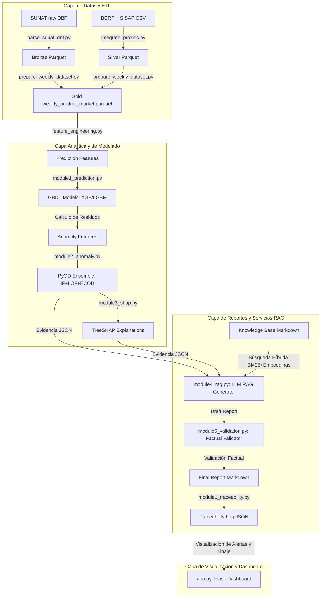
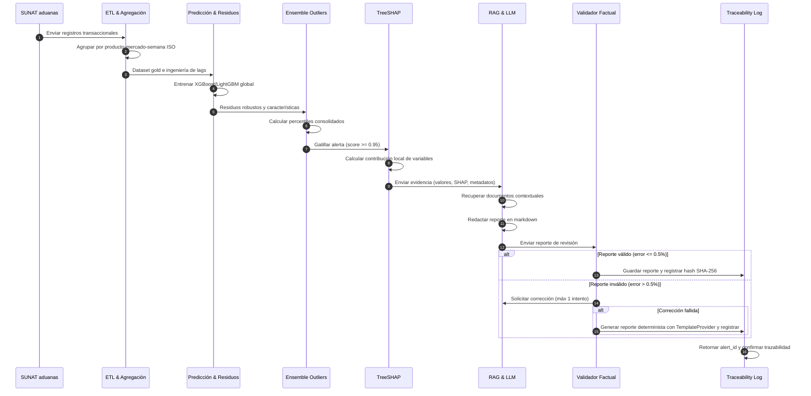
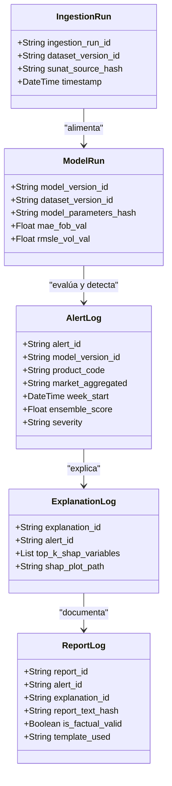
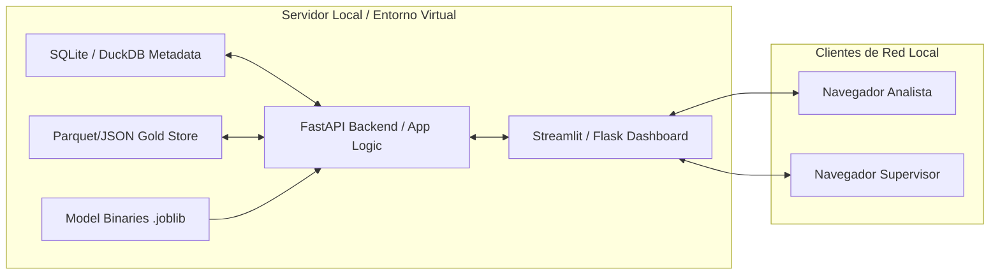
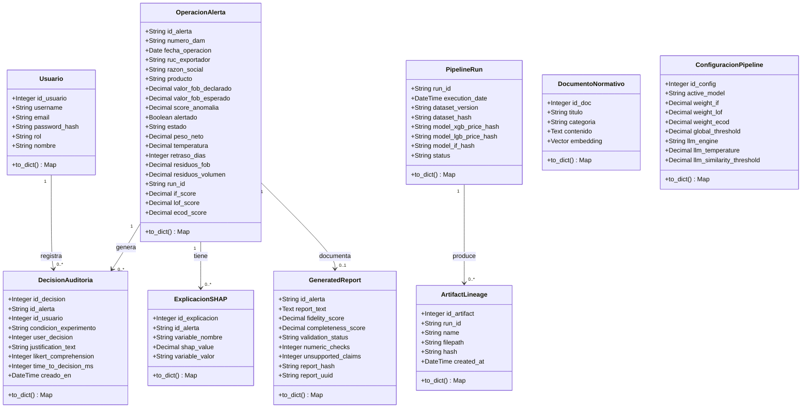

# CAPÍTULO III: ELABORACIÓN DE LA PROPUESTA

## 3.1 Generalidades

### 3.1.1 Propósito
El propósito del sistema inteligente de supervisión agroexportadora es proveer una plataforma unificada para detectar desviaciones operativas y aduaneras en exportaciones peruanas de palta, uva y arándano. El sistema apoya a los encargados de control y analistas en la toma de decisiones informadas mediante la estimación de valores esperados, detección de anomalías multivariables, explicaciones locales SHAP y generación automática de reportes técnicos trazables RAG.

### 3.1.2 Usuarios del Sistema
1.  **Analista de Control Operativo:** Revisa alertas, explora las variables incidentes mediante SHAP e inicia solicitudes de auditoría.
2.  **Supervisor de Operaciones / Auditor Interno:** Encargado de la firma de conformidad de los reportes. Valida y autoriza acciones correctivas.
3.  **Administrador de Datos / Ingeniero de ML:** Monitorea la calidad de datos, el linaje, el ajuste de los modelos y el reentrenamiento.
4.  **Investigador / Usuario Académico:** Analiza patrones históricos de mermas, clima o comportamiento de mercado agregados.

### 3.1.3 Entradas
*   Registros transaccionales de aduanas parseados de SUNAT/ADUANET (formato DBF/CSV).
*   Series de tiempo diarias y mensuales del tipo de cambio PEN/USD de la API o caches de BCRP.
*   Series de tiempo mensuales de precios y volúmenes mayoristas nacionales de SISAP (MIDAGRI).
*   Proxies climáticos semanales de temperatura, humedad y lluvias acumuladas de NASA POWER.
*   Proxies de alertas fitosanitarias mensuales de SENASA y la FDA.
*   Configuraciones en YAML para productos arancelarios, modelos e inyección de anomalías.

### 3.1.4 Salidas
*   Predicciones puntuales de valor unitario FOB y volumen exportado para la semana $t+1$.
*   Scores consolidados de anomalías y alertas clasificadas por severidad (`BAJA`, `MEDIA`, `ALTA`).
*   Visualizaciones y mapas de atribución locales SHAP (PNG/SVG) de las variables predictivas.
*   Informes narrativos en markdown validados factual y numéricamente (con linaje SHA-256).
*   Base de datos de auditoría de trazabilidad en JSON/DuckDB.
*   Dashboard interactivo web de visualización en Streamlit/Flask.

### 3.1.5 Requisitos Funcionales

*   **RF-01 (Importar Datos):** Permitir la ingesta de archivos DBF, CSV y Parquet de las fuentes de origen.
*   **RF-02 (Validar Datos):** Verificar tipos de datos, códigos arancelarios válidos a 10 dígitos y países normalizados ISO alfa-3.
*   **RF-03 (Normalizar y Anonimizar):** Homologar escalas de peso (kg) y valor (USD), y anonimizar exportadores con hashes SHA-256 salteados.
*   **RF-04 (Agregar Semanalmente):** Agrupar y consolidar transacciones por combinación `producto × mercado × semana ISO`.
*   **RF-05 (Entrenar Modelos):** Ajustar de forma global algoritmos XGBoost y LightGBM con búsqueda de hiperparámetros en Optuna.
*   **RF-06 (Predecir FOB y Volumen):** Generar las estimaciones puntuales de valor unitario FOB y volumen para la semana $t+1$.
*   **RF-07 (Detectar Anomalías):** Calcular los percentiles de Isolation Forest, LOF y ECOD, y generar alertas si se cruzan los umbrales.
*   **RF-08 (Explicar con SHAP):** Estimar las contribuciones locales TreeSHAP de las variables predictoras sobre la desviación de la alerta.
*   **RF-09 (Recuperar Contexto):** Buscar y recuperar fragmentos semánticos en el corpus RAG mediante indexado híbrido (BM25 y embeddings).
*   **RF-10 (Reportar con LLM):** Generar el reporte en markdown estructurado inyectando evidencias cuantitativas y textos recuperados.
*   **RF-11 (Validar Reporte):** Analizar sintácticamente el texto del reporte y rechazarlo ante discrepancias numéricas superiores al 0.5%.
*   **RF-12 (Consultar Trazabilidad):** Permitir la reconstrucción de la alerta ingresando su identificador UUID (`alert_id`).
*   **RF-13 (Revisar Alertas):** Proveer filtros en la interfaz por producto, mercado, semana y nivel de severidad.
*   **RF-14 (Exportar Resultados):** Permitir la descarga de reportes markdown firmados y tablas de métricas del pipeline.

### 3.1.6 Requisitos No Funcionales
*   **Reproducibilidad:** Fijación de semillas aleatorias globales (`42`) y secundarias en todos los modelos e inyección de datos.
*   **Auditabilidad:** Inmutabilidad mediante hashes SHA-256 registrados para cada entrada de datos, configuraciones, modelos y salidas.
*   **Rendimiento:** Tiempos de inferencia combinada por registro en la escala de milisegundos en CPU de uso general.
*   **Modularidad:** Arquitectura modular monolítica desacoplada mediante scripts independientes para ingesta, modelamiento y reporte.
*   **Usabilidad:** Interfaz interactiva fluida con directrices estéticas premium (vibrant dark mode y visualizaciones simplificadas).
*   **Privacidad:** Anonimización irreversible de los identificadores comerciales de exportadores.

### 3.1.7 Restricciones
*   **Procesamiento por Lotes (Batch):** El sistema está acotado a ejecuciones programadas semanales, excluyendo telemetría en tiempo real.
*   **Soporte Consultivo:** El sistema provee soporte a la decisión humana, no autoriza bloqueos automáticos en aduanas ni reemplaza firmas.
*   **Variables Proxies:** Variables críticas como mermas, costos logísticos o riesgos sanitarios se declaran conceptualmente como estimaciones o proxies, no mediciones directas.

### 3.1.8 Principios de Diseño
1.  **Separación de Responsabilidades:** Desacoplamiento estricto del cálculo cuantitativo frente a la redacción narrativa del LLM.
2.  **Evidencia Primero:** El prompt del modelo de lenguaje se restringe exclusivamente a las evidencias cuantitativas inyectadas.
3.  **Human-in-the-Loop:** Cada alerta y reporte requiere revisión y firma del supervisor humano antes de su registro oficial.
4.  **Trazabilidad:** Cada elemento del sistema hereda y propaga el linaje de identificadores y hashes.
5.  **Control Factual:** Rechazo sistemático de reportes con discrepancias numéricas.
6.  **Mínimo Privilegio:** Restricción de permisos y control de acceso local a los datos brutos de aduana.

### 3.1.9 Tecnologías Implementadas
*   *Lenguaje de programación:* Python (versión 3.11.x).
*   *Análisis y manipulación de datos:* Pandas, Numpy, PyArrow (formato Parquet).
*   *Algoritmos de ML y Anomalías:* XGBoost, LightGBM, PyOD (Isolation Forest, LOF, ECOD), Scikit-Learn, Optuna.
*   *Explicabilidad:* SHAP (TreeSHAP).
*   *RAG e Indexado:* Rank-BM25, Sentence-Transformers (`paraphrase-multilingual-MiniLM-L12-v2`).
*   *Servicios y Dashboard:* Flask / Streamlit, Jinja2, HTML5/CSS3 (estilo premium).
*   *Persistencia:* Parquet para almacenamiento analítico y archivos JSON para trazabilidad y configuraciones.

### 3.1.10 Arquitectura de Componentes

**Figura 3.1 — Arquitectura lógica del sistema integrado.**  
**Estado:** placeholder de figura pendiente.  
**Archivo esperado:** `docs/figures/figura_3_1_arquitectura_logica.svg` y copia PNG en `docs/figures/figura_3_1_arquitectura_logica.png`.  
**Fuente de generación:** bloque Mermaid anterior o diagrama equivalente generado desde `src/module1_prediction.py` a `src/module6_traceability.py` y `sistema-web-agro/backend/app.py`.  
**Contenido visual requerido:** cinco capas diferenciadas: datos/ETL, modelado predictivo, anomalías, explicabilidad/RAG-validación y dashboard/trazabilidad. Debe mostrar entradas, salidas, módulos y relación de linaje.  
**Criterio de aceptación:** la figura debe renderizarse sin código Mermaid visible en el PDF final, tener título, fuente "Elaboración propia" y coincidir con las rutas reales del repositorio.

## 3.2 Esquema de la Propuesta

### 3.2.1 Flujo General de Datos

**Figura 3.2 — Flujo temporal de datos, predicción, alerta y reporte.**  
**Estado:** placeholder de figura pendiente.  
**Archivo esperado:** `docs/figures/figura_3_2_flujo_temporal.svg` y copia PNG en `docs/figures/figura_3_2_flujo_temporal.png`.  
**Fuente de generación:** bloque Mermaid anterior, scripts `src/prepare_weekly_dataset.py`, `src/feature_engineering.py`, `src/module1_prediction.py`, `src/module2_anomaly.py`, `src/module4_rag.py` y `src/module6_traceability.py`.  
**Contenido visual requerido:** secuencia desde registros SUNAT/ADUANET hasta dataset gold, predicción, residuo, score ensemble, explicación SHAP, reporte RAG, validación factual y log de trazabilidad.  
**Criterio de aceptación:** debe distinguir explícitamente información disponible en semana `t` frente al objetivo `t+1`, para evidenciar prevención de fuga temporal.

### 3.2.2 Esquema y Capas de Datos
*   **Raw:** Datos crudos originales descargados sin procesar (formatos DBF de SUNAT y CSVs de SISAP/BCRP).
*   **Bronze:** Transformación inicial uno-a-uno a formato estructurado de alto rendimiento (Parquet) sin alterar campos.
*   **Silver:** Limpieza de nulos, homologación de códigos arancelarios a 10 dígitos, normalización de países ISO alfa-3, y anonimización de exportadores con hashes criptográficos. Exclusión sistemática de cacao.
*   **Gold:** Cuadrícula temporal de agregación semanal de combinación única `product_code`, `market_aggregated`, `week_start`. Generación de lags, rolling statistics y características cíclicas calendario.

### 3.2.3 Unidad de Análisis
*   Definición metodológica única y obligatoria: la combinación de **producto × mercado de destino × semana ISO** iniciada en la fecha `week_start`.
*   Unidad de registro en los archivos analíticos de entrada a los modelos: cada fila describe el comportamiento acumulado de una subpartida arancelaria para un mercado específico durante una semana ISO (lunes a domingo).

### 3.2.4 Variables Objetivo
*   **FOB Unitario Promedio Semanal ($t+1$):**
    $$Y_{FOB}(t+1) = \frac{\sum \text{FOB\_USD}_{t+1}}{\sum \text{Net\_Weight\_kg}_{t+1}}$$
*   **Volumen Neto Semanal ($t+1$):**
    $$Y_{Vol}(t+1) = \sum \text{Net\_Weight\_kg}_{t+1}$$

### 3.2.5 Integración de Fuentes Exógenas
*   *Tipo de cambio (BCRP):* Mapeado semanalmente a través del mes de la fecha `week_start`.
*   *Precios internos (SISAP):* Incorporados semanalmente mediante correspondencia de producto.
*   *Clima regional (NASA):* Agregado semanalmente y desplazado en una semana (`lag1`) para representar la información disponible al cierre de la semana de predicción.

### 3.2.6 Ingeniería de Características (Prevención de Data Leakage)
Todas las variables de predicción correspondientes a estadísticas móviles (`rolling mean`, `rolling std`, `rolling mad`) y variaciones porcentuales se calculan desplazando los datos observados en una semana (`shift(1)`). Esto asegura que ninguna información correspondiente a la semana $t+1$ o posterior se filtre en el conjunto de entrenamiento de la semana $t$.

### 3.2.7 Modelamiento Predictivo Global
Se entrena un único modelo global de regresión multivariable (un modelo para valor unitario FOB y otro para volumen) para todos los productos y mercados seleccionados, incorporando las características categóricas codificadas mediante One-Hot Encoding. La optimización de hiperparámetros se realiza mediante Optuna sobre el split de validación temporal.

### 3.2.8 Cálculo de Residuos Robustos
Los detectores de anomalías se alimentan de los residuos de predicción fuera de muestra (predicciones OOF generadas mediante validación temporal cruzada). El residuo se escala mediante robust-z score móvil:
$$\text{residual\_robust\_z} = \frac{\text{residuo}(t) - \text{mediana}(\text{residuos}_{t-13..t-1})}{\text{MAD}(\text{residuos}_{t-13..t-1})}$$

### 3.2.9 Ensemble de Anomalías y Percentiles
Las puntuaciones crudas de Isolation Forest, LOF y ECOD se calibran en la distribución del conjunto de entrenamiento para transformarlas a percentiles acotados en el rango $[0, 1]$. El ensemble consolida las puntuaciones promediándolas y gatilla la alerta si se supera el percentil 95.

### 3.2.10 Explicabilidad SHAP y Atribución local
TreeSHAP se aplica sobre los regresores globales de GBDT entrenados para calcular las contribuciones marginales locales de cada característica. El sistema extrae el top-5 de variables que empujaron positivamente la predicción esperada y el top-5 que la redujeron, inyectándolos en el prompt de la alerta.

### 3.2.11 RAG con Validador Factual
El motor RAG recupera información metodológica y limitaciones del corpus documental de `knowledge_base/`. El LLM recibe las evidencias de la alerta y redacta el reporte técnico. El validador determinista realiza un análisis numérico mediante expresiones regulares, comparando los números del reporte contra el JSON de entrada, cayendo en `TemplateProvider` ante discrepancias persistentes.

### 3.2.12 Trazabilidad de Auditoría

**Figura 3.3 — Modelo lógico de trazabilidad de alerta, explicación y reporte.**  
**Estado:** placeholder de figura pendiente.  
**Archivo esperado:** `docs/figures/figura_3_3_trazabilidad.svg` y copia PNG en `docs/figures/figura_3_3_trazabilidad.png`.  
**Fuente de generación:** bloque Mermaid anterior, `src/module6_traceability.py`, `data/gold/traceability_log.json` y modelos del prototipo en `sistema-web-agro/backend/models.py`.  
**Contenido visual requerido:** entidades `IngestionRun`, `ModelRun`, `AlertLog`, `ExplanationLog` y `ReportLog`, con campos mínimos de ID, hash, fecha, dataset, modelo y artefacto.  
**Criterio de aceptación:** debe permitir reconstruir visualmente qué hash conecta dataset, modelo, alerta, explicación y reporte.

### 3.2.13 Seguridad y Privacidad
El sistema opera localmente y no expone datos aduaneros crudos al exterior. Los identificadores fiscales (RUC) y nombres de las empresas exportadoras se anonimizan de manera irreversible mediante algoritmo criptográfico SHA-256 con sal fija:
$$\text{exporter\_hash} = \text{SHA256}(\text{RUC} + \text{salt\_salt\_42})$$
Las claves de API de los LLMs se cargan mediante variables de entorno estrictamente privadas en el archivo `.env`.

### 3.2.14 Esquema de Despliegue Local

## 3.3 Obtención y Preparación de Datos

La preparación de datos se organiza como un flujo reproducible por capas. Esta estructura evita mezclar archivos crudos, datos intermedios, resultados experimentales y evidencias finales. La unidad de análisis se mantiene constante en todo el proceso: producto agroexportador, mercado de destino y semana ISO.

### 3.3.1 Fuentes de datos y estado de uso

| Fuente | Ruta o evidencia | Uso en la tesis | Estado |
|---|---|---|---|
| Dataset real local | `data/dataset_real_v1.csv` | Base experimental inicial de exportaciones y proxies | Disponible; requiere declarar composición real/proxy/sintética |
| SUNAT/ADUANET | `data/sunat/raw_downloads/`, `data/sunat/x23290326.DBF` | Fuente primaria aduanera y validación de estructura | Parcial; descargas locales concentradas en 2026 |
| Trade Map | `data-trademap/*.xls` | Contraste externo por producto y mercado | Disponible como benchmark agregado |
| BCRP | `data/bcrp/exchange_rates_cache.json`, `data/downloads/bcrp_tipo_cambio.csv` | Tipo de cambio PEN/USD | Disponible |
| SISAP/MIDAGRI | `codex-revision/metadata/sisap_*` | Contexto de precio/volumen mayorista interno | Disponible como dato agregado |
| NASA POWER / clima | Variables climáticas integradas en silver/gold | Contexto climático regional | Disponible como proxy |
| Dataset analítico gold | `data/gold/weekly_product_market.parquet` | Unidad producto-mercado-semana | Disponible, preliminar |
| Prototipo funcional | `sistema-web-agro/backend/init_db.py` | Datos semilla para validar interfaz y telemetría | Implementado como prototipo |

Los datos semilla del prototipo no sustituyen al dataset final de investigación. Se usan para demostrar integración funcional de backend, frontend, alertas, explicaciones, reportes y telemetría. Los resultados finales deberán provenir del dataset semanal reproducible y documentado.

### 3.3.2 Inventario reproducible de archivos principales

| Capa | Archivo | Filas x columnas | Hash SHA-256 | Uso |
|---|---:|---:|---|---|
| Raw local | `data/raw/exports_raw.csv` | 40,672 x 21 | `64a7dd130cbe2ba79cee04fe8e391d64a81d18cb6a0cbdb4d84e7d27fbd7bea3` | Base tabular inicial |
| Dataset real v1 | `data/dataset_real_v1.csv` | 40,672 x 21 | `64a7dd130cbe2ba79cee04fe8e391d64a81d18cb6a0cbdb4d84e7d27fbd7bea3` | Base experimental local |
| Bronze | `data/bronze/exports_raw.parquet` | 40,672 x 21 | `66c4464cd87a6d4238a793ccb693d5afe1be704e1556d49e3bad8540bb2b2c9c` | Conversión estructural |
| Silver | `data/silver/exports_clean.parquet` | 40,293 x 24 | `ba98a37a9f3c9c7cf36baff8af8e1b61837cd237817b6e441d2bfb9f839e4eb3` | Limpieza y normalización |
| Gold | `data/gold/weekly_product_market.parquet` | 8,340 x 27 | `4b9d0ea84880dc46192806125896707aec8274d51f5c05c8e5d1ebb5350edac3` | Agregación semanal |
| Features predictivas | `data/gold/prediction_features.parquet` | 8,340 x 139 | `e343829f19fc26b1cd153e18fcb70808b9713c82c4b37ea86fe8395c8c607773` | Entrenamiento FOB/volumen |
| Features anomalías | `data/gold/anomaly_features.parquet` | 8,340 x 170 | `f3fa9e7868e2432df240ad932daff0bfb99d54e825fc5967fce991b125412c26` | Detección IF/LOF/ECOD |

**Comando de verificación:** `.\.venv\Scripts\python.exe -c "<script de lectura pandas y hash SHA-256>"`.  
**Salida esperada:** dimensiones y hashes iguales a la tabla anterior. Si algún hash cambia, debe generarse nueva versión de dataset y actualizar los reportes.

### 3.3.3 Capas de procesamiento

| Capa | Descripción | Evidencia esperada |
|---|---|---|
| Raw | Archivos originales sin transformación metodológica | Hash de origen, fecha de descarga, ruta cruda |
| Bronze | Conversión estructural a formatos tabulares/parquet | Script de extracción y conteo de registros |
| Silver | Limpieza, normalización, homologación y anonimización | Diccionario de datos y reporte de calidad |
| Gold | Agregación semanal por producto-mercado-semana | Dataset final, hash, versión y pruebas |
| Features | Variables predictivas, rezagos y ventanas móviles | Matriz de entrenamiento y prueba de fuga |
| Evidence | Métricas, residuos, alertas, explicaciones y reportes | Artefactos en `reports/tesis/` |

### 3.3.4 Caracterización del dataset semanal gold

| Indicador | Valor observado | Evidencia |
|---|---:|---|
| Filas gold | 8,340 | `data/gold/weekly_product_market.parquet` |
| Columnas gold | 27 | `data/gold/weekly_product_market.parquet` |
| Productos | 4 (`avocado`, `blueberry`, `esparrago`, `grape`) | Conteo pandas |
| Mercados agregados | 10 | Conteo pandas |
| Series producto-mercado | 20 | Conteo pandas |
| Semanas ISO | 417 | `week_start` |
| Periodo semanal | 2018-06-04 a 2026-05-25 | `week_start` |
| Filas avocado | 2,502 | Conteo por `product_code` |
| Filas blueberry | 2,502 | Conteo por `product_code` |
| Filas grape | 2,502 | Conteo por `product_code` |
| Filas esparrago | 834 | Conteo por `product_code` |

**Criterio metodológico sobre espárrago:** aunque existe en la base gold, se mantiene como producto secundario o de sensibilidad. El núcleo experimental defendible se concentra en palta, uva y arándano; espárrago no debe mezclarse en conclusiones principales salvo que se declare explícitamente su cobertura menor.

### 3.3.5 Calidad, registros eliminados y límites de datos

El reporte `codex-revision/reporte-calidad-datos.md` registra 40,293 filas válidas post-validación y 4 filas rechazadas. También identifica 4,933 duplicados funcionales potenciales usando producto, fecha, exportador, destino, volumen y precio. Estos duplicados no deben eliminarse automáticamente sin revisar si representan múltiples operaciones similares o registros repetidos.

| Control | Resultado actual | Acción documental |
|---|---|---|
| Cacao | Excluido | Mantener exclusión |
| Palta, uva, arándano | Presentes | Núcleo del estudio |
| Espárrago | Presente con menor cobertura | Mantener como secundario |
| Rechazados | 4 filas | Documentar archivo de rechazados |
| Duplicados exactos | 0 | Sin acción |
| Duplicados funcionales | 4,933 | Revisar antes de cierre final |
| `fob_unit_value_usd_kg` faltante en gold | 91.46% | No usar como métrica final sin imputación/criterio formal |

### 3.3.6 Controles de calidad temporal

Para prevenir fuga de información, las variables predictivas solo deben utilizar información disponible antes de la semana objetivo. Los rezagos, medias móviles y desviaciones móviles se calculan con desplazamiento explícito de una semana. Los escaladores, codificadores y selectores de características se ajustan únicamente con el conjunto de entrenamiento. La partición temporal se congela antes de entrenar los modelos definitivos.

| Control | Regla de aceptación | Estado actual |
|---|---|---|
| Rezagos y ventanas | Toda ventana móvil usa `shift(1)` antes del objetivo | Parcial, requiere prueba automatizada final |
| Escaladores/codificadores | Ajuste solo en entrenamiento | Pendiente de evidencia definitiva |
| Selección de características | Sin acceso al conjunto de prueba | Pendiente |
| Predicciones fuera de muestra | Residuos generados con validación temporal | Pendiente para dataset final |
| Reporte de fuga | Guardar en `reports/tesis/data-quality/leakage-tests/` | Pendiente si no existe ejecución |

**Comando de prueba esperado:** `.\.venv\Scripts\python.exe -m pytest tests/leakage/test_leakage.py`.  
**Salida esperada:** pruebas aprobadas y reporte copiado a `reports/tesis/data-quality/leakage-tests/` con fecha, commit y hash. Si el reporte no existe, la evidencia queda pendiente.

### 3.3.7 Registro de artefactos experimentales

Cada corrida experimental debe registrar identificador único, commit, dataset, semilla, configuración, hiperparámetros, entorno, métricas globales, métricas por producto, predicciones, residuos y hashes de salida. Hasta que esos campos existan, el artefacto se clasifica como preliminar o pendiente, no como definitivo.

## 3.4 Diseño e Implementación del Prototipo

El prototipo funcional se encuentra en `sistema-web-agro/`. Su propósito es demostrar la integración de los componentes de supervisión aduanera con IA explicable, no cerrar por sí solo la validación estadística final de la tesis.

### 3.4.1 Estructura técnica del prototipo

| Componente | Ruta | Función | Estado |
|---|---|---|---|
| Backend Flask | `sistema-web-agro/backend/app.py` | API de alertas, configuración, telemetría y reportes | Implementado |
| Modelos de datos | `sistema-web-agro/backend/models.py` | Entidades de alerta, decisión, usuario y documentos | Implementado |
| Semilla de base | `sistema-web-agro/backend/init_db.py` | Carga de datos de prueba y configuración inicial | Implementado |
| Frontend React | `sistema-web-agro/frontend/src/` | Interfaz de auditoría, detalle, telemetría e integridad | Implementado |
| Despliegue local | `sistema-web-agro/docker-compose.yml`, `run.ps1` | Orquestación local del prototipo | Implementado |
| Evidencia visual | `sistema-web-agro/*/screen.png` | Capturas de pantallas funcionales | Disponible |

### 3.4.2 Vistas funcionales del prototipo

El prototipo incluye vistas para autenticación, panel del auditor, gestión de alertas, detalle de operación con IA explicable, historial, telemetría, integridad, exploración de datos, configuración de modelo y control de usuarios. La vista de detalle de alerta concentra la integración de predicción, score de anomalía, explicación SHAP, reporte RAG y decisión humana.

| Vista | Ruta esperada | Evidencia |
|---|---|---|
| Login | `/login` | `frontend/src/pages/Login.jsx` |
| Dashboard | `/dashboard` | `frontend/src/pages/Dashboard.jsx` |
| Alertas | `/alerts` | `frontend/src/pages/Alerts.jsx` |
| Detalle de alerta | `/alerts/:id` | `frontend/src/pages/Detail.jsx`, `AuditDetail.jsx` |
| Historial | `/history` | `frontend/src/pages/History.jsx` |
| Telemetría | `/telemetry` | `frontend/src/pages/Telemetry.jsx` |
| Integridad | `/integrity` | `frontend/src/pages/Integrity.jsx` |
| Datos/RAG | `/data` | `frontend/src/pages/Data.jsx` |
| Configuración | `/config` | `frontend/src/pages/Config.jsx` |
| Usuarios | `/users` | `frontend/src/pages/Users.jsx` |

### 3.4.3 Placeholders de capturas del prototipo

Las capturas de pantalla no deben sustituir evidencia funcional ni resultados experimentales. Se usan para documentar la interfaz del prototipo. Cuando una captura todavía no esté incorporada al PDF final, se registra el placeholder siguiente:

| Figura | Pantalla | Archivo esperado | Fuente actual | Contenido que debe mostrar | Estado |
|---|---|---|---|---|---|
| Figura 4.1 | Detalle de alerta IA explicable | `docs/figures/figura_4_1_detalle_alerta.png` | `sistema-web-agro/detalle_de_operaci_n_ia_explicable_esp/screen.png` | Datos DAM, FOB esperado, score, SHAP, reporte RAG y decisión humana | Pendiente de inserción formal |
| Figura 4.2 | Consola de telemetría | `docs/figures/figura_4_2_telemetria.png` | `sistema-web-agro/experimental_telemetry_console/screen.png` o `monitor_de_telemetr_a_y_equidad_esp/screen.png` | Condiciones A/B, tiempo de decisión, comprensión y métricas agregadas | Pendiente de inserción formal |
| Figura 4.3 | Bandeja de alertas | `docs/figures/figura_4_3_bandeja_alertas.png` | `sistema-web-agro/alerts_management_inbox/screen.png` | Lista filtrable de alertas, estados, severidad y producto | Pendiente de inserción formal |
| Figura 4.4 | Configuración de modelo | `docs/figures/figura_4_4_configuracion_modelo.png` | `sistema-web-agro/model_configuration_terminal/screen.png` | Pesos IF/LOF/ECOD, umbral y parámetros editables | Pendiente de inserción formal |
| Figura 4.5 | Explorador de datos y RAG | `docs/figures/figura_4_5_explorador_datos.png` | `sistema-web-agro/data_explorer_load_center/screen.png` | Carga o exploración de datos, biblioteca documental y estado de indexación | Pendiente de inserción formal |

**Criterio de aceptación de capturas:** cada imagen debe tener resolución legible, título, fuente "captura del prototipo `sistema-web-agro`", fecha de generación y ruta del componente React correspondiente. Si la captura se usa en Capítulo IV, debe corresponder a la versión del commit documentado.

### 3.4.4 Algoritmos propuestos e implementación vinculada

| Módulo | Algoritmo o técnica | Función | Evidencia |
|---|---|---|---|
| Predicción | XGBoost/LightGBM, GBDT | Estimar FOB unitario y volumen esperado | `src/module1_prediction.py`, prototipo backend |
| Detección de anomalías | Isolation Forest, LOF, ECOD | Calcular score anómalo individual y ensemble | `src/module2_anomaly.py`, `backend/app.py` |
| Explicabilidad | TreeSHAP/SHAP | Atribuir variables que impulsan el riesgo | `src/module3_shap.py`, vista de detalle |
| Reportes automáticos | RAG con recuperación documental y plantilla determinística | Generar narrativa técnica anclada a evidencia | `src/module4_rag.py`, `src/module5_validation.py` |
| Validación factual | Reglas determinísticas y comparación numérica | Rechazar cifras no sustentadas | `src/module5_validation.py` |
| Trazabilidad | Hashes, IDs, logs y relaciones alerta-decisión | Auditar evidencia de extremo a extremo | `src/module6_traceability.py`, modelos del backend |

En el estado actual, el prototipo respalda la arquitectura, las rutas funcionales, la telemetría y la experiencia de auditoría. La validación cuantitativa definitiva sigue condicionada al dataset semanal final, a las pruebas de fuga de información y a los experimentos formales.

### 3.4.5 Modelo de Entidades y Diagrama de Clases del Prototipo

Para garantizar la consistencia, persistencia y trazabilidad de los datos recolectados durante la validación del prototipo, se implementó un modelo relacional mapeado a través de SQLAlchemy. Este comprende el control de acceso, los metadatos de las operaciones, la telemetría del experimento de usabilidad y los reportes generados.

**Figura 3.4 — Diagrama de clases y entidades relacionales de la base de datos del prototipo.**  
**Fuente:** modelado relacional implementado en `sistema-web-agro/backend/models.py`.

## 3.5 Diseño Experimental y Validación

La validación se plantea en cinco bloques: rendimiento predictivo y detección, explicabilidad, calidad de reportes, usabilidad y trazabilidad. Cada bloque debe producir evidencia reproducible antes de ser incorporado como resultado definitivo en el Capítulo IV.

### 3.5.1 Validación de predicción y anomalías

La comparación principal evalúa el ensemble IF + LOF + ECOD frente a detectores individuales y baselines. Las métricas previstas son Precision, Recall, F1, PR-AUC, ROC-AUC y Precision@k. Cuando se usen anomalías sintéticas, se debe registrar tipo, magnitud, proporción de inyección y etiqueta generada.

#### 3.5.1.1 Partición temporal propuesta

La partición se define por fecha y no por muestreo aleatorio, debido a la naturaleza longitudinal del problema.

| Conjunto | Periodo propuesto | Uso | Regla |
|---|---|---|---|
| Entrenamiento | 2018-06-04 a 2024-12-30 | Ajustar modelos, codificadores y escaladores | Puede usarse para Optuna y calibración interna |
| Validación | 2025-01-06 a 2025-12-29 | Selección de hiperparámetros y umbrales | No se mezcla con test |
| Prueba | 2026-01-05 a 2026-05-25 | Evaluación final preliminar | Solo inferencia fuera de muestra |

Si la distribución real por producto no permite sostener estas ventanas para todas las series, debe usarse una validación walk-forward por serie con ventanas mínimas documentadas. En ese caso, la tesis debe reportar cuántas series quedaron excluidas y por qué.

#### 3.5.1.2 Estrategia walk-forward

| Parámetro | Valor metodológico |
|---|---|
| Unidad de ventana | Semana ISO |
| Horizonte | 1 semana (`t+1`) |
| Ventana inicial mínima | 104 semanas por serie cuando exista cobertura |
| Paso | 1 semana o bloque mensual, según costo computacional |
| Salida | Predicción, residuo y error por semana fuera de muestra |
| Evidencia | `reports/tesis/experiments/<run_id>/predictions_oos.parquet` |

#### 3.5.1.3 Baselines predictivos

| Objetivo | Baseline | Descripción | Métrica principal |
|---|---|---|---|
| FOB unitario | Último valor observado | `y_hat(t+1)=y(t)` | MAE |
| FOB unitario | Mediana móvil 4 semanas | Mediana de semanas disponibles hasta `t` | MAE |
| FOB unitario | Mediana móvil 13 semanas | Baseline robusto estacional corto | MAE |
| FOB unitario | Elastic Net | Modelo lineal regularizado | MAE/RMSE |
| Volumen | Último valor observado | Persistencia temporal | RMSLE |
| Volumen | Mediana móvil 4/13 semanas | Baseline robusto | RMSLE |
| Volumen | Baseline estacional | Misma semana del año anterior si existe | RMSLE |

#### 3.5.1.4 Modelos propuestos e hiperparámetros

| Modelo | Hiperparámetros a registrar | Selección |
|---|---|---|
| XGBoost | `n_estimators`, `max_depth`, `learning_rate`, `subsample`, `colsample_bytree`, `reg_lambda`, `reg_alpha` | Optuna o grid reducido sobre validación temporal |
| LightGBM | `num_leaves`, `max_depth`, `learning_rate`, `feature_fraction`, `bagging_fraction`, `lambda_l1`, `lambda_l2` | Optuna o grid reducido sobre validación temporal |
| Elastic Net | `alpha`, `l1_ratio` | Validación temporal |
| IF/LOF/ECOD | `contamination`, vecinos LOF, semilla y umbral percentílico | Calibración en entrenamiento/validación |

**Semilla base:** `42`. Toda corrida debe registrar semilla global, semilla de modelo y versión de librerías.

#### 3.5.1.5 Métricas por objetivo

| Bloque | Métricas | Nivel de reporte |
|---|---|---|
| FOB | MAE, RMSE, MAPE/SMAPE, R² | Global, producto y mercado principal |
| Volumen | RMSLE, MAE, RMSE, SMAPE, R² | Global, producto y mercado principal |
| Anomalías | Precision, Recall, F1, PR-AUC, ROC-AUC, Precision@k | Global, tipo de anomalía y producto |
| Eficiencia | Tiempo de entrenamiento e inferencia | Por modelo |
| Estabilidad | Intervalo de confianza por bootstrap temporal | Por métrica principal |

#### 3.5.1.6 Protocolo de anomalías sintéticas

| Tipo | Inyección | Magnitud sugerida | Etiqueta |
|---|---|---|---|
| Precio/FOB | Multiplicar FOB unitario o precio por factor atípico | ±20% a ±60% | `precio` |
| Volumen | Alterar `total_net_weight_kg` o volumen semanal | ±30% a ±80% | `volumen` |
| Clima/contexto | Perturbar temperatura o precipitación proxy | Percentiles 95-99 | `clima` |
| Logística | Aumentar días logísticos proxy | Percentiles 95-99 | `logistica` |
| Calidad/sanidad | Alterar merma o cumplimiento proxy | Regla documentada | `calidad` |

La proporción de inyección no debe superar el 5% del conjunto evaluado sin justificarlo. Deben ejecutarse al menos tres repeticiones con semillas distintas si se quieren reportar intervalos de confianza.

### 3.5.2 Validación de explicabilidad

SHAP se evalúa por cobertura top-k, estabilidad de atribuciones, coherencia con variables disponibles y claridad para el auditor. Las atribuciones se interpretan como contribuciones del modelo, no como causalidad empresarial.

| Indicador | Definición | Evidencia esperada |
|---|---|---|
| Cobertura top-k | Porcentaje de alertas con top-5 variables explicativas | `data/gold/local_explanations.json` |
| Estabilidad | Variación del ranking SHAP entre corridas equivalentes | Reporte de estabilidad |
| Coherencia | Variables explicativas existen en matriz de features | Validación de columnas |
| Tiempo de cálculo | Milisegundos por explicación | Log de inferencia |
| Visualización | Gráficos bar/beeswarm exportados | `src/static/images/shap_*.png` |

**Placeholders de figuras SHAP.**

| Figura | Archivo actual o esperado | Descripción |
|---|---|---|
| Figura 4.6 | `src/static/images/shap_price_bar.png` | Importancia global para predicción de precio/FOB |
| Figura 4.7 | `src/static/images/shap_volume_bar.png` | Importancia global para predicción de volumen |
| Figura 4.8 | `src/static/images/shap_price_beeswarm.png` | Distribución de efectos SHAP para precio/FOB |
| Figura 4.9 | `src/static/images/shap_volume_beeswarm.png` | Distribución de efectos SHAP para volumen |

### 3.5.3 Validación de reportes automáticos

Los reportes se validan con una rúbrica de completitud, coherencia, fidelidad factual y consistencia numérica. Cada cifra citada en el reporte debe existir en evidencia estructurada. Si el reporte RAG no supera la validación, se registra rechazo y se genera una versión determinística.

| Criterio | Métrica | Fuente |
|---|---|---|
| Completitud | Porcentaje de campos obligatorios presentes | `data/gold/validation_metrics.json` |
| Fidelidad factual | Proporción de cifras coincidentes con evidencia | `data/gold/validation_metrics.json` |
| Rechazo controlado | Reportes no aprobados por validador | `reports/audits/` |
| Comparación determinística | RAG frente a plantilla | Reporte de validación |
| Recuperación documental | Documentos usados por reporte | Log RAG |

En el estado actual, `data/gold/validation_metrics.json` registra 5 reportes evaluados y 0 reportes válidos. Por tanto, el módulo queda documentado como funcional pero no aprobado para resultados definitivos hasta corregir las discrepancias numéricas.

### 3.5.4 Evaluación controlada con usuarios

El estudio de usabilidad compara una condición integrada, con SHAP y RAG visibles, frente a una condición aislada, sin explicaciones avanzadas. Las métricas son tiempo de análisis, decisión registrada, comprensión percibida y utilidad. Hasta contar con participantes reales y consentimiento documentado, esta sección permanece como diseño experimental y no como resultado concluyente.

| Elemento | Diseño mínimo |
|---|---|
| Participantes | Definir perfil, experiencia y número mínimo antes de ejecutar |
| Condiciones | A: integrado con SHAP/RAG; B: aislado sin SHAP/RAG |
| Tareas | Casos equivalentes por producto y severidad |
| Orden | Contrabalanceado para reducir aprendizaje |
| Métricas | Tiempo, decisión correcta, Likert de comprensión, SUS, utilidad |
| Prueba estadística | Mann-Whitney U o Welch según normalidad y tamaño muestral |
| Evidencia | Consentimiento, datos anonimizados y script de análisis |

**Placeholder de instrumento:** el formulario final de consentimiento y encuesta SUS debe guardarse como `reports/tesis/user-study/instrumento_usabilidad_v1.pdf` o `docs/tesis/anexos/instrumento_usabilidad.md`. Si no existe, la evaluación con usuarios permanece pendiente.

### 3.5.5 Puertas de control

| Puerta | Criterio | Estado actual |
|---|---|---|
| A. Datos | Dataset semanal reproducible, documentado, versionado y sin duplicidad de clave | Parcial |
| B. Implementación | Cada módulo con ruta, entrada, salida, configuración, prueba y evidencia | Parcialmente aprobado por prototipo |
| C. Experimento | Split temporal, métricas, semillas y criterios congelados | Pendiente |
| D. Capítulo III | Arquitectura e implementación documentadas sin resultados finales | En desarrollo |
| E. Capítulo IV preliminar | Resultados reproducibles y claramente marcados como preliminares o definitivos | Parcial |

### 3.5.6 Checklist verificable de cierre del Capítulo III

| ID | Actividad | Archivo fuente | Comando | Salida esperada | Estado |
|---|---|---|---|---|---|
| C3-DATA-01 | Verificar hashes de datasets | `data/raw`, `data/gold` | Script pandas + SHA-256 | Hashes iguales a Tabla 3.3.2 | Parcial |
| C3-DATA-02 | Ejecutar pruebas de calidad | `tests/data_quality/test_quality.py` | `.\.venv\Scripts\python.exe -m pytest tests/data_quality/test_quality.py` | Tests aprobados | Pendiente de corrida final |
| C3-LEAK-01 | Ejecutar prueba de fuga temporal | `tests/leakage/test_leakage.py` | `.\.venv\Scripts\python.exe -m pytest tests/leakage/test_leakage.py` | Tests aprobados y reporte en `reports/tesis/data-quality/leakage-tests/` | Pendiente |
| C3-EXP-01 | Registrar experimento | `src/train_models.py` | `.\.venv\Scripts\python.exe src/train_models.py` | `run_id`, métricas, predicciones y residuos | Parcial |
| C3-SHAP-01 | Generar explicabilidad | `src/module3_shap.py` | Script de SHAP | JSON + PNG/SVG | Parcial |
| C3-RAG-01 | Validar reportes | `src/module5_validation.py` | Tests/report validation | Reportes válidos o rechazados documentados | Parcial, actualmente no aprobado |
| C3-FIG-01 | Renderizar figuras Mermaid | `docs/02-30-capitulo3.md` | Mermaid CLI o equivalente | Figuras 3.1-3.3 PNG/SVG | Pendiente |
| C3-UI-01 | Insertar capturas del prototipo | `sistema-web-agro/*/screen.png` | Copia a `docs/figures/` | Figuras 4.1-4.5 con título y fuente | Pendiente |

---

