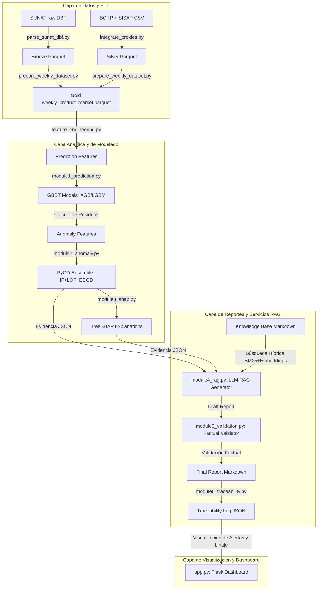
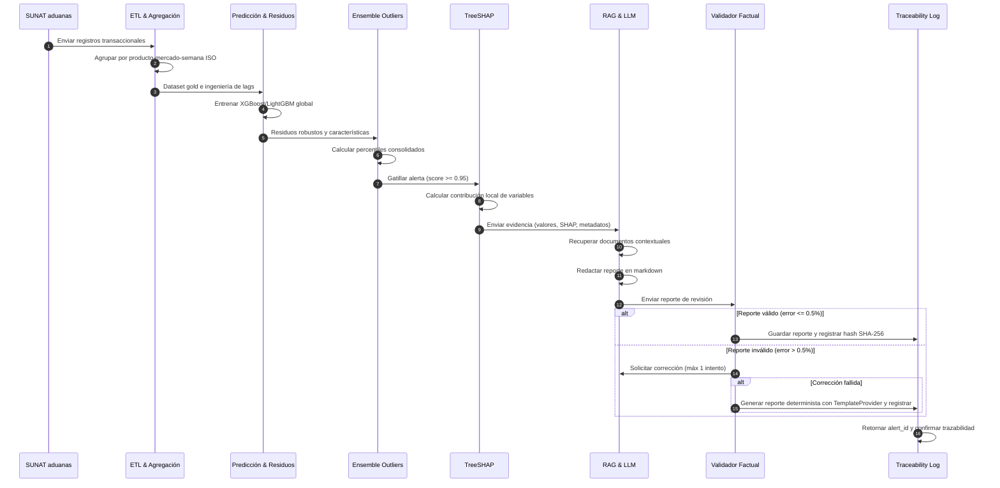
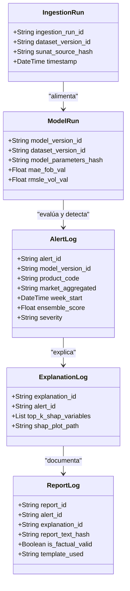
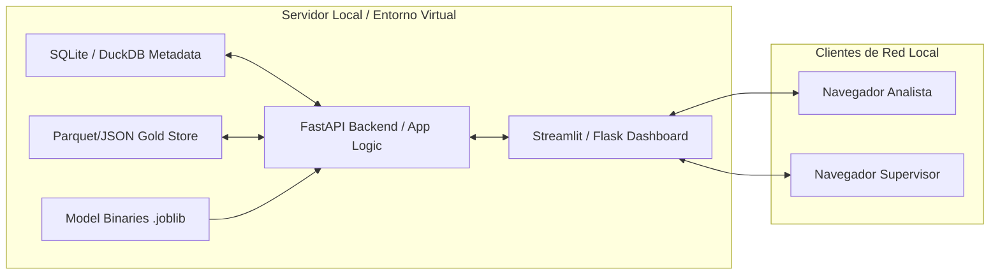

# CAPÍTULO III: ELABORACIÓN DE LA PROPUESTA

## 3.1 Generalidades

### 3.1.1 Propósito
El propósito del sistema inteligente de supervisión agroexportadora es proveer una plataforma unificada para detectar desviaciones operativas y aduaneras en exportaciones peruanas de palta, uva y arándano. El sistema apoya a los encargados de control y analistas en la toma de decisiones informadas mediante la estimación de valores esperados, detección de anomalías multivariables, explicaciones locales SHAP y generación automática de reportes técnicos trazables RAG.

### 3.1.2 Usuarios del Sistema
1.  **Analista de Control Operativo:** Revisa alertas, explora las variables incidentes mediante SHAP e inicia solicitudes de auditoría.
2.  **Supervisor de Operaciones / Auditor Interno:** Encargado de la firma de conformidad de los reportes. Valida y autoriza acciones correctivas.
3.  **Administrador de Datos / Ingeniero de ML:** Monitorea la calidad de datos, el linaje, el ajuste de los modelos y el reentrenamiento.
4.  **Investigador / Usuario Académico:** Analiza patrones históricos de mermas, clima o comportamiento de mercado agregados.

### 3.1.3 Entradas
*   Registros transaccionales de aduanas parseados de SUNAT/ADUANET (formato DBF/CSV).
*   Series de tiempo diarias y mensuales del tipo de cambio PEN/USD de la API o caches de BCRP.
*   Series de tiempo mensuales de precios y volúmenes mayoristas nacionales de SISAP (MIDAGRI).
*   Proxies climáticos semanales de temperatura, humedad y lluvias acumuladas de NASA POWER.
*   Proxies de alertas fitosanitarias mensuales de SENASA y la FDA.
*   Configuraciones en YAML para productos arancelarios, modelos e inyección de anomalías.

### 3.1.4 Salidas
*   Predicciones puntuales de valor unitario FOB y volumen exportado para la semana $t+1$.
*   Scores consolidados de anomalías y alertas clasificadas por severidad (`BAJA`, `MEDIA`, `ALTA`).
*   Visualizaciones y mapas de atribución locales SHAP (PNG/SVG) de las variables predictivas.
*   Informes narrativos en markdown validados factual y numéricamente (con linaje SHA-256).
*   Base de datos de auditoría de trazabilidad en JSON/DuckDB.
*   Dashboard interactivo web de visualización en Streamlit/Flask.

### 3.1.5 Requisitos Funcionales

*   **RF-01 (Importar Datos):** Permitir la ingesta de archivos DBF, CSV y Parquet de las fuentes de origen.
*   **RF-02 (Validar Datos):** Verificar tipos de datos, códigos arancelarios válidos a 10 dígitos y países normalizados ISO alfa-3.
*   **RF-03 (Normalizar y Anonimizar):** Homologar escalas de peso (kg) y valor (USD), y anonimizar exportadores con hashes SHA-256 salteados.
*   **RF-04 (Agregar Semanalmente):** Agrupar y consolidar transacciones por combinación `producto × mercado × semana ISO`.
*   **RF-05 (Entrenar Modelos):** Ajustar de forma global algoritmos XGBoost y LightGBM con búsqueda de hiperparámetros en Optuna.
*   **RF-06 (Predecir FOB y Volumen):** Generar las estimaciones puntuales de valor unitario FOB y volumen para la semana $t+1$.
*   **RF-07 (Detectar Anomalías):** Calcular los percentiles de Isolation Forest, LOF y ECOD, y generar alertas si se cruzan los umbrales.
*   **RF-08 (Explicar con SHAP):** Estimar las contribuciones locales TreeSHAP de las variables predictoras sobre la desviación de la alerta.
*   **RF-09 (Recuperar Contexto):** Buscar y recuperar fragmentos semánticos en el corpus RAG mediante indexado híbrido (BM25 y embeddings).
*   **RF-10 (Reportar con LLM):** Generar el reporte en markdown estructurado inyectando evidencias cuantitativas y textos recuperados.
*   **RF-11 (Validar Reporte):** Analizar sintácticamente el texto del reporte y rechazarlo ante discrepancias numéricas superiores al 0.5%.
*   **RF-12 (Consultar Trazabilidad):** Permitir la reconstrucción de la alerta ingresando su identificador UUID (`alert_id`).
*   **RF-13 (Revisar Alertas):** Proveer filtros en la interfaz por producto, mercado, semana y nivel de severidad.
*   **RF-14 (Exportar Resultados):** Permitir la descarga de reportes markdown firmados y tablas de métricas del pipeline.

### 3.1.6 Requisitos No Funcionales
*   **Reproducibilidad:** Fijación de semillas aleatorias globales (`42`) y secundarias en todos los modelos e inyección de datos.
*   **Auditabilidad:** Inmutabilidad mediante hashes SHA-256 registrados para cada entrada de datos, configuraciones, modelos y salidas.
*   **Rendimiento:** Tiempos de inferencia combinada por registro en la escala de milisegundos en CPU de uso general.
*   **Modularidad:** Arquitectura modular monolítica desacoplada mediante scripts independientes para ingesta, modelamiento y reporte.
*   **Usabilidad:** Interfaz interactiva fluida con directrices estéticas premium (vibrant dark mode y visualizaciones simplificadas).
*   **Privacidad:** Anonimización irreversible de los identificadores comerciales de exportadores.

### 3.1.7 Restricciones
*   **Procesamiento por Lotes (Batch):** El sistema está acotado a ejecuciones programadas semanales, excluyendo telemetría en tiempo real.
*   **Soporte Consultivo:** El sistema provee soporte a la decisión humana, no autoriza bloqueos automáticos en aduanas ni reemplaza firmas.
*   **Variables Proxies:** Variables críticas como mermas, costos logísticos o riesgos sanitarios se declaran conceptualmente como estimaciones o proxies, no mediciones directas.

### 3.1.8 Principios de Diseño
1.  **Separación de Responsabilidades:** Desacoplamiento estricto del cálculo cuantitativo frente a la redacción narrativa del LLM.
2.  **Evidencia Primero:** El prompt del modelo de lenguaje se restringe exclusivamente a las evidencias cuantitativas inyectadas.
3.  **Human-in-the-Loop:** Cada alerta y reporte requiere revisión y firma del supervisor humano antes de su registro oficial.
4.  **Trazabilidad:** Cada elemento del sistema hereda y propaga el linaje de identificadores y hashes.
5.  **Control Factual:** Rechazo sistemático de reportes con discrepancias numéricas.
6.  **Mínimo Privilegio:** Restricción de permisos y control de acceso local a los datos brutos de aduana.

### 3.1.9 Tecnologías Implementadas
*   *Lenguaje de programación:* Python (versión 3.11.x).
*   *Análisis y manipulación de datos:* Pandas, Numpy, PyArrow (formato Parquet).
*   *Algoritmos de ML y Anomalías:* XGBoost, LightGBM, PyOD (Isolation Forest, LOF, ECOD), Scikit-Learn, Optuna.
*   *Explicabilidad:* SHAP (TreeSHAP).
*   *RAG e Indexado:* Rank-BM25, Sentence-Transformers (`paraphrase-multilingual-MiniLM-L12-v2`).
*   *Servicios y Dashboard:* Flask / Streamlit, Jinja2, HTML5/CSS3 (estilo premium).
*   *Persistencia:* Parquet para almacenamiento analítico y archivos JSON para trazabilidad y configuraciones.

### 3.1.10 Arquitectura de Componentes (Mermaid)

---

## 3.2 Esquema de la Propuesta

### 3.2.1 Flujo General de Datos

### 3.2.2 Esquema y Capas de Datos
*   **Raw:** Datos crudos originales descargados sin procesar (formatos DBF de SUNAT y CSVs de SISAP/BCRP).
*   **Bronze:** Transformación inicial uno-a-uno a formato estructurado de alto rendimiento (Parquet) sin alterar campos.
*   **Silver:** Limpieza de nulos, homologación de códigos arancelarios a 10 dígitos, normalización de países ISO alfa-3, y anonimización de exportadores con hashes criptográficos. Exclusión sistemática de cacao.
*   **Gold:** Cuadrícula temporal de agregación semanal de combinación única `product_code`, `market_aggregated`, `week_start`. Generación de lags, rolling statistics y características cíclicas calendario.

### 3.2.3 Unidad de Análisis
*   Definición metodológica única y obligatoria: la combinación de **producto × mercado de destino × semana ISO** iniciada en la fecha `week_start`.
*   Unidad de registro en los archivos analíticos de entrada a los modelos: cada fila describe el comportamiento acumulado de una subpartida arancelaria para un mercado específico durante una semana ISO (lunes a domingo).

### 3.2.4 Variables Objetivo
*   **FOB Unitario Promedio Semanal ($t+1$):**
    $$Y_{FOB}(t+1) = \frac{\sum \text{FOB\_USD}_{t+1}}{\sum \text{Net\_Weight\_kg}_{t+1}}$$
*   **Volumen Neto Semanal ($t+1$):**
    $$Y_{Vol}(t+1) = \sum \text{Net\_Weight\_kg}_{t+1}$$

### 3.2.5 Integración de Fuentes Exógenas
*   *Tipo de cambio (BCRP):* Mapeado semanalmente a través del mes de la fecha `week_start`.
*   *Precios internos (SISAP):* Incorporados semanalmente mediante correspondencia de producto.
*   *Clima regional (NASA):* Agregado semanalmente y desplazado en una semana (`lag1`) para representar la información disponible al cierre de la semana de predicción.

### 3.2.6 Ingeniería de Características (Prevención de Data Leakage)
Todas las variables de predicción correspondientes a estadísticas móviles (`rolling mean`, `rolling std`, `rolling mad`) y variaciones porcentuales se calculan desplazando los datos observados en una semana (`shift(1)`). Esto asegura que ninguna información correspondiente a la semana $t+1$ o posterior se filtre en el conjunto de entrenamiento de la semana $t$.

### 3.2.7 Modelamiento Predictivo Global
Se entrena un único modelo global de regresión multivariable (un modelo para valor unitario FOB y otro para volumen) para todos los productos y mercados seleccionados, incorporando las características categóricas codificadas mediante One-Hot Encoding. La optimización de hiperparámetros se realiza mediante Optuna sobre el split de validación temporal.

### 3.2.8 Cálculo de Residuos Robustos
Los detectores de anomalías se alimentan de los residuos de predicción fuera de muestra (predicciones OOF generadas mediante validación temporal cruzada). El residuo se escala mediante robust-z score móvil:
$$\text{residual\_robust\_z} = \frac{\text{residuo}(t) - \text{mediana}(\text{residuos}_{t-13..t-1})}{\text{MAD}(\text{residuos}_{t-13..t-1})}$$

### 3.2.9 Ensemble de Anomalías y Percentiles
Las puntuaciones crudas de Isolation Forest, LOF y ECOD se calibran en la distribución del conjunto de entrenamiento para transformarlas a percentiles acotados en el rango $[0, 1]$. El ensemble consolida las puntuaciones promediándolas y gatilla la alerta si se supera el percentil 95.

### 3.2.10 Explicabilidad SHAP y Atribución local
TreeSHAP se aplica sobre los regresores globales de GBDT entrenados para calcular las contribuciones marginales locales de cada característica. El sistema extrae el top-5 de variables que empujaron positivamente la predicción esperada y el top-5 que la redujeron, inyectándolos en el prompt de la alerta.

### 3.2.11 RAG con Validador Factual
El motor RAG recupera información metodológica y limitaciones del corpus documental de `knowledge_base/`. El LLM recibe las evidencias de la alerta y redacta el reporte técnico. El validador determinista realiza un análisis numérico mediante expresiones regulares, comparando los números del reporte contra el JSON de entrada, cayendo en `TemplateProvider` ante discrepancias persistentes.

### 3.2.12 Trazabilidad de Auditoría

### 3.2.13 Seguridad y Privacidad
El sistema opera localmente y no expone datos aduaneros crudos al exterior. Los identificadores fiscales (RUC) y nombres de las empresas exportadoras se anonimizan de manera irreversible mediante algoritmo criptográfico SHA-256 con sal fija:
$$\text{exporter\_hash} = \text{SHA256}(\text{RUC} + \text{salt\_salt\_42})$$
Las claves de API de los LLMs se cargan mediante variables de entorno estrictamente privadas en el archivo `.env`.

### 3.2.14 Esquema de Despliegue Local

