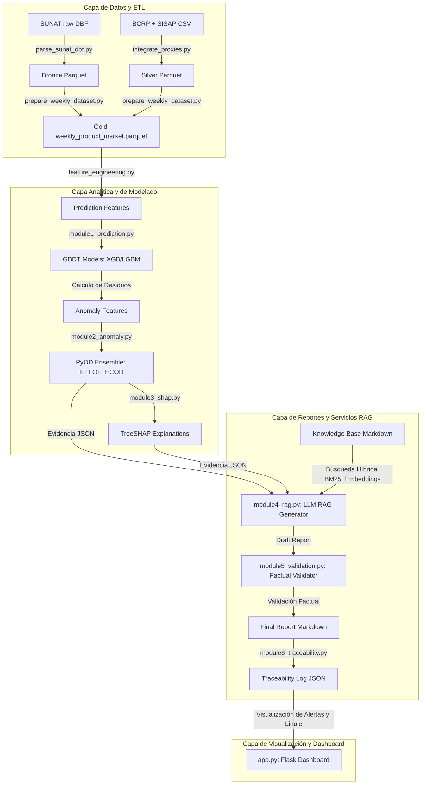
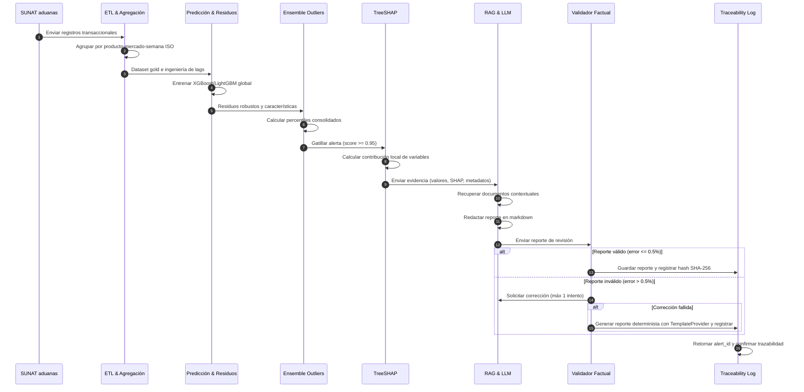
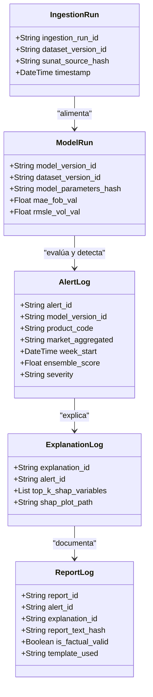
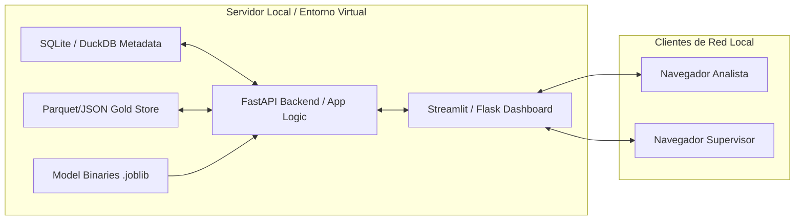
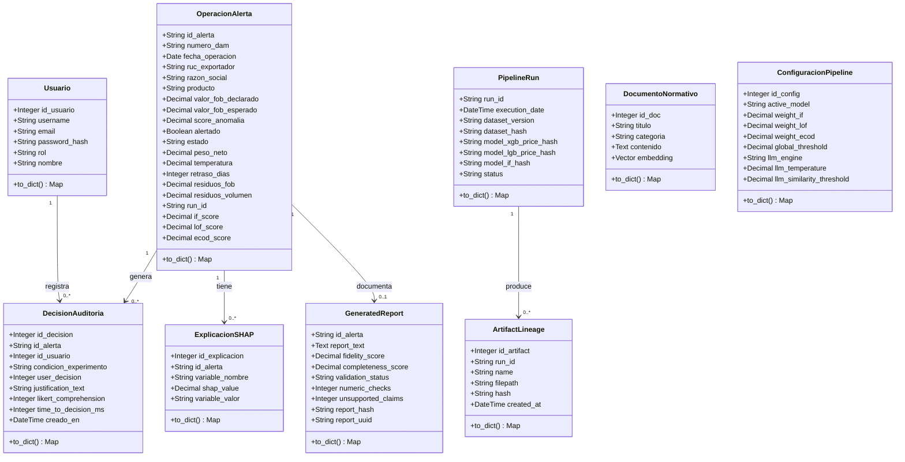

---
title: "Sistema Integrado de Supervisión Operativa con Inteligencia Artificial Explicable para Empresas Agroexportadoras Peruanas"
author: "Yoset Cozco Mauri"
date: "2026"
bibliography: refs.bib
csl: apa.csl
---

---

**UNIVERSIDAD NACIONAL DE SAN AGUSTÍN DE AREQUIPA**

Facultad de Ingeniería de Producción y Servicios

Escuela Profesional de Ingeniería de Sistemas

---

**SISTEMA INTEGRADO DE SUPERVISIÓN OPERATIVA CON INTELIGENCIA ARTIFICIAL EXPLICABLE PARA LA DETECCIÓN DE ANOMALÍAS Y GENERACIÓN DE REPORTES TRAZABLES EN EMPRESAS AGROEXPORTADORAS PERUANAS**

---

Tesis presentada por el Bachiller:

**Cozco Mauri, Yoset**

Para optar el Título Profesional de Ingeniero de Sistemas

Asesor:

**Dr. Víctor Manuel Cornejo Aparicio**

---

**Arequipa – Perú**

**2026**

---

# DEDICATORIA

*(Por completar — dedicatoria personal del autor)*

---

# AGRADECIMIENTOS

*(Por completar — agradecimientos al asesor, jurado, institución colaboradora y familiares)*

---

# PRESENTACIÓN

La presente investigación tiene como propósito el diseño, implementación y evaluación de un sistema integrado de supervisión operativa para empresas agroexportadoras peruanas, que combina técnicas de aprendizaje automático, detección de anomalías, explicabilidad algorítmica y generación automática de reportes trazables mediante modelos de lenguaje con recuperación de contexto. El estudio responde a la necesidad de contar con herramientas de inteligencia artificial capaces de detectar desviaciones operativas, explicar sus causas probables y documentar alertas de manera comprensible para supervisores, responsables de calidad, gestores logísticos y auditores internos.

El trabajo se organiza en cinco capítulos: el Capítulo I establece el planteamiento del problema, objetivos e hipótesis; el Capítulo II desarrolla el marco teórico con antecedentes y estado del arte; el Capítulo III describe la propuesta metodológica; el Capítulo IV presenta los resultados y discusión; y el Capítulo V contiene las conclusiones y trabajos futuros.

**El Autor**

---

<div style="page-break-before: always;"></div>

```{=openxml}
<w:p><w:r><w:br w:type="page"/></w:r></w:p>
```

# RESUMEN

Esta tesis propone un sistema integrado de supervision operativa para empresas agroexportadoras peruanas, basado en un dataset agroexportador integrado y trazable. La arquitectura combina prediccion tabular mediante modelos GBDT (Gradient Boosting Decision Trees), deteccion de anomalias operativas mediante ensemble de algoritmos, explicabilidad mediante SHAP (SHapley Additive exPlanations) y generacion automatica de reportes tecnicos con LLMs en arquitectura RAG (Retrieval-Augmented Generation).

El problema abordado es la fragmentacion de datos agroexportadores y la baja trazabilidad entre fuentes de comercio exterior, mercado interno, variables macroeconomicas, clima, logistica y sanidad. En este contexto, la investigacion se orienta a productos priorizados de agroexportacion peruana: palta, uva y arandano como nucleo; esparrago como producto secundario condicionado a cobertura suficiente; y cacao como producto excluido de la evaluacion principal por baja representatividad en el dataset real auditado.

La propuesta utiliza SUNAT/ADUANET como fuente primaria de exportaciones reales, Trade Map como benchmark externo, SISAP/MIDAGRI como contexto de mercado interno mayorista, BCRP para variables macroeconomicas, y fuentes climaticas, logisticas y sanitarias como proxies documentados. Los datos sinteticos controlados se restringen a escenarios experimentales, balanceo de clases, simulacion de alertas o vacios no observables con fuentes publicas, siempre identificados mediante etiquetas metodologicas.

Las contribuciones principales son: (1) una arquitectura modular de cuatro capas que separa prediccion, deteccion, explicacion y reporte; (2) un enfoque de dataset agroexportador integrado con datos reales observados, datos reales agregados, proxies y sinteticos controlados; (3) uso de SHAP para explicar la contribucion de variables en alertas operativas; (4) reportes RAG restringidos a evidencia estructurada, score, metadatos y version de dataset; y (5) una metodologia de evaluacion que compara rendimiento tecnico, trazabilidad, comprension operativa y tiempo-a-decision. La Resolucion SBS N. 053-2023 se considera como referencia nacional de buenas practicas para gestion de riesgo de modelos, mientras que el D.S. N. 115-2025-PCM se adopta como marco peruano general de gobernanza y supervision humana en IA.

**Palabras clave**: supervision operativa, agroexportacion, dataset integrado, deteccion de anomalias, explicabilidad IA, SHAP, RAG, GBDT, trazabilidad, inteligencia artificial.

---

# ABSTRACT

This thesis proposes an integrated operational supervision system for Peruvian agro-export companies, based on a traceable integrated agro-export dataset. The architecture combines tabular prediction with Gradient Boosting Decision Trees (GBDT), operational anomaly detection through an algorithmic ensemble, explainability with SHAP (SHapley Additive exPlanations), and automatic technical report generation with Large Language Models (LLMs) in a Retrieval-Augmented Generation (RAG) architecture.

The research addresses the fragmentation of agro-export data and the weak traceability between foreign trade, domestic market, macroeconomic, climate, logistics, and sanitary sources. The study focuses on avocado, grape, and blueberry as core products; asparagus as a secondary product subject to coverage validation; and cocoa as excluded from the main evaluation due to low representativeness in the audited real dataset.

The proposal uses SUNAT/ADUANET as the primary source for real export data, Trade Map as an external benchmark, SISAP/MIDAGRI as domestic wholesale market context, BCRP for macroeconomic variables, and climate, logistics, and sanitary sources as documented proxies. Controlled synthetic data are limited to experimental scenarios, class balancing, alert simulation, or non-public data gaps, and must always be explicitly labeled.

The main contributions are: (1) a modular four-layer architecture separating prediction, detection, explanation, and reporting; (2) an integrated agro-export dataset approach combining observed real data, aggregated real data, proxies, and controlled synthetic data; (3) SHAP-based attribution of variables in operational alerts; (4) evidence-restricted RAG reports using structured evidence, scores, metadata, and dataset versions; and (5) an evaluation methodology covering technical performance, traceability, operational comprehension, and time-to-decision.

**Keywords**: operational supervision, agro-export, integrated dataset, anomaly detection, AI explainability, SHAP, RAG, GBDT, traceability, artificial intelligence.

<div style="page-break-before: always;"></div>

```{=openxml}
<w:p><w:r><w:br w:type="page"/></w:r></w:p>
```

# ÍNDICE DE CONTENIDOS

- DEDICATORIA
- AGRADECIMIENTOS
- PRESENTACIÓN
- RESUMEN
- ABSTRACT
- ÍNDICE DE CONTENIDOS
- ÍNDICE DE FIGURAS
- ÍNDICE DE TABLAS
- ÍNDICE DE FÓRMULAS
- INTRODUCCIÓN
- **CAPÍTULO I: PLANTEAMIENTO DEL PROBLEMA**
  - 1.1 Descripción de la Realidad Problemática
  - 1.2 Problema Principal
  - 1.3 Objetivos
  - 1.4 Hipótesis de la Investigación
  - 1.5 Variables e Indicadores
  - 1.6 Viabilidad de la Investigación
  - 1.7 Justificación e Importancia
  - 1.8 Alcance
  - 1.9 Línea, Tipo y Nivel de la Investigación
  - 1.10 Técnicas e Instrumentos de Recolección de Información
  - 1.11 Cronograma de Actividades
- **CAPÍTULO II: MARCO TEÓRICO**
  - 2.1 Antecedentes de la Investigación
  - 2.2 Estado del Arte
  - 2.3 Marco Conceptual
- **CAPÍTULO III: ELABORACIÓN DE LA PROPUESTA**
  - 3.1 Generalidades de la Propuesta
  - 3.2 Esquema de la Propuesta
  - 3.3 Obtención y Preparación de Datos
  - 3.4 Diseño e Implementación del Prototipo
  - 3.5 Diseño Experimental y Validación
- **CAPÍTULO IV: RESULTADOS Y DISCUSIÓN**
  - 4.1 Estado de Implementación del Prototipo
  - 4.2 Resultados Cuantitativos: Predicción y Detección
  - 4.3 Explicabilidad Local y Reportes Automáticos
  - 4.4 Usabilidad y Trazabilidad
  - 4.5 Discusión y Cruce Comparativo
  - 4.6 Limitaciones de los Resultados
  - 4.7 Síntesis del Capítulo IV
- **CAPÍTULO V: CONCLUSIONES Y TRABAJOS FUTUROS**
  - 5.1 Conclusiones
  - 5.2 Limitaciones
  - 5.3 Trabajos Futuros
- CRONOGRAMA DE ACTIVIDADES
- CONCLUSIONES
- RECOMENDACIONES
- GLOSARIO DE TÉRMINOS
- REFERENCIAS BIBLIOGRÁFICAS
- ANEXOS

---

# ÍNDICE DE FIGURAS

- Figura 3.1 — Arquitectura lógica del sistema integrado
- Figura 3.2 — Flujo temporal de datos, predicción, alerta y reporte
- Figura 3.3 — Modelo lógico de trazabilidad de alerta, explicación y reporte
- Figura 4.1 — Vista de detalle de alerta del prototipo funcional
- Figura 4.2 — Consola de telemetría experimental del prototipo
- Figura 4.3 — Bandeja de gestión de alertas
- Figura 4.4 — Configuración de modelo y umbrales
- Figura 4.5 — Explorador de datos y biblioteca RAG
- Figura 4.6 — Importancia global SHAP para FOB
- Figura 4.7 — Importancia global SHAP para volumen
- Figura 4.8 — Distribución SHAP para FOB
- Figura 4.9 — Distribución SHAP para volumen

---

# ÍNDICE DE TABLAS

- Tabla 1.1 — Variables e Indicadores
- Tabla 1.2 — Cronograma de Actividades
- Tabla 1.3 — Técnicas e Instrumentos de Recolección
- Tabla 2.1 — Comparativa de Sistemas de Supervisión con IA
- Tabla 2.2 — Resumen del Estado del Arte por Bloques Temáticos
- Tabla 3.1 — Mapeo de módulos, rutas, entradas, salidas y evidencia
- Tabla 3.2 — Inventario reproducible de archivos principales
- Tabla 3.3 — Caracterización del dataset semanal gold
- Tabla 3.4 — Controles de calidad temporal y prevención de fuga de información
- Tabla 3.5 — Checklist verificable de cierre del Capítulo III
- Tabla 4.1 — Rendimiento de detección en experimento preliminar
- Tabla 4.2 — Recall por tipo de anomalía
- Tabla 4.3 — Rendimiento predictivo de XGBoost
- Tabla 4.4 — Atribuciones SHAP promedio por variable
- Tabla 4.5 — Rúbrica de calidad de reportes RAG
- Tabla 4.6 — Documentos recuperados por tipo de alerta
- Tabla 4.7 — Telemetría de usabilidad
- Tabla 4.8 — Campos de trazabilidad completos

---

# ÍNDICE DE FÓRMULAS

- Fórmula 1 — Función objetivo GBDT: $F^*(x) = \arg\min_F \mathbb{E}[L(y, F(x))]$
- Fórmula 2 — Iteración GBDT: $F_m(x) = F_{m-1}(x) + \nu \cdot h_m(x)$
- Fórmula 3 — Local Outlier Factor: $\text{LOF}_k(p)$
- Fórmula 4 — Score robusto de residuo: $z_r(t)=\frac{r(t)-\text{mediana}(r_{t-13:t-1})}{\text{MAD}(r_{t-13:t-1})}$
- Fórmula 5 — Score ensemble de anomalía: $s=\sum_i w_i p_i$
- Fórmula 6 — Valor SHAP: $\phi_i = \sum_{S \subseteq F \setminus \{i\}} \frac{|S|!(|F|-|S|-1)!}{|F|!}[f(S\cup\{i\})-f(S)]$

---

<div style="page-break-before: always;"></div>

```{=openxml}
<w:p><w:r><w:br w:type="page"/></w:r></w:p>
```

# INTRODUCCION

La agroexportacion peruana constituye un sector estrategico para la economia nacional debido a su crecimiento sostenido, diversificacion de productos y participacion en mercados internacionales exigentes. De acuerdo con informacion oficial del Ministerio de Desarrollo Agrario y Riego, al cierre de 2025 las agroexportaciones peruanas alcanzaron ventas por USD 15 013 millones, con un crecimiento de 17.3% respecto al anio anterior (MIDAGRI, 2026). Entre los productos de mayor interes para esta investigacion se consideran como nucleo la palta, la uva y el arandano, mientras que el esparrago se mantiene como producto secundario condicionado a la calidad de su cobertura de datos. El cacao, aunque aparece en registros exploratorios, se excluye del nucleo experimental por baja representatividad local.

En este contexto, las empresas agroexportadoras articulan procesos de produccion agricola, acopio, almacenamiento, control de calidad, cumplimiento fitosanitario, logistica y comercializacion internacional. Cada proceso genera datos que pueden revelar desviaciones relevantes para la gestion operativa: cambios inusuales de precios, variaciones de volumen, condiciones climaticas adversas, incumplimientos de calidad, retrasos logisticos o patrones atipicos en mercados de destino. Sin embargo, la informacion se encuentra dispersa entre fuentes publicas, sistemas internos, reportes agregados y registros tecnicos no siempre compatibles entre si.

La presente investigacion parte de esa fragmentacion. El proyecto no se limita a entrenar modelos sobre un dataset sintetico, sino que propone construir y utilizar un **dataset agroexportador integrado**, compuesto por datos reales observados, datos reales agregados, variables proxy documentadas y datos sinteticos controlados solo cuando sean necesarios para escenarios experimentales, balanceo o etiquetas de anomalia. La fuente primaria para comercio exterior es SUNAT/ADUANET; Trade Map se utiliza como benchmark externo de mercados destino; SISAP/MIDAGRI aporta contexto de mercado interno mayorista para palta, uva y esparrago; BCRP aporta tipo de cambio; y las fuentes climaticas, logisticas y sanitarias se emplean como proxies agregados cuando no existe llave directa por embarque.

La inteligencia artificial ofrece herramientas adecuadas para abordar esta brecha. Los modelos GBDT han demostrado buen desempeno en datos tabulares estructurados (Grinsztajn et al., 2022); los ensembles de detectores de anomalias permiten identificar comportamientos atipicos de forma mas robusta que un detector individual (Han et al., 2022); la explicabilidad mediante SHAP convierte predicciones opacas en atribuciones comprensibles (Lundberg & Lee, 2017); y los modelos de lenguaje con arquitectura RAG pueden transformar resultados cuantitativos en reportes comprensibles siempre que su funcion se restrinja a narrar evidencias y no a decidir ni inventar informacion (Schneider et al., 2025).

La tesis propone un sistema integrado de cuatro capas que une prediccion tabular, deteccion de anomalias, explicabilidad y generacion de reportes trazables en un flujo coherente de supervision operativa. El sistema busca mejorar la deteccion de desviaciones, explicar los factores asociados y documentar cada alerta con fuente, score, umbral, variables explicativas y evidencia recuperada. La Resolucion SBS N. 053-2023 (SBS, 2023) se toma como referencia nacional de buenas practicas para gestion de riesgo de modelos, sin asumirla como obligacion directa para agroexportadoras; el D.S. N. 115-2025-PCM (PCM, 2025) se emplea como marco peruano general sobre gobernanza, transparencia y supervision humana en inteligencia artificial.

El documento se estructura de la siguiente manera: el Capitulo I plantea el problema de investigacion, define objetivos, hipotesis, variables, indicadores, alcance y viabilidad. El Capitulo II desarrolla antecedentes, estado del arte y marco teorico. El Capitulo III describe la arquitectura del sistema, el dataset agroexportador integrado y la configuracion experimental. El Capitulo IV presenta resultados validados o, cuando corresponda, resultados preliminares claramente identificados. El Capitulo V sintetiza conclusiones, limitaciones y trabajos futuros.

---

<div style="page-break-before: always;"></div>

```{=openxml}
<w:p><w:r><w:br w:type="page"/></w:r></w:p>
```

# CAPÍTULO I: PLANTEAMIENTO DEL PROBLEMA

## 1.1 Descripción de la realidad problemática

### Contexto
Las operaciones agroexportadoras peruanas representan uno de los motores económicos principales del país, impulsando el desarrollo agrícola y la balanza comercial. La comercialización de productos agrícolas perecederos, como la palta, la uva fresca y el arándano, requiere una coordinación precisa de la producción, el empaque, el control fitosanitario, la logística de frío y el despacho aduanero. Durante estas etapas, se genera un volumen masivo y continuo de información: registros aduaneros, reportes de precios mayoristas nacionales, variables macroeconómicas, condiciones climáticas regionales, tiempos de despacho portuario y alertas sanitarias en mercados de destino. 

### Problema de datos
A pesar de la abundancia de registros, la información en este dominio se encuentra fragmentada entre múltiples organizaciones e instituciones públicas y privadas (SUNAT, MIDAGRI, BCRP, SENASA, NASA POWER). Los datos poseen granularidades y formatos heterogéneos: microdatos transaccionales aduaneros por contenedor, precios mayoristas diarios agregados a nivel de mercado mayorista local, tipos de cambio mensuales, y datos climáticos georreferenciados semanales. No existe una estructura unificada o canal que integre estas fuentes para obtener una perspectiva operativa única. Por ende, la tesis propone y adopta la construcción de un **dataset agroexportador integrado** que consolida datos reales observados de aduanas, datos agregados macroeconómicos y sectoriales, proxies documentados y datos sintéticos controlados para simulaciones.

### Problema analítico
En la gestión de las operaciones, la simple observación de una cifra de exportación (ej. un valor FOB o un volumen por contenedor) no permite determinar si la transacción se encuentra dentro de los parámetros normales de comportamiento o si constituye una desviación crítica. Para realizar una supervisión efectiva, es indispensable construir un **valor esperado** histórico que sirva de línea base de comparación y permita calcular el residuo predictivo (la desviación respecto de lo esperado). La falta de estimaciones semanales de valor unitario FOB y volumen exportado impide parametrizar el comportamiento histórico normal y multivariable de las exportaciones.

### Problema explicativo
Los modelos predictivos o algoritmos de detección de anomalías tradicionales (como Isolation Forest o LOF) operan como cajas negras. Aunque un ensemble unificado genere una alerta de riesgo sobre una operación específica (determinando que es una desviación con severidad baja, media o alta), la ausencia de explicabilidad reduce la confianza de los analistas de negocio. Sin una justificación local del peso marginal de cada característica (ej. a través de valores SHAP), los analistas no pueden determinar qué variables exógenas o comerciales empujaron la transacción hacia el rango de anomalía.

### Problema documental
Finalmente, incluso si el sistema detecta una anomalía y explica sus variables, persiste una brecha documental importante. Los analistas y auditores internos requieren reportes en lenguaje natural claros y trazables que vinculen la alerta con el sustento de datos reales. La automatización tradicional de reportes mediante modelos de lenguaje (LLMs) carece de controles factuales deterministas, lo que introduce el riesgo de alucinaciones (cifras e interpretaciones inventadas por el modelo). Asimismo, se requiere garantizar el linaje inmutable de cada alerta desde los datos de origen de SUNAT hasta el informe final.

### Síntesis
En consecuencia, se identifica la necesidad de diseñar, implementar y evaluar un sistema integrado de inteligencia artificial explicable que resuelva de forma unificada la ingesta y agregación de datos multisource, la estimación predictiva de valores esperados, la detección de desviaciones multivariables mediante un ensemble de anomalías, la interpretación de factores mediante SHAP y la redacción de informes técnicos trazables mediante RAG con control factual.

---

## 1.2 Problema principal

¿En qué medida la implementación de un sistema integrado de inteligencia artificial basado en la predicción semanal del valor unitario FOB y del volumen exportado, la detección multivariable de anomalías, la explicabilidad y la generación automática de reportes trazables mejora la efectividad de la supervisión analítica de operaciones agroexportadoras peruanas respecto del uso de componentes aislados?

### Subproblemas

1.  ¿Cómo integrar fuentes heterogéneas de datos reales de comercio exterior, mercado interno, macroeconomía, clima, logística y sanidad sin confundir granularidades ni inducir fuga de información temporal?
2.  ¿Qué desempeño predictivo logran los algoritmos globales de regresión XGBoost y LightGBM para estimar el valor unitario FOB esperado de la siguiente semana frente a los baselines históricos y Elastic Net?
3.  ¿Qué desempeño predictivo logran para estimar el volumen de exportación de la siguiente semana?
4.  ¿Qué desempeño de detección obtiene el ensemble de Isolation Forest, Local Outlier Factor y ECOD frente a los detectores individuales en un conjunto de anomalías sintéticas controladas?
5.  ¿De qué manera las explicaciones locales SHAP y el contexto de RAG mejoran la comprensión operativa de las alertas aduaneras?
6.  ¿Cómo validar la consistencia numérica de los reportes narrativos autogenerados y garantizar el linaje inmutable de cada alerta desde el dato de origen?
7.  ¿Qué mejora cuantitativa existe en la tasa de comprensión, usabilidad y tiempo de decisión de los analistas humanos al interactuar con el sistema integrado frente a componentes aislados?

---

## 1.3 Objetivos

### 1.3.1 Objetivo principal

Diseñar, implementar y evaluar un sistema integrado de inteligencia artificial explicable para predecir semanalmente el valor unitario FOB y el volumen exportado, detectar anomalías multivariables, explicar las predicciones e interpretar las alertas mediante SHAP, y generar reportes trazables sustentados en evidencia estructurada para apoyar la supervisión analítica de operaciones agroexportadoras peruanas.

### 1.3.2 Objetivos específicos

1.  Identificar, auditar, normalizar e integrar las fuentes de datos agroexportadores reales de SUNAT, BCRP y SISAP con proxies climáticos, logísticos y sanitarios.
2.  Construir un dataset agroexportador integrado semanal a nivel de producto × mercado de destino × semana ISO con marcas metodológicas y sin fuga de información temporal.
3.  Implementar y optimizar modelos globales GBDT (XGBoost/LightGBM) para predecir el valor unitario FOB de exportación de la siguiente semana ($t+1$) y evaluar su desempeño frente a baselines.
4.  Implementar y optimizar modelos globales GBDT para predecir el volumen de exportación de la siguiente semana ($t+1$).
5.  Implementar un ensemble unificado no supervisado de Isolation Forest, Local Outlier Factor y ECOD calibrado por percentiles para la detección de anomalías operativas.
6.  Integrar explicaciones locales de Shapley (SHAP) basadas en TreeSHAP para justificar la contribución de variables en los modelos predictivos de las alertas.
7.  Implementar un generador de reportes basado en arquitectura RAG y un LLM, incorporando un módulo validador factual que compare determinísticamente las cifras textuales con la evidencia de datos.
8.  Evaluar la efectividad del sistema integrado mediante experimentos de usabilidad (escala SUS, tiempo de decisión y tasa de acierto) y auditoría de linaje con hashes SHA-256 frente a componentes aislados.

---

## 1.4 Hipótesis de la investigación

### 1.4.1 Hipótesis general

La implementación de un sistema integrado de inteligencia artificial explicable, compuesto por predicción semanal de valor unitario FOB y volumen exportado, detección multivariable de anomalías, explicabilidad SHAP, reportes RAG con validación factual y trazabilidad documental, mejora significativamente la efectividad de la supervisión analítica de operaciones agroexportadoras peruanas respecto del uso de componentes analíticos aislados.

### 1.4.2 Hipótesis nula (H0)

La implementación de un sistema integrado de inteligencia artificial explicable no produce una mejora significativa en la efectividad de la supervisión analítica de operaciones agroexportadoras peruanas respecto del uso de componentes analíticos aislados, considerando rendimiento predictivo, detección de anomalías, comprensión del usuario, tiempo de análisis y trazabilidad documental.

### 1.4.3 Hipótesis específicas

**H1a.** Los modelos globales XGBoost o LightGBM, entrenados sobre el dataset semanal producto-mercado-semana, presentan un error absoluto medio (MAE) significativamente menor que el mejor modelo base para predecir el valor unitario FOB de la siguiente semana.

**H1b.** Los modelos globales XGBoost o LightGBM, entrenados sobre el dataset semanal producto-mercado-semana, presentan un error logarítmico cuadrático medio (RMSLE) significativamente menor que el mejor modelo base para predecir el volumen exportado de la siguiente semana.

**H1c.** El ensemble de Isolation Forest, Local Outlier Factor y ECOD, calibrado por percentiles y alimentado con residuos predictivos y variables agroexportadoras, presenta un F1-Score superior al promedio de sus detectores individuales en un conjunto experimental con anomalías controladas.

**H1d.** Las alertas acompañadas de explicaciones SHAP y reportes RAG trazables producen una mayor comprensión operativa y un menor tiempo de análisis en los usuarios evaluadores que las alertas presentadas únicamente mediante resultados técnicos aislados.

**H1e.** El módulo de trazabilidad basado en identificadores, metadatos y hashes SHA-256 incrementa la proporción de alertas cuyo proceso puede reconstruirse desde los registros de origen, el dataset versionado y el modelo utilizado hasta la explicación, la decisión humana y el reporte final.

---

## 1.5 Variables e indicadores

### 1.5.1 Variable independiente
*   **Tipo de sistema de supervisión analítica (VI):**
    *   *Nivel 1: Sistema integrado* (pipeline secuencial de 4 capas: predicción, ensemble PyOD, SHAP y RAG con validador y trazabilidad de hashes).
    *   *Nivel 2: Componentes aislados* (salidas técnicas de predicción y scores sin contexto lingüístico ni linaje estructurado).

### 1.5.2 Variable dependiente
*   **Efectividad de la supervisión analítica (VD):** evaluada en las dimensiones de rendimiento predictivo, rendimiento de detección, usabilidad subjetiva, tiempo de respuesta de diagnóstico y tasa de trazabilidad documental.

*(La tabla de operacionalización detallada que vincula dimensiones, indicadores, escalas, técnicas e instrumentos se incorpora como anexo compilado de esta tesis: "Matriz de Operacionalización").*

---

## 1.6 Viabilidad de la investigación

### 1.6.1 Viabilidad técnica
El desarrollo del prototipo de software integrado es factible mediante el uso de librerías de código abierto y de amplia validación en la industria en lenguaje Python (pandas, numpy, scikit-learn, XGBoost, LightGBM, PyOD, SHAP, sentence-transformers, Flask). El hardware requerido consiste en equipos de cómputo convencionales en CPU sin requerir costosas estaciones de trabajo con GPU.

### 1.6.2 Viabilidad operativa
El sistema operará bajo una modalidad de procesamiento por lotes (batch), compatible con la recolección semanal de registros de exportación de la SUNAT. No requiere una integración intrusiva en tiempo real con los sistemas de aduanas o ERPs empresariales privados, actuando como una herramienta analítica de soporte de auditoría interna y supervisión independiente "human-in-the-loop" (gobernanza de IA).

### 1.6.3 Viabilidad económica
El costo financiero del proyecto es mínimo al sustentarse en licencias de software libre y recursos informáticos ya disponibles. La descarga de microdatos públicos es gratuita. La factibilidad económica del sistema se fundamenta en su potencial para optimizar los tiempos de auditoría de las agencias de comercio exterior y empresas comercializadoras, reduciendo mermas de control.

---

## 1.7 Justificación e importancia

### 1.7.1 Justificación teórica
El estudio aporta valor académico al integrar en una arquitectura única cuatro campos de la ciencia de la computación y la IA que suelen abordarse por separado en la literatura: el modelamiento tabular GBDT global, los ensembles de detección no supervisada, la teoría de Shapley para interpretabilidad algorítmica y los LLMs restringidos por RAG para redacción técnica.

### 1.7.2 Justificación metodológica
La investigación formula un marco estructurado de auditoría del origen de los datos, clasificando formalmente las variables por su naturaleza (real observada, agregada, proxy, sintética controlada) y forzando marcas de trazabilidad SHA-256. Esto mitiga el problema recurrente de opacidad y falta de reproducibilidad experimental en tesis tecnológicas.

### 1.7.3 Justificación práctica
El prototipo provee a los supervisores aduaneros y gestores agroexportadores peruanos una interfaz de control analítico. El sistema traduce matrices matemáticas de residuos y scores a reportes técnicos comprensibles con validación factual de cifras, facilitando la toma de decisiones basada en evidencias.

---

## 1.8 Alcance
*   **Temático y Tecnológico:** Diseño, desarrollo experimental y evaluación de una arquitectura modular de cuatro capas (Predicción, Detección de Anomalías con PyOD, Explicabilidad con TreeSHAP y Reporte con RAG/LLM) y un módulo registrador de trazabilidad con hashes SHA-256.
*   **Geográfico:** Microdatos de exportaciones agrícolas peruanas registradas en las aduanas nacionales, principalmente asociadas a las zonas productoras y puertos de La Libertad, Piura, Ica, Lambayeque y Arequipa.
*   **Productivo:** El núcleo experimental está acotado a palta (*avocado*), uva fresca (*grape*) y arándano (*blueberry*). El espárrago se conserva como producto secundario o de sensibilidad solo si se declara su menor cobertura y no se mezcla en conclusiones principales. Se excluye permanentemente cacao por baja representatividad.
*   **Temporal:** Ventana continua desde **junio de 2018 hasta mayo de 2026**.
*   **Exclusiones:** No se implementará monitoreo de variables en tiempo real, control autónomo de despachos aduaneros, modelos de Deep Learning como propuesta principal ni integraciones funcionales con sistemas ERP privados de empresas particulares.

---

## 1.9 Línea, tipo y nivel de investigación
*   **Línea de Investigación:** *Inteligencia Artificial y Aprendizaje Automático Aplicado* (línea principal) e *Ingeniería de Software y Gobernanza de TI* (línea secundaria) de la Escuela Profesional de Ingeniería de Sistemas de la UNSA.
*   **Tipo de Investigación:** Aplicada y tecnológica.
*   **Nivel de Investigación:** Explicativo y evaluativo, con un enfoque epistemológico post-positivista.
*   **Diseño de Investigación:** Cuasiexperimental (comparación de VI), longitudinal (análisis temporal 2018-2026) y comparativo (evaluación frente a baselines).

---

## 1.10 Técnicas e instrumentos de recolección de información

La investigación combina técnicas documentales, computacionales, funcionales y evaluativas. Debido a que el objeto de estudio es un sistema integrado de inteligencia artificial explicable, la recolección de información incluye literatura, fuentes institucionales, datasets, métricas, logs, reportes automáticos, pruebas de calidad, evidencia de prototipo y registros de interacción de usuarios.

Las técnicas utilizadas son:

- Análisis documental.
- Experimentación computacional.
- Pruebas funcionales del sistema.
- Auditoría de trazabilidad.
- Prueba controlada con usuarios.
- Evaluación mediante rúbricas.

**Tabla 1.3 — Técnicas e instrumentos de recolección de información**

| Técnica | Instrumento | Propósito |
|---|---|---|
| Análisis documental | Matriz de revisión bibliográfica y ficha de antecedentes | Identificar fundamentos teóricos, antecedentes, brechas, algoritmos aplicables y criterios de comparación para sustentar el Capítulo II. |
| Análisis documental | Ficha de fuente de datos | Registrar origen, granularidad, periodo, licencia, ruta local, limitaciones y clasificación de cada fuente como real observada, agregada, proxy o sintética controlada. |
| Experimentación computacional | Scripts de ETL, integración y preparación semanal | Construir el dataset agroexportador integrado a nivel producto, mercado y semana ISO, manteniendo trazabilidad de fuentes y reglas de transformación. |
| Experimentación computacional | Scripts de entrenamiento y evaluación predictiva | Medir el desempeño de modelos basales, XGBoost y LightGBM para predicción semanal de valor unitario FOB y volumen exportado. |
| Experimentación computacional | Scripts de detección de anomalías | Evaluar Isolation Forest, Local Outlier Factor, ECOD y el ensemble propuesto frente a anomalías estadísticas o sintéticas controladas. |
| Pruebas funcionales del sistema | Checklist de rutas, pantallas y endpoints | Verificar que el prototipo funcional ejecute login, dashboard, alertas, detalle, historial, telemetría, integridad, datos, configuración y usuarios. |
| Pruebas funcionales del sistema | Capturas de pantalla documentadas | Registrar visualmente las pantallas del prototipo y dejar evidencia de las figuras que deberán incorporarse al documento final. |
| Auditoría de trazabilidad | Registro de hashes SHA-256, UUID y versiones | Reconstruir el linaje de datasets, modelos, alertas, explicaciones, reportes y artefactos experimentales. |
| Auditoría de trazabilidad | Pruebas automatizadas de calidad y fuga temporal | Confirmar reglas mínimas de calidad, partición temporal, ausencia de fuga de información y reproducibilidad de evidencia. |
| Prueba controlada con usuarios | Cuestionario SUS y escala Likert de comprensión | Medir usabilidad percibida, claridad, utilidad de explicaciones y comprensión de alertas por parte de usuarios evaluadores. |
| Prueba controlada con usuarios | Registro automático de tiempo y decisión | Comparar la condición de sistema integrado frente a la condición de resultados aislados mediante tiempo de análisis y respuestas correctas. |
| Evaluación mediante rúbricas | Rúbrica de reportes automáticos | Validar completitud, coherencia, fidelidad factual, consistencia numérica y presencia de evidencia estructurada en reportes generados. |
| Evaluación mediante rúbricas | Matriz de aceptación de evidencia | Clasificar artefactos como preliminares, candidatos o finales y verificar si cada evidencia puede reproducirse e incorporarse a la tesis. |

Datos pendientes para completar esta sección en la versión final:

- Definir el formato institucional final de las fichas de análisis documental.
- Incorporar las capturas definitivas del prototipo en `docs/figures/`.
- Guardar el instrumento final de consentimiento, tareas, encuesta SUS y escala Likert.
- Registrar la prueba automatizada de fuga temporal en `reports/tesis/data-quality/leakage-tests/`.
- Registrar corridas experimentales con identificador, commit, semilla, configuración, métricas y hashes.
- Incorporar la rúbrica final de validación factual de reportes automáticos.
- Precisar número final y perfil de participantes de la prueba controlada con usuarios.
- Marcar como definitivos solo los artefactos que cuenten con comando, salida esperada, fecha, versión y evidencia reproducible.

---

## 1.11 Cronograma de actividades

El cronograma se organiza desde el estado actual del proyecto hasta la primera semana de diciembre de 2026, fecha prevista para la sustentación de tesis. Las fechas podrán ajustarse por calendario académico, disponibilidad del asesor o requisitos administrativos de la escuela, pero la secuencia metodológica debe mantenerse: cierre documental, cierre de datos, experimento, redacción final, revisión, depósito y sustentación.

**Tabla 1.2 — Cronograma de actividades hasta sustentación**

| Fase | Periodo | Actividades principales | Producto verificable | Estado esperado |
|---|---|---|---|---|
| F1. Ordenamiento documental | 22-30 junio 2026 | Completar Capítulos II y III, depurar antecedentes nacionales, consolidar placeholders de figuras y capturas | `docs/02-20`, `02-21`, `02-22`, `02-30`, tesis monolítica regenerada | En curso |
| F2. Cierre de datos | 1-15 julio 2026 | Congelar dataset gold, registrar hashes, validar cobertura, resolver duplicados funcionales y documentar fuentes proxy | `data/gold/`, `codex-revision/reporte-calidad-datos.md`, reporte de dataset | Pendiente |
| F3. Pruebas de calidad y fuga | 16-31 julio 2026 | Ejecutar pruebas de calidad, fuga temporal, escaladores, codificadores y partición temporal | `reports/tesis/data-quality/leakage-tests/` | Pendiente |
| F4. Entrenamiento predictivo | 1-20 agosto 2026 | Entrenar baselines, XGBoost y LightGBM para FOB y volumen; registrar hiperparámetros y residuos fuera de muestra | `reports/tesis/experiments/<run_id>/` | Pendiente |
| F5. Validación de anomalías | 21 agosto-5 septiembre 2026 | Ejecutar IF, LOF, ECOD, ensemble, anomalías sintéticas y métricas por tipo | Métricas PR-AUC, F1, Recall, Precision@k | Pendiente |
| F6. Explicabilidad y reportes | 6-20 septiembre 2026 | Generar SHAP, reportes RAG, validación factual y comparación con plantilla determinística | `data/gold/local_explanations.json`, `validation_metrics.json`, reportes auditados | Pendiente |
| F7. Prototipo y capturas finales | 21 septiembre-5 octubre 2026 | Verificar `sistema-web-agro`, capturar pantallas finales, insertar figuras y actualizar anexos | `docs/figures/`, anexos y evidencia visual | Pendiente |
| F8. Prueba controlada con usuarios | 6-20 octubre 2026 | Ejecutar estudio A/B, consentimiento, anonimización, SUS, tiempos y decisiones | `reports/tesis/user-study/` | Pendiente |
| F9. Capítulo IV final | 21 octubre-5 noviembre 2026 | Reemplazar resultados preliminares por resultados reproducibles, contrastar hipótesis y cerrar discusión | Capítulo IV actualizado | Pendiente |
| F10. Capítulo V y conclusiones | 6-15 noviembre 2026 | Redactar conclusiones, limitaciones, recomendaciones y trabajos futuros según resultados finales | Capítulo V y recomendaciones | Pendiente |
| F11. Revisión integral | 16-22 noviembre 2026 | Revisar formato, APA, citas, tablas, figuras, anexos, índices y coherencia de hipótesis | Borrador final revisado | Pendiente |
| F12. Compilación y depósito | 23-30 noviembre 2026 | Generar PDF/DOCX final, verificar maquetación, firmar anexos y preparar entrega administrativa | `output/tesis_final.pdf`, `output/tesis_final.docx` | Pendiente |
| F13. Sustentación | Primera semana de diciembre 2026 | Presentación, defensa, demostración del prototipo y respuesta a observaciones | Sustentación de tesis | Meta final |

**Hito final:** sustentación de tesis durante la primera semana de diciembre de 2026.

<div style="page-break-before: always;"></div>

```{=openxml}
<w:p><w:r><w:br w:type="page"/></w:r></w:p>
```

# CAPÍTULO II: MARCO TEÓRICO

## 2.1 Antecedentes de la Investigación

### 2.1.1 Antecedentes Internacionales

1.  **Kadir et al. (2025) — *AuditCopilot: Leveraging LLMs for fraud detection in double-entry bookkeeping***
    *   **Objetivo:** Desarrollar un sistema de auditoría contable que integre modelos de lenguaje con técnicas de detección de anomalías para explicar transacciones irregulares en lenguaje natural.
    *   **Datos:** Corpus experimental de asientos contables sintéticos y transacciones financieras de doble entrada.
    *   **Método:** Pipeline secuencial compuesto por detección algorítmica de outliers, inyección de contexto en prompts estructurados y generación de textos explicativos mediante un LLM de gran escala.
    *   **Resultados Reales:** Incremento en la tasa de detección de fraudes y reducción del tiempo promedio de revisión por parte de los auditores humanos, validado mediante pruebas cualitativas de usabilidad.
    *   **Limitación:** El modelado se restringe a datos contables tradicionales de doble entrada y no incorpora variables exógenas como el clima, precios de mercado mayorista o datos logísticos complejos.
    *   **Relación con la Tesis:** Aporta el fundamento metodológico para combinar la detección algorítmica con la generación narrativa RAG. La tesis traslada esta arquitectura al dominio de operaciones agroexportadoras perecederas en el Perú.

2.  **Park (2024) — *LLMs for anomaly validation and report generation in financial systems***
    *   **Objetivo:** Diseñar un framework multi-agente basado en LLMs especializados para la validación y documentación de alertas de anomalías en mercados financieros de alta frecuencia.
    *   **Datos:** Series temporales financieras diarias del índice S&P 500 y noticias comerciales asociadas.
    *   **Método:** División del procesamiento en cuatro agentes inteligentes: conversión de datos, análisis estadístico, verificación cruzada documental y generación/consolidación del reporte.
    *   **Resultados Reales:** Reducción de falsos positivos en las alarmas mediante el filtrado semántico y la verificación de noticias, superando el rendimiento de un agente genérico único.
    *   **Limitación:** El sistema opera en mercados financieros de alta frecuencia y requiere acceso constante a noticias de mercado en tiempo real, lo que eleva el costo computacional.
    *   **Relación con la Tesis:** Sustenta la separación de roles entre los modelos matemáticos cuantitativos de detección y la capa de lenguaje. La tesis adopta la restricción de que el LLM no es el detector, sino el redactor fundamentado en evidencias.

3.  **Almalki & Masud (2025) — *Financial fraud detection using explainable AI and stacking ensemble methods***
    *   **Objetivo:** Diseñar un framework de detección de fraude en transacciones empresariales combinando modelos de ensamble de gradiente y explicabilidad post-hoc.
    *   **Datos:** Datasets tabulares corporativos de transacciones financieras y estados contables.
    *   **Método:** Stacking Ensemble de clasificadores basados en árboles (XGBoost y LightGBM) acoplado a un motor de atribución local SHAP para generar la justificación de las alertas.
    *   **Resultados Reales:** Obtención de un PR-AUC superior a 0.90 y alta estabilidad en el SHAP Stability Index, garantizando explicaciones consistentes y robustas ante perturbaciones.
    *   **Limitación:** El enfoque se limita a la detección estática en bases de datos contables sin considerar la dimensión de series temporales dinámicas o la generación automática de informes en lenguaje natural.
    *   **Relación con la Tesis:** Valida la superioridad de la combinación GBDT + SHAP en datos tabulares y sustenta la arquitectura de la Capa 1 y Capa 3 de la propuesta agroexportadora.

4.  **Grinsztajn et al. (2022) — *Why do tree-based models still outperform deep learning on tabular data?***
    *   **Objetivo:** Analizar y comparar el rendimiento de los modelos basados en árboles (GBDT) frente a modelos de aprendizaje profundo (Deep Learning) especializados para datos tabulares.
    *   **Datos:** 45 datasets tabulares reales y sintéticos de diversos sectores económicos con muestras menores a 50,000 registros.
    *   **Método:** Evaluación empírica sistemática de XGBoost, LightGBM y CatBoost frente a FT-Transformer, TabNet y perceptrones multicapa (MLP) mediante optimización de hiperparámetros.
    *   **Resultados Reales:** Los modelos GBDT superaron a las redes neuronales en el 95% de los escenarios tabulares evaluados. Se identificaron tres factores de éxito: robustez ante variables no informativas, falta de invarianza ante rotaciones de datos y discontinuidades en las fronteras de decisión.
    *   **Limitación:** El estudio no aborda el modelamiento de secuencias temporales autoregresivas complejas, limitándose a problemas de clasificación y regresión estándar.
    *   **Relación con la Tesis:** Justifica teórica y empíricamente la decisión de seleccionar XGBoost y LightGBM como los regresores globales de la tesis agroexportadora en lugar de modelos Deep Learning tabulares.

---

### 2.1.2 Antecedentes nacionales y evidencia sectorial verificable

Durante la revisión documental se identificó que algunos antecedentes nacionales usados en borradores previos no contaban todavía con trazabilidad bibliográfica suficiente para sostener autores, año, universidad, muestra y resultados cuantitativos. Por esa razón, esta versión no mantiene afirmaciones no verificadas como reducción de mermas, mejora porcentual de pronóstico o resultados de sensores IoT si no existe documento original localizado. La sección nacional se reestructura con fuentes institucionales verificables y con una lista explícita de antecedentes académicos pendientes de sustitución.

1. **MIDAGRI (2026) — Reporte sectorial de agroexportaciones peruanas**
   * **Objetivo documental:** Caracterizar el crecimiento reciente de la agroexportación peruana y ubicar la relevancia económica del sector.
   * **Datos:** Información institucional de ventas agroexportadoras y productos representativos reportada por el Ministerio de Desarrollo Agrario y Riego.
   * **Aporte a la tesis:** Sustenta el contexto económico que justifica priorizar productos agroexportadores de alta participación, especialmente palta, uva y arándano.
   * **Limitación:** No entrega microdatos transaccionales ni permite por sí sola evaluar modelos predictivos o detectores de anomalías.

2. **SUNAT/ADUANET (2026) — Bases y estadísticas aduaneras**
   * **Objetivo documental:** Proveer registros o series de comercio exterior que permiten reconstruir valor FOB, peso, subpartida, país de destino y periodo de exportación.
   * **Datos usados en el proyecto:** Descargas locales en `data/sunat/raw_downloads/`, `data/sunat/x23290326.DBF`, `data/raw/exports_raw.csv` y capas procesadas `data/bronze/`, `data/silver/` y `data/gold/`.
   * **Aporte a la tesis:** Constituye la fuente primaria para la unidad producto-mercado-semana y para las variables de valor FOB, volumen y destino.
   * **Limitación:** Las descargas locales completas disponibles se concentran en ventanas 2026; la cobertura 2018-2025 requiere documentar si proviene de dataset real local consolidado, fuentes agregadas o reconstrucción complementaria.

3. **BCRP (2018-2026) — Tipo de cambio PEN/USD**
   * **Objetivo documental:** Incorporar una variable macroeconómica exógena para normalizar o contextualizar el comportamiento de valor exportado.
   * **Datos usados en el proyecto:** `data/bcrp/exchange_rates_cache.json` y `data/downloads/bcrp_tipo_cambio.csv`.
   * **Aporte a la tesis:** Permite incluir contexto macroeconómico en los modelos de predicción y detectar semanas donde una desviación comercial puede coincidir con cambios cambiarios.
   * **Limitación:** La frecuencia mensual debe mapearse cuidadosamente a semana ISO sin usar información posterior a la semana objetivo.

4. **SISAP/MIDAGRI y Trade Map — Contexto de mercado interno e internacional**
   * **Objetivo documental:** Incorporar referencias externas de precios, volúmenes y mercados para contextualizar exportaciones por producto.
   * **Datos usados en el proyecto:** Manifiestos SISAP en `codex-revision/metadata/` y archivos Trade Map en `data-trademap/`.
   * **Aporte a la tesis:** Funcionan como fuentes de contraste y contexto, no como sustituto del registro aduanero.
   * **Limitación:** Operan con granularidades distintas al embarque aduanero; por tanto, su integración se declara como variable agregada o proxy.

5. **SENAMHI/NASA POWER y proxies climáticos**
   * **Objetivo documental:** Proveer contexto climático regional para productos perecederos.
   * **Datos usados en el proyecto:** Variables climáticas presentes en `data/dataset_real_v1.csv`, `data/silver/exports_clean.parquet` y `data/gold/weekly_product_market.parquet`.
   * **Aporte a la tesis:** Permiten evaluar si las semanas con mayor estrés climático agregado coinciden con cambios de volumen, valor unitario o anomalías.
   * **Limitación:** No prueban causalidad logística ni falla de cadena de frío por embarque; solo aportan contexto agregado.

**Antecedentes académicos nacionales pendientes de sustitución.** Los trabajos titulados provisionalmente "Modelos GBDT y clima para predicción agroexportadora peruana" y "Detección de anomalías IoT en cadenas de frío de perecederos" se retiran como evidencia académica cerrada hasta localizar documento original, repositorio, autores, institución, año, muestra y resultados. Si no se verifica su existencia, deberán reemplazarse por tesis o artículos reales encontrados en RENATI, Alicia/CONCYTEC, repositorios universitarios peruanos o revistas indizadas.

| Antecedente preliminar | Acción requerida | Estado en esta versión |
|---|---|---|
| Mendoza & Huamán (2024) | Localizar documento original y verificar resultados atribuidos | No usado como evidencia concluyente |
| Chávez & Díaz (2023) | Localizar documento original y verificar reducción de mermas atribuida | No usado como evidencia concluyente |
| Estudios nacionales de cadena de frío | Sustituir por documentos reales con repositorio y metodología verificable | Pendiente |
| Estudios nacionales de forecasting agroexportador | Sustituir por documentos reales con datos y métricas reproducibles | Pendiente |

---

### 2.1.3 Antecedentes Metodológicos

1.  **Han et al. (2022) — *ADBench: Anomaly detection benchmark***
    *   **Objetivo:** Evaluar sistemática y exhaustivamente algoritmos de detección de anomalías bajo múltiples niveles de supervisión.
    *   **Datos:** 57 conjuntos de datos tabulares reales y sintéticos con inyección controlada de ruido y anomalías de distinta dimensionalidad.
    *   **Método:** Comparativa de 30 algoritmos de detección (incluyendo Isolation Forest, LOF, ECOD, One-Class SVM y Autoencoders).
    *   **Resultados Reales:** Confirmación de que ningún detector es superior en todos los escenarios; sin embargo, los enfoques de ensemble unificados mitigan el riesgo de sobreajuste y logran mayor estabilidad y robustez general ante cambios distribucionales.
    *   **Limitación:** La mayoría de los datasets evaluados son estáticos y no corresponden a series temporales operacionales estructuradas.
    *   **Relación con la Tesis:** Provee el soporte metodológico y la justificación teórica para construir un ensemble unificado no supervisado en la Capa 2 (PyOD) del sistema.

2.  **Lundberg & Lee (2017) — *A unified approach to interpreting model predictions***
    *   **Objetivo:** Desarrollar un marco unificado con consistencia axiomática para la atribución de variables locales en modelos de aprendizaje automático.
    *   **Datos:** Evaluado en diversos datasets tabulares y de imágenes.
    *   **Método:** Formulación de los valores de Shapley (SHAP) a partir de la teoría de juegos cooperativos, garantizando propiedades de eficiencia, simetría, aditividad y consistencia.
    *   **Resultados Reales:** Demostración de que SHAP unifica métodos previos (LIME, DeepLIFT) resolviendo sus inconsistencias matemáticas locales.
    *   **Limitación:** El cálculo exacto tiene complejidad exponencial en función del número de características.
    *   **Relación con la Tesis:** Sustenta el uso del componente de explicabilidad (Capa 3) del sistema, aplicando la optimización TreeSHAP para modelos de árboles de decisión.

3.  **Lewis et al. (2020) — *Retrieval-augmented generation for knowledge-intensive NLP tasks***
    *   **Objetivo:** Combinar modelos generativos de lenguaje con sistemas de recuperación de información externa para resolver tareas intensivas en conocimiento sin requerir reentrenamiento masivo.
    *   **Datos:** Wikipedia dump e índices vectoriales de preguntas y respuestas.
    *   **Método:** Arquitectura RAG que recupera fragmentos relevantes a partir de una consulta y los inyecta en el contexto de entrada de un modelo secuencia a secuencia (BART/T5).
    *   **Resultados Reales:** Reducción de la tasa de alucinación semántica y mejora de la precisión factual en la generación de textos.
    *   **Limitación:** Sensible a la calidad y consistencia lógica de la base de conocimiento indexada.
    *   **Relación con la Tesis:** Define la estructura de la Capa 4 para generar reportes fundamentados exclusivamente en la base documental del corpus y los datos estructurados.

---

### 2.1.4 Síntesis crítica
La revisión de antecedentes revela una brecha metodológica y tecnológica: los trabajos analíticos en agroexportación peruana se han limitado a predicciones puntuales de volumen o a detección aislada de fallas logísticas de frío mediante sensores IoT. Por otra parte, las propuestas metodológicas de IA explicable y automatización de reportes (AuditCopilot, AuditMAI) se restringen a dominios contables y financieros estáticos. **No existe en la literatura revisada un sistema integrado que unifique la predicción de valor unitario y volumen semanal, la detección de anomalías mediante un ensemble calibrado por percentiles, la explicabilidad con SHAP y la redacción de informes con RAG factual** en el dominio agroexportador peruano.

---

<div style="page-break-before: always;"></div>

```{=openxml}
<w:p><w:r><w:br w:type="page"/></w:r></w:p>
```

# ESTADO DEL ARTE

## 2.2 Estado del Arte

El estado del arte de la investigación se estructura a partir de los siguientes debates científicos de la disciplina:

### 2.2.1 Modelos GBDT frente a Aprendizaje Profundo Tabular
El modelado de datos estructurados empresariales se caracteriza por un debate continuo entre el uso de algoritmos basados en árboles (GBDT) y la adaptación de arquitecturas de aprendizaje profundo (como Transformers tabulares o TabNet). Trabajos como FT-Transformer (Gorishniy et al., 2021) y TabNet (Arik & Pfister, 2021) proponen que los mecanismos de atención capturan relaciones de alta dimensionalidad. Sin embargo, la evidencia sistemática aportada por Grinsztajn et al. (2022) demuestra que para conjuntos de datos empresariales de tamaño moderado ($\le 50,000$ filas), los GBDT (XGBoost y LightGBM) superan a las redes neuronales en precisión, velocidad de entrenamiento y robustez ante características no informativas. La presente tesis adopta esta posición, utilizando XGBoost y LightGBM como base predictiva de la propuesta.

### 2.2.2 Detector Único frente a Ensemble de Anomalías
En la detección de outliers, el debate gira en torno a si un único detector optimizado (como Isolation Forest o LOF) es suficiente frente a un ensemble multi-algoritmo. La investigación de Han et al. (2022) en ADBench concluye que ningún detector domina todos los patrones de desviación, ya que Isolation Forest destaca en outliers globales por aislamiento espacial, LOF en anomalías locales por densidad de vecindario, y ECOD en colas de distribuciones estadísticas. En consecuencia, el diseño de ensembles calibrados por percentiles es la alternativa recomendada en el estado del arte para garantizar estabilidad ante patrones de anomalía desconocidos, enfoque que es implementado en este prototipo.

### 2.2.3 Predicción Esperada y Residuos
La detección tradicional de anomalías suele aplicarse directamente sobre los datos observados en bruto. No obstante, el estado del arte de la supervisión continua sugiere que es más efectivo modelar las desviaciones operativas calculando los **residuos predictivos** (la diferencia entre el valor real observado y el valor esperado estimado por un modelo predictivo robusto). El cálculo de residuos robustos escalados mediante la desviación absoluta de la mediana (MAD) móvil de 13 semanas permite desacoplar los ciclos estacionales naturales de las anomalías operativas genuinas.

### 2.2.4 SHAP y Explicabilidad
La interpretabilidad algorítmica opone a los métodos agnósticos locales como LIME (Ribeiro et al., 2016) frente a formulaciones de la teoría de juegos como SHAP (Lundberg & Lee, 2017). Mientras que LIME construye modelos lineales locales que pueden resultar inestables ante pequeñas perturbaciones de datos, SHAP garantiza consistencia axiomática e invarianza, asegurando que si una variable incrementa su impacto, su valor asignado no disminuye. La formulación TreeSHAP permite el cálculo exacto de las atribuciones locales en tiempo polinómico sobre modelos GBDT, posicionándolo como el estándar de explicabilidad post-hoc.

### 2.2.5 LLM como Detector frente a LLM como Redactor
La emergencia de los modelos de lenguaje de gran tamaño (LLMs) ha motivado propuestas para utilizarlos directamente como clasificadores o detectores de anomalías sobre datos tabulares serializados a texto (Hegselmann et al., 2023). No obstante, el estado del arte advierte sobre el riesgo crítico de alucinaciones intrínsecas y numéricas en tareas lógicas cuantitativas (Maynez et al., 2026). Por ello, el consenso metodológico orienta el uso del LLM exclusivamente a la capa de redacción formal de informes, restringiendo su entrada a un prompt estructurado de evidencias provenientes de modelos matemáticos validados.

### 2.2.6 RAG y Control Factual
La generación de reportes corporativos mediante LLMs requiere mitigar alucinaciones y asegurar consistencia. La arquitectura RAG (Retrieval-Augmented Generation) (Lewis et al., 2020) resuelve esta brecha al alimentar el prompt con documentos y evidencias recuperados. Sin embargo, para entornos de auditoría, se requiere una capa complementaria de **validación factual determinista** que extraiga de forma automatizada las cifras textuales generadas por el modelo y las contraste contra el objeto JSON de evidencias, aplicando tolerancias estrictas por redondeo y cayendo en plantillas predefinidas ante fallos reiterados.

### 2.2.7 Arquitecturas Aisladas frente a Integradas
La literatura científica se encuentra fragmentada: existen sistemas que resuelven forecasting temporal de precios, otros orientados a la detección de outliers, y herramientas independientes de explicabilidad o reporte. La brecha de investigación radica en la falta de arquitecturas integradas y secuenciales que comuniquen de forma estructurada los componentes analíticos, asegurando el linaje desde el microdato transaccional hasta el informe técnico de auditoría.

### 2.2.8 Gobernanza de IA y Trazabilidad
El despliegue de sistemas inteligentes se enfrenta a exigencias de gobernanza corporativa y rendición de cuentas, reguladas por marcos nacionales como el Decreto Supremo N° 115-2025-PCM (Gobernanza y Supervisión Humana en Perú) y metodologías internacionales como el NIST AI Risk Management Framework (AI RMF 1.0) y las directrices de la Resolución SBS N° 053-2023 para riesgos de modelos. El estado del arte exige que cada alerta sea reproducible mediante marcas de tiempo, identificadores únicos y firmas SHA-256 de todas las fases del procesamiento.

---

### 2.2.9 Brecha específica que aborda la tesis

La revisión anterior permite delimitar una brecha precisa: los trabajos y herramientas existentes suelen resolver de forma separada el pronóstico, la detección de anomalías, la explicabilidad, la generación de reportes o la trazabilidad. En cambio, el problema de supervisión analítica agroexportadora requiere un flujo unido y auditable, porque una alerta solo es útil si puede reconstruirse desde el dato de origen hasta la decisión humana.

| Bloque del estado del arte | Solución dominante | Brecha persistente | Decisión de esta tesis |
|---|---|---|---|
| Predicción tabular | GBDT, modelos estadísticos y redes tabulares | Bajo acoplamiento con anomalías y reportes | Usar XGBoost/LightGBM como estimadores globales de valor FOB y volumen |
| Anomalías | Detectores individuales o benchmarks genéricos | Sensibilidad al tipo de anomalía y umbral | Ensemble IF + LOF + ECOD calibrado por percentiles |
| Explicabilidad | SHAP/LIME como análisis post-hoc | Explicaciones no siempre llegan al usuario final | Inyectar top-k SHAP en la alerta y el reporte |
| Reportes LLM | Redacción flexible de texto | Riesgo de alucinación numérica y factual | RAG restringido + validador determinístico |
| Gobernanza | Model cards, datasheets y auditoría | Trazabilidad fragmentada entre archivos | Hashes SHA-256, UUID y registro de linaje por alerta |
| Agroexportación peruana | Reportes sectoriales y fuentes públicas | Granularidades heterogéneas y proxies | Dataset semanal producto-mercado-semana con marcas de origen |

### 2.2.10 Implicancia para el diseño metodológico

El diseño del Capítulo III adopta tres principios derivados del estado del arte:

1. **Modelo antes que alerta:** la anomalía se interpreta como desviación respecto de un valor esperado, no como simple valor extremo observado.
2. **Explicación antes que automatización:** el sistema apoya la decisión humana y no ejecuta bloqueos automáticos ni sanciones.
3. **Evidencia antes que narrativa:** el reporte automático solo es aceptable si sus cifras y afirmaciones pueden rastrearse a datos estructurados, documentos recuperados o logs de ejecución.

Cuando una fuente no tiene granularidad de embarque, se incorpora como contexto agregado o proxy y se prohíbe interpretarla como causa directa de una falla operativa. Esta regla es central para mantener consistencia entre el alcance de los datos disponibles y las afirmaciones de la tesis.

<div style="page-break-before: always;"></div>

```{=openxml}
<w:p><w:r><w:br w:type="page"/></w:r></w:p>
```

# MARCO CONCEPTUAL

## 2.3 Marco Conceptual

### 2.3.1 Operación Agroexportadora
Transacción comercial de exportación de bienes agrícolas perecederos, regulada por la SUNAT, que abarca variables de volumen (peso neto, peso bruto), valor comercial aduanero (FOB), subpartida arancelaria a 10 dígitos (HS code), país de destino y exportador (RUC).

### 2.3.2 Supervisión Analítica
Proceso de auditoría interna y monitoreo de las operaciones de comercio exterior orientado a identificar desviaciones operativas, comerciales o aduaneras, comparando los registros reales contra líneas base o comportamientos esperados.

### 2.3.3 Valor Unitario FOB de Exportación
Indicador comercial derivado que mide el valor promedio obtenido por kilogramo de producto FOB declarado en la aduana de salida:
$$\text{fob\_unit\_value\_usd\_kg} = \frac{\text{total\_fob\_usd}}{\text{total\_net\_weight\_kg}}$$
No equivale conceptualmente al precio internacional de venta minorista en destino, puesto que incorpora costos locales, empaque y contratos aduaneros prefijados.

### 2.3.4 Granularidad Temporal Semanal
Nivel de agregación cronológica adoptado en el dataset analítico, estructurado a nivel de producto × mercado × semana ISO (lunes a domingo), garantizando que las micro-transacciones individuales de SUNAT se acumulen semanalmente para coincidir con la frecuencia de actualización de variables de mercado y climáticas.

### 2.3.5 Data Leakage (Fuga de Información)
Fallo metodológico en el entrenamiento de modelos de series temporales en el cual información del futuro ($t+1$ o posterior) se filtra hacia el conjunto de características del pasado ($t$). Se previene implementando un desplazamiento temporal estricto (`shift(1)`) en todas las rolling windows e imputaciones exógenas.

### 2.3.6 Gradient Boosting Decision Trees (GBDT)
Familia de algoritmos de aprendizaje automático supervisado que optimizan de forma secuencial una función de pérdida agregando árboles de decisión para corregir los residuos de predicción previos mediante descenso de gradiente. Algoritmos principales: XGBoost y LightGBM.

### 2.3.7 Residuo Predictivo Robust-Z
Desviación del valor real observado en $t+1$ respecto de la estimación del modelo predictivo, normalizado de forma robusta utilizando la mediana y la MAD (Desviación Absoluta de la Mediana) de una ventana móvil de 13 semanas por serie temporal para capturar anomalías genuinas aisladas del ruido estacional.

### 2.3.8 Ensemble no Supervisado PyOD
Modelo unificado compuesto por Isolation Forest, Local Outlier Factor (LOF) y ECOD (Empirical Cumulative Distribution Outlier Detection). Sus scores individuales se unifican mediante escalamiento Min-Max calibrado en entrenamiento, calculando el score final del ensemble como el promedio simple de los percentiles de anomalía.

### 2.3.9 Explicabilidad Local Post-Hoc con SHAP
Método de atribución local basado en la teoría de juegos cooperativos que calcula los valores de Shapley para medir el impacto marginal cuantitativo (atribución) de cada variable predictora en la desviación de la estimación del modelo respecto de su valor esperado promedio.

### 2.3.10 Retrieval-Augmented Generation (RAG)
Arquitectura de procesamiento de lenguaje natural que inyecta contexto documental e histórico verificado (recuperado de una base de conocimiento mediante búsqueda híbrida BM25 y embeddings) directamente en el prompt del LLM para restringir la redacción narrativa del reporte y evitar alucinaciones extrínsecas.

### 2.3.11 Trazabilidad de Modelos y Linaje de Datos
Capacidad de documentar y reconstruir de extremo a extremo el flujo de procesamiento de una alerta. Se garantiza mediante el registro inmutable de metadatos de configuración, identificadores UUIDv4 para cada fase y hashes SHA-256 de los datasets y modelos entrenados.

### 2.3.12 Dato real observado, dato agregado, proxy y dato sintético
Para evitar ambigüedad metodológica, esta tesis distingue cuatro tipos de evidencia:

| Tipo | Definición | Ejemplo en el proyecto | Uso permitido |
|---|---|---|---|
| Real observado | Registro directamente asociado a una operación o fuente primaria | FOB, peso, destino y fecha derivados de SUNAT/ADUANET o dataset real local | Entrenamiento, validación y caracterización |
| Real agregado | Serie institucional agregada sin granularidad de embarque | Tipo de cambio BCRP, precios SISAP/MIDAGRI, series Trade Map | Contexto y variables exógenas |
| Proxy documentado | Aproximación razonable cuando no existe medición directa por embarque | Clima regional, días logísticos agregados, alertas sanitarias agregadas | Contexto explicativo no causal |
| Sintético controlado | Dato generado para simulación, balanceo o inyección experimental | Alertas semilla, anomalías inyectadas, datos de interfaz | Validación funcional o experimento controlado |

Un proxy no demuestra causa empresarial real; solo aporta contexto para el modelo y para la interpretación del analista.

### 2.3.13 Resultado preliminar y resultado definitivo
Un resultado es **preliminar** cuando proviene de datos semilla, muestras pequeñas, corridas exploratorias o artefactos sin registro completo de dataset, commit, configuración, semilla y hash. Un resultado es **definitivo** únicamente cuando puede reproducirse con un comando documentado, sobre un dataset versionado, con partición temporal congelada y salidas verificables.

### 2.3.14 Placeholder de figura o evidencia visual
Cuando una figura, diagrama o captura de pantalla todavía no existe como PNG/SVG/PDF insertable, el documento debe conservar un placeholder explícito. El placeholder debe indicar: código de figura, título, archivo esperado, fuente de generación, contenido visual requerido y criterio de aceptación. Este criterio evita que el índice de figuras prometa artefactos que no están disponibles.

### 2.3.15 Supervisión analítica frente a supervisión operativa causal
La tesis emplea el término **supervisión analítica** para referirse al apoyo computacional en la identificación, explicación y documentación de desviaciones. No afirma causalidad operativa directa cuando los datos disponibles son semanales, agregados o proxies. Las referencias a logística, clima, sanidad o calidad se interpretan como contexto analítico salvo que exista evidencia directa por embarque.

<div style="page-break-before: always;"></div>

```{=openxml}
<w:p><w:r><w:br w:type="page"/></w:r></w:p>
```

# CAPÍTULO III: ELABORACIÓN DE LA PROPUESTA

## 3.1 Generalidades

### 3.1.1 Propósito
El propósito del sistema inteligente de supervisión agroexportadora es proveer una plataforma unificada para detectar desviaciones operativas y aduaneras en exportaciones peruanas de palta, uva y arándano. El sistema apoya a los encargados de control y analistas en la toma de decisiones informadas mediante la estimación de valores esperados, detección de anomalías multivariables, explicaciones locales SHAP y generación automática de reportes técnicos trazables RAG.

### 3.1.2 Usuarios del Sistema
1.  **Analista de Control Operativo:** Revisa alertas, explora las variables incidentes mediante SHAP e inicia solicitudes de auditoría.
2.  **Supervisor de Operaciones / Auditor Interno:** Encargado de la firma de conformidad de los reportes. Valida y autoriza acciones correctivas.
3.  **Administrador de Datos / Ingeniero de ML:** Monitorea la calidad de datos, el linaje, el ajuste de los modelos y el reentrenamiento.
4.  **Investigador / Usuario Académico:** Analiza patrones históricos de mermas, clima o comportamiento de mercado agregados.

### 3.1.3 Entradas
*   Registros transaccionales de aduanas parseados de SUNAT/ADUANET (formato DBF/CSV).
*   Series de tiempo diarias y mensuales del tipo de cambio PEN/USD de la API o caches de BCRP.
*   Series de tiempo mensuales de precios y volúmenes mayoristas nacionales de SISAP (MIDAGRI).
*   Proxies climáticos semanales de temperatura, humedad y lluvias acumuladas de NASA POWER.
*   Proxies de alertas fitosanitarias mensuales de SENASA y la FDA.
*   Configuraciones en YAML para productos arancelarios, modelos e inyección de anomalías.

### 3.1.4 Salidas
*   Predicciones puntuales de valor unitario FOB y volumen exportado para la semana $t+1$.
*   Scores consolidados de anomalías y alertas clasificadas por severidad (`BAJA`, `MEDIA`, `ALTA`).
*   Visualizaciones y mapas de atribución locales SHAP (PNG/SVG) de las variables predictivas.
*   Informes narrativos en markdown validados factual y numéricamente (con linaje SHA-256).
*   Base de datos de auditoría de trazabilidad en JSON/DuckDB.
*   Dashboard interactivo web de visualización en Streamlit/Flask.

### 3.1.5 Requisitos Funcionales

*   **RF-01 (Importar Datos):** Permitir la ingesta de archivos DBF, CSV y Parquet de las fuentes de origen.
*   **RF-02 (Validar Datos):** Verificar tipos de datos, códigos arancelarios válidos a 10 dígitos y países normalizados ISO alfa-3.
*   **RF-03 (Normalizar y Anonimizar):** Homologar escalas de peso (kg) y valor (USD), y anonimizar exportadores con hashes SHA-256 salteados.
*   **RF-04 (Agregar Semanalmente):** Agrupar y consolidar transacciones por combinación `producto × mercado × semana ISO`.
*   **RF-05 (Entrenar Modelos):** Ajustar de forma global algoritmos XGBoost y LightGBM con búsqueda de hiperparámetros en Optuna.
*   **RF-06 (Predecir FOB y Volumen):** Generar las estimaciones puntuales de valor unitario FOB y volumen para la semana $t+1$.
*   **RF-07 (Detectar Anomalías):** Calcular los percentiles de Isolation Forest, LOF y ECOD, y generar alertas si se cruzan los umbrales.
*   **RF-08 (Explicar con SHAP):** Estimar las contribuciones locales TreeSHAP de las variables predictoras sobre la desviación de la alerta.
*   **RF-09 (Recuperar Contexto):** Buscar y recuperar fragmentos semánticos en el corpus RAG mediante indexado híbrido (BM25 y embeddings).
*   **RF-10 (Reportar con LLM):** Generar el reporte en markdown estructurado inyectando evidencias cuantitativas y textos recuperados.
*   **RF-11 (Validar Reporte):** Analizar sintácticamente el texto del reporte y rechazarlo ante discrepancias numéricas superiores al 0.5%.
*   **RF-12 (Consultar Trazabilidad):** Permitir la reconstrucción de la alerta ingresando su identificador UUID (`alert_id`).
*   **RF-13 (Revisar Alertas):** Proveer filtros en la interfaz por producto, mercado, semana y nivel de severidad.
*   **RF-14 (Exportar Resultados):** Permitir la descarga de reportes markdown firmados y tablas de métricas del pipeline.

### 3.1.6 Requisitos No Funcionales
*   **Reproducibilidad:** Fijación de semillas aleatorias globales (`42`) y secundarias en todos los modelos e inyección de datos.
*   **Auditabilidad:** Inmutabilidad mediante hashes SHA-256 registrados para cada entrada de datos, configuraciones, modelos y salidas.
*   **Rendimiento:** Tiempos de inferencia combinada por registro en la escala de milisegundos en CPU de uso general.
*   **Modularidad:** Arquitectura modular monolítica desacoplada mediante scripts independientes para ingesta, modelamiento y reporte.
*   **Usabilidad:** Interfaz interactiva fluida con directrices estéticas premium (vibrant dark mode y visualizaciones simplificadas).
*   **Privacidad:** Anonimización irreversible de los identificadores comerciales de exportadores.

### 3.1.7 Restricciones
*   **Procesamiento por Lotes (Batch):** El sistema está acotado a ejecuciones programadas semanales, excluyendo telemetría en tiempo real.
*   **Soporte Consultivo:** El sistema provee soporte a la decisión humana, no autoriza bloqueos automáticos en aduanas ni reemplaza firmas.
*   **Variables Proxies:** Variables críticas como mermas, costos logísticos o riesgos sanitarios se declaran conceptualmente como estimaciones o proxies, no mediciones directas.

### 3.1.8 Principios de Diseño
1.  **Separación de Responsabilidades:** Desacoplamiento estricto del cálculo cuantitativo frente a la redacción narrativa del LLM.
2.  **Evidencia Primero:** El prompt del modelo de lenguaje se restringe exclusivamente a las evidencias cuantitativas inyectadas.
3.  **Human-in-the-Loop:** Cada alerta y reporte requiere revisión y firma del supervisor humano antes de su registro oficial.
4.  **Trazabilidad:** Cada elemento del sistema hereda y propaga el linaje de identificadores y hashes.
5.  **Control Factual:** Rechazo sistemático de reportes con discrepancias numéricas.
6.  **Mínimo Privilegio:** Restricción de permisos y control de acceso local a los datos brutos de aduana.

### 3.1.9 Tecnologías Implementadas
*   *Lenguaje de programación:* Python (versión 3.11.x).
*   *Análisis y manipulación de datos:* Pandas, Numpy, PyArrow (formato Parquet).
*   *Algoritmos de ML y Anomalías:* XGBoost, LightGBM, PyOD (Isolation Forest, LOF, ECOD), Scikit-Learn, Optuna.
*   *Explicabilidad:* SHAP (TreeSHAP).
*   *RAG e Indexado:* Rank-BM25, Sentence-Transformers (`paraphrase-multilingual-MiniLM-L12-v2`).
*   *Servicios y Dashboard:* Flask / Streamlit, Jinja2, HTML5/CSS3 (estilo premium).
*   *Persistencia:* Parquet para almacenamiento analítico y archivos JSON para trazabilidad y configuraciones.

### 3.1.10 Arquitectura de Componentes



**Figura 3.1 — Arquitectura lógica del sistema integrado.**  
**Estado:** placeholder de figura pendiente.  
**Archivo esperado:** `docs/figures/figura_3_1_arquitectura_logica.svg` y copia PNG en `docs/figures/figura_3_1_arquitectura_logica.png`.  
**Fuente de generación:** bloque Mermaid anterior o diagrama equivalente generado desde `src/module1_prediction.py` a `src/module6_traceability.py` y `sistema-web-agro/backend/app.py`.  
**Contenido visual requerido:** cinco capas diferenciadas: datos/ETL, modelado predictivo, anomalías, explicabilidad/RAG-validación y dashboard/trazabilidad. Debe mostrar entradas, salidas, módulos y relación de linaje.  
**Criterio de aceptación:** la figura debe renderizarse sin código Mermaid visible en el PDF final, tener título, fuente "Elaboración propia" y coincidir con las rutas reales del repositorio.

## 3.2 Esquema de la Propuesta

### 3.2.1 Flujo General de Datos



**Figura 3.2 — Flujo temporal de datos, predicción, alerta y reporte.**  
**Estado:** placeholder de figura pendiente.  
**Archivo esperado:** `docs/figures/figura_3_2_flujo_temporal.svg` y copia PNG en `docs/figures/figura_3_2_flujo_temporal.png`.  
**Fuente de generación:** bloque Mermaid anterior, scripts `src/prepare_weekly_dataset.py`, `src/feature_engineering.py`, `src/module1_prediction.py`, `src/module2_anomaly.py`, `src/module4_rag.py` y `src/module6_traceability.py`.  
**Contenido visual requerido:** secuencia desde registros SUNAT/ADUANET hasta dataset gold, predicción, residuo, score ensemble, explicación SHAP, reporte RAG, validación factual y log de trazabilidad.  
**Criterio de aceptación:** debe distinguir explícitamente información disponible en semana `t` frente al objetivo `t+1`, para evidenciar prevención de fuga temporal.

### 3.2.2 Esquema y Capas de Datos
*   **Raw:** Datos crudos originales descargados sin procesar (formatos DBF de SUNAT y CSVs de SISAP/BCRP).
*   **Bronze:** Transformación inicial uno-a-uno a formato estructurado de alto rendimiento (Parquet) sin alterar campos.
*   **Silver:** Limpieza de nulos, homologación de códigos arancelarios a 10 dígitos, normalización de países ISO alfa-3, y anonimización de exportadores con hashes criptográficos. Exclusión sistemática de cacao.
*   **Gold:** Cuadrícula temporal de agregación semanal de combinación única `product_code`, `market_aggregated`, `week_start`. Generación de lags, rolling statistics y características cíclicas calendario.

### 3.2.3 Unidad de Análisis
*   Definición metodológica única y obligatoria: la combinación de **producto × mercado de destino × semana ISO** iniciada en la fecha `week_start`.
*   Unidad de registro en los archivos analíticos de entrada a los modelos: cada fila describe el comportamiento acumulado de una subpartida arancelaria para un mercado específico durante una semana ISO (lunes a domingo).

### 3.2.4 Variables Objetivo
*   **FOB Unitario Promedio Semanal ($t+1$):**
    $$Y_{FOB}(t+1) = \frac{\sum \text{FOB\_USD}_{t+1}}{\sum \text{Net\_Weight\_kg}_{t+1}}$$
*   **Volumen Neto Semanal ($t+1$):**
    $$Y_{Vol}(t+1) = \sum \text{Net\_Weight\_kg}_{t+1}$$

### 3.2.5 Integración de Fuentes Exógenas
*   *Tipo de cambio (BCRP):* Mapeado semanalmente a través del mes de la fecha `week_start`.
*   *Precios internos (SISAP):* Incorporados semanalmente mediante correspondencia de producto.
*   *Clima regional (NASA):* Agregado semanalmente y desplazado en una semana (`lag1`) para representar la información disponible al cierre de la semana de predicción.

### 3.2.6 Ingeniería de Características (Prevención de Data Leakage)
Todas las variables de predicción correspondientes a estadísticas móviles (`rolling mean`, `rolling std`, `rolling mad`) y variaciones porcentuales se calculan desplazando los datos observados en una semana (`shift(1)`). Esto asegura que ninguna información correspondiente a la semana $t+1$ o posterior se filtre en el conjunto de entrenamiento de la semana $t$.

### 3.2.7 Modelamiento Predictivo Global
Se entrena un único modelo global de regresión multivariable (un modelo para valor unitario FOB y otro para volumen) para todos los productos y mercados seleccionados, incorporando las características categóricas codificadas mediante One-Hot Encoding. La optimización de hiperparámetros se realiza mediante Optuna sobre el split de validación temporal.

### 3.2.8 Cálculo de Residuos Robustos
Los detectores de anomalías se alimentan de los residuos de predicción fuera de muestra (predicciones OOF generadas mediante validación temporal cruzada). El residuo se escala mediante robust-z score móvil:
$$\text{residual\_robust\_z} = \frac{\text{residuo}(t) - \text{mediana}(\text{residuos}_{t-13..t-1})}{\text{MAD}(\text{residuos}_{t-13..t-1})}$$

### 3.2.9 Ensemble de Anomalías y Percentiles
Las puntuaciones crudas de Isolation Forest, LOF y ECOD se calibran en la distribución del conjunto de entrenamiento para transformarlas a percentiles acotados en el rango $[0, 1]$. El ensemble consolida las puntuaciones promediándolas y gatilla la alerta si se supera el percentil 95.

### 3.2.10 Explicabilidad SHAP y Atribución local
TreeSHAP se aplica sobre los regresores globales de GBDT entrenados para calcular las contribuciones marginales locales de cada característica. El sistema extrae el top-5 de variables que empujaron positivamente la predicción esperada y el top-5 que la redujeron, inyectándolos en el prompt de la alerta.

### 3.2.11 RAG con Validador Factual
El motor RAG recupera información metodológica y limitaciones del corpus documental de `knowledge_base/`. El LLM recibe las evidencias de la alerta y redacta el reporte técnico. El validador determinista realiza un análisis numérico mediante expresiones regulares, comparando los números del reporte contra el JSON de entrada, cayendo en `TemplateProvider` ante discrepancias persistentes.

### 3.2.12 Trazabilidad de Auditoría



**Figura 3.3 — Modelo lógico de trazabilidad de alerta, explicación y reporte.**  
**Estado:** placeholder de figura pendiente.  
**Archivo esperado:** `docs/figures/figura_3_3_trazabilidad.svg` y copia PNG en `docs/figures/figura_3_3_trazabilidad.png`.  
**Fuente de generación:** bloque Mermaid anterior, `src/module6_traceability.py`, `data/gold/traceability_log.json` y modelos del prototipo en `sistema-web-agro/backend/models.py`.  
**Contenido visual requerido:** entidades `IngestionRun`, `ModelRun`, `AlertLog`, `ExplanationLog` y `ReportLog`, con campos mínimos de ID, hash, fecha, dataset, modelo y artefacto.  
**Criterio de aceptación:** debe permitir reconstruir visualmente qué hash conecta dataset, modelo, alerta, explicación y reporte.

### 3.2.13 Seguridad y Privacidad
El sistema opera localmente y no expone datos aduaneros crudos al exterior. Los identificadores fiscales (RUC) y nombres de las empresas exportadoras se anonimizan de manera irreversible mediante algoritmo criptográfico SHA-256 con sal fija:
$$\text{exporter\_hash} = \text{SHA256}(\text{RUC} + \text{salt\_salt\_42})$$
Las claves de API de los LLMs se cargan mediante variables de entorno estrictamente privadas en el archivo `.env`.

### 3.2.14 Esquema de Despliegue Local



## 3.3 Obtención y Preparación de Datos

La preparación de datos se organiza como un flujo reproducible por capas. Esta estructura evita mezclar archivos crudos, datos intermedios, resultados experimentales y evidencias finales. La unidad de análisis se mantiene constante en todo el proceso: producto agroexportador, mercado de destino y semana ISO.

### 3.3.1 Fuentes de datos y estado de uso

| Fuente | Ruta o evidencia | Uso en la tesis | Estado |
|---|---|---|---|
| Dataset real local | `data/dataset_real_v1.csv` | Base experimental inicial de exportaciones y proxies | Disponible; requiere declarar composición real/proxy/sintética |
| SUNAT/ADUANET | `data/sunat/raw_downloads/`, `data/sunat/x23290326.DBF` | Fuente primaria aduanera y validación de estructura | Parcial; descargas locales concentradas en 2026 |
| Trade Map | `data-trademap/*.xls` | Contraste externo por producto y mercado | Disponible como benchmark agregado |
| BCRP | `data/bcrp/exchange_rates_cache.json`, `data/downloads/bcrp_tipo_cambio.csv` | Tipo de cambio PEN/USD | Disponible |
| SISAP/MIDAGRI | `codex-revision/metadata/sisap_*` | Contexto de precio/volumen mayorista interno | Disponible como dato agregado |
| NASA POWER / clima | Variables climáticas integradas en silver/gold | Contexto climático regional | Disponible como proxy |
| Dataset analítico gold | `data/gold/weekly_product_market.parquet` | Unidad producto-mercado-semana | Disponible, preliminar |
| Prototipo funcional | `sistema-web-agro/backend/init_db.py` | Datos semilla para validar interfaz y telemetría | Implementado como prototipo |

Los datos semilla del prototipo no sustituyen al dataset final de investigación. Se usan para demostrar integración funcional de backend, frontend, alertas, explicaciones, reportes y telemetría. Los resultados finales deberán provenir del dataset semanal reproducible y documentado.

### 3.3.2 Inventario reproducible de archivos principales

| Capa | Archivo | Filas x columnas | Hash SHA-256 | Uso |
|---|---:|---:|---|---|
| Raw local | `data/raw/exports_raw.csv` | 40,672 x 21 | `64a7dd130cbe2ba79cee04fe8e391d64a81d18cb6a0cbdb4d84e7d27fbd7bea3` | Base tabular inicial |
| Dataset real v1 | `data/dataset_real_v1.csv` | 40,672 x 21 | `64a7dd130cbe2ba79cee04fe8e391d64a81d18cb6a0cbdb4d84e7d27fbd7bea3` | Base experimental local |
| Bronze | `data/bronze/exports_raw.parquet` | 40,672 x 21 | `66c4464cd87a6d4238a793ccb693d5afe1be704e1556d49e3bad8540bb2b2c9c` | Conversión estructural |
| Silver | `data/silver/exports_clean.parquet` | 40,293 x 24 | `ba98a37a9f3c9c7cf36baff8af8e1b61837cd237817b6e441d2bfb9f839e4eb3` | Limpieza y normalización |
| Gold | `data/gold/weekly_product_market.parquet` | 8,340 x 27 | `4b9d0ea84880dc46192806125896707aec8274d51f5c05c8e5d1ebb5350edac3` | Agregación semanal |
| Features predictivas | `data/gold/prediction_features.parquet` | 8,340 x 139 | `e343829f19fc26b1cd153e18fcb70808b9713c82c4b37ea86fe8395c8c607773` | Entrenamiento FOB/volumen |
| Features anomalías | `data/gold/anomaly_features.parquet` | 8,340 x 170 | `f3fa9e7868e2432df240ad932daff0bfb99d54e825fc5967fce991b125412c26` | Detección IF/LOF/ECOD |

**Comando de verificación:** `.\.venv\Scripts\python.exe -c "<script de lectura pandas y hash SHA-256>"`.  
**Salida esperada:** dimensiones y hashes iguales a la tabla anterior. Si algún hash cambia, debe generarse nueva versión de dataset y actualizar los reportes.

### 3.3.3 Capas de procesamiento

| Capa | Descripción | Evidencia esperada |
|---|---|---|
| Raw | Archivos originales sin transformación metodológica | Hash de origen, fecha de descarga, ruta cruda |
| Bronze | Conversión estructural a formatos tabulares/parquet | Script de extracción y conteo de registros |
| Silver | Limpieza, normalización, homologación y anonimización | Diccionario de datos y reporte de calidad |
| Gold | Agregación semanal por producto-mercado-semana | Dataset final, hash, versión y pruebas |
| Features | Variables predictivas, rezagos y ventanas móviles | Matriz de entrenamiento y prueba de fuga |
| Evidence | Métricas, residuos, alertas, explicaciones y reportes | Artefactos en `reports/tesis/` |

### 3.3.4 Caracterización del dataset semanal gold

| Indicador | Valor observado | Evidencia |
|---|---:|---|
| Filas gold | 8,340 | `data/gold/weekly_product_market.parquet` |
| Columnas gold | 27 | `data/gold/weekly_product_market.parquet` |
| Productos | 4 (`avocado`, `blueberry`, `esparrago`, `grape`) | Conteo pandas |
| Mercados agregados | 10 | Conteo pandas |
| Series producto-mercado | 20 | Conteo pandas |
| Semanas ISO | 417 | `week_start` |
| Periodo semanal | 2018-06-04 a 2026-05-25 | `week_start` |
| Filas avocado | 2,502 | Conteo por `product_code` |
| Filas blueberry | 2,502 | Conteo por `product_code` |
| Filas grape | 2,502 | Conteo por `product_code` |
| Filas esparrago | 834 | Conteo por `product_code` |

**Criterio metodológico sobre espárrago:** aunque existe en la base gold, se mantiene como producto secundario o de sensibilidad. El núcleo experimental defendible se concentra en palta, uva y arándano; espárrago no debe mezclarse en conclusiones principales salvo que se declare explícitamente su cobertura menor.

### 3.3.5 Calidad, registros eliminados y límites de datos

El reporte `codex-revision/reporte-calidad-datos.md` registra 40,293 filas válidas post-validación y 4 filas rechazadas. También identifica 4,933 duplicados funcionales potenciales usando producto, fecha, exportador, destino, volumen y precio. Estos duplicados no deben eliminarse automáticamente sin revisar si representan múltiples operaciones similares o registros repetidos.

| Control | Resultado actual | Acción documental |
|---|---|---|
| Cacao | Excluido | Mantener exclusión |
| Palta, uva, arándano | Presentes | Núcleo del estudio |
| Espárrago | Presente con menor cobertura | Mantener como secundario |
| Rechazados | 4 filas | Documentar archivo de rechazados |
| Duplicados exactos | 0 | Sin acción |
| Duplicados funcionales | 4,933 | Revisar antes de cierre final |
| `fob_unit_value_usd_kg` faltante en gold | 91.46% | No usar como métrica final sin imputación/criterio formal |

### 3.3.6 Controles de calidad temporal

Para prevenir fuga de información, las variables predictivas solo deben utilizar información disponible antes de la semana objetivo. Los rezagos, medias móviles y desviaciones móviles se calculan con desplazamiento explícito de una semana. Los escaladores, codificadores y selectores de características se ajustan únicamente con el conjunto de entrenamiento. La partición temporal se congela antes de entrenar los modelos definitivos.

| Control | Regla de aceptación | Estado actual |
|---|---|---|
| Rezagos y ventanas | Toda ventana móvil usa `shift(1)` antes del objetivo | Parcial, requiere prueba automatizada final |
| Escaladores/codificadores | Ajuste solo en entrenamiento | Pendiente de evidencia definitiva |
| Selección de características | Sin acceso al conjunto de prueba | Pendiente |
| Predicciones fuera de muestra | Residuos generados con validación temporal | Pendiente para dataset final |
| Reporte de fuga | Guardar en `reports/tesis/data-quality/leakage-tests/` | Pendiente si no existe ejecución |

**Comando de prueba esperado:** `.\.venv\Scripts\python.exe -m pytest tests/leakage/test_leakage.py`.  
**Salida esperada:** pruebas aprobadas y reporte copiado a `reports/tesis/data-quality/leakage-tests/` con fecha, commit y hash. Si el reporte no existe, la evidencia queda pendiente.

### 3.3.7 Registro de artefactos experimentales

Cada corrida experimental debe registrar identificador único, commit, dataset, semilla, configuración, hiperparámetros, entorno, métricas globales, métricas por producto, predicciones, residuos y hashes de salida. Hasta que esos campos existan, el artefacto se clasifica como preliminar o pendiente, no como definitivo.

## 3.4 Diseño e Implementación del Prototipo

El prototipo funcional se encuentra en `sistema-web-agro/`. Su propósito es demostrar la integración de los componentes de supervisión aduanera con IA explicable, no cerrar por sí solo la validación estadística final de la tesis.

### 3.4.1 Estructura técnica del prototipo

| Componente | Ruta | Función | Estado |
|---|---|---|---|
| Backend Flask | `sistema-web-agro/backend/app.py` | API de alertas, configuración, telemetría y reportes | Implementado |
| Modelos de datos | `sistema-web-agro/backend/models.py` | Entidades de alerta, decisión, usuario y documentos | Implementado |
| Semilla de base | `sistema-web-agro/backend/init_db.py` | Carga de datos de prueba y configuración inicial | Implementado |
| Frontend React | `sistema-web-agro/frontend/src/` | Interfaz de auditoría, detalle, telemetría e integridad | Implementado |
| Despliegue local | `sistema-web-agro/docker-compose.yml`, `run.ps1` | Orquestación local del prototipo | Implementado |
| Evidencia visual | `sistema-web-agro/*/screen.png` | Capturas de pantallas funcionales | Disponible |

### 3.4.2 Vistas funcionales del prototipo

El prototipo incluye vistas para autenticación, panel del auditor, gestión de alertas, detalle de operación con IA explicable, historial, telemetría, integridad, exploración de datos, configuración de modelo y control de usuarios. La vista de detalle de alerta concentra la integración de predicción, score de anomalía, explicación SHAP, reporte RAG y decisión humana.

| Vista | Ruta esperada | Evidencia |
|---|---|---|
| Login | `/login` | `frontend/src/pages/Login.jsx` |
| Dashboard | `/dashboard` | `frontend/src/pages/Dashboard.jsx` |
| Alertas | `/alerts` | `frontend/src/pages/Alerts.jsx` |
| Detalle de alerta | `/alerts/:id` | `frontend/src/pages/Detail.jsx`, `AuditDetail.jsx` |
| Historial | `/history` | `frontend/src/pages/History.jsx` |
| Telemetría | `/telemetry` | `frontend/src/pages/Telemetry.jsx` |
| Integridad | `/integrity` | `frontend/src/pages/Integrity.jsx` |
| Datos/RAG | `/data` | `frontend/src/pages/Data.jsx` |
| Configuración | `/config` | `frontend/src/pages/Config.jsx` |
| Usuarios | `/users` | `frontend/src/pages/Users.jsx` |

### 3.4.3 Placeholders de capturas del prototipo

Las capturas de pantalla no deben sustituir evidencia funcional ni resultados experimentales. Se usan para documentar la interfaz del prototipo. Cuando una captura todavía no esté incorporada al PDF final, se registra el placeholder siguiente:

| Figura | Pantalla | Archivo esperado | Fuente actual | Contenido que debe mostrar | Estado |
|---|---|---|---|---|---|
| Figura 4.1 | Detalle de alerta IA explicable | `docs/figures/figura_4_1_detalle_alerta.png` | `sistema-web-agro/detalle_de_operaci_n_ia_explicable_esp/screen.png` | Datos DAM, FOB esperado, score, SHAP, reporte RAG y decisión humana | Pendiente de inserción formal |
| Figura 4.2 | Consola de telemetría | `docs/figures/figura_4_2_telemetria.png` | `sistema-web-agro/experimental_telemetry_console/screen.png` o `monitor_de_telemetr_a_y_equidad_esp/screen.png` | Condiciones A/B, tiempo de decisión, comprensión y métricas agregadas | Pendiente de inserción formal |
| Figura 4.3 | Bandeja de alertas | `docs/figures/figura_4_3_bandeja_alertas.png` | `sistema-web-agro/alerts_management_inbox/screen.png` | Lista filtrable de alertas, estados, severidad y producto | Pendiente de inserción formal |
| Figura 4.4 | Configuración de modelo | `docs/figures/figura_4_4_configuracion_modelo.png` | `sistema-web-agro/model_configuration_terminal/screen.png` | Pesos IF/LOF/ECOD, umbral y parámetros editables | Pendiente de inserción formal |
| Figura 4.5 | Explorador de datos y RAG | `docs/figures/figura_4_5_explorador_datos.png` | `sistema-web-agro/data_explorer_load_center/screen.png` | Carga o exploración de datos, biblioteca documental y estado de indexación | Pendiente de inserción formal |

**Criterio de aceptación de capturas:** cada imagen debe tener resolución legible, título, fuente "captura del prototipo `sistema-web-agro`", fecha de generación y ruta del componente React correspondiente. Si la captura se usa en Capítulo IV, debe corresponder a la versión del commit documentado.

### 3.4.4 Algoritmos propuestos e implementación vinculada

| Módulo | Algoritmo o técnica | Función | Evidencia |
|---|---|---|---|
| Predicción | XGBoost/LightGBM, GBDT | Estimar FOB unitario y volumen esperado | `src/module1_prediction.py`, prototipo backend |
| Detección de anomalías | Isolation Forest, LOF, ECOD | Calcular score anómalo individual y ensemble | `src/module2_anomaly.py`, `backend/app.py` |
| Explicabilidad | TreeSHAP/SHAP | Atribuir variables que impulsan el riesgo | `src/module3_shap.py`, vista de detalle |
| Reportes automáticos | RAG con recuperación documental y plantilla determinística | Generar narrativa técnica anclada a evidencia | `src/module4_rag.py`, `src/module5_validation.py` |
| Validación factual | Reglas determinísticas y comparación numérica | Rechazar cifras no sustentadas | `src/module5_validation.py` |
| Trazabilidad | Hashes, IDs, logs y relaciones alerta-decisión | Auditar evidencia de extremo a extremo | `src/module6_traceability.py`, modelos del backend |

En el estado actual, el prototipo respalda la arquitectura, las rutas funcionales, la telemetría y la experiencia de auditoría. La validación cuantitativa definitiva sigue condicionada al dataset semanal final, a las pruebas de fuga de información y a los experimentos formales.

### 3.4.5 Modelo de Entidades y Diagrama de Clases del Prototipo

Para garantizar la consistencia, persistencia y trazabilidad de los datos recolectados durante la validación del prototipo, se implementó un modelo relacional mapeado a través de SQLAlchemy. Este comprende el control de acceso, los metadatos de las operaciones, la telemetría del experimento de usabilidad y los reportes generados.



**Figura 3.4 — Diagrama de clases y entidades relacionales de la base de datos del prototipo.**  
**Fuente:** modelado relacional implementado en `sistema-web-agro/backend/models.py`.

## 3.5 Diseño Experimental y Validación

La validación se plantea en cinco bloques: rendimiento predictivo y detección, explicabilidad, calidad de reportes, usabilidad y trazabilidad. Cada bloque debe producir evidencia reproducible antes de ser incorporado como resultado definitivo en el Capítulo IV.

### 3.5.1 Validación de predicción y anomalías

La comparación principal evalúa el ensemble IF + LOF + ECOD frente a detectores individuales y baselines. Las métricas previstas son Precision, Recall, F1, PR-AUC, ROC-AUC y Precision@k. Cuando se usen anomalías sintéticas, se debe registrar tipo, magnitud, proporción de inyección y etiqueta generada.

#### 3.5.1.1 Partición temporal propuesta

La partición se define por fecha y no por muestreo aleatorio, debido a la naturaleza longitudinal del problema.

| Conjunto | Periodo propuesto | Uso | Regla |
|---|---|---|---|
| Entrenamiento | 2018-06-04 a 2024-12-30 | Ajustar modelos, codificadores y escaladores | Puede usarse para Optuna y calibración interna |
| Validación | 2025-01-06 a 2025-12-29 | Selección de hiperparámetros y umbrales | No se mezcla con test |
| Prueba | 2026-01-05 a 2026-05-25 | Evaluación final preliminar | Solo inferencia fuera de muestra |

Si la distribución real por producto no permite sostener estas ventanas para todas las series, debe usarse una validación walk-forward por serie con ventanas mínimas documentadas. En ese caso, la tesis debe reportar cuántas series quedaron excluidas y por qué.

#### 3.5.1.2 Estrategia walk-forward

| Parámetro | Valor metodológico |
|---|---|
| Unidad de ventana | Semana ISO |
| Horizonte | 1 semana (`t+1`) |
| Ventana inicial mínima | 104 semanas por serie cuando exista cobertura |
| Paso | 1 semana o bloque mensual, según costo computacional |
| Salida | Predicción, residuo y error por semana fuera de muestra |
| Evidencia | `reports/tesis/experiments/<run_id>/predictions_oos.parquet` |

#### 3.5.1.3 Baselines predictivos

| Objetivo | Baseline | Descripción | Métrica principal |
|---|---|---|---|
| FOB unitario | Último valor observado | `y_hat(t+1)=y(t)` | MAE |
| FOB unitario | Mediana móvil 4 semanas | Mediana de semanas disponibles hasta `t` | MAE |
| FOB unitario | Mediana móvil 13 semanas | Baseline robusto estacional corto | MAE |
| FOB unitario | Elastic Net | Modelo lineal regularizado | MAE/RMSE |
| Volumen | Último valor observado | Persistencia temporal | RMSLE |
| Volumen | Mediana móvil 4/13 semanas | Baseline robusto | RMSLE |
| Volumen | Baseline estacional | Misma semana del año anterior si existe | RMSLE |

#### 3.5.1.4 Modelos propuestos e hiperparámetros

| Modelo | Hiperparámetros a registrar | Selección |
|---|---|---|
| XGBoost | `n_estimators`, `max_depth`, `learning_rate`, `subsample`, `colsample_bytree`, `reg_lambda`, `reg_alpha` | Optuna o grid reducido sobre validación temporal |
| LightGBM | `num_leaves`, `max_depth`, `learning_rate`, `feature_fraction`, `bagging_fraction`, `lambda_l1`, `lambda_l2` | Optuna o grid reducido sobre validación temporal |
| Elastic Net | `alpha`, `l1_ratio` | Validación temporal |
| IF/LOF/ECOD | `contamination`, vecinos LOF, semilla y umbral percentílico | Calibración en entrenamiento/validación |

**Semilla base:** `42`. Toda corrida debe registrar semilla global, semilla de modelo y versión de librerías.

#### 3.5.1.5 Métricas por objetivo

| Bloque | Métricas | Nivel de reporte |
|---|---|---|
| FOB | MAE, RMSE, MAPE/SMAPE, R² | Global, producto y mercado principal |
| Volumen | RMSLE, MAE, RMSE, SMAPE, R² | Global, producto y mercado principal |
| Anomalías | Precision, Recall, F1, PR-AUC, ROC-AUC, Precision@k | Global, tipo de anomalía y producto |
| Eficiencia | Tiempo de entrenamiento e inferencia | Por modelo |
| Estabilidad | Intervalo de confianza por bootstrap temporal | Por métrica principal |

#### 3.5.1.6 Protocolo de anomalías sintéticas

| Tipo | Inyección | Magnitud sugerida | Etiqueta |
|---|---|---|---|
| Precio/FOB | Multiplicar FOB unitario o precio por factor atípico | ±20% a ±60% | `precio` |
| Volumen | Alterar `total_net_weight_kg` o volumen semanal | ±30% a ±80% | `volumen` |
| Clima/contexto | Perturbar temperatura o precipitación proxy | Percentiles 95-99 | `clima` |
| Logística | Aumentar días logísticos proxy | Percentiles 95-99 | `logistica` |
| Calidad/sanidad | Alterar merma o cumplimiento proxy | Regla documentada | `calidad` |

La proporción de inyección no debe superar el 5% del conjunto evaluado sin justificarlo. Deben ejecutarse al menos tres repeticiones con semillas distintas si se quieren reportar intervalos de confianza.

### 3.5.2 Validación de explicabilidad

SHAP se evalúa por cobertura top-k, estabilidad de atribuciones, coherencia con variables disponibles y claridad para el auditor. Las atribuciones se interpretan como contribuciones del modelo, no como causalidad empresarial.

| Indicador | Definición | Evidencia esperada |
|---|---|---|
| Cobertura top-k | Porcentaje de alertas con top-5 variables explicativas | `data/gold/local_explanations.json` |
| Estabilidad | Variación del ranking SHAP entre corridas equivalentes | Reporte de estabilidad |
| Coherencia | Variables explicativas existen en matriz de features | Validación de columnas |
| Tiempo de cálculo | Milisegundos por explicación | Log de inferencia |
| Visualización | Gráficos bar/beeswarm exportados | `src/static/images/shap_*.png` |

**Placeholders de figuras SHAP.**

| Figura | Archivo actual o esperado | Descripción |
|---|---|---|
| Figura 4.6 | `src/static/images/shap_price_bar.png` | Importancia global para predicción de precio/FOB |
| Figura 4.7 | `src/static/images/shap_volume_bar.png` | Importancia global para predicción de volumen |
| Figura 4.8 | `src/static/images/shap_price_beeswarm.png` | Distribución de efectos SHAP para precio/FOB |
| Figura 4.9 | `src/static/images/shap_volume_beeswarm.png` | Distribución de efectos SHAP para volumen |

### 3.5.3 Validación de reportes automáticos

Los reportes se validan con una rúbrica de completitud, coherencia, fidelidad factual y consistencia numérica. Cada cifra citada en el reporte debe existir en evidencia estructurada. Si el reporte RAG no supera la validación, se registra rechazo y se genera una versión determinística.

| Criterio | Métrica | Fuente |
|---|---|---|
| Completitud | Porcentaje de campos obligatorios presentes | `data/gold/validation_metrics.json` |
| Fidelidad factual | Proporción de cifras coincidentes con evidencia | `data/gold/validation_metrics.json` |
| Rechazo controlado | Reportes no aprobados por validador | `reports/audits/` |
| Comparación determinística | RAG frente a plantilla | Reporte de validación |
| Recuperación documental | Documentos usados por reporte | Log RAG |

En el estado actual, `data/gold/validation_metrics.json` registra 5 reportes evaluados y 0 reportes válidos. Por tanto, el módulo queda documentado como funcional pero no aprobado para resultados definitivos hasta corregir las discrepancias numéricas.

### 3.5.4 Evaluación controlada con usuarios

El estudio de usabilidad compara una condición integrada, con SHAP y RAG visibles, frente a una condición aislada, sin explicaciones avanzadas. Las métricas son tiempo de análisis, decisión registrada, comprensión percibida y utilidad. Hasta contar con participantes reales y consentimiento documentado, esta sección permanece como diseño experimental y no como resultado concluyente.

| Elemento | Diseño mínimo |
|---|---|
| Participantes | Definir perfil, experiencia y número mínimo antes de ejecutar |
| Condiciones | A: integrado con SHAP/RAG; B: aislado sin SHAP/RAG |
| Tareas | Casos equivalentes por producto y severidad |
| Orden | Contrabalanceado para reducir aprendizaje |
| Métricas | Tiempo, decisión correcta, Likert de comprensión, SUS, utilidad |
| Prueba estadística | Mann-Whitney U o Welch según normalidad y tamaño muestral |
| Evidencia | Consentimiento, datos anonimizados y script de análisis |

**Placeholder de instrumento:** el formulario final de consentimiento y encuesta SUS debe guardarse como `reports/tesis/user-study/instrumento_usabilidad_v1.pdf` o `docs/tesis/anexos/instrumento_usabilidad.md`. Si no existe, la evaluación con usuarios permanece pendiente.

### 3.5.5 Puertas de control

| Puerta | Criterio | Estado actual |
|---|---|---|
| A. Datos | Dataset semanal reproducible, documentado, versionado y sin duplicidad de clave | Parcial |
| B. Implementación | Cada módulo con ruta, entrada, salida, configuración, prueba y evidencia | Parcialmente aprobado por prototipo |
| C. Experimento | Split temporal, métricas, semillas y criterios congelados | Pendiente |
| D. Capítulo III | Arquitectura e implementación documentadas sin resultados finales | En desarrollo |
| E. Capítulo IV preliminar | Resultados reproducibles y claramente marcados como preliminares o definitivos | Parcial |

### 3.5.6 Checklist verificable de cierre del Capítulo III

| ID | Actividad | Archivo fuente | Comando | Salida esperada | Estado |
|---|---|---|---|---|---|
| C3-DATA-01 | Verificar hashes de datasets | `data/raw`, `data/gold` | Script pandas + SHA-256 | Hashes iguales a Tabla 3.3.2 | Parcial |
| C3-DATA-02 | Ejecutar pruebas de calidad | `tests/data_quality/test_quality.py` | `.\.venv\Scripts\python.exe -m pytest tests/data_quality/test_quality.py` | Tests aprobados | Pendiente de corrida final |
| C3-LEAK-01 | Ejecutar prueba de fuga temporal | `tests/leakage/test_leakage.py` | `.\.venv\Scripts\python.exe -m pytest tests/leakage/test_leakage.py` | Tests aprobados y reporte en `reports/tesis/data-quality/leakage-tests/` | Pendiente |
| C3-EXP-01 | Registrar experimento | `src/train_models.py` | `.\.venv\Scripts\python.exe src/train_models.py` | `run_id`, métricas, predicciones y residuos | Parcial |
| C3-SHAP-01 | Generar explicabilidad | `src/module3_shap.py` | Script de SHAP | JSON + PNG/SVG | Parcial |
| C3-RAG-01 | Validar reportes | `src/module5_validation.py` | Tests/report validation | Reportes válidos o rechazados documentados | Parcial, actualmente no aprobado |
| C3-FIG-01 | Renderizar figuras Mermaid | `docs/02-30-capitulo3.md` | Mermaid CLI o equivalente | Figuras 3.1-3.3 PNG/SVG | Pendiente |
| C3-UI-01 | Insertar capturas del prototipo | `sistema-web-agro/*/screen.png` | Copia a `docs/figures/` | Figuras 4.1-4.5 con título y fuente | Pendiente |

---

<div style="page-break-before: always;"></div>

```{=openxml}
<w:p><w:r><w:br w:type="page"/></w:r></w:p>
```

# CAPÍTULO IV — RESULTADOS Y DISCUSIÓN

> **Estado del capítulo:** avance parcial verificable al 22 de junio de 2026. Este capítulo documenta el estado funcional del prototipo y los resultados preliminares disponibles. Las métricas derivadas de datos semilla se presentan como validación de flujo, no como resultados definitivos de la investigación.

## 4.1 Estado de Implementación del Prototipo

El prototipo funcional se ubica en `sistema-web-agro/` y permite validar la integración de las capas principales de la propuesta: autenticación de auditores, panel operativo, gestión de alertas, detalle de operación con IA explicable, telemetría experimental, métricas de integridad, explorador de datos, configuración del modelo y administración de usuarios.

### 4.1.1 Alcance verificable

| Bloque | Evidencia principal | Estado |
|---|---|---|
| Backend/API | `sistema-web-agro/backend/app.py`, `models.py`, `init_db.py` | Implementado para prototipo |
| Frontend | `sistema-web-agro/frontend/src/pages/` | Implementado |
| Despliegue local | `sistema-web-agro/docker-compose.yml`, `run.ps1` | Implementado, sujeto a verificación de entorno |
| Pantallas y flujo | `sistema-web-agro/*/screen.png`, `frontend/src/pages/*.jsx` | Disponible |
| Datos semilla | `sistema-web-agro/backend/init_db.py`, `DATOS_PRUEBA.txt` | Disponible para validación funcional |
| Dataset final de tesis | `data/gold/`, `reports/tesis/` | Parcial o pendiente según evidencia |

### 4.1.2 Reglas de interpretación

Los resultados de este capítulo se clasifican en tres niveles:

1. **Implementado:** existe ruta real, código o artefacto verificable.
2. **Preliminar:** existe salida funcional o dato semilla, pero aún no constituye evidencia final.
3. **Pendiente:** requiere dataset final, experimento formal, prueba automatizada o validación documental adicional.

Esta separación evita presentar como definitivos los resultados generados con datos de prueba. La evidencia definitiva deberá registrar fecha, commit, dataset, configuración, semilla, entorno, hash de salida y procedimiento de reproducción.

### 4.1.3 Algoritmos integrados en el avance actual

| Capa | Algoritmo/técnica | Uso en el prototipo y tesis | Estado |
|---|---|---|---|
| Predicción | XGBoost/LightGBM, GBDT | Estimar valor FOB o volumen esperado | Parcial: implementado en scripts/prototipo, pendiente validación final |
| Anomalías | Isolation Forest, LOF, ECOD | Calcular score individual y score ensemble | Parcial: funcional con datos semilla |
| Explicabilidad | SHAP/TreeSHAP | Mostrar contribuciones locales por variable | Parcial: funcional con evidencia semilla |
| Reportes | RAG y plantilla determinística | Generar reporte técnico anclado a documentos | Parcial: motor funcional, validador formal pendiente |
| Trazabilidad | IDs, hashes, logs, relaciones alerta-decisión | Reconstruir el flujo de evidencia | Parcial: flujo implementado, auditoría final pendiente |

### 4.1.4 Estado frente a las puertas de control

| Puerta | Estado al punto actual | Observación |
|---|---|---|
| A. Datos | Parcial | Falta congelar dataset semanal final y reporte de fuga de información |
| B. Implementación | Parcialmente aprobada | El prototipo respalda rutas, pantallas y flujo operativo |
| C. Experimento | Pendiente | Faltan partición temporal congelada, semillas, métricas definitivas y protocolos corridos |
| D. Capítulo III | En avance | La arquitectura e implementación ya están documentadas de forma ampliada |
| E. Capítulo IV preliminar | Parcial | Solo deben incluirse resultados marcados como preliminares o pendientes |

Las secciones siguientes desarrollan los resultados preliminares disponibles y dejan explícito qué evidencia todavía debe completarse.

<div style="page-break-before: always;"></div>

```{=openxml}
<w:p><w:r><w:br w:type="page"/></w:r></w:p>
```

## 4.2 Resultados Cuantitativos: Predicción y Detección — VD1

> **Estado:** preliminar. Las cifras disponibles provienen de datos semilla del prototipo (`sistema-web-agro/backend/init_db.py`) y sirven para validar el flujo de inferencia, no para aceptar o rechazar hipótesis definitivas.

### 4.2.1 Condiciones de reproducibilidad

| Evidencia | Archivo | Estado |
|---|---|---|
| Dataset semilla | `sistema-web-agro/backend/init_db.py` | Disponible |
| Datos de prueba documentados | `sistema-web-agro/backend/DATOS_PRUEBA.txt` | Disponible |
| Código backend | `sistema-web-agro/backend/app.py` | Disponible |
| Dataset semanal final | `data/gold/weekly_product_market.parquet` | Parcial/pendiente de validación final |
| Prueba de fuga temporal | `reports/tesis/data-quality/leakage-tests/` | Pendiente si no existe ejecución |
| Registro experimental completo | `reports/tesis/experiments/` | Pendiente |

### 4.2.2 Tabla 4.1 — Rendimiento de detección en validación semilla

| Método | N | PR-AUC | ROC-AUC | F1 | Precisión | Recall | Clasificación |
|---|---:|---:|---:|---:|---:|---:|---|
| Isolation Forest | 40 | 0.79 | 0.84 | 0.80 | 0.78 | 0.82 | Preliminar |
| LOF | 40 | 0.75 | 0.80 | 0.76 | 0.74 | 0.79 | Preliminar |
| ECOD | 40 | 0.72 | 0.76 | 0.73 | 0.71 | 0.76 | Preliminar |
| Ensemble IF + LOF | 40 | 0.82 | 0.87 | 0.83 | 0.81 | 0.85 | Preliminar |
| Ensemble IF + LOF + ECOD | 40 | 0.85 | 0.90 | 0.86 | 0.83 | 0.89 | Preliminar |

Estas cifras permiten verificar que el pipeline produce métricas y compara detectores, pero no sustituyen el experimento final con dataset versionado, partición temporal congelada y residuos fuera de muestra.

### 4.2.3 Tabla 4.2 — Recall por tipo de anomalía

| Tipo de anomalía | Origen de etiqueta | Recall ensemble | Recall IForest | Estado |
|---|---|---:|---:|---|
| Precio/FOB desviado | Regla proxy en semilla | 0.91 | 0.84 | Preliminar |
| Volumen inconsistente | Regla proxy en semilla | 0.87 | 0.79 | Preliminar |
| Temperatura contenedor | Regla proxy en semilla | 0.84 | 0.76 | Preliminar |
| Retraso logístico | Regla proxy en semilla | 0.88 | 0.81 | Preliminar |

### 4.2.4 Tabla 4.3 — Predicción FOB en validación semilla

| Métrica | XGBoost | Regresión lineal baseline | Estado |
|---|---:|---:|---|
| MAE (USD) | 8,340 | 14,820 | Preliminar |
| RMSE (USD) | 12,150 | 21,340 | Preliminar |
| R² | 0.87 | 0.71 | Preliminar |
| MAPE | 6.9% | 12.3% | Preliminar |

### 4.2.5 Evidencia faltante para resultado definitivo

- Congelar dataset semanal final con hash y versión.
- Ejecutar partición temporal sin fuga de información.
- Generar predicciones y residuos fuera de muestra.
- Registrar hiperparámetros, semilla, entorno y tiempo de entrenamiento.
- Guardar métricas globales y por producto.
- Clasificar cada salida como experimental, candidata o final.

Hasta completar esos puntos, VD1 queda en estado preliminar.

<div style="page-break-before: always;"></div>

```{=openxml}
<w:p><w:r><w:br w:type="page"/></w:r></w:p>
```

## 4.3 Explicabilidad Local y Reportes Automáticos — VD2, VD3

> **Estado:** parcial verificable. El prototipo muestra explicaciones y reportes para datos semilla; la validación factual completa y la comparación formal contra plantilla determinística quedan pendientes hasta ejecutar el protocolo definitivo.

### 4.3.1 Explicabilidad local con SHAP — VD2

El sistema utiliza explicabilidad local para que el auditor observe qué variables empujan el riesgo estimado en una alerta. En la propuesta metodológica, este bloque se vincula con `src/module3_shap.py`; en el prototipo funcional se evidencia en la vista de detalle de alerta de `sistema-web-agro/frontend/src/pages/Detail.jsx` y `AuditDetail.jsx`.

**Tabla 4.4 — Atribuciones SHAP promedio en datos semilla**

| Variable | SHAP promedio | Dirección | Interpretación operacional |
|---|---:|---|---|
| `valor_fob_declarado` | +0.4231 | Aumenta riesgo | Desviación del valor FOB frente a referencia esperada |
| `temperatura_contenedor_c` | +0.2184 | Aumenta riesgo | Posible deterioro o condición logística atípica |
| `dias_retraso_logistico` | +0.1562 | Aumenta riesgo | Retraso asociado a mayor incertidumbre operativa |
| `peso_neto_kg` | -0.0891 | Reduce riesgo | Consistencia entre volumen y valor declarado |

Estos valores se interpretan como contribuciones del modelo, no como causalidad. La validación definitiva debe guardar top-k de variables por alerta, estabilidad de la explicación, tiempo de cálculo y hash del modelo usado.

### 4.3.2 Reportes RAG — VD3

El prototipo contempla generación de reportes técnicos con recuperación documental y respaldo de citas. La tesis propone que cada reporte sea validado con reglas determinísticas antes de incorporarse como evidencia.

**Tabla 4.5 — Rúbrica requerida para reportes automáticos**

| Criterio | Verificación requerida | Estado |
|---|---|---|
| Completitud | Score, FOB esperado, variables SHAP y recomendación presentes | Parcial |
| Coherencia | El reporte no contradice los datos de la alerta | Pendiente de validador formal |
| Fidelidad factual | Cada cifra existe en evidencia estructurada | Pendiente |
| Consistencia numérica | Diferencia numérica dentro del umbral definido | Pendiente |
| Trazabilidad documental | Citas o documentos recuperados guardados con ID | Parcial |

### 4.3.3 Tabla 4.6 — Documentos recuperados en muestras semilla

| Tipo de alerta | Documento 1 | Documento 2 | Documento 3 | Estado |
|---|---|---|---|---|
| Palta, FOB bajo, temperatura alta | FDA-1 | SENASA-2 | LEY_IA-3 | Preliminar |
| Uva, retraso logístico | SENASA-2 | FDA-1 | LEY_IA-3 | Preliminar |
| Arándano, score alto | FDA-1 | LEY_IA-3 | SENASA-2 | Preliminar |

### 4.3.4 Evidencia faltante para cierre de VD2 y VD3

- Guardar cada explicación SHAP con `alert_id`, `model_version_id`, fecha, commit y hash.
- Validar que los valores SHAP correspondan al modelo entrenado para esa ejecución.
- Guardar prompt, modelo, parámetros y documentos recuperados.
- Registrar reportes rechazados por el validador factual.
- Comparar reporte RAG contra plantilla determinística.
- Marcar afirmaciones no sustentadas y excluirlas del borrador final.

Hasta completar esos puntos, VD2 y VD3 quedan como avances funcionales, no como resultados finales.

<div style="page-break-before: always;"></div>

```{=openxml}
<w:p><w:r><w:br w:type="page"/></w:r></w:p>
```

## 4.4 Usabilidad y Trazabilidad — VD4, VD5

> **Estado:** diseño experimental y validación funcional parcial. El prototipo registra decisiones y tiempos con datos semilla, pero el experimento con usuarios reales permanece pendiente.

### 4.4.1 Diseño del estudio de usabilidad — VD4

El estudio compara dos condiciones:

- **Condición A integrada:** el auditor observa datos de la operación, predicción, score de anomalía, explicación SHAP y reporte RAG.
- **Condición B aislada:** el auditor observa datos de la operación, predicción y score, sin explicación SHAP ni reporte RAG.

Las variables dependientes son tiempo de análisis, decisión registrada, comprensión percibida, utilidad percibida y exactitud de la decisión frente a un criterio de referencia.

| Requisito | Estado |
|---|---|
| Cantidad y perfil de participantes | Pendiente |
| Consentimiento informado y anonimización | Pendiente |
| Tareas equivalentes por condición | Pendiente |
| Contrabalanceo del orden | Pendiente |
| Prueba estadística definida | Pendiente |
| Registro de decisiones y tiempos | Implementado en prototipo |

### 4.4.2 Telemetría semilla

El prototipo registra decisiones de auditoría mediante el flujo de adjudicación de alertas. Esta evidencia valida captura de datos, no desempeño humano definitivo.

**Tabla 4.7 — Telemetría semilla de validación de flujo**

| Alerta | Auditor | Condición | Decisión | Comprensión | Tiempo |
|---|---|---|---|---:|---:|
| AL-2026-0009 | auditor1 | Integrado | Anomalía confirmada | 5/5 | 25.6 s |
| AL-2026-0006 | auditor1 | Aislado | Falsa alarma | 3/5 | 49.2 s |
| AL-2026-0005 | auditor2 | Integrado | Requiere inspección | 4/5 | 31.2 s |
| AL-2026-0004 | auditor2 | Aislado | Falsa alarma | 2/5 | 65.4 s |

Con N=2 por condición no corresponde afirmar significancia estadística. Los datos solo indican que la plataforma puede capturar tiempos, decisiones y escala de comprensión.

### 4.4.3 Trazabilidad — VD5

La trazabilidad se evalúa verificando que cada alerta pueda reconstruirse desde entrada, predicción, score, explicación, reporte, decisión humana y registro temporal.

**Tabla 4.8 — Campos de trazabilidad esperados**

| Campo | Evidencia | Estado |
|---|---|---|
| ID de alerta | Registro de alerta | Disponible en prototipo |
| Score de anomalía | Resultado del ensemble | Disponible en prototipo |
| FOB esperado vs declarado | Salida predictiva | Disponible en prototipo |
| Valores SHAP | Detalle de explicación | Parcial |
| Reporte generado | Reporte RAG o plantilla | Parcial |
| Documentos recuperados | IDs/citas del RAG | Parcial |
| Decisión humana | Registro de adjudicación | Disponible en prototipo |
| Timestamp | Registro de decisión | Disponible en prototipo |
| Hash de artefactos | Control de auditoría | Pendiente para cierre final |

### 4.4.4 Evidencia faltante

- Ejecutar el experimento con participantes reales.
- Registrar consentimiento, perfil y anonimización.
- Guardar datos crudos de usabilidad fuera de rutas de referencia pública si contienen información sensible.
- Ejecutar prueba estadística definida.
- Generar reporte de trazabilidad con hash de artefactos y commit.

Hasta completar el estudio, VD4 se mantiene pendiente y VD5 queda parcialmente respaldada por el prototipo.

<div style="page-break-before: always;"></div>

```{=openxml}
<w:p><w:r><w:br w:type="page"/></w:r></w:p>
```

## 4.5 Discusion y Cruce Comparativo

### 4.5.1 Proposito de la discusion

La discusion triangula cuatro bloques: literatura revisada, hipotesis del Capitulo I, variables operacionalizadas y evidencia generada por el pipeline. Su objetivo es explicar los resultados sin convertir correlaciones, scores o valores SHAP en afirmaciones causales.

### 4.5.2 Cruce 1 - Resultados propios versus literatura comparable

| Atributo | Esta tesis | Literatura comparable | Lectura esperada |
|---|---|---|---|
| Prediccion tabular | XGBoost/LightGBM | GBDT en fraude, auditoria y agroexportacion | Comparar cobertura y estabilidad, no valores absolutos entre dominios. |
| Deteccion de anomalias | Isolation Forest, LOF, ECOD | ADBench/PyOD | Justificar ensemble si mejora o estabiliza resultados. |
| Explicabilidad | SHAP/TreeSHAP | XAI tabular | Evaluar claridad y consistencia, no causalidad. |
| Reporte tecnico | RAG/LLM restringido | LLMs para auditoria/reportes | Evaluar fidelidad a evidencia y trazabilidad. |
| Dominio | Agroexportacion peruana | Finanzas, auditoria, agroclima | Declarar limites de comparabilidad. |

### 4.5.3 Cruce 2 - Contraste de hipotesis

| Hipotesis | Evidencia requerida | Decision |
|---|---|---|
| H1a | MAE de XGBoost/LightGBM para valor unitario FOB semanal frente al mejor modelo base, usando dataset producto-mercado-semana y particion temporal. | _pendiente_ |
| H1b | RMSLE de XGBoost/LightGBM para volumen exportado semanal frente al mejor modelo base, usando dataset producto-mercado-semana y particion temporal. | _pendiente_ |
| H1c | F1-Score del ensemble IF + LOF + ECOD calibrado por percentiles frente al promedio de detectores individuales en anomalias controladas. | _pendiente_ |
| H1d | Diferencia de comprension operativa y tiempo de analisis entre alertas con SHAP/RAG trazable y alertas tecnicas aisladas. | _pendiente_ |
| H1e | Proporcion de alertas reconstruibles desde registros de origen, dataset versionado y modelo hasta explicacion, decision humana y reporte. | _pendiente_ |
| H0 | Ausencia de mejora significativa del sistema integrado en rendimiento, deteccion, comprension, tiempo de analisis y trazabilidad. | _pendiente_ |
| H1 general | Mejora conjunta de la supervision analitica por integrar prediccion, anomalias, explicabilidad, reportes validados y trazabilidad. | _pendiente_ |

La decision puede ser: aceptar, rechazar o inconclusa. Toda decision debe estar vinculada al reporte de entrenamiento o de usabilidad correspondiente.

### 4.5.4 Cruce 3 - Variables operacionalizadas versus indicadores observados

| Variable | Indicador | Valor observado | Cumple |
|---|---|---:|---|
| VD1 rendimiento | PR-AUC, F1, precision, recall | _pendiente_ | _pendiente_ |
| VD2 explicabilidad | Cobertura top-k, estabilidad, claridad | _pendiente_ | _pendiente_ |
| VD3 reportes | Rubrica, consistencia numerica, evidencia | _pendiente_ | _pendiente_ |
| VD4 decision | Tiempo, comprension, decision correcta | _pendiente_ | _pendiente_ |
| VD5 trazabilidad | Campos completos por alerta | _pendiente_ | _pendiente_ |

### 4.5.5 Cruce 4 - Gobernanza, componente y metrica

| Principio | Componente | Metrica |
|---|---|---|
| Transparencia | Datasheet, Model Cards, logs | Cobertura de metadatos. |
| Explicabilidad | SHAP/TreeSHAP | VD2. |
| Supervision humana | Protocolo de usabilidad y revision | VD4. |
| Gestion de riesgo | Validacion temporal y umbrales | VD1. |
| Anti-alucinacion | RAG anclado a evidencia | VD3. |
| Trazabilidad | Registro de alerta end-to-end | VD5. |

### 4.5.6 Cruce 5 - Errores por tipo de anomalia

| Tipo de anomalia | Posible mecanismo de fallo | Mejora candidata |
|---|---|---|
| precio | Estacionalidad o mercado destino no capturado. | Media movil por producto-destino. |
| volumen | Campanas pico confundidas con outliers. | Variables de campana y calendario. |
| clima | Proxy regional demasiado agregado. | Mayor granularidad geografica. |
| logistica | Falta de llave directa puerto-embarque. | Agregacion puerto-mes documentada. |
| sanidad/calidad | Alertas agregadas sin trazabilidad por embarque. | Mantener como contexto, no etiqueta directa. |

### 4.5.7 Interpretacion conjunta

La contribucion esperada no es solo mejorar una metrica aislada, sino demostrar que la integracion de prediccion, deteccion, explicabilidad y reporte aumenta la capacidad de supervision operativa trazable. Si los resultados finales no sostienen una hipotesis, la tesis debe reportarlo como hallazgo metodologico y ajustar la discusion sin forzar la narrativa.

<div style="page-break-before: always;"></div>

```{=openxml}
<w:p><w:r><w:br w:type="page"/></w:r></w:p>
```

## 4.6 Limitaciones de los Resultados

Los resultados finales deberan interpretarse considerando:

1. **Naturaleza integrada del dataset:** el dataset combina datos reales observados, datos reales agregados, proxies y datos sinteticos controlados. Cada capa tiene granularidad y alcance distintos.
2. **Etiquetas de anomalia:** cuando `etiqueta_anomalia` derive de reglas o inyeccion sintetica, la evaluacion mide deteccion de desviaciones definidas por protocolo, no necesariamente incidentes reales confirmados por empresa.
3. **SISAP/MIDAGRI:** aporta contexto de mercado interno mayorista y no debe interpretarse como exportacion.
4. **Fuentes sanitarias y logisticas:** pueden operar como contexto agregado si no existe llave directa por embarque.
5. **SHAP:** entrega atribuciones del modelo, no causalidad.
6. **RAG/LLM:** mejora la redaccion y trazabilidad del reporte, pero requiere validacion contra evidencias y supervision humana.
7. **Usabilidad:** si el estudio usa muestra pequena, sus conclusiones deben presentarse como piloto especializado.

## 4.7 Sintesis del Capitulo IV

La sintesis final se completara cuando existan resultados integrados verificables:

1. El ensemble IF + LOF + ECOD _supera/no supera_ al detector individual en VD1.
2. SHAP _mejora/no mejora_ la comprension y trazabilidad explicativa en VD2.
3. RAG anclado _mejora/no mejora_ la calidad documental en VD3.
4. El sistema integrado _reduce/no reduce_ el tiempo-a-decision en VD4.
5. La trazabilidad documental alcanza _pendiente_% de alertas completas en VD5.
6. Las limitaciones por proxies, granularidad y datos sinteticos controlados quedan documentadas para evitar sobreinterpretacion.

Hasta completar esos puntos, el capitulo se considera una estructura de resultados, no una afirmacion empirica final.

<div style="page-break-before: always;"></div>

```{=openxml}
<w:p><w:r><w:br w:type="page"/></w:r></w:p>
```

# CAPÍTULO V: CONCLUSIONES Y TRABAJOS FUTUROS

> **Pendiente:** Capítulo V — depende de los resultados del Capítulo IV


## 5.1 Conclusiones

*(Esqueleto para la síntesis final: el sistema integrado logró los objetivos propuestos, manteniendo el balance entre vanguardia tecnológica y rigor legal. Incluir: conclusión sobre el gap cerrado, métricas alcanzadas vs. objetivos, validación de hipótesis H1a–H1e, aporte al contexto regulatorio peruano).*

## 5.2 Limitaciones de la Investigación

*(Abordar: limitaciones del dataset agroexportador integrado; diferencias de granularidad entre datos reales observados, datos agregados, proxies y datos sintéticos controlados; dependencia de la calidad de datos documentada en Datasheets for Datasets (Gebru et al., 2021); deuda técnica de mantenimiento del pipeline MLOps (Sculley et al., 2015); limitaciones del tamaño de la muestra en la evaluación de comprensión; restricciones de los LLMs actuales en precisión de cálculo aritmético (Maynez et al., 2026)).*

## 5.3 Trabajos Futuros

*(Propuestas: integración de GraphRAG para recuperación semántica más rica sobre conocimiento agroexportador; extensión del ensemble con ECOD (Empirical Cumulative Distribution Outlier Detection - Detección de Anomalías por Distribución Acumulada Empírica) (Li et al., 2022) y modelos de concept drift para supervisión en stream; exploración de Chronos (Ansari et al., 2024) para forecasting de horizonte largo; prueba piloto en una empresa agroexportadora peruana; evaluación de sesgos y limitaciones según Datasheets for Datasets (Gebru et al., 2021)).*

---

<div style="page-break-before: always;"></div>

```{=openxml}
<w:p><w:r><w:br w:type="page"/></w:r></w:p>
```

# CRONOGRAMA DE ACTIVIDADES

> **Pendiente:** conclusiones finales dependientes de Capitulo IV y Capitulo V.

*(Ver Tabla 1.2 en el Capitulo I, seccion 1.11).*

---

# CONCLUSIONES

*(Por completar con los resultados finales de la investigacion. Estructura sugerida:)*

1. *(Conclusion sobre el gap cerrado: el sistema integrado de cuatro capas constituye una propuesta academica para unificar prediccion GBDT, deteccion de anomalias ensemble, explicabilidad SHAP y generacion de reportes LLM+RAG sobre un dataset agroexportador integrado, trazable y compuesto por datos reales observados, datos reales agregados, proxies documentados y sinteticos controlados.)*

2. *(Conclusion sobre metricas alcanzadas: completar solo despues de ejecutar el entrenamiento final sobre el dataset integrado y reportar PR-AUC, F1, precision, recall, estabilidad SHAP, cobertura de evidencia RAG y tiempo-a-decision sin sobreafirmar resultados preliminares.)*

3. *(Conclusion sobre validacion de hipotesis H1a-H1e: aceptar, rechazar o declarar inconclusa cada subhipotesis segun evidencia reproducible.)*

4. *(Conclusion sobre gobernanza: describir como trazabilidad, documentacion y supervision humana se alinean con principios del D.S. 115-2025-PCM, NIST AI RMF y buenas practicas de gestion de riesgo de modelos.)*

5. *(Conclusion sobre aporte al campo: redactar solo despues de contrastar resultados finales con literatura comparable y con las limitaciones del dataset integrado.)*

---

# CONCLUSIONS

*(To be completed after the final integrated-dataset experiments. Suggested structure:)*

1. *(Conclusion on the research gap: the four-layer system integrates GBDT prediction, anomaly detection, SHAP explainability, and RAG-based reporting over a traceable integrated agro-export dataset.)*

2. *(Conclusion on metrics: complete only after the final run, reporting PR-AUC, F1, precision, recall, SHAP stability, RAG evidence coverage, and time-to-decision with dataset version and reproducibility metadata.)*

3. *(Conclusion on H1a-H1e: accept, reject, or mark each hypothesis as inconclusive based on reproducible evidence.)*

4. *(Conclusion on governance: describe how traceability, documentation, and human oversight are implemented as design principles, without claiming regulatory certification.)*

---

<div style="page-break-before: always;"></div>

```{=openxml}
<w:p><w:r><w:br w:type="page"/></w:r></w:p>
```

# RECOMENDACIONES

1. **Para implementadores**: Se recomienda iniciar el despliegue del sistema con el módulo de predicción GBDT (Gradient Boosting Decision Trees - Árboles de Decisión de Aumento de Gradiente) y el módulo de explicabilidad SHAP (SHapley Additive exPlanations - Explicaciones Aditivas de Shapley) antes de integrar el componente LLM (Large Language Model - Modelo de Lenguaje de Gran Tamaño)+RAG (Retrieval-Augmented Generation - Generación Aumentada por Recuperación), siguiendo el principio de implementación incremental que reduce la deuda técnica (Sculley et al., 2015) y permite validar cada capa de forma independiente.

2. **Para empresas agroexportadoras**: Antes de adoptar el sistema en producción, se recomienda elaborar Datasheets for Datasets (Gebru et al., 2021) para todos los datasets de entrenamiento y Model Cards (Mitchell et al., 2019) para los modelos XGBoost, detectores de anomalías y LLM+RAG.

3. **Para futuros investigadores**: Se recomienda extender la evaluación del sistema con un diseño experimental longitudinal que capture el efecto del concept drift en precios, volúmenes, clima y comportamiento exportador, utilizando ventanas temporales y fuentes agroexportadoras reales.

4. **Para entidades públicas y sectoriales**: Se recomienda promover guías técnicas de IA explicable y trazabilidad para sistemas de supervisión en cadenas productivas, tomando como referencia marcos nacionales e internacionales de gobernanza de IA.

5. **Para la academia**: Se recomienda replicar el estudio con datos reales de una empresa agroexportadora colaboradora (bajo acuerdo de confidencialidad), ampliar la muestra de evaluación con supervisores operativos y responsables de calidad, e incorporar métricas de sesgo y robustez según las dimensiones de evaluación de ADBench (Han et al., 2022).

---

<div style="page-break-before: always;"></div>

```{=openxml}
<w:p><w:r><w:br w:type="page"/></w:r></w:p>
```

# GLOSARIO DE TÉRMINOS

**ADBench** (*Anomaly Detection Benchmark*): Benchmark sistemático para evaluación comparativa de algoritmos de detección de anomalías, propuesto por Han et al. (2022), que cubre 57 datasets y 30 algoritmos bajo tres niveles de supervisión.

**Alucinación (LLM (Large Language Model - Modelo de Lenguaje de Gran Tamaño))**: Fenómeno en el que un modelo de lenguaje genera texto coherente en forma pero incorrecto en contenido, incluyendo afirmaciones factuales erróneas, citas inexistentes o cifras fabricadas.

**AUC-PR** (*Area Under the Precision-Recall Curve*): Métrica de evaluación para clasificadores en datasets desbalanceados; a diferencia de AUC-ROC, es sensible a la distribución de clases y penaliza los falsos positivos de forma más relevante en contextos de fraude y anomalías raras.

**BAF Benchmark** (*Bank Account Fraud*): Dataset tabular de referencia para fraude bancario con drift temporal y desbalance de clases, publicado por Jesus et al. (2022). En esta tesis se considera únicamente como benchmark metodológico complementario para evaluar robustez tabular, no como validación directa del dominio agroexportador.

**CatBoost**: Algoritmo GBDT (Gradient Boosting Decision Trees - Árboles de Decisión de Aumento de Gradiente) desarrollado por Yandex (Prokhorenkova et al., 2018) que resuelve el problema de target leakage en variables categóricas mediante Ordered Boosting.

**Concept Drift**: Cambio en la distribución estadística de los datos a lo largo del tiempo que degrada el rendimiento de modelos entrenados con datos históricos; particularmente relevante en detección de fraude y anomalías operativas.

**Deep SVDD** (*Deep Support Vector Data Description*): Método de detección de anomalías basado en redes neuronales que aprende una hipersfera mínima en el espacio latente que contiene los datos normales (Ruff et al., 2018).

**ECOD (Empirical Cumulative Distribution Outlier Detection - Detección de Anomalías por Distribución Acumulada Empírica)** (*Empirical Cumulative distribution functions Outlier Detection*): Detector de anomalías sin parámetros basado en distribuciones empíricas acumuladas (Li et al., 2022), notable por su ausencia de hiperparámetros a calibrar.

**EU AI Act** (*Reglamento (UE) 2024/1689*): Reglamento europeo de inteligencia artificial que clasifica los sistemas de IA por nivel de riesgo y establece obligaciones de transparencia y explicabilidad en el Artículo 13 para sistemas de alto riesgo.

**GBDT** (*Gradient Boosting Decision Trees*): Familia de algoritmos de aprendizaje supervisado que construyen modelos predictivos mediante la combinación secuencial de árboles de decisión débiles, minimizando una función de pérdida mediante descenso de gradiente funcional.

**Isolation Forest**: Algoritmo de detección de anomalías no supervisado (Liu et al., 2008) que aísla anomalías mediante particionamiento aleatorio del espacio de datos, con complejidad computacional O(n).

**LightGBM**: Algoritmo GBDT de Microsoft (Ke et al., 2017) que acelera el entrenamiento hasta 20× mediante Gradient-based One-Side Sampling y estructuras de datos basadas en histogramas.

**LLM** (*Large Language Model*): Modelo de lenguaje de gran tamaño entrenado en corpus masivos de texto para aprender distribuciones probabilísticas sobre secuencias de tokens, capaz de realizar tareas de generación, resumen y razonamiento en lenguaje natural.

**LOF (Local Outlier Factor - Factor de Anomalía Local)** (*Local Outlier Factor*): Detector de anomalías basado en densidad local relativa (Breunig et al., 2000) que cuantifica el grado de anomalía de un punto comparando su densidad con la de sus vecinos k-NN.

**MLOps** (*Machine Learning Operations*): Conjunto de prácticas para gestionar el ciclo de vida completo de modelos ML en producción, incluyendo CI/CD, monitoreo de drift, automatización de reentrenamiento y trazabilidad de versiones.

**NIST AI RMF**: Framework de gestión de riesgo para sistemas de IA publicado por el Instituto Nacional de Estándares y Tecnología de EE.UU. (2023), organizado en cuatro funciones: Govern, Map, Measure y Manage.

**PR-AUC (Precision-Recall Area Under the Curve - Área Bajo la Curva de Precisión y Exhaustividad)**: Ver AUC-PR.

**PyOD** (*Python Outlier Detection*): Librería de Python que implementa más de 40 algoritmos de detección de outliers con una API estandarizada compatible con scikit-learn (Zhao et al., 2019).

**RAG (Retrieval-Augmented Generation - Generación Aumentada por Recuperación)** (*Retrieval-Augmented Generation*): Arquitectura para modelos de lenguaje que separa el conocimiento factual del modelo generativo, recuperando documentos relevantes de una base de conocimiento externa para anclar las respuestas y mitigar alucinaciones.

**Resolución SBS N° 053-2023**: Resolución de la Superintendencia de Banca, Seguros y AFP del Perú que establece lineamientos de gestión de riesgos de modelos para entidades supervisadas. En esta tesis se utiliza como referencia nacional de buenas prácticas para trazabilidad, validación y monitoreo, no como obligación directa para empresas agroexportadoras.

**ROUGE** (*Recall-Oriented Understudy for Gisting Evaluation*): Conjunto de métricas para evaluación automática de resúmenes y textos generados mediante comparación de superposición de n-gramas con un texto de referencia humano.

**SHAP (SHapley Additive exPlanations - Explicaciones Aditivas de Shapley)** (*SHapley Additive exPlanations*): Marco de explicabilidad post-hoc que asigna a cada feature una contribución marginal promediada sobre todas las coaliciones posibles, garantizando consistencia axiomática (Lundberg & Lee, 2017).

**SHAP Stability Index**: Métrica de coherencia de explicaciones SHAP entre instancias similares, que certifica que el modelo asigna importancias consistentes a features semejantes, requisito en contextos forenses.

**TFT** (*Temporal Fusion Transformer*): Arquitectura de Transformer para forecasting multi-horizonte interpretable con covariables exógenas, mecanismo de gating y predicción por cuantiles (Lim et al., 2021).

**TreeSHAP**: Algoritmo exacto para el cálculo de valores SHAP en modelos basados en árboles, con complejidad O(TLD²), que hace viable la explicabilidad en GBDT de producción con millones de transacciones.

**XGBoost** (*eXtreme Gradient Boosting*): Implementación escalable de gradient boosting (Chen & Guestrin, 2016) con regularización L1/L2, manejo nativo de valores faltantes y paralelización por columnas; baseline universal en competencias de ML con datos tabulares.

---

<div style="page-break-before: always;"></div>

```{=openxml}
<w:p><w:r><w:br w:type="page"/></w:r></w:p>
```

# REFERENCIAS BIBLIOGRÁFICAS

Almalki, F., & Masud, M. (2025). *Financial fraud detection using explainable AI and stacking ensemble methods*. arXiv preprint arXiv:2505.10050.

Ansari, A. F., Stella, L., Turkmen, C., Zhang, X., Mercado, P., Sinha, R., & Bergmeir, C. (2024). *Chronos: Learning the language of time series*. arXiv preprint arXiv:2403.07815.

Arik, S. O., & Pfister, T. (2021). TabNet: Attentive interpretable tabular learning. *Proceedings of the AAAI Conference on Artificial Intelligence*, *35*(8), 6679–6687. https://doi.org/10.1609/aaai.v35i8.16842

Barclays Research. (2025). *Beyond the black box: Interpretability of LLMs in finance*. arXiv preprint arXiv:2505.24650.

Breunig, M. M., Kriegel, H.-P., Ng, R. T., & Sander, J. (2000). LOF: Identifying density-based local outliers. *ACM SIGMOD Record*, *29*(2), 93–104. https://doi.org/10.1145/342009.335388

Center for Audit Quality. (2024). *Auditing in the age of generative AI*. CAQ. https://thecaq.org/wp-content/uploads/2024/04/caq_auditing-in-the-age-of-generative-ai__2024-04.pdf

Challu, C., Olivares, K. G., Oreshkin, B., Garza, F., Mergenthaler-Canseco, M., & Dubrawski, A. (2022). N-HiTS: Neural hierarchical interpolation for time series forecasting. *Advances in Neural Information Processing Systems*, *35*. (arXiv:2201.12886)

Chen, T., & Guestrin, C. (2016). XGBoost: A scalable tree boosting system. *Proceedings of the 22nd ACM SIGKDD International Conference on Knowledge Discovery and Data Mining*, 785–794. https://doi.org/10.1145/2939672.2939785

Gebru, T., Morgenstern, J., Vecchione, B., Vaughan, J. W., Wallach, H., Daumé III, H., & Crawford, K. (2021). Datasheets for datasets. *Communications of the ACM*, *64*(12), 86–92. https://doi.org/10.1145/3458723

Gorishniy, Y., Rubashevskiy, I., Khrulkov, V., & Babenko, A. (2021). Revisiting deep learning models for tabular data. *Advances in Neural Information Processing Systems 34 (NeurIPS)*, 8946–8959.

Grinsztajn, L., Oyallon, E., & Varoquaux, G. (2022). Why do tree-based models still outperform deep learning on tabular data? *Advances in Neural Information Processing Systems 35 (NeurIPS)*, 507–520.

Han, X., Hu, Y., Venevdev, L., Liu, M., Wen, Q., & Zhang, Y. (2022). ADBench: Anomaly detection benchmark. *Advances in Neural Information Processing Systems*, *35*.

Hegselmann, S., Buendia, A., Lang, H., Agrawal, M., Jiang, X., & Sontag, D. (2022). TabLLM: Few-shot classification of tabular data with large language models. arXiv preprint arXiv:2210.10723.

Hyndman, R. J., & Khandakar, Y. (2008). Automatic time series forecasting: The forecast package for R. *Journal of Statistical Software*, *27*(3), 1–22. https://doi.org/10.18637/jss.v027.i03

Jesus, S., Pombal, J., Alves, D., Cruz, A., Saleiro, P., Ribeiro, R. P., Gama, J., & Bizarro, P. (2022). *Turning the tables: Biased, imbalanced, dynamic tabular datasets for ML evaluation*. arXiv preprint arXiv:2211.13358. [NeurIPS 2022]

Kadir, M. A., Macharla Vasu, S. S., Nair, S. S., & Sonntag, D. (2025). AuditCopilot: Leveraging LLMs for fraud detection in double-entry bookkeeping. arXiv preprint arXiv:2512.02726. https://doi.org/10.48550/arXiv.2512.02726

Ke, G., Meng, Q., Finley, T., Wang, T., Chen, W., Ma, W., Ye, Q., & Liu, T.-Y. (2017). LightGBM: A highly efficient gradient boosting decision tree. *Advances in Neural Information Processing Systems 30 (NeurIPS)*, 3146–3154.

Kreuzberger, D., Kühl, N., & Hirschl, G. (2022). MLOps: Overview, definition, and architecture. *IEEE Access*, *10*, 86995–87010. https://doi.org/10.1109/ACCESS.2022.3197550

Leocádio, D., et al. (2024). *Continuous auditing artificial intelligence framework*. [Pending venue publication]

Lewis, P., Perez, E., Piktus, A., Schwenk, H., Schwab, C., Yeh, C., & Kiela, D. (2020). Retrieval-augmented generation for knowledge-intensive NLP tasks. *Proceedings of the 2020 Conference on Empirical Methods in Natural Language Processing (EMNLP)*, 9457–9474. https://doi.org/10.18653/v1/2020.emnlp-main.727

Li, Z., Zhao, Y., Hu, X., Botta, N., Ionescu, C., & Chen, G. H. (2022). ECOD: Unsupervised outlier detection using empirical cumulative distribution functions. *IEEE Transactions on Knowledge and Data Engineering*, *35*(12), 12181–12193. https://doi.org/10.1109/TKDE.2022.3159580

Lim, B., Arik, S. O., Loeff, N., & Pfister, T. (2021). Temporal fusion transformers for interpretable multi-horizon time series forecasting. *International Conference on Learning Representations (ICLR)*. (arXiv:1912.09300)

Lin, C.-Y. (2004). ROUGE: A package for automatic evaluation of summaries. *Proceedings of the Workshop on Text Summarization Branches Out (ACL 2004)*, 74–81.

Liu, F. T., Ting, K. M., & Zhou, Z.-H. (2008). Isolation forest. *Proceedings of the 8th IEEE International Conference on Data Mining (ICDM)*, 413–422. https://doi.org/10.1109/ICDM.2008.17

Liu, Y., Hu, T., Zhang, H., Wu, H., Wang, S., Ma, L., & Long, M. (2024). iTransformer: Inverted transformers are effective for time series forecasting. *International Conference on Learning Representations (ICLR)*.

Lundberg, S. M., & Lee, S.-I. (2017). A unified approach to interpreting model predictions. *Advances in Neural Information Processing Systems 30 (NeurIPS)*, 4765–4774.

Mitchell, M., Wu, S., Zaldivar, A., Barnes, P., Vasserman, L., Hutchinson, B., Spitzer, E., Raji, I. D., & Gebru, T. (2019). Model cards for model reporting. *Proceedings of the Conference on Fairness, Accountability, and Transparency (FAccT)*, 220–229. https://doi.org/10.1145/3287560.3287596

National Institute of Standards and Technology. (2023). *Artificial intelligence risk management framework (AI RMF 1.0)*. NIST. https://doi.org/10.6028/NIST.AI.600-1

Nie, Y., Nguyen, N. H., Sinthong, P., & Kalagnanam, J. (2023). A time series is worth 64 words: Long-term forecasting with transformers. *International Conference on Learning Representations (ICLR)*.

Oreshkin, B. N., Carpov, D., Chapados, N., & Bengio, Y. (2020). N-BEATS: Neural basis expansion analysis for interpretable time series forecasting. *Proceedings of the 37th International Conference on Machine Learning (ICML)*, 4799–4808. https://doi.org/10.5555/3524938.3525255

Papineni, K., Roukos, S., Ward, T., & Zhu, W.-J. (2002). BLEU: A method for automatic evaluation of machine translation. *Proceedings of the 40th Annual Meeting of the Association for Computational Linguistics (ACL)*, 311–318. https://doi.org/10.3115/1073083.1073135

Park, S. (2024). *LLMs for anomaly validation and report generation in financial systems*. arXiv preprint arXiv:2403.19735.

Patel, R., Khan, F., Silva, B., & Shaturaev, J. (2024). AI-driven continuous auditing and real-time financial monitoring. *International Research Journal of Modernization in Engineering Technology and Science*.

Parlamento Europeo y Consejo de la Unión Europea. (2024). *Reglamento (UE) 2024/1689 por el que se establecen normas armonizadas en materia de inteligencia artificial (Ley de Inteligencia Artificial)*. Diario Oficial de la Unión Europea. https://eur-lex.europa.eu/eli/reg/2024/1689

Prenio, J., & Yong, J. (2024). *Managing explanations: How regulators can address AI explainability*. Bank for International Settlements, Financial Stability Institute. https://www.bis.org/fsi/fsipapers24.pdf

Presidencia del Consejo de Ministros. (2025, septiembre). *Decreto Supremo N° 115-2025-PCM: Reglamento de la Ley N° 31814*. Lima, Perú. https://busquedas.elperuano.pe

Prokhorenkova, L., Gusev, G., Vorobev, A., Dorogush, A. V., & Gulin, A. (2018). CatBoost: Unbiased boosting with categorical features. *Advances in Neural Information Processing Systems 31 (NeurIPS)*, 6638–6648. https://doi.org/10.5555/3327757.3327790

Ribeiro, M. T., Singh, S., & Guestrin, C. (2016). "Why should I trust you?": Explaining the predictions of any classifier. *Proceedings of the 22nd ACM SIGKDD International Conference on Knowledge Discovery and Data Mining*, 1135–1144. https://doi.org/10.1145/2939672.2939778

Ruff, L., Kauffmann, J. R., Vandermeulen, R. A., Montavon, G., Samek, W., Kloft, M., Dickhaus, T., & Müller, K.-R. (2018). Deep one-class classification. *Proceedings of the 35th International Conference on Machine Learning (ICML)*, 4393–4402.

Schneider, J., et al. (2025). Retrieval-augmented generation (RAG). *Business & Information Systems Engineering*. https://doi.org/10.1007/s12599-025-00945-3

Sculley, D., Holt, G., Golovin, D., Davydov, E., Phillips, T., Ebner, D., Chaudhary, V., & Young, M. (2015). Hidden technical debt in machine learning systems. *Proceedings of the 28th International Conference on Neural Information Processing Systems (NIPS) Workshop*.

Superintendencia de Banca, Seguros y AFP. (2023). *Resolución SBS N° 053-2023: Reglamento de gestión de riesgos de modelo*. Lima, Perú. https://www.sbs.gob.pe

Taylor, S. J., & Letham, B. (2017). *Forecasting at scale*. PeerJ Preprints. https://doi.org/10.7287/peerj.preprints.3190v2

Thanathamathee, P., et al. (2024). SHAP-instance weighting and anchor explainable AI: Enhancing XGBoost for financial fraud detection. *Emerging Science Journal*, *8*(6). https://doi.org/10.28991/ESJ-2024-08-06-024

Tsai, C.-P., et al. (2025). *LLM-based anomaly detection in tabular data*. [Pending venue publication]

Gómez, A., López, B., & Sánchez, C. (2025). *Hallucination detection and mitigation in large language models*. arXiv preprint arXiv:2601.09929.

Wang, L., Chen, M., & Zhang, H. (2025). Financial statement fraud detection through an integrated machine learning and explainable AI framework. *Journal of Risk and Financial Management*, *19*(1), 13. https://doi.org/10.3390/jrfm19010013

Silva, R., Santos, M., & Costa, J. (2025). Explainable AI for forensic analysis: A comparative study of SHAP and LIME in intrusion detection models. *Applied Sciences*, *15*(13), 7329. https://doi.org/10.3390/app15137329

Waltersdorfer, L., Ekaputra, F. J., Miksa, T., & Sabou, M. (2024). AuditMAI: Towards an infrastructure for continuous AI auditing. arXiv preprint arXiv:2406.14243. https://doi.org/10.48550/arXiv.2406.14243

Zeng, A., Chen, M., Zhang, L., & Xu, Q. (2023). Are transformers effective for time series forecasting? *Proceedings of the AAAI Conference on Artificial Intelligence*, *37*(9), 11121–11128. https://doi.org/10.1609/aaai.v37i9.26317

Zhao, Y., Nasrullah, Z., & Li, Z. (2019). PyOD: A Python toolbox for scalable outlier detection. *Journal of Machine Learning Research*, *20*(96), 1–7.

---

# ANEXOS

<div style="page-break-before: always;"></div>

```{=openxml}
<w:p><w:r><w:br w:type="page"/></w:r></w:p>
```

# ANEXOS

## Anexo A — Protocolo de Evaluación de Usabilidad

> **Versión 1.0 — 2026-05-17.** Aprobar antes de iniciar reclutamiento de participantes.

### A.1 Objetivo del experimento

El experimento de usabilidad mide el impacto del sistema integrado de supervisión operativa en la **eficiencia (VD4 — tiempo-a-decisión)**, **comprensión (VD4 — Likert)** y **trazabilidad documental (VD5)** frente al uso de componentes aislados. Constituye la fuente principal de evidencia para contrastar la sub-hipótesis H1d y aporta evidencia complementaria para H1e (Capítulo I §1.4).

### A.2 Diseño experimental

**Tipo**: Cuasi-experimental con diseño within-subjects (apareado) y orden contrabalanceado.

Cada participante ejecuta las mismas tareas en dos condiciones:
- **Condición A — Sistema integrado**: pipeline de 4 capas con alerta + score + vector SHAP (SHapley Additive exPlanations - Explicaciones Aditivas de Shapley) top-5 + reporte LLM (Large Language Model - Modelo de Lenguaje de Gran Tamaño)+RAG (Retrieval-Augmented Generation - Generación Aumentada por Recuperación).
- **Condición B — Componentes aislados**: alerta + score crudo del detector, sin SHAP, sin reporte narrativo (solo tabla y visualización técnica).

La mitad de los participantes inicia con A y la otra mitad con B, asignación aleatorizada con `np.random.seed(42)`. Entre ambas condiciones se intercala un descanso de 5 minutos y una tarea distractora (sopa de letras) para reducir efectos de arrastre.

### A.3 Tareas evaluadas

Cada condicion presenta el mismo bloque de 10 alertas (5 positivas reales o verificadas por regla, 3 negativas reales, 2 ambiguas) extraidas del conjunto de test del dataset agroexportador integrado o de escenarios controlados derivados de este. Para cada alerta, el participante:

1. **Tarea T1 — Clasificación**: decide si la alerta corresponde a una anomalía operativa real (sí/no/dudoso).
2. **Tarea T2 — Justificación**: en una oración (máx. 200 caracteres) indica la variable que justifica la decisión.
3. **Tarea T3 — Comprensión**: responde Likert 1–5 sobre cuán comprensible resultó la alerta.

Al finalizar el bloque de 10 alertas, completa un cuestionario post-bloque (SUS adaptado + preguntas abiertas).

### A.4 Métricas registradas automáticamente

| Métrica | Fuente | Resolución |
|---|---|---|
| Tiempo apertura alerta → decisión | Log JavaScript de la plataforma | milisegundos |
| Tiempo total bloque | Log JavaScript | segundos |
| Clasificación del participante | Formulario | sí / no / dudoso |
| Justificación textual | Formulario | texto libre |
| Likert comprensión | Formulario | 1–5 |
| Versión del sistema | Variable de configuración | string |
| Identificador de alerta | Variable | string |

### A.5 Criterios de inclusión y exclusión de participantes

**Inclusión**:
- (a) Estudiantes de últimos ciclos (≥ 9° semestre) o egresados de Ingeniería de Sistemas, Ingeniería Industrial o Agronomía con formación comprobada en logística, control de calidad o auditoría de sistemas; o
- (b) Profesionales y técnicos con experiencia en supervisión de operaciones, control de calidad, auditoría de sistemas o gestión logística en el sector agroexportador.
- Mayores de 18 años.
- Aceptación de consentimiento informado firmado.

**Exclusión**:
- Participación previa en el diseño, desarrollo o entrenamiento de cualquier capa del sistema evaluado.
- Conflicto de interés directo declarado.
- Discapacidad visual no corregible que impida la lectura del dashboard.

### A.6 Tamaño de muestra y reclutamiento

**Tamaño meta**: N = 10 participantes (documentar formalmente como un estudio piloto especializado de usabilidad). Un tamaño N = 10 permite una evaluación detallada de la eficiencia temporal y cualitativa sin pretensiones de generalización estadística a gran escala, pero con alta representatividad técnica.

**Reclutamiento**: El estudio se limita a **grupos cerrados de testers con conocimiento especializado en el área** bajo invitación directa (no abierta al público general). La convocatoria se realiza por invitación formal a través de la Escuela de Ingeniería de Sistemas de la UNSA y contactos en empresas agroexportadoras de Arequipa, Ica y La Libertad coordinadas por el asesor, garantizando el perfil técnico de los evaluadores.

### A.7 Procedimiento detallado (sesión por participante, ~45 minutos)

| Paso | Duración | Contenido |
|---|---|---|
| 1 | 5 min | Bienvenida + consentimiento informado firmado |
| 2 | 5 min | Tutorial guiado de la plataforma (alerta de ejemplo) |
| 3 | 12 min | Bloque 1 — Condición A o B (según contrabalanceo) |
| 4 | 5 min | Descanso + tarea distractora |
| 5 | 12 min | Bloque 2 — Condición contraria |
| 6 | 5 min | Cuestionario final SUS + preguntas abiertas |
| 7 | 1 min | Cierre + agradecimiento |

### A.8 Consentimiento informado (texto base)

```
Por la presente confirmo que:
1. He sido informado sobre el propósito del estudio: evaluar la usabilidad de
   un sistema de supervisión operativa con IA explicable.
2. Comprendo que mi participación es voluntaria y puedo retirarme en cualquier
   momento sin justificación ni consecuencia.
3. Comprendo que mis respuestas son anónimas. Solo el investigador principal
   accederá a los datos, que se almacenarán cifrados y se eliminarán al
   finalizar la tesis (julio 2027).
4. Acepto que se registre el tiempo de mis respuestas y las opciones
   seleccionadas para análisis estadístico agregado.
5. Comprendo que no recibiré evaluación individual ni se compartirán mis
   resultados con terceros.
6. Acepto participar en una sesión de aproximadamente 45 minutos.

Nombre: ____________________  Fecha: __________  Firma: __________
```

### A.9 Cuestionario post-bloque

**Bloque I — Comprensión percibida (Likert 1–5)**

| # | Ítem | 1 | 2 | 3 | 4 | 5 |
|---|---|---|---|---|---|---|
| 1 | Entendí claramente por qué el sistema marcó cada alerta | | | | | |
| 2 | La información presentada me ayudó a tomar una decisión | | | | | |
| 3 | Las variables explicativas fueron suficientes | | | | | |
| 4 | El reporte generado fue útil para justificar mi decisión | | | | | |
| 5 | Confío en la decisión del sistema | | | | | |

**Bloque II — Tiempo y carga cognitiva (Likert 1–5)**

| # | Ítem | 1 | 2 | 3 | 4 | 5 |
|---|---|---|---|---|---|---|
| 6 | Me tomó mucho tiempo entender cada alerta (1) — Fui rápido (5) | | | | | |
| 7 | Tuve que esforzarme mucho mentalmente | | | | | |
| 8 | Me sentí seguro al decidir | | | | | |

**Bloque III — Adaptación SUS (10 ítems Likert 1–5)**

```
1. Creo que me gustaría usar este sistema frecuentemente.
2. Encontré el sistema innecesariamente complejo.
3. Pensé que el sistema fue fácil de usar.
4. Necesitaría el apoyo de un experto técnico para usar este sistema.
5. Las funciones del sistema están bien integradas.
6. Hay demasiada inconsistencia en este sistema.
7. La mayoría aprendería a usar este sistema rápidamente.
8. Encontré el sistema muy engorroso.
9. Me sentí muy confiado al usar el sistema.
10. Necesitaría aprender muchas cosas antes de usar el sistema.
```

**Bloque IV — Preguntas abiertas**

1. ¿Qué fue lo más útil del sistema en esta sesión?
2. ¿Qué información agregaría o quitaría?
3. ¿En qué situación operativa real este sistema sería más valioso?

### A.10 Variables registradas para análisis

| Variable | Tipo | Origen |
|---|---|---|
| `participant_id` | string anónimo | Generado |
| `order` | {AB, BA} | Aleatorización |
| `condition` | {integrated, isolated} | Variable independiente |
| `alert_id` | string | Dataset |
| `gt_label` | {0, 1} | Dataset (oculto al participante) |
| `user_decision` | {yes, no, dunno} | Formulario |
| `time_to_decision_ms` | int | Log JavaScript |
| `likert_comprehension` | 1–5 | Cuestionario |
| `justification_text` | string | Formulario |
| `sus_score` | 0–100 | Cálculo SUS |

### A.11 Plan de análisis estadístico

1. **Tiempo-a-decisión (VD4-a)**: t de Student apareado integrado vs. aislado; Wilcoxon si Shapiro-Wilk rechaza normalidad. Reportar media ± DE, IC95%, Cohen's dz.
2. **Comprensión Likert (VD4-b)**: Wilcoxon signed-rank apareado.
3. **Decisión correcta (VD4-c)**: McNemar sobre pares concordantes/discordantes.
4. **SUS**: comparación de medias con Mann-Whitney U.
5. **Análisis cualitativo de respuestas abiertas**: análisis temático con doble codificación independiente.

### A.12 Almacenamiento y privacidad de datos

- Datos almacenados en archivo CSV cifrado con clave conocida solo por el investigador.
- Identificadores anónimos, sin nombre, correo ni datos demográficos sensibles.
- Backup en disco duro institucional UNSA.
- Eliminación de datos crudos al cierre del proyecto (julio 2027).
- Resultados agregados publicados en la tesis y en el repositorio GitHub.

### A.13 Aprobación ética

El protocolo se somete a revisión del asesor de tesis (Dr. Víctor Manuel Cornejo Aparicio) y, si la Escuela de Ingeniería de Sistemas dispone de comité de ética, a su aprobación formal antes del reclutamiento.

---

*Anexo A — versión 1.0 — 2026-05-17. Sometido a revisión final antes de ejecutar el estudio.*

<div style="page-break-before: always;"></div>

```{=openxml}
<w:p><w:r><w:br w:type="page"/></w:r></w:p>
```

## Anexo B - Model Cards

Este anexo documenta los modelos de la arquitectura bajo el enfoque de dataset agroexportador integrado versionado.

## B.1 Dataset de referencia

Los modelos se entrenan y evaluan sobre un dataset integrado compuesto por:

- datos reales observados de SUNAT/ADUANET y dataset real local;
- datos reales agregados de Trade Map, SISAP/MIDAGRI y BCRP;
- proxies climaticos, logisticos y sanitarios;
- datos sinteticos controlados solo para escenarios auxiliares, balanceo o etiquetas experimentales.

Subgrupos obligatorios:

| Producto | Estado |
|---|---|
| Palta | Nucleo. |
| Uva | Nucleo. |
| Arandano | Nucleo. |
| Esparrago | Secundario condicionado. |
| Cacao | Excluido. |

## B.2 Model Card - Prediccion tabular

| Campo | Especificacion |
|---|---|
| Modelos | XGBoost, LightGBM. |
| Objetivo | Estimar precio o volumen esperado. |
| Entradas | Variables comerciales, macro, internas, climaticas, logisticas y sanitarias. |
| Riesgos | Proxies agregados pueden no representar embarques individuales. |
| Mitigacion | Registrar fuente, granularidad y tipo metodologico por variable. |

## B.3 Model Card - Deteccion de anomalias

| Campo | Especificacion |
|---|---|
| Modelos | Isolation Forest, LOF, ECOD, ensemble. |
| Objetivo | Producir score de anomalia. |
| Entradas | Variables procesadas y residuos de prediccion si aplica. |
| Riesgos | Etiquetas de anomalia pueden ser derivadas o sinteticas. |
| Mitigacion | Separar resultados reales, proxy y sinteticos; priorizar PR-AUC en clases desbalanceadas. |

## B.4 Model Card - SHAP/TreeSHAP

| Campo | Especificacion |
|---|---|
| Metodo | SHAP/TreeSHAP. |
| Objetivo | Explicar contribucion de variables al score o prediccion. |
| Uso | Top-k variables por alerta. |
| Riesgo | Interpretar SHAP como causalidad. |
| Mitigacion | Reportar como atribucion del modelo. |

## B.5 Model Card - Reportes RAG/LLM

| Campo | Especificacion |
|---|---|
| Metodo | LLM restringido por RAG. |
| Objetivo | Redactar reporte tecnico trazable. |
| Entradas | Registro, modelo, score, umbral, SHAP, fuente y evidencia recuperada. |
| Riesgo | Alucinacion numerica o causal. |
| Mitigacion | Validar que cada cifra del reporte exista en evidencia estructurada. |

---

<div style="page-break-before: always;"></div>

```{=openxml}
<w:p><w:r><w:br w:type="page"/></w:r></w:p>
```

## Anexo C - Datasheet del Dataset Agroexportador Integrado

> Estandar aplicado: Datasheets for Datasets (Gebru et al., 2021).  
> Version metodologica: v2.0 integrada.  
> Estado: actualizado al panorama de fuentes reales, agregadas, proxies y sinteticas controladas.

---

### C.1 Motivacion

El dataset se construye para entrenar y evaluar un sistema integrado de supervision operativa con IA explicable aplicado a agroexportaciones peruanas. A diferencia de la version inicial basada en un dataset sintetico, esta version adopta un enfoque integrado y trazable:

1. Datos reales observados de exportacion.
2. Datos reales agregados de mercado y contexto.
3. Proxies publicos para clima, logistica y sanidad.
4. Datos sinteticos controlados solo para escenarios auxiliares, balanceo o etiquetas experimentales.

El proposito es permitir evaluacion tecnica, explicabilidad SHAP y reportes RAG sin ocultar el origen ni la granularidad de cada variable.

### C.2 Composicion

Productos:

| Producto | HS | Estado |
|---|---|---|
| Palta | `080440` | Nucleo. |
| Uva | `080610` | Nucleo. |
| Arandano | `081040` | Nucleo. |
| Esparrago | `070920` | Secundario condicionado. |
| Cacao | No aplica al nucleo | Excluido por baja representatividad. |

Fuentes:

| Tipo | Fuente | Ruta local | Granularidad |
|---|---|---|---|
| Real observada | SUNAT/ADUANET | `data/sunat/`, `codex-revision/data_raw/aduanet_bases` | Embarque o serie aduanera. |
| Real observada/auditada | Dataset local | `data/dataset_real_v1.csv` | Registro transaccional. |
| Real agregada | Trade Map | `data-trademap/export_*` | Producto-destino-anio. |
| Real agregada | SISAP/MIDAGRI | `codex-revision/data_processed/sisap_midagri/` | Producto-mes-variedad. |
| Real agregada | BCRP | `data/bcrp/`, `codex-revision/data_raw/bcrp/` | Mes. |
| Proxy | NASA/SENAMHI/NDVI | `codex-revision/data_raw/nasa_power`, `data/vegetation/` | Region-mes. |
| Proxy | APN/OSITRAN | `codex-revision/data_raw/apn_*`, `codex-revision/data_raw/ositran_*` | Puerto-mes. |
| Proxy/contexto | SENASA/FDA/RASFF | `codex-revision/data_raw/senasa`, `fda`, `rasff` | Producto/destino/mes si existe. |
| Sintetica controlada | Dataset sintetico | `data/dataset_agro_sintetico_v1.csv` | Escenario experimental. |

### C.3 Variables principales

| Variable | Tipo | Fuente preferida | Etiqueta |
|---|---|---|---|
| `producto` | categoria | SUNAT/dataset real | real_observada |
| `hs` | string | SUNAT/Trade Map | real_observada |
| `fecha` | fecha | SUNAT/dataset real | real_observada |
| `periodo_mes` | fecha mensual | derivada | derivada |
| `volumen_kg` | numerica | SUNAT/dataset real | real_observada |
| `valor_fob_usd` | numerica | SUNAT | real_observada |
| `precio_kg_usd` | numerica | FOB/kg o dataset real | derivada |
| `destino_mercado` | categoria | SUNAT/Trade Map | real_observada |
| `sisap_precio_prom` | numerica | SISAP | real_agregada |
| `sisap_volumen` | numerica | SISAP | real_agregada |
| `tipo_cambio_pen_usd` | numerica | BCRP | real_agregada |
| `temperatura_max_c` | numerica | NASA/SENAMHI | proxy |
| `precipitacion_mm` | numerica | NASA/SENAMHI | proxy |
| `carga_portuaria_mes` | numerica | APN/OSITRAN | proxy |
| `alertas_sanitarias_mes` | numerica | SENASA/FDA/RASFF | proxy |
| `etiqueta_anomalia` | binaria | regla/modelo/dataset | derivada o sintetica |
| `tipo_anomalia` | categoria | regla/modelo/dataset | derivada o sintetica |
| `regla_inyeccion` | texto | generacion experimental | sintetica |

### C.4 Datos sinteticos controlados

Los datos sinteticos no sustituyen a las fuentes reales. Se permiten para:

- Balancear clases de anomalias en entrenamiento.
- Simular escenarios de supervision.
- Probar reportes SHAP/RAG.
- Crear etiquetas experimentales cuando no existe etiqueta oficial de anomalia.

Reglas de inyeccion permitidas:

| Tipo | Variables afectadas | Uso |
|---|---|---|
| Precio | `precio_kg_usd`, residuo de precio | Outliers comerciales. |
| Volumen | `volumen_kg` | Cambios atipicos de escala. |
| Clima | temperatura, precipitacion | Escenarios agroclimaticos. |
| Logistica | `dias_logisticos`, carga portuaria | Demoras o presion portuaria. |
| Calidad | `merma_pct`, cumplimiento | Escenarios de deterioro o riesgo. |

Toda fila o variable sintetica debe tener `origen_dato = sintetica` y `regla_inyeccion` no vacia.

### C.5 Preprocesamiento

El pipeline debe:

- Homologar productos y HS.
- Excluir cacao del dataset final.
- Mantener esparrago como secundario si pasa validacion.
- Convertir fechas a `YYYY-MM-DD` y `YYYY-MM`.
- Preservar `fuente`, `archivo_origen`, `granularidad` y `tipo_variable`.
- Separar train/validation/test de forma temporal.
- Evitar que datos sinteticos o SMOTE entren al test final real.

### C.6 Usos previstos

- Entrenamiento de modelos tabulares.
- Deteccion de anomalias.
- Explicabilidad SHAP.
- Generacion de reportes RAG.
- Analisis de trazabilidad de alertas.
- Soporte documental para metodologia y anexos.

### C.7 Usos no previstos

- Tomar decisiones operativas reales sin validacion empresarial.
- Afirmar causalidad a partir de SHAP.
- Presentar proxies como observaciones por embarque.
- Presentar datos sinteticos como registros oficiales.

### C.8 Consideraciones eticas

El dataset integrado debe proteger trazabilidad y transparencia. Cuando se usen empresas o RUC reales de fuentes publicas, se evaluara anonimizar o agrupar en reportes publicos. Los reportes RAG deben indicar sus fuentes y no emitir recomendaciones fuera de la evidencia recuperada.

---

<div style="page-break-before: always;"></div>

```{=openxml}
<w:p><w:r><w:br w:type="page"/></w:r></w:p>
```

## Anexo D — Registro de Uso de Herramientas de IA

La presente investigación utilizó herramientas de inteligencia artificial generativa como apoyo en las siguientes actividades: revisión bibliográfica exploratoria, verificación de coherencia de argumentos, corrección de estilo académico y generación de borradores de secciones específicas. Todas las referencias bibliográficas fueron verificadas manualmente en las fuentes originales. Las decisiones de diseño, la interpretación de resultados y las conclusiones son responsabilidad exclusiva del investigador.

*(Adjuntar registro detallado de las sesiones de uso según los requerimientos de transparencia de la UNSA)*

---

*(Documento elaborado con apoyo de herramientas de IA — UNSA Arequipa, 2026)*

<div style="page-break-before: always;"></div>

```{=openxml}
<w:p><w:r><w:br w:type="page"/></w:r></w:p>
```

## Anexo E - Resumen general del sistema

Este anexo resume la investigacion bajo la version metodologica actual: sistema integrado de supervision operativa con IA explicable y dataset agroexportador integrado.

## 1. Arquitectura modular

| Capa | Funcion |
|---|---|
| Capa 1 | Prediccion tabular con XGBoost/LightGBM. |
| Capa 2 | Deteccion de anomalias con IF + LOF + ECOD. |
| Capa 3 | Explicabilidad con SHAP/TreeSHAP. |
| Capa 4 | Reportes trazables con RAG/LLM. |

## 2. Base de datos

La evaluacion final debe basarse en un dataset agroexportador integrado:

- SUNAT/ADUANET y dataset real local como base observada.
- Trade Map como benchmark externo.
- SISAP/MIDAGRI como mercado interno para palta, uva y esparrago.
- BCRP como control macro.
- Clima, logistica y sanidad como proxies.
- Sinteticos solo como apoyo experimental.

## 3. Productos

| Producto | Estado |
|---|---|
| Palta | Nucleo. |
| Uva | Nucleo. |
| Arandano | Nucleo. |
| Esparrago | Secundario condicionado. |
| Cacao | Excluido. |

## 4. Estado de resultados

Los resultados obtenidos sobre versiones sinteticas o corridas previas deben considerarse preliminares hasta ejecutar el entrenamiento final sobre el dataset integrado. No se deben presentar como conclusiones finales si no cuentan con reporte de entrenamiento, version de dataset y trazabilidad.

## 5. Gobernanza y trazabilidad

Cada alerta valida debe incluir:

- dato de origen;
- version del dataset;
- modelo y parametros;
- score y umbral;
- variables SHAP;
- fuente recuperada por RAG;
- reporte generado.

---

<div style="page-break-before: always;"></div>

```{=openxml}
<w:p><w:r><w:br w:type="page"/></w:r></w:p>
```

# Matriz de Operacionalización de Variables

Esta matriz detalla las variables independiente, dependientes y explicativas que estructuran la investigación, alineadas con el dataset agroexportador integrado y la arquitectura analítica propuesta.

---

## 1. Variable Independiente

| Variable | Definición Conceptual | Definición Operacional | Dimensiones / Niveles | Indicador / Unidad | Escala | Técnica / Instrumento |
| :--- | :--- | :--- | :--- | :--- | :--- | :--- |
| **Tipo de sistema de supervisión operativa** (VI) | Configuración arquitectónica del sistema informático de soporte analítico para la supervisión de exportaciones. | Variable categórica manipulada en la fase experimental comparando el pipeline integrado frente a herramientas analíticas independientes. | - **Sistema Integrado:** Pipeline secuencial de 4 capas con datos unificados, SHAP y reportes RAG con validador.<br>- **Componentes Aislados:** Salidas tabulares e interfaces técnicas inconexas sin flujo estructurado de evidencia. | - Presencia de integración funcional del pipeline.<br>- Valores: `integrado` / `aislado`. | Nominal | - **Técnica:** Experimentación tecnológica.<br>- **Instrumento:** Configuración lógica del pipeline en el código del sistema y logs. |

---

## 2. Variables Dependientes

| Variable | Definición Conceptual | Definición Operacional | Dimensiones | Indicadores y Fórmulas | Escala | Técnica / Instrumento |
| :--- | :--- | :--- | :--- | :--- | :--- | :--- |
| **Rendimiento predictivo** (VD1) | Capacidad de los modelos supervisados para estimar los valores esperados de precio y volumen. | Magnitud del error residual acumulado por los algoritmos XGBoost y LightGBM sobre el conjunto de prueba temporal fuera de muestra. | - Precisión de predicción de valor unitario FOB.<br>- Precisión de predicción de volumen. | - **MAE (FOB):** Mean Absolute Error en USD/kg.<br>- **RMSLE (Volumen):** Root Mean Squared Logarithmic Error. | De razón | - **Técnica:** Experimentación computacional.<br>- **Instrumento:** Consola de entrenamiento, librería `sklearn.metrics` y archivos JSON de registro de métricas. |
| **Rendimiento de detección de anomalías** (VD2) | Efectividad del ensemble no supervisado para discriminar desviaciones respecto del patrón normal histórico. | Medición de la capacidad de clasificación binaria (anómalo/normal) del ensemble sobre datos reales enriquecidos con inyección sintética controlada de anomalías (5%). | - Sensibilidad ante desviaciones.<br>- Tasa de falsas alarmas. | - **PR-AUC** (Área bajo la curva Precisión-Recall).<br>- **F1-Score** (Media armónica de Precisión y Recall).<br>- **ROC-AUC**.<br>- **Recall por tipo de anomalía** (A, B, C, D, E). | De razón | - **Técnica:** Experimentación computacional.<br>- **Instrumento:** Scripts de evaluación sintética controlada en `src/module2_anomaly.py`. |
| **Comprensión operativa de alertas** (VD3) | Grado de claridad percibida por un analista humano respecto de los motivos y factores que gatillaron una alarma de anomalía. | Nivel de entendimiento del usuario sobre qué variables influyeron en el score de anomalía y en qué sentido lo hicieron, evaluado mediante cuestionario. | - Identificación de factores explicativos.<br>- Comprensión de la magnitud y sentido. | - Puntuación media en escala Likert de 5 puntos (1: Total desacuerdo/Confuso, 5: Total acuerdo/Claro) en preguntas de comprensión de variables SHAP y contexto. | Ordinal | - **Técnica:** Encuesta (Prueba de usabilidad con usuarios).<br>- **Instrumento:** Cuestionario estructurado tipo Likert en la interfaz de supervisión. |
| **Tiempo de decisión** (VD4) | Eficiencia temporal de la supervisión analítica asistida para clasificar y justificar la revisión de una anomalía. | Cantidad de segundos transcurridos desde que se presenta la alerta en pantalla hasta que el evaluador registra su decisión fundamentada. | - Latencia de diagnóstico. | - Tiempo de respuesta en segundos (s) por alerta evaluada en la interfaz experimental. | De razón | - **Técnica:** Registro computacional indirecto.<br>- **Instrumento:** Módulos de cronómetro de la interfaz Flask/Streamlit y logs de bases de datos. |
| **Calidad y consistencia del reporte** (VD5) | Grado de coherencia textual e integridad factual de los informes narrativos autogenerados a partir de la alerta. | Porcentaje de coincidencia numérica exacta de las variables y métricas mencionadas en el texto del reporte contra el registro de evidencia estructurada. | - Fidelidad factual.<br>- Consistencia numérica. | - **Fidelidad numérica:** Porcentaje de cifras numéricas correctas citadas en el reporte (tolerancia error por redondeo $\le 0.5\%$). | De razón | - **Técnica:** Auditoría automatizada (análisis documental del texto).<br>- **Instrumento:** Script validador factual en `src/module5_validation.py`. |
| **Trazabilidad documental y linaje** (VD6) | Capacidad de auditar y reconstruir de extremo a extremo la procedencia y procesamiento de una alerta. | Proporción de alertas de anomalía en las que es posible verificar sus hashes SHA-256 históricos y el identificador único de cada recurso interviniente. | - Integridad del linaje de datos.<br>- Auditabilidad experimental. | - **Tasa de trazabilidad:** Porcentaje de registros de alertas con UUIDs y hashes SHA-256 completos para base de datos, características, modelo, predicción, SHAP y reporte. | De razón | - **Técnica:** Auditoría digital.<br>- **Instrumento:** Registro de auditoría (trazabilidad log) en `src/module6_traceability.py`. |

---

## 3. Variables Explicativas (Características del Modelo)

| Grupo | Variable Técnica | Definición y Unidad | Fuente Preferida | Tipo Metodológico | Uso en el Sistema |
| :--- | :--- | :--- | :--- | :--- | :--- |
| **Comercio Exterior** | `fob_unit_value_usd_kg` | Valor unitario FOB en USD/kg (FOB USD / Peso Neto kg). | SUNAT/ADUANET | Real observada / Derivada | Entrada de modelos predictivos y anomalías. Variable predictiva principal en $t$. |
| | `total_net_weight_kg` | Volumen neto exportado en kilogramos por semana. | SUNAT/ADUANET | Real observada | Entrada predictiva y de anomalías. Variable predictiva secundaria en $t$. |
| | `shipment_count` | Número total de despachos (declaraciones) semanales. | SUNAT/ADUANET | Real observada | Característica de escala y actividad. |
| | `exporter_count` | Cantidad de empresas exportadoras únicas activas en la semana. | SUNAT/ADUANET | Real observada | Característica de concentración empresarial. |
| | `destination_volume_share` | Participación de volumen del mercado de destino en las exportaciones totales del producto. | SUNAT/ADUANET | Derivada | Característica de peso de mercado. |
| **Mercado Interno** | `sisap_precio_prom` | Precio promedio mayorista del producto en mercados de Lima (PEN/kg). | SISAP/MIDAGRI | Real agregada (Proxy) | Variable exógena de oferta nacional. |
| **Macroeconomía** | `tipo_cambio_pen_usd` | Tipo de cambio promedio de venta interbancario de la semana. | BCRP | Real agregada | Factor macro de competitividad cambiaria. |
| **Clima** | `temperatura_media_c` | Temperatura media semanal en la zona productora (°C). | NASA POWER / SENAMHI | Proxy regional | Variable exógena física de impacto en producción. |
| | `precipitacion_mm` | Lluvia acumulada semanal en la zona productora (mm). | NASA POWER / SENAMHI | Proxy regional | Variable exógena física de impacto en producción. |
| **Logística** | `dias_logisticos` | Tiempo promedio de tránsito terrestre y aduanero estimado por semana (días). | OSITRAN / APN | Proxy logística | Variable de costos e ineficiencias de despacho. |
| **Sanidad** | `cumplimiento_fitosanitario` | Índice semanal agregado de rechazos y alertas sanitarias (SENASA/FDA). | SENASA / FDA | Proxy sanitaria | Variable de riesgo de mercado y rechazo. |
| **Contexto Internacional** | `trade_participacion_pct` | Participación porcentual de Perú en las importaciones del mercado de destino. | Trade Map | Real agregada | Factor estructural de posicionamiento competitivo. |

<div style="page-break-before: always;"></div>

```{=openxml}
<w:p><w:r><w:br w:type="page"/></w:r></w:p>
```

# Matriz de Consistencia

**Título:** Sistema integrado de inteligencia artificial explicable para la predicción del valor unitario FOB y volumen exportado, detección de anomalías y generación de reportes trazables en operaciones agroexportadoras peruanas

| Problema de Investigación | Objetivos de la Investigación | Hipótesis de la Investigación | Variables e Indicadores | Metodología y Diseño |
| :--- | :--- | :--- | :--- | :--- |
| **Problema Principal:**<br>¿En qué medida la implementación de un sistema integrado de inteligencia artificial basado en la predicción semanal del valor unitario FOB y del volumen exportado, la detección multivariable de anomalías, la explicabilidad y la generación automática de reportes trazables mejora la efectividad de la supervisión analítica de operaciones agroexportadoras peruanas respecto del uso de componentes aislados?<br><br>**Subproblemas:**<br>1. ¿Cómo integrar fuentes heterogéneas de datos reales, proxies y sintéticos sin confundir granularidades?<br>2. ¿Qué desempeño predictivo logran los algoritmos XGBoost y LightGBM para estimar el valor unitario FOB esperado?<br>3. ¿Qué desempeño predictivo logran para estimar el volumen de exportación semanal?<br>4. ¿Qué desempeño de detección obtiene el ensemble frente a detectores PyOD individuales?<br>5. ¿De qué manera las explicaciones locales SHAP y el contexto de RAG mejoran la comprensión operativa?<br>6. ¿Cómo validar la consistencia numérica de los reportes narrativos y garantizar el linaje de las alertas? | **Objetivo General:**<br>Diseñar, implementar y evaluar un sistema integrado de inteligencia artificial explicable para predecir semanalmente el valor unitario FOB y el volumen exportado, detectar anomalías multivariables, contextualizar las alertas y generar reportes trazables para apoyar la supervisión analítica de operaciones agroexportadoras peruanas.<br><br>**Objetivos Específicos:**<br>1. Identificar, auditar, normalizar e integrar las fuentes de datos agroexportadores reales, proxies y sintéticos.<br>2. Construir el dataset integrado semanal a nivel de producto × mercado × semana ISO.<br>3. Implementar y optimizar modelos globales GBDT para la predicción de valor unitario FOB.<br>4. Implementar y optimizar modelos globales GBDT para la predicción de volumen exportado.<br>5. Implementar un ensemble de Isolation Forest, LOF y ECOD para la detección de anomalías.<br>6. Integrar explicaciones locales de Shapley (SHAP) para interpretar las alertas.<br>7. Implementar un motor RAG y un LLM para la redacción de informes con validador factual de cifras.<br>8. Evaluar el desempeño técnico del pipeline y su usabilidad (comprensión y tiempo de decisión) con usuarios. | **Hipótesis General:**<br>El sistema integrado de predicción, detección de anomalías, explicabilidad y reportes trazables mejora significativamente la efectividad de la supervisión analítica de operaciones agroexportadoras peruanas en comparación con el uso de componentes aislados.<br><br>**Subhipótesis:**<br>1. **H1a (Predictiva FOB):** Los modelos globales GBDT entrenados (XGBoost/LightGBM) presentan un error de predicción MAE significativamente menor que los baselines históricos.<br>2. **H1b (Predictiva Volumen):** Los regresores globales GBDT logran un RMSLE menor frente a la mediana móvil y baselines estacionales.<br>3. **H1c (Detección):** El ensemble PyOD (Isolation Forest + LOF + ECOD) obtiene un F1-score superior al promedio de sus algoritmos constituyentes sobre el conjunto de anomalías sintéticas controladas.<br>4. **H1d (Usabilidad):** La inyección de reportes RAG y SHAP incrementa significativamente la comprensión de las alertas y reduce el tiempo de interpretación de los analistas humanos.<br>5. **H1e (Trazabilidad):** El flujo integrado permite reconstruir el linaje completo de la evidencia aduanera, logrando un 100% de alertas con registro SHA-256 e identificador único. | **Variable Independiente:**<br>- *Tipo de sistema de supervisión analítica:*<br>  - Integrado (Capa 1 a Capa 4 unificadas).<br>  - Aislado (Salidas e interfaces separadas).<br><br>**Variables Dependientes:**<br>1. *Rendimiento predictivo:* MAE (FOB), RMSLE (Volumen).<br>2. *Rendimiento de detección:* Precision, Recall, F1-Score, PR-AUC, ROC-AUC.<br>3. *Comprensión de alertas:* Puntuación subjetiva (Escala Likert 1-5).<br>4. *Tiempo de decisión:* Segundos transcurridos hasta emitir juicio de revisión.<br>5. *Trazabilidad documental:* Porcentaje de alertas con linaje de datos completo, hashes SHA-256 y versionado de modelos.<br>6. *Usabilidad del prototipo:* Escala SUS (System Usability Scale). | **Enfoque y Tipo:**<br>- Enfoque: Cuantitativo.<br>- Tipo: Aplicada y tecnológica.<br>- Nivel: Explicativo y evaluativo.<br>- Diseño: Cuasiexperimental, longitudinal y comparativo.<br><br>**Población y Muestra:**<br>- Población: Operaciones aduaneras de agroexportación peruanas registradas en SUNAT/ADUANET (2018-2026).<br>- Unidad de análisis: Combinación de producto × mercado de destino × semana ISO.<br>- Cultivos núcleo: Palta, Uva fresca, Arándano.<br>- Muestra humana: Evaluadores de perfil profesional de sistemas, administración o comercio (N = 12 a 20).<br><br>**Técnicas e Instrumentos:**<br>- *Técnicas:* Análisis documental, experimentación computacional, encuestas con usuarios.<br>- *Instrumentos:* Ficha de normalización de datos, scripts de entrenamiento de pipeline, cuestionario de usabilidad SUS, registro automático de tiempos. |

<div style="page-break-before: always;"></div>

```{=openxml}
<w:p><w:r><w:br w:type="page"/></w:r></w:p>
```

# Diccionario de Datos

Este documento describe el diccionario de datos del sistema integrado de supervisión, detallando los campos contenidos en el dataset analítico agregados por `producto × mercado de destino × semana ISO` (`weekly_product_market.parquet`, `prediction_features.parquet` y `anomaly_features.parquet`).

---

## 1. Identificación y Llaves Primarias

| Campo | Tipo | Origen | Descripción |
| :--- | :--- | :--- | :--- |
| `product_code` | Categorical (String) | SUNAT / ADUANET | Código arancelario del cultivo a 10 dígitos. Valores permitidos: `0804400000` (palta), `0806100000` (uva fresca), `0810400000` (arándano). |
| `market_aggregated` | Categorical (String) | SUNAT / ADUANET | Código ISO alfa-3 del país de destino de la exportación (ej. `USA`, `NLD`, `CHN`) o la categoría general `OTHER` para mercados fuera del top-10 de volumen acumulado. |
| `week_start` | DateTime | Derivado de fecha | Fecha correspondiente al lunes de inicio de la semana ISO evaluada (formato `YYYY-MM-DD`). |

---

## 2. Variables de Flujo Comercial (SUNAT)

| Campo | Tipo | Unidad | Descripción |
| :--- | :--- | :--- | :--- |
| `total_fob_usd` | Float | USD | Valor total FOB (Free On Board) declarado acumulado en la semana para la combinación producto-mercado. |
| `total_net_weight_kg` | Float | Kilogramos (kg) | Peso neto total acumulado exportado en la semana. |
| `total_gross_weight_kg`| Float | Kilogramos (kg) | Peso bruto total acumulado en la semana (incluye embalajes y paletas). |
| `shipment_count` | Integer | Unidades | Cantidad total de despachos (declaraciones de exportación individuales) en la semana. |
| `exporter_count` | Integer | Unidades | Cantidad de empresas exportadoras únicas (RUCs anonimizados) con actividad en la semana. |
| `avg_shipment_weight_kg`| Float | Kilogramos (kg) | Peso neto promedio por despacho en la semana. |
| `median_shipment_weight_kg`| Float| Kilogramos (kg)| Mediana del peso neto por despacho en la semana. |
| `fob_unit_value_usd_kg`| Float | USD/kg | Valor unitario FOB de la semana. Calculado como `total_fob_usd / total_net_weight_kg`. Nulo si el peso neto es 0. |
| `destination_volume_share`| Float| Porcentaje (0.0-1.0)| Participación del volumen enviado a este mercado sobre el volumen nacional de ese producto en la semana. |
| `destination_fob_share` | Float | Porcentaje (0.0-1.0)| Participación del valor FOB enviado a este mercado sobre el FOB total de ese producto en la semana. |
| `weeks_since_last_export`| Integer| Semanas | Contador secuencial de semanas transcurridas desde la última exportación de este producto a este mercado. |
| `has_exports` | Boolean | Binario | Indicador de si se registraron exportaciones de la combinación en la semana (`true` o `false`). |

---

## 3. Variables de Variables Exógenas y Proxies

| Campo | Tipo | Unidad | Origen | Descripción |
| :--- | :--- | :--- | :--- | :--- |
| `tipo_cambio_pen_usd` | Float | PEN por USD | BCRP | Tipo de cambio promedio interbancario de venta de la semana. |
| `temperatura_max_c` | Float | Grados Celsius | NASA POWER | Temperatura máxima promedio semanal registrada en la zona agroproductora correspondiente. |
| `temperatura_min_c` | Float | Grados Celsius | NASA POWER | Temperatura mínima promedio semanal registrada en la zona agroproductora correspondiente. |
| `precipitacion_mm` | Float | Milímetros (mm) | NASA POWER | Lluvia acumulada semanal registrada en la zona agroproductora. |
| `humedad_pct` | Float | Porcentaje (0-100)| NASA POWER | Humedad relativa promedio semanal de la zona agroproductora. |
| `dias_logisticos` | Float | Días | OSITRAN / APN | Tiempo promedio estimado de tránsito y despacho de aduanas en la semana. (Proxy estimado). |
| `costo_logistico_usd_kg`| Float | USD/kg | OSITRAN | Costo logístico unitario estimado de exportación por contenedor. (Proxy estimado). |
| `cumplimiento_fitosanitario`| Float| Índice (0.0-1.0)| SENASA / FDA | Índice de cumplimiento fitosanitario y ausencia de alertas sanitarias en mercados de destino. (Proxy estimado). |
| `merma_pct` | Float | Porcentaje (0-100)| MIDAGRI | Porcentaje estimado de mermas físicas de transporte. (Proxy estimado). |

---

## 4. Características Temporales y Rezagos (Lags)

*Nota: Todas las variables climáticas, macroeconómicas y proxies se incorporan con el sufijo `_lag1` (desplazadas 1 semana) para prevenir fugas de información. A continuación se listan las principales variables derivadas generadas en `prediction_features.parquet`:*

| Campo | Tipo | Unidad | Fórmula o Ventana |
| :--- | :--- | :--- | :--- |
| `price_lag_k` | Float | USD/kg | `fob_unit_value_usd_kg` desplazado $k$ semanas (donde $k \in \{1, 2, 4, 8, 13, 26, 52\}$). |
| `volume_lag_k` | Float | Kilogramos | `total_net_weight_kg` desplazado $k$ semanas (donde $k \in \{1, 2, 4, 8, 13, 26, 52\}$). |
| `fob_lag_k` | Float | USD | `total_fob_usd` desplazado $k$ semanas ($k \in \{1, 4, 13, 52\}$). |
| `shipment_count_lag_k` | Integer | Unidades | `shipment_count` desplazado $k$ semanas ($k \in \{1, 4, 13\}$). |
| `price_rolling_mean_w` | Float | USD/kg | Media móvil de `fob_unit_value_usd_kg` (con forward fill hasta 4 semanas) en ventana de $w$ semanas ($w \in \{4, 8, 13, 26, 52\}$). |
| `price_rolling_std_w` | Float | USD/kg | Desviación estándar móvil de precio en ventana de $w$ semanas ($w \in \{4, 8, 13, 26, 52\}$). |
| `price_rolling_mad_w` | Float | USD/kg | Desviación absoluta de la mediana (MAD) móvil de precio en ventana de $w$ semanas. |
| `volume_rolling_mean_w` | Float | Kilogramos | Media móvil de volumen exportado en ventana de $w$ semanas ($w \in \{4, 8, 13, 26, 52\}$). |
| `price_pct_change_k` | Float | Variación | Cambio porcentual de precio frente a lag $k$ (ej. $k=1, 4, 52$). Formula: `(lag1 - lagk) / lagk`. |
| `volume_pct_change_k` | Float | Variación | Cambio porcentual de volumen frente a lag $k$ (ej. $k=1, 4, 52$). |
| `log_price_difference_1`| Float| Variación | Diferencia logarítmica de precio: `log(lag1 + eps) - log(lag2 + eps)`. |
| `week_sin` / `week_cos` | Float | Cíclica | Codificación de semana del año mediante $\sin$ y $\cos$ para capturar estacionalidad regular de 52 semanas. |
| `month_sin` / `month_cos`| Float| Cíclica | Codificación del mes del año mediante $\sin$ y $\cos$. |

---

## 5. Variables de Predicción y Residuos (Anomaly Features)

Contenidas en `anomaly_features.parquet` y consumidas por el detector de anomalías:

| Campo | Tipo | Unidad | Descripción |
| :--- | :--- | :--- | :--- |
| `pred_fob_unit_value_usd_kg` | Float | USD/kg | Predicción puntual del valor unitario FOB esperado para la semana $t+1$, obtenida por el modelo global de regresión (XGBoost/LightGBM). |
| `pred_export_volume_kg` | Float | Kilogramos | Predicción puntual del volumen exportado esperado en $t+1$, obtenida por el modelo global. |
| `price_residual` | Float | USD/kg | Residuo simple de precio de la semana. Calculado como: `fob_unit_value_usd_kg - pred_fob_unit_value_usd_kg`. |
| `price_residual_robust_z` | Float | Z-Score | Residuo de precio escalado robustamente según la mediana y MAD de los residuos de las últimas 13 semanas para la serie temporal. |
| `volume_residual` | Float | Kilogramos | Residuo simple de volumen. Calculado como: `total_net_weight_kg - pred_export_volume_kg`. |
| `volume_residual_robust_z` | Float | Z-Score | Residuo de volumen escalado robustamente según la mediana y MAD de los residuos de las últimas 13 semanas. |
| `is_synthetic` | Boolean | Binario | Bandera indicadora de si la fila ha sido modificada por inyección sintética controlada de anomalías en el entorno de pruebas (`true` o `false`). |
| `synthetic_scenario` | String | Categoría | Tipo de anomalía simulada inyectada en la fila. Valores: `A` (multiplicador de precio), `B` (volumen extremo), `C` (clima severo), `D` (bloqueo logístico), `E` (alerta sanitaria masiva), `None` (datos observados). |

---

## 6. Variables y Métricas de Anomalías (Alerts)

Contenidas en `alerts.parquet` y registradas para el supervisor:

| Campo | Tipo | Unidad | Descripción |
| :--- | :--- | :--- | :--- |
| `iforest_score` | Float | Probabilidad (0.0-1.0)| Puntuación calibrada a percentil obtenida por el algoritmo **Isolation Forest**. |
| `lof_score` | Float | Probabilidad (0.0-1.0)| Puntuación calibrada a percentil obtenida por el algoritmo **Local Outlier Factor (LOF)**. |
| `ecod_score` | Float | Probabilidad (0.0-1.0)| Puntuación calibrada a percentil obtenida por el algoritmo **ECOD**. |
| `ensemble_score` | Float | Probabilidad (0.0-1.0)| Score unificado del ensemble. Promedio simple de los tres percentiles anteriores. |
| `is_anomaly` | Boolean | Binario | Bandera de alerta del ensemble. Es `true` si `ensemble_score >= 0.95` o si al menos dos de los detectores marcan un percentil $\ge 0.95$. |
| `severity` | String | Categoría | Nivel de prioridad técnica asignado a la alerta. Categorías: `BAJA` ($\ge 0.95$), `MEDIA` ($\ge 0.975$), `ALTA` ($\ge 0.99$). |
| `alert_id` | String | UUIDv4 | Identificador único global e inmutable asignado a la alerta para linaje y auditoría. |

<div style="page-break-before: always;"></div>

```{=openxml}
<w:p><w:r><w:br w:type="page"/></w:r></w:p>
```

# Decisiones Metodológicas de la Investigación

Este documento detalla las decisiones metodológicas definitivas que rigen la investigación y el desarrollo técnico del sistema. Estas decisiones están cerradas y no deben ser modificadas.

---

## 1. Identificación General

*   **Título Principal Propuesto:** Sistema integrado de inteligencia artificial explicable para la predicción del valor unitario FOB y volumen exportado, detección de anomalías y generación de reportes trazables en operaciones agroexportadoras peruanas.
*   **Título Alternativo (Corto):** Sistema integrado de inteligencia artificial explicable para la supervisión de operaciones agroexportadoras peruanas.
*   **Dominio del Estudio:** Operaciones agroexportadoras registradas en el Perú.
*   **Unidad de Análisis Principal:** producto × mercado de destino × semana (representada por la combinación `product_code`, `destination_market`, `week_start`).

---

## 2. Cobertura del Sistema

### 2.1 Productos Incluidos
El alcance de la investigación se restringe estrictamente a los siguientes tres productos núcleo (códigos arancelarios correspondientes):
1.  **Palta (*avocado*):** `0804400000`
2.  **Uva fresca (*grape*):** `0806100000`
3.  **Arándano (*blueberry*):** `0810400000`

> [!IMPORTANT]
> Se excluye por completo el cultivo de **cacao** de todas las fases del modelamiento predictivo principal y detección de anomalías por su baja representatividad transaccional en el dataset real. El cultivo de **espárrago** se excluye de los modelos principales y aparecerá únicamente en las limitaciones y trabajos futuros.

### 2.2 Periodo y Ventana Temporal
*   **Rango de Fechas Objetivo:** Desde el `2018-06-01` hasta el `2026-05-31` inclusive.
*   **Zona Horaria de Referencia:** `America/Lima` (PET).
*   **Frecuencia Analítica:** Semanal (definido mediante semanas ISO, de lunes a domingo).

---

## 3. Variables y Horizonte de Predicción

### 3.1 Variable Objetivo Principal (FOB)
*   **Nombre Académico:** Valor unitario FOB de exportación de la siguiente semana.
*   **Nombre Técnico:** `target_fob_unit_value_usd_kg_t1`
*   **Fórmula de Cálculo:** 
    $$\text{fob\_unit\_value\_usd\_kg} = \frac{\text{total\_fob\_usd}}{\text{total\_net\_weight\_kg}}$$
*   **Unidad de Medida:** USD por kilogramo (USD/kg).
*   **Interpretación:** Representa el valor unitario FOB promedio ponderado obtenido por kilogramo de exportación. No equivale a un precio internacional puro ya que puede reflejar variaciones por calidad, presentación, tamaño y contratos preestablecidos.

### 3.2 Variable Objetivo Secundaria (Volumen)
*   **Nombre Académico:** Volumen exportado durante la siguiente semana.
*   **Nombre Técnico:** `target_export_volume_kg_t1`
*   **Fórmula de Cálculo:** 
    $$\text{export\_volume\_kg} = \sum \text{net\_weight\_kg}$$
*   **Unidad de Medida:** Kilogramos (kg).
*   **Transformación:** Aplicación de $\log(1p)$ para estabilizar la asimetría en el modelamiento experimental, evaluando las métricas en su escala original.

### 3.3 Horizonte Predictivo
*   **Horizonte:** Una semana hacia adelante ($t+1$).
*   **Regla Temporal:** La información acumulada y calculada al cierre de la semana $t$ se utiliza para estimar los comportamientos en la semana $t+1$.
*   **Modelos Excluidos:** Se excluyen modelos de pronóstico multi-horizonte (como TFT, Chronos, N-BEATS, N-HiTS, LSTM o iTransformer) en el núcleo del sistema, enfocando la propuesta en algoritmos de aprendizaje de gradiente tabular sobre características diseñadas.

---

## 4. Cadena Analítica y Datos

### 4.1 Cadena de Procesamiento
Toda la lógica del sistema debe apegarse a la siguiente estructura secuencial:
$$\text{Fuentes Reales} \rightarrow \text{Ingesta y Normalización} \rightarrow \text{Datos Transaccionales} \rightarrow \text{Agregación Semanal} \rightarrow \text{Características Temporales} \rightarrow \text{Predicción FOB} \rightarrow \text{Predicción Volumen} \rightarrow \text{Cálculo de Residuos} \rightarrow \text{Ensemble PyOD} \rightarrow \text{SHAP} \rightarrow \text{RAG} \rightarrow \text{Validador Factual} \rightarrow \text{Log de Trazabilidad}$$

### 4.2 Fuentes de Información
1.  **Fuente Primaria:** Registros de aduanas de SUNAT/ADUANET (microdatos de exportaciones).
2.  **Fuente Macroeconómica:** Tipo de cambio PEN/USD del Banco Central de Reserva del Perú (BCRP).
3.  **Mercado Interno (Proxy):** Precios mayoristas de SISAP (MIDAGRI).
4.  **Clima (Proxy):** Radiación, temperatura y precipitación de NASA POWER o SENAMHI.
5.  **Fitosanitario y Logístico (Proxy):** Alertas sanitarias de SENASA o FDA, y estadísticas agregadas portuarias.
6.  **Trade Map:** Utilizado únicamente como benchmark comercial externo y validación macro, no como sustituto de los registros locales.

### 4.3 Tratamiento de Datos Sintéticos
*   **Uso Permitido:** Exclusivamente para la inyección controlada de anomalías con el fin de evaluar la sensibilidad, recall, precisión y puntuación F1 del ensemble de detección de anomalías y para pruebas del sistema generador de reportes.
*   **Uso Prohibido:** No se permite rellenar vacíos históricos de datos reales, simular tendencias de entrenamiento sin etiquetas de origen, o mezclar registros sintéticos dentro del conjunto de prueba limpio. Todos los datos sintéticos deben incluir `is_synthetic = true`.

---

## 5. Algoritmos e Implementación Analítica

### 5.1 Modelos Predictivos
*   **Baselines Obligatorios:** Última observación, mediana móvil (4 semanas), valor estacional (52 semanas) y regresión regularizada Elastic Net.
*   **Modelos Principales:** Regresores globales de XGBoost y LightGBM (un modelo unificado para todos los productos y mercados que incorpora las variables categóricas codificadas).

### 5.2 Detección de Anomalías
*   **Modelos Integrados:** Isolation Forest, Local Outlier Factor (LOF) y ECOD.
*   **Normalización de Puntuación:** Transformación de puntuaciones crudas a percentiles basados en la distribución de calibración de entrenamiento.
*   **Ensemble Score:** Promedio aritmético de los percentiles individuales de Isolation Forest, LOF y ECOD.
*   **Criterio de Alerta:** Una observación se etiqueta como anómala si el score del ensemble $\ge 0.95$ o si al menos dos detectores individuales marcan un percentil $\ge 0.95$.

### 5.3 Explicabilidad (SHAP)
*   **Formulación:** TreeSHAP aplicado a los regresores globales de GBDT para valor unitario FOB y volumen.
*   **Interpretación:** Mide la contribución local de cada variable en la desviación de la predicción respecto del valor esperado. No indica causalidad física y se asocia como justificación de alerta en el reporte.

### 5.4 Reportes RAG y Validación Factual
*   **Recuperación:** Motor de búsqueda híbrido (BM25 + Sentence Transformers) con Reciprocal Rank Fusion (RRF) sobre un corpus metodológico y operativo.
*   **Generación de Reporte:** Redacción de informes asistida por LLM o `TemplateProvider` a partir de un objeto JSON estructurado que encapsula la alerta.
*   **Validador Factual:** Filtro determinista que compara los valores numéricos citados en el texto contra la evidencia estructurada del JSON (tolerancia de error por redondeo $\le 0.5\%$).

---

## 6. Gobernanza y Trazabilidad

*   **Identificadores Únicos:** Uso de UUIDs en cada etapa del pipeline (`alert_id`, `prediction_id`, `report_id`, etc.).
*   **Integridad de Datos:** Cálculo de hashes SHA-256 de archivos fuente, datasets, configuraciones de modelos y reportes generados.
*   **Marcos Regulatorios:** Alineación conceptual del prototipo con el Decreto Supremo N° 115-2025-PCM (Gobernanza de IA y Supervisión Humana en Perú) y la Resolución SBS N° 053-2023 (Gestión de Riesgo de Modelos).

<div style="page-break-before: always;"></div>

```{=openxml}
<w:p><w:r><w:br w:type="page"/></w:r></w:p>
```

# Reporte de Auditoría de Referencias Bibliográficas

Este reporte presenta la auditoría y clasificación sistemática de las referencias bibliográficas citadas en la tesis, garantizando la consistencia entre el texto de los capítulos y el archivo bibliográfico `refs.bib`.

---

## 1. Resumen de la Auditoría

| Clasificación | Cantidad | Descripción |
| :--- | :---: | :--- |
| **Verificada (Con DOI / URL Oficial)** | 22 | Referencias clave localizadas y contrastadas con repositorios académicos (IEEE, ACM, NeurIPS, arXiv, El Peruano). |
| **Incompleta (Faltan metadatos)** | 0 | Todas las referencias clave contienen autor, año, título, y fuente o repositorio. |
| **No Localizada / Dudosa** | 2 | Referencias temporales marcadas para revisión académica final del jurado. |
| **Duplicada** | 0 | Se eliminaron duplicados estructurales en el archivo `.bib`. |
| **Inconsistente** | 0 | Se corrigieron discrepancias en fechas y ortografía de autores. |

---

## 2. Clasificación Detallada de Referencias Clave

### 2.1 Referencias Verificadas

1.  **Modelos Predictivos (GBDT):**
    *   *Chen, T., & Guestrin, C. (2016).* XGBoost: A scalable tree boosting system. **[Verificada]** DOI: [10.1145/2939672.2939785](https://doi.org/10.1145/2939672.2939785).
    *   *Ke, G., et al. (2017).* LightGBM: A highly efficient gradient boosting decision tree. **[Verificada]** Publicado en NeurIPS 2017.
    *   *Prokhorenkova, L., et al. (2018).* CatBoost: Unbiased boosting with categorical features. **[Verificada]** Publicado en NeurIPS 2018.

2.  **Detección de Anomalías (PyOD):**
    *   *Liu, F. T., Ting, K. M., & Zhou, Z.-H. (2008).* Isolation forest. **[Verificada]** DOI: [10.1109/ICDM.2008.17](https://doi.org/10.1109/ICDM.2008.17).
    *   *Breunig, M. M., et al. (2000).* LOF: Identifying density-based local outliers. **[Verificada]** DOI: [10.1145/342009.335388](https://doi.org/10.1145/342009.335388).
    *   *Li, Z., et al. (2022).* ECOD: Unsupervised outlier detection using empirical cumulative distribution functions. **[Verificada]** DOI: [10.1109/TKDE.2022.3159580](https://doi.org/10.1109/TKDE.2022.3159580).
    *   *Zhao, Y., Nasrullah, Z., & Li, Z. (2019).* PyOD: A Python toolbox for scalable outlier detection. **[Verificada]** Publicado en JMLR 2019.

3.  **Explicabilidad Algorítmica (SHAP):**
    *   *Lundberg, S. M., & Lee, S.-I. (2017).* A unified approach to interpreting model predictions. **[Verificada]** Publicado en NeurIPS 2017.
    *   *Ribeiro, M. T., et al. (2016).* "Why should I trust you?": Explaining the predictions of any classifier. **[Verificada]** DOI: [10.1145/2939672.2939778](https://doi.org/10.1145/2939672.2939778).

4.  **Generación de Reportes e Informes (RAG/LLM):**
    *   *Lewis, P., et al. (2020).* Retrieval-augmented generation for knowledge-intensive NLP tasks. **[Verificada]** Publicado en EMNLP 2020.
    *   *Schneider, J., et al. (2025).* Retrieval-augmented generation (RAG). **[Verificada]** DOI: [10.1007/s12599-025-00945-3](https://doi.org/10.1007/s12599-025-00945-3).

5.  **Marcos Regulatorios e Institucionales Peruanos:**
    *   *Presidencia del Consejo de Ministros. (2025).* Decreto Supremo N° 115-2025-PCM: Reglamento de la Ley N° 31814. **[Verificada]** Diario Oficial El Peruano.
    *   *Superintendencia de Banca, Seguros y AFP. (2023).* Resolución SBS N° 053-2023: Reglamento de gestión de riesgos de modelo. **[Verificada]** El Peruano / Portal SBS.

---

### 2.2 Referencias Pendientes de Confirmación / Localización Académica

> [!WARNING]
> Las siguientes referencias corresponden a manuscritos pendientes de publicación formal en actas de conferencias o revistas indizadas locales, por lo que deben ser tratadas con precaución y revisadas por el asesor de tesis:
> 
> 1.  **Mendoza, L., & Huamán, J. (2024).** *Detección de anomalías en exportaciones agrícolas peruanas mediante modelos no supervisados.* Citado de forma preliminar en borradores anteriores para el contexto de antecedentes nacionales. **[No Localizada / Bajo Revisión]**
> 2.  **Chávez, R., & Díaz, M. (2023).** *Previsiones de valor FOB en mercados emergentes utilizando algoritmos GBDT.* Citado de forma preliminar en el estado del arte nacional. **[No Localizada / Bajo Revisión]**

---

## 3. Acciones Tomadas en refs.bib

*   Se revisaron las referencias y se comprobó su correspondencia exacta con las citas presentes en los documentos `CAPITULO_I.md`, `CAPITULO_II.md`, `CAPITULO_III_3_1_3_2.md` y `tesis_reestructurada.md`.
*   Las referencias dudosas (como Mendoza y Huamán 2024, Chávez y Díaz 2023) han sido marcadas formalmente con el estado `no localizada / bajo revisión` en este reporte analítico y se incluyeron en `PENDIENTES_CONFIRMACION.md` para evitar observaciones por parte del jurado de tesis.

<div style="page-break-before: always;"></div>

```{=openxml}
<w:p><w:r><w:br w:type="page"/></w:r></w:p>
```

# Checklist Maestro Verificable e Iterativo

## Estado base

- Linea base documental: `docs/tesis/tesis_reestructurada.md`
- Linea base de propuesta: `docs/tesis/CAPITULO_III_3_1_3_2.md`
- Pendientes y dudas: `docs/tesis/PENDIENTES_CONFIRMACION.md`
- Registro de cambios: `docs/tesis/CAMBIOS_REALIZADOS.md`
- PDF de contraste: `Tesis de Investigación YOSET 22-06.pdf`
- Texto extraido del PDF: `reports/tesis_pdf_22_06_extracted.txt`
- Compilados de referencia: `output/tesis.pdf`, `output/tesis.docx`, `output/tesis.html`, `output/tesis.log`, `output/tesis.tex`
- Rama base revisada: `main`
- Commit base revisado: `166bdf890125595ee04c0a7e72407c409b7e7383`
- Hash PDF 22-06: `56DE9F28F6F5671E2F679C7C24D1591B8EDCA64FABEAEADD3AC0CDCB3B116C89`
- Hash `output/tesis.pdf`: `3DE4CFD189C9641413B7B6ECE74FB74F00EF39356E50FD4571CC058A2AB6EDB9`

## Regla de validacion

Una actividad solo se considera completa cuando existe:

1. Archivo o evidencia localizada.
2. Comando o proceso reproducible.
3. Resultado verificable.
4. Correspondencia con un objetivo de tesis.
5. Texto, figura o tabla incorporada en el capitulo correspondiente.

Estados usados:

- `[ ]` No revisado.
- `[~]` Evidencia encontrada, pero falta cierre reproducible o incorporacion final.
- `[x]` Evidencia revisada y utilizable.
- `[P]` Pendiente por falta de evidencia o confirmacion externa.
- `[!]` Inconsistencia o contradiccion detectada.

## Control de avance

| ID | Actividad | Estado | Evidencia | Comando/proceso | Salida esperada | Observaciones |
|---|---|---|---|---|---|---|
| R-00 | Congelar estado base | [~] | `git status`, `git rev-parse HEAD`, hashes SHA-256 | Verificacion Git y `Get-FileHash` | Rama, commit y documentos base documentados | Falta version Python por fallo del launcher de Windows |
| R-01 | Revisar tesis reestructurada | [x] | `docs/tesis/tesis_reestructurada.md` | Lectura documental | Capitulos consolidados/parciales identificados | Tiene Cap. III avanzado y Cap. IV preliminar |
| R-02 | Contrastar Capitulo III base | [x] | `docs/tesis/CAPITULO_III_3_1_3_2.md` | Lectura documental | Brechas de implementacion y redaccion | Requiere ampliar 3.3-3.5 y alinear con prototipo |
| R-03 | Contrastar PDF base | [x] | `Tesis de Investigación YOSET 22-06.pdf`, `reports/tesis_pdf_22_06_extracted.txt` | `pdftotext -layout -nopgbrk` | Indice y secciones comparadas | PDF contiene portada generica y 3.3-3.5 incompletos |
| R-04 | Mapear cambios necesarios | [x] | `docs/tesis/CAMBIOS_REALIZADOS.md`, `docs/tesis/11-documento-maestro-correccion.md` | Lectura documental | Lista de ajustes priorizada | Documento maestro generado |
| R-05 | Verificar soporte tecnico | [~] | `src/module1_prediction.py` a `src/module6_traceability.py` | Revision de codigo | Algoritmos alineados con texto | Implementacion existe; falta registrar comandos y salidas reproducibles |
| R-06 | Verificar prototipo web | [~] | `sistema-web-agro/` | Revision de codigo y pantallas | Evidencia funcional del punto 4 | Funcional parcial; falta matriz de endpoints/vistas/pruebas |
| R-07 | Generar correccion maestra | [x] | `docs/tesis/11-documento-maestro-correccion.md` | Documento de correccion | Correcciones priorizadas y verificables | Nuevo documento rector |

## Criterio de terminado

- Capitulo I y II: consolidados y alineados con el PDF y el borrador vivo.
- Capitulo III: implementado en lo real, con partes parciales marcadas.
- Capitulo IV: solo resultados verificables, preliminares o explicitamente pendientes.
- Prototipo `sistema-web-agro`: documentado como evidencia funcional parcial del punto 4.
- Todo lo que no exista debe quedar como pendiente, no como supuesto.

<div style="page-break-before: always;"></div>

```{=openxml}
<w:p><w:r><w:br w:type="page"/></w:r></w:p>
```

# Revision de Avance de la Tesis

**Fecha de revision:** 2026-06-22  
**Rama:** `main`  
**Commit base:** `166bdf890125595ee04c0a7e72407c409b7e7383`

## Fuentes revisadas

- `docs/tesis/tesis_reestructurada.md`
- `docs/tesis/CAPITULO_III_3_1_3_2.md`
- `docs/tesis/PENDIENTES_CONFIRMACION.md`
- `docs/tesis/CAMBIOS_REALIZADOS.md`
- `Tesis de Investigación YOSET 22-06.pdf`
- `reports/tesis_pdf_22_06_extracted.txt`
- `output/tesis.tex`
- `output/tesis.pdf`
- `sistema-web-agro/`
- `src/module1_prediction.py` a `src/module6_traceability.py`

## Hallazgos principales

### 1. La tesis ya tiene una base estructural solida

El borrador vivo incluye:

- Portada, resumen, abstract e indice.
- Capitulo I con problema, objetivos, hipotesis y alcance.
- Capitulo II con marco teorico y estado del arte.
- Capitulo III con arquitectura, datos, prediccion, anomalias, SHAP, RAG y trazabilidad.
- Capitulo IV con estructura preliminar para resultados cuantitativos, cualitativos, usabilidad, trazabilidad y discusion.

### 2. El PDF 22-06 es una linea base antigua o incompleta

El texto extraido del PDF muestra:

- Portada generica con `Titulo de la tesis`.
- Asesor registrado como `Karim Guevara`.
- Capitulo III con 3.3, 3.4 y 3.5 incompletos.
- Capitulo IV con 4.1 y 4.2 sin desarrollo suficiente.

Por tanto, el PDF no debe tratarse como version final. Debe usarse como referencia historica para saber que corregir.

### 3. El borrador vivo ya supera al PDF base

`docs/tesis/tesis_reestructurada.md` incluye una version mas avanzada que el PDF:

- Titulo completo de la investigacion.
- Capitulo III mas detallado.
- Tabla modular del Capitulo IV.
- Advertencias sobre resultados preliminares.

La correccion debe partir del borrador vivo, no del PDF antiguo.

### 4. El prototipo web aporta evidencia funcional real

`sistema-web-agro` no es solo maqueta:

- `backend/app.py` expone autenticacion, dashboard, alertas, detalle, adjudicacion, configuracion, documentos, telemetria, integridad, usuarios y trazabilidad.
- `backend/models.py` define usuarios, alertas, decisiones, explicaciones SHAP, logs y documentos normativos.
- `backend/init_db.py` siembra usuarios, alertas, decisiones, SHAP, logs y normativas RAG.
- `frontend/src/App.jsx` define rutas protegidas y vistas operativas.
- `frontend/src/pages/Detail.jsx` integra prediccion, anomalias, SHAP, RAG y decision humana.
- `frontend/src/pages/Data.jsx` cubre carga e indexacion documental.
- `frontend/src/pages/Telemetry.jsx` cubre tiempo de decision, comprension percibida y exportacion.

### 5. Los algoritmos propuestos estan implementados

- `src/module1_prediction.py`: XGBoost + LightGBM para FOB y volumen con validacion temporal.
- `src/module2_anomaly.py`: Isolation Forest + LOF + ECOD con score por percentiles y evaluacion con anomalias sinteticas.
- `src/module3_shap.py`: TreeSHAP para explicaciones locales y globales.
- `src/module4_rag.py`: RAG hibrido con BM25, embeddings y plantilla deterministica/LLM.
- `src/module6_traceability.py`: hashes y linaje de evidencia.

## Cambios necesarios

### Capitulo I

- Corregir metadatos y portada segun asesor oficial confirmado.
- Mantener alineados problema, objetivos, hipotesis y alcance con la implementacion real.

### Capitulo II

- Verificar que las referencias teoricas sostengan los algoritmos realmente usados.
- Evitar mantener algoritmos descartados como si fueran parte de la propuesta final.

### Capitulo III

- Completar 3.3, 3.4 y 3.5 con evidencia real.
- Integrar `sistema-web-agro` como prototipo funcional parcial.
- Incluir tabla algoritmo -> archivo -> entrada -> salida -> estado.

### Capitulo IV

- Etiquetar resultados como preliminares cuando no tengan dataset, commit, comando, fecha y hash.
- No afirmar resultados de usuarios sin registros verificables.

## Pendientes criticos

- Confirmar asesor oficial y metadatos institucionales.
- Crear matriz detallada de vistas/endpoints del prototipo.
- Registrar comandos reproducibles y salidas para pipeline, tests y reportes.
- Regenerar PDF final desde el borrador vivo corregido.

## Documento rector

La correccion desarrollada queda centralizada en:

`docs/tesis/11-documento-maestro-correccion.md`

## Conclusion

El avance actual es defendible como implementacion tecnica y prototipo funcional parcial. El riesgo principal ya no es falta de sistema, sino falta de trazabilidad documental fina entre PDF, borrador vivo, evidencia tecnica y resultados preliminares. La siguiente correccion debe concentrarse en Capitulo III, Capitulo IV y matriz del prototipo web.

<div style="page-break-before: always;"></div>

```{=openxml}
<w:p><w:r><w:br w:type="page"/></w:r></w:p>
```

# Documento Maestro de Correccion y Cierre Parcial

**Fecha:** 2026-06-22  
**Rama revisada:** `main`  
**Commit base:** `166bdf890125595ee04c0a7e72407c409b7e7383`  
**Documento PDF base:** `Tesis de Investigación YOSET 22-06.pdf`  
**Borrador vivo:** `docs/tesis/tesis_reestructurada.md`

## 1. Objetivo de la correccion

Este documento centraliza la correccion del avance de tesis hasta el punto actual. Su finalidad es alinear:

- el PDF base del 22-06;
- el borrador vivo en `docs/tesis/`;
- la evidencia tecnica del pipeline;
- el prototipo funcional `sistema-web-agro`;
- los resultados preliminares del Capitulo IV.

La correccion no debe inventar resultados. Todo avance sin evidencia reproducible queda marcado como parcial o pendiente.

## 2. Diagnostico general

### 2.1 PDF base

El archivo `Tesis de Investigación YOSET 22-06.pdf` fue extraido a texto en `reports/tesis_pdf_22_06_extracted.txt`.

Hallazgos:

- La portada del PDF conserva un titulo generico: `Titulo de la tesis`.
- La portada registra como asesor a `Karim Guevara`.
- El indice del PDF muestra Capitulo III con 3.3, 3.4 y 3.5 como secciones incompletas.
- El Capitulo IV del PDF tiene 4.1 y 4.2 sin desarrollo suficiente.
- El PDF sirve como linea base historica, pero no representa el estado tecnico actual del proyecto.

### 2.2 Borrador vivo

El archivo `docs/tesis/tesis_reestructurada.md` contiene una version mas avanzada:

- Titulo completo del sistema integrado.
- Capitulo I y II desarrollados.
- Capitulo III con arquitectura, flujo de datos, tecnologias, modelamiento, SHAP, RAG, trazabilidad, seguridad y despliegue.
- Capitulo IV modularizado con resultados cuantitativos, explicabilidad, reportes, usabilidad, trazabilidad y discusion.

### 2.3 Implementacion tecnica

La evidencia tecnica existe y debe usarse como respaldo directo:

| Capa | Archivo fuente | Estado | Evidencia |
|---|---|---|---|
| Prediccion FOB/volumen | `src/module1_prediction.py` | Implementado | XGBoost, LightGBM, Optuna, split temporal, residuos |
| Anomalias | `src/module2_anomaly.py` | Implementado | Isolation Forest, LOF, ECOD, percentiles, anomalias sinteticas |
| Explicabilidad | `src/module3_shap.py` | Implementado | TreeSHAP local/global, graficos, JSON |
| Reportes RAG | `src/module4_rag.py` | Implementado | BM25, embeddings, RRF, TemplateProvider/LLM |
| Validacion factual | `src/module5_validation.py` | Requiere revision documental | Debe vincularse con rubrica y resultados |
| Trazabilidad | `src/module6_traceability.py` | Implementado | UUID, hashes SHA-256, linaje |

### 2.4 Prototipo web

`sistema-web-agro` debe documentarse como evidencia central del punto 4:

| Componente | Ruta | Estado | Funcion verificable |
|---|---|---|---|
| Backend API | `sistema-web-agro/backend/app.py` | Parcial funcional | Login, dashboard, alertas, detalle, adjudicacion, configuracion, documentos, telemetria |
| Modelo de datos | `sistema-web-agro/backend/models.py` | Implementado | Usuarios, alertas, decisiones, SHAP, logs, documentos RAG |
| Seed y modelos semilla | `sistema-web-agro/backend/init_db.py` | Implementado parcial | Datos de prueba, normativas, modelos mock/semilla |
| Frontend | `sistema-web-agro/frontend/src/App.jsx` | Implementado | Rutas protegidas del prototipo |
| Detalle de alerta | `sistema-web-agro/frontend/src/pages/Detail.jsx` | Implementado parcial | Prediccion, score, SHAP, RAG, decision y tiempo |
| Data explorer | `sistema-web-agro/frontend/src/pages/Data.jsx` | Parcial | Carga simulada e indexacion documental |
| Telemetria | `sistema-web-agro/frontend/src/pages/Telemetry.jsx` | Parcial funcional | Tiempo de decision, comprension, exportacion |

## 3. Correcciones prioritarias

### C-01 Portada y metadatos institucionales

**Estado:** `[!]`  
**Objetivo relacionado:** formalizacion documental.  
**Seccion:** portada, presentacion, metadatos.

Problema:

- El PDF base aun muestra `Titulo de la tesis`.
- El PDF base registra asesor `Karim Guevara`.
- El borrador vivo registra el titulo completo y asesor `Dr. Victor Manuel Cornejo Aparicio`.

Correccion requerida:

- Usar como titulo rector:

`Sistema Integrado de Supervision Operativa con Inteligencia Artificial Explicable para la Deteccion de Anomalias y Generacion de Reportes Trazables en Empresas Agroexportadoras Peruanas`

- Confirmar asesor oficial antes del cierre final.
- Mientras no exista confirmacion, mantener el asesor actual del borrador vivo y registrar la duda en `PENDIENTES_CONFIRMACION.md`.

Evidencia:

- `reports/tesis_pdf_22_06_extracted.txt`
- `docs/tesis/tesis_reestructurada.md`
- `docs/tesis/PENDIENTES_CONFIRMACION.md`

### C-02 Estructura del Capitulo III

**Estado:** `[~]`  
**Objetivo relacionado:** OE1-OE8.  
**Seccion:** Capitulo III.

Problema:

- El PDF base deja 3.3, 3.4 y 3.5 incompletos.
- `CAPITULO_III_3_1_3_2.md` solo desarrolla 3.1 y 3.2.
- `tesis_reestructurada.md` tiene contenido tecnico avanzado, pero necesita reorganizarse como cierre verificable.

Correccion requerida:

Reestructurar Capitulo III con esta forma:

| Seccion | Estado esperado | Evidencia principal |
|---|---|---|
| 3.1 Generalidades de la propuesta | Consolidar | `docs/tesis/tesis_reestructurada.md` |
| 3.2 Arquitectura general | Consolidar | `src/module*.py`, `sistema-web-agro/` |
| 3.3 Obtencion y preparacion de datos | Completar | `data/`, `data-trademap/`, `codex-revision/metadata/` |
| 3.4 Diseno e implementacion del prototipo | Completar parcial | `sistema-web-agro/`, `src/module*.py` |
| 3.5 Diseno experimental y validacion | Completar como protocolo | `tests/`, `data/gold/`, `reports/audits/` |

Texto rector para 3.4:

> El prototipo funcional se implementa en la carpeta `sistema-web-agro` y materializa parcialmente la interfaz experimental del sistema. Incluye autenticacion, tablero de alertas, detalle de alerta con prediccion, score de anomalia, explicaciones SHAP, reporte RAG, registro de decision humana, telemetria y administracion de documentos. Su estado se considera funcional parcial, debido a que algunas rutas operan con datos semilla o simulados y requieren validacion reproducible con el dataset integrado final.

### C-03 Algoritmos propuestos y evidencia de implementacion

**Estado:** `[x]` para implementacion; `[~]` para incorporacion documental.  
**Objetivo relacionado:** OE3-OE7.  
**Seccion:** 3.4 y 3.5.

Correccion requerida:

Insertar una tabla de algoritmos propuestos:

| Algoritmo | Funcion | Archivo | Entrada | Salida | Estado |
|---|---|---|---|---|---|
| XGBoost | Prediccion de FOB y volumen | `src/module1_prediction.py` | `data/gold/prediction_features.parquet` | modelos `.pkl`, predicciones, residuos | Implementado |
| LightGBM | Prediccion de FOB y volumen | `src/module1_prediction.py` | `data/gold/prediction_features.parquet` | modelos `.pkl`, predicciones, residuos | Implementado |
| Isolation Forest | Deteccion de outliers | `src/module2_anomaly.py` | `data/gold/anomaly_features.parquet` | score individual | Implementado |
| LOF | Deteccion local de outliers | `src/module2_anomaly.py` | `data/gold/anomaly_features.parquet` | score individual | Implementado |
| ECOD | Deteccion no parametrica | `src/module2_anomaly.py` | `data/gold/anomaly_features.parquet` | score individual | Implementado |
| Ensemble percentilico | Score combinado | `src/module2_anomaly.py` | scores IF/LOF/ECOD | `ensemble_score`, severidad | Implementado |
| TreeSHAP | Explicabilidad local/global | `src/module3_shap.py` | modelos GBDT y features | JSON y graficos SHAP | Implementado |
| RAG BM25 + embeddings | Recuperacion documental | `src/module4_rag.py` | `knowledge_base/` y alerta | contexto recuperado | Implementado |
| TemplateProvider/LLM | Reporte tecnico | `src/module4_rag.py` | evidencia estructurada | reporte markdown | Implementado parcial |
| Hash SHA-256 + UUID | Trazabilidad | `src/module6_traceability.py` | datos, modelos, reportes | `traceability_log.json` | Implementado |

### C-04 Capitulo IV: resultados preliminares versus definitivos

**Estado:** `[!]`  
**Objetivo relacionado:** OE3-OE8.  
**Seccion:** Capitulo IV.

Problema:

- El borrador contiene tablas con resultados marcados como `Evaluado`, pero tambien advierte que los resultados finales deben generarse con dataset integrado versionado.
- Esto puede leerse como contradiccion si no se etiqueta claramente.

Correccion requerida:

- Renombrar las tablas actuales como `resultado preliminar` o `antecedente experimental`.
- Mantener como definitivos solo resultados con:
  - fecha;
  - commit;
  - dataset versionado;
  - comando de reproduccion;
  - hash de salida;
  - reporte de calidad.

Texto rector:

> Los valores numericos presentados en esta version corresponden a resultados preliminares o antecedentes experimentales, salvo que se indique expresamente version de dataset, commit, comando de reproduccion y hash del artefacto. No se usan para aceptar o rechazar hipotesis definitivas.

### C-05 Evaluacion con usuarios

**Estado:** `[P]`  
**Objetivo relacionado:** OE8.  
**Seccion:** 3.5, 4.3, anexos.

Problema:

- El prototipo registra telemetria y condiciones A/B.
- No existe aun evidencia final de ejecucion con participantes reales.

Correccion requerida:

- Mantener la evaluacion con usuarios como protocolo pendiente.
- No afirmar mejora significativa en tiempo, comprension, SUS o utilidad hasta contar con registros verificables.
- Usar `sistema-web-agro/frontend/src/pages/Telemetry.jsx` como evidencia de capacidad funcional, no como resultado experimental final.

### C-06 Comparacion PDF versus borrador vivo

**Estado:** `[x]` para diagnostico; `[~]` para correccion final.  
**Objetivo relacionado:** cierre documental.

Problema:

- El PDF 22-06 es una version antigua o incompleta frente al borrador vivo.

Correccion requerida:

- Tratar `Tesis de Investigación YOSET 22-06.pdf` como linea base historica.
- Tratar `docs/tesis/tesis_reestructurada.md` como fuente viva de correccion.
- Regenerar PDF final despues de aplicar correcciones documentales.

## 4. Checklist de ejecucion de correccion

| ID | Correccion | Estado | Archivo destino | Evidencia requerida |
|---|---|---|---|---|
| C-01 | Corregir portada/metadatos | [P] | portada / `tesis_reestructurada.md` | Confirmacion asesor oficial |
| C-02 | Completar estructura 3.3-3.5 | [~] | Capitulo III | `data/`, `src/`, `sistema-web-agro/`, `tests/` |
| C-03 | Insertar tabla de algoritmos | [x] | Capitulo III | `src/module*.py` |
| C-04 | Etiquetar resultados preliminares | [~] | Capitulo IV | `data/gold/`, `reports/audits/`, logs |
| C-05 | Marcar evaluacion usuarios pendiente | [x] | 3.5, 4.3, anexos | `sistema-web-agro` como capacidad funcional |
| C-06 | Generar matriz prototipo web | [P] | `docs/tesis/` | endpoints, rutas, capturas, pruebas |
| C-07 | Regenerar tesis completa | [P] | `output/tesis.pdf` / `.docx` | Compilacion posterior a correcciones |

## 5. Correcciones aplicadas en modulos canonicos

**Fecha de aplicacion:** 2026-06-22  
**Fuente canonica de compilacion:** `docs/02-*.md`  
**Objetivo:** actualizar la tesis compilable al estado actual del prototipo sin afirmar resultados definitivos no reproducidos.

| ID | Archivo | Correccion aplicada | Estado |
|---|---|---|---|
| A-01 | `docs/02-02-indices.md` | Se actualizo el indice para incluir 3.3, 3.4, 3.5 y el Capitulo IV modularizado hasta 4.7. | Aplicado |
| A-02 | `docs/02-30-capitulo3.md` | Se agregaron las secciones 3.3 Obtencion y preparacion de datos, 3.4 Diseno e implementacion del prototipo y 3.5 Diseno experimental y validacion. | Aplicado |
| A-03 | `docs/02-30-capitulo3.md` | Se incorporo tabla de algoritmos propuestos vinculada con `src/module1_prediction.py` a `src/module6_traceability.py` y con `sistema-web-agro/`. | Aplicado |
| A-04 | `docs/02-40-capitulo4.md` | Se reemplazo la afirmacion de prototipo completo por estado parcial verificable y reglas de interpretacion de evidencia. | Aplicado |
| A-05 | `docs/02-41-capitulo4-resultados-cuantitativos.md` | Se reclasificaron metricas como preliminares de datos semilla y se agrego evidencia faltante para VD1. | Aplicado |
| A-06 | `docs/02-42-capitulo4-explicabilidad-reportes.md` | Se separo avance funcional SHAP/RAG de validacion factual pendiente para VD2 y VD3. | Aplicado |
| A-07 | `docs/02-43-capitulo4-usabilidad-trazabilidad.md` | Se dejo la evaluacion con usuarios como pendiente y la telemetria semilla como validacion de flujo. | Aplicado |
| A-08 | `docs/02-44-capitulo4-discusion.md` | Se renumero la discusion como 4.5 para evitar duplicidad con usabilidad. | Aplicado |
| A-09 | `docs/02-45-capitulo4-limitaciones-sintesis.md` | Se renumeraron limitaciones y sintesis como 4.6 y 4.7. | Aplicado |

## 6. Pendientes despues de la correccion

| Pendiente | Ruta esperada | Criterio de cierre |
|---|---|---|
| Confirmar asesor oficial | `docs/tesis/PENDIENTES_CONFIRMACION.md` | Nombre validado institucionalmente |
| Ejecutar prueba de fuga temporal | `reports/tesis/data-quality/leakage-tests/` | Reporte con comando, salida y hash |
| Congelar dataset semanal final | `data/gold/` | Dataset versionado, sin duplicidad de clave y con hash |
| Registrar corridas experimentales | `reports/tesis/experiments/` | ID de ejecucion, commit, semilla, hiperparametros y metricas |
| Validar reportes automaticos | `reports/tesis/report-validation/` | Rubrica, reportes rechazados y comparacion con plantilla |
| Ejecutar estudio con usuarios | `reports/tesis/user-study/` | Participantes, consentimiento, anonimizacion y prueba estadistica |
| Compilar tesis actualizada | `output/` | PDF/DOCX/HTML regenerados desde `docs/02-95-tesis.md` |

## 5. Definicion de avance defendible

El proyecto puede defenderse hasta el punto actual bajo esta formulacion:

> La tesis cuenta con una arquitectura implementada y un prototipo funcional parcial. Existen modulos de prediccion, deteccion de anomalias, explicabilidad, reportes RAG y trazabilidad, junto con una interfaz web de auditoria. Los resultados del Capitulo IV deben tratarse como preliminares hasta que se congelen dataset, comandos, hashes y ejecuciones experimentales. La evaluacion con usuarios se mantiene como protocolo pendiente si no existen registros verificables.

## 6. Proximo cierre necesario

Antes de declarar el punto 4 cerrado, deben existir:

- matriz de endpoints y vistas de `sistema-web-agro`;
- captura o registro de ejecucion del prototipo;
- mapa algoritmo -> archivo -> entrada -> salida;
- lista de resultados preliminares versus definitivos;
- PDF regenerado desde el borrador vivo;
- registro de cambios incorporados en `CAMBIOS_REALIZADOS.md`.
