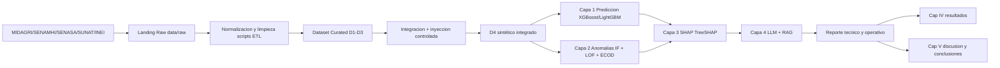
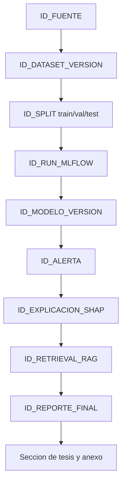
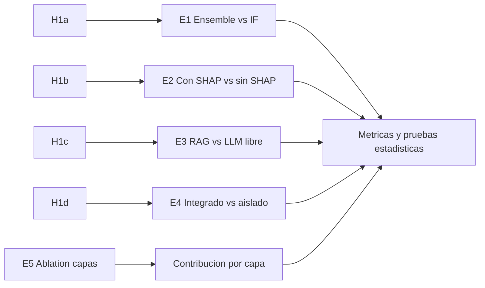

# Plan de Avance desde Punto 3: Datos, Trazabilidad, Tecnologias y Ejecucion

Fecha base: 2026-05-21  
Alcance: Desde Capitulo III (diseno metodologico) hasta cierre de resultados (Cap. IV-V + anexos tecnicos)

---

## 1) Objetivo operativo del plan

Pasar de "diseno metodologico definido" a "evidencia experimental completa y defendible", asegurando:

- Seleccion de fuentes y bases de datos por tipo.
- Trazabilidad completa dato -> modelo -> explicacion -> reporte -> capitulo.
- Ejecucion por hitos con entregables verificables.
- Reproducibilidad tecnica (scripts, seeds, versionado y registro de experimentos).

---

## 2) Bases de datos/fuentes a usar y tipo de dato

### 2.1 Fuentes externas (entrada)

| Codigo | Fuente | Tipo de base/fuente | Tipo de datos | Frecuencia | Uso en tesis |
|---|---|---|---|---|---|
| F1 | MIDAGRI | Fuente documental publica | Precios, volumen, producto, zona | Diaria/Mensual | Calibracion de rangos y variables productivas |
| F2 | SENAMHI | Serie temporal publica | Temperatura, precipitacion, humedad | Diaria | Features climaticas y stress operacional |
| F3 | SENASA | Base regulatoria publica | Cumplimiento fitosanitario, alertas | Continua | Variables de cumplimiento/riesgo |
| F4 | SUNAT | Estadistica aduanera | Destinos, valor exportado, flujo comercial | Mensual/Anual | Variables de mercado destino |
| F5 | INEI | Indicadores macro | IPM, IPC, PBI, indices sectoriales | Mensual/Trimestral | Variables de contexto macro |
| F6 | FAOSTAT/UN Comtrade | Benchmark internacional | Produccion y comercio internacional | Anual/Mensual | Validacion externa de plausibilidad |

### 2.2 Base de datos de trabajo (interna del proyecto)

| Capa | Tecnologia sugerida | Tipo de almacenamiento | Finalidad |
|---|---|---|---|
| Landing (raw) | CSV/Parquet en data/raw | Data lake local versionado | Guardar datos de origen sin transformacion |
| Curated (silver/gold) | DuckDB o PostgreSQL | Analitico tabular | Integrar, limpiar y unificar variables |
| Feature Store ligero | Tablas versionadas (Parquet + metadatos) | Dataset model-ready | Reproducir entrenamiento e inferencia |
| Registro de experimentos | MLflow (file backend) | Metadatos de ejecucion | Parametros, metricas, artefactos |
| Evidencia RAG | JSON/Markdown en docs/evidence | Corpus auditable | Soporte de reportes LLM con fuente |

Decision recomendada para tesis:

- Opcion A (simple y robusta): DuckDB + Parquet + MLflow local.
- Opcion B (mas cercana a produccion): PostgreSQL + Parquet + MLflow.

Para esta tesis, Opcion A minimiza complejidad operativa y mantiene trazabilidad fuerte.

---

## 3) Tipologia de datasets finales para experimentacion

Se trabajara con 4 datasets versionados:

| Dataset | Origen | Tipo | Objetivo experimental |
|---|---|---|---|
| D1_operativo | F1 + F4 + F5 | Tabular temporal | Prediccion base (Capa 1) |
| D2_climatico | F2 | Serie temporal | Deteccion de eventos y contexto (Capas 1-2) |
| D3_regulatorio | F3 | Categórico/reglas | Riesgo de cumplimiento y explicabilidad |
| D4_sintetico_integrado_v1 | D1 + D2 + D3 (fusion + inyeccion controlada) | Tabular etiquetado | Entrenar y evaluar E1-E5 |

Regla de versionado:

- v1.0: 2,000 filas (minimo defendible).
- v1.1: correcciones de calidad (nulos, outliers, consistencia temporal).
- v2.0: 5,000+ filas para extension/publicacion.

---

## 4) Trazabilidad integral (diagramas)

### 4.1 Flujo de datos de extremo a extremo

### 4.2 Trazabilidad auditable por artefacto

### 4.3 Mapa hipotesis -> experimento -> evidencia

---

## 5) Plan de trabajo detallado (desde 2026-05-21)

### Fase 0: Cierre de definiciones (2 dias)

- Duracion: 2026-05-21 al 2026-05-22
- Entregables:
  - Matriz final de fuentes F1-F6 y campos por fuente.
  - Decision de stack: DuckDB o PostgreSQL.
  - Estructura de carpetas de datos y convencion de versionado.

### Fase 1: Ingestion y consolidacion de datos (7 dias)

- Duracion: 2026-05-23 al 2026-05-29
- Actividades:
  - Extraccion y homogenizacion de F1-F6.
  - Estandarizacion de fechas, unidades y categorias.
  - Data quality check: nulos, duplicados, outliers, coherencia temporal.
- Entregables:
  - D1_operativo_v1.csv/parquet
  - D2_climatico_v1.csv/parquet
  - D3_regulatorio_v1.csv/parquet
  - Reporte de calidad de datos.

### Fase 2: Construccion del dataset experimental (5 dias)

- Duracion: 2026-05-30 al 2026-06-03
- Actividades:
  - Integracion D1-D3.
  - Inyeccion de anomalias controladas.
  - Split cronologico 70/10/20 con seeds 42-47.
- Entregables:
  - D4_sintetico_integrado_v1.0
  - Datasheet actualizado (Anexo C)
  - Diccionario de datos final.

### Fase 3: Desarrollo y validacion de modulos (10 dias)

- Duracion: 2026-06-04 al 2026-06-15
- Actividades:
  - Capa 1: entrenamiento XGBoost/LightGBM + Optuna.
  - Capa 2: IF + LOF + ECOD (ensemble).
  - Capa 3: SHAP local/global + estabilidad top-k.
  - Capa 4: plantillas de reporte LLM + evidencia RAG.
- Entregables:
  - Scripts reproducibles por modulo.
  - Baselines B1-B4 ejecutados.
  - Registro de runs y metricas por experimento.

### Fase 4: Experimentos E1-E5 y analisis estadistico (7 dias)

- Duracion: 2026-06-16 al 2026-06-24
- Actividades:
  - Ejecucion completa E1-E5 con 6 seeds.
  - Pruebas de hipotesis (Wilcoxon, Mann-Whitney, t/Wilcoxon segun supuestos).
  - Calculo de tamano de efecto e IC 95%.
- Entregables:
  - Tabla maestra de resultados para Cap. IV.
  - Graficos de desempeno, SHAP y trazabilidad.
  - Resumen de aceptacion/rechazo de H1a-H1d.

### Fase 5: Redaccion de resultados y cierre de sustentacion (8 dias)

- Duracion: 2026-06-25 al 2026-07-04
- Actividades:
  - Completar Cap. IV con tablas/figuras finales.
  - Completar Cap. V, conclusiones y limitaciones.
  - Cerrar Anexos A2 (Model Cards) y A3 (Datasheet final).
- Entregables:
  - Version de tesis lista para revision final del asesor.
  - Checklist de sustentacion con evidencias trazables.

---

## 6) Stack tecnologico recomendado (tesis)

### 6.1 Datos e ingenieria

- Python 3.11
- Pandas, NumPy
- DuckDB + Parquet (o PostgreSQL si se prioriza SQL transaccional)
- Great Expectations o script propio de validacion (completitud/consistencia)

### 6.2 Modelado y explicabilidad

- XGBoost, LightGBM
- PyOD (IF, LOF, ECOD)
- SHAP
- Optuna (tuning)
- Scikit-learn (metricas y utilitarios)

### 6.3 Reporteria y trazabilidad

- MLflow (tracking de experimentos)
- Jinja2/Markdown para plantillas de reporte
- RAG ligero con indice local (FAISS opcional, o retrieval por metadatos)
- Git + convenciones de versionado de dataset/modelo

### 6.4 Infraestructura y reproducibilidad

- Docker + docker-compose
- requirements.txt pinneado
- Semillas fijas y configuracion de splits cronologicos
- Script unico de reproduccion end-to-end (make/run script)

---

## 7) Matriz de riesgos y mitigacion

| Riesgo | Prob. | Impacto | Mitigacion |
|---|---|---|---|
| No disponibilidad de datos oficiales en formato util | Media | Alto | Priorizar fuentes validadas + parser PDF + fallback sintetico |
| Baja calidad (nulos/inconsistencia) | Alta | Alto | Reglas de calidad y umbrales antes de modelar |
| Sobreajuste del modelo | Media | Alto | Split cronologico, seeds multiples, ablation y baselines |
| Reportes LLM con alucinacion | Media | Alto | RAG anclado, plantillas restringidas, no inferir sin evidencia |
| Retraso en Cap. IV por ejecucion experimental | Media | Alto | Congelar alcance a E1-E5 y priorizar tablas nucleares |

---

## 8) Criterios de finalizacion (Definition of Done)

Este plan se considera completado cuando:

1. Existen datasets D1-D4 versionados y documentados.
2. E1-E5 estan ejecutados con resultados reproducibles (seeds 42-47).
3. Cada resultado en Cap. IV tiene trazabilidad a run, dataset y fuente.
4. Cap. V y conclusiones estan sustentadas por evidencia cuantitativa.
5. Anexos A2 y A3 estan consistentes con el codigo y datos finales.

---

## 9) Primeros 7 dias: lista accionable inmediata

Dia 1:
- Confirmar stack (DuckDB recomendado).
- Crear esquema de carpetas data/raw, data/curated, data/features, output/experiments.

Dia 2-3:
- Consolidar F1-F6 en tablas normalizadas.
- Definir diccionario de datos v0.

Dia 4:
- Ejecutar control de calidad y registrar decisiones de limpieza.

Dia 5:
- Publicar D1-D3 v1 y cerrar Datasheet preliminar.

Dia 6-7:
- Construir D4 v1.0 con inyeccion de anomalias.
- Preparar script de split cronologico y seeds.

Con esto, el proyecto queda listo para entrar directamente a entrenamiento y experimentacion formal E1-E5.
