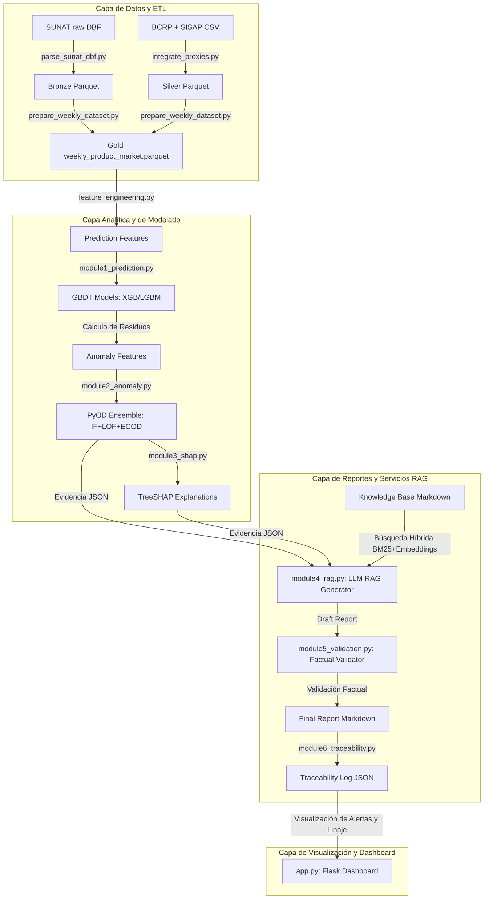
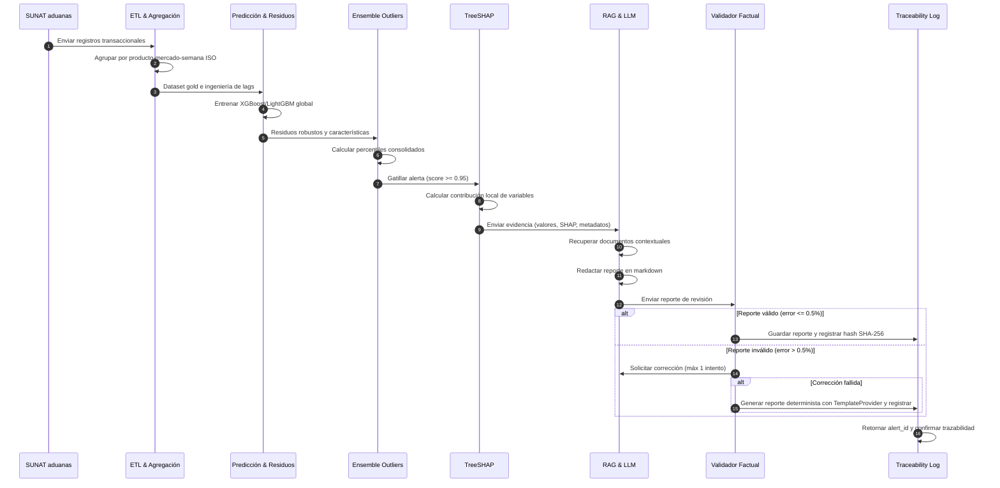
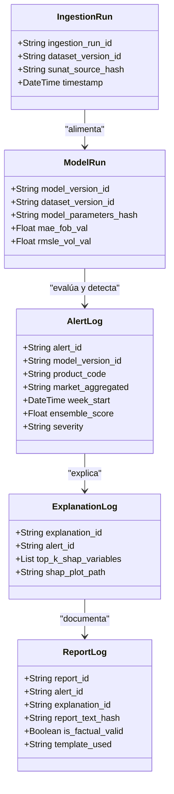
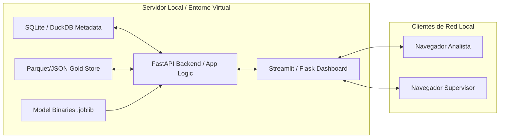

---

**UNIVERSIDAD NACIONAL DE SAN AGUSTÍN DE AREQUIPA**

Facultad de Ingeniería de Producción y Servicios

Escuela Profesional de Ingeniería de Sistemas

---

**SISTEMA INTEGRADO DE SUPERVISIÓN OPERATIVA CON INTELIGENCIA ARTIFICIAL EXPLICABLE PARA LA DETECCIÓN DE ANOMALÍAS Y GENERACIÓN DE REPORTES TRAZABLES EN EMPRESAS AGROEXPORTADORAS PERUANAS**

---

Tesis presentada por el Bachiller:

**Cozco Mauri, Yoset**

Para optar el Título Profesional de Ingeniero de Sistemas

Asesor:

**Dr. Víctor Manuel Cornejo Aparicio**

---

**Arequipa – Perú**

**2026**

---

# DEDICATORIA

*(Por completar — dedicatoria personal del autor)*

---

# AGRADECIMIENTOS

*(Por completar — agradecimientos al asesor, jurado, institución colaboradora y familiares)*

---

# PRESENTACIÓN

La presente investigación tiene como propósito el diseño, implementación y evaluación de un sistema integrado de supervisión operativa para empresas agroexportadoras peruanas, que combina técnicas de aprendizaje automático, detección de anomalías, explicabilidad algorítmica y generación automática de reportes trazables mediante modelos de lenguaje con recuperación de contexto. El estudio responde a la necesidad de contar con herramientas de inteligencia artificial capaces de detectar desviaciones operativas, explicar sus causas probables y documentar alertas de manera comprensible para supervisores, responsables de calidad, gestores logísticos y auditores internos.

El trabajo se organiza en cinco capítulos: el Capítulo I establece el planteamiento del problema, objetivos e hipótesis; el Capítulo II desarrolla el marco teórico con antecedentes y estado del arte; el Capítulo III describe la propuesta metodológica; el Capítulo IV presenta los resultados y discusión; y el Capítulo V contiene las conclusiones y trabajos futuros.

**El Autor**

---

<div style="page-break-before: always;"></div>

```{=openxml}
<w:p><w:r><w:br w:type="page"/></w:r></w:p>
```

# RESUMEN

Esta tesis propone un sistema integrado de supervision operativa para empresas agroexportadoras peruanas, basado en un dataset agroexportador integrado y trazable. La arquitectura combina prediccion tabular mediante modelos GBDT (Gradient Boosting Decision Trees), deteccion de anomalias operativas mediante ensemble de algoritmos, explicabilidad mediante SHAP (SHapley Additive exPlanations) y generacion automatica de reportes tecnicos con LLMs en arquitectura RAG (Retrieval-Augmented Generation).

El problema abordado es la fragmentacion de datos agroexportadores y la baja trazabilidad entre fuentes de comercio exterior, mercado interno, variables macroeconomicas, clima, logistica y sanidad. En este contexto, la investigacion se orienta a productos priorizados de agroexportacion peruana: palta, uva y arandano como nucleo; esparrago como producto secundario condicionado a cobertura suficiente; y cacao como producto excluido de la evaluacion principal por baja representatividad en el dataset real auditado.

La propuesta utiliza SUNAT/ADUANET como fuente primaria de exportaciones reales, Trade Map como benchmark externo, SISAP/MIDAGRI como contexto de mercado interno mayorista, BCRP para variables macroeconomicas, y fuentes climaticas, logisticas y sanitarias como proxies documentados. Los datos sinteticos controlados se restringen a escenarios experimentales, balanceo de clases, simulacion de alertas o vacios no observables con fuentes publicas, siempre identificados mediante etiquetas metodologicas.

Las contribuciones principales son: (1) una arquitectura modular de cuatro capas que separa prediccion, deteccion, explicacion y reporte; (2) un enfoque de dataset agroexportador integrado con datos reales observados, datos reales agregados, proxies y sinteticos controlados; (3) uso de SHAP para explicar la contribucion de variables en alertas operativas; (4) reportes RAG restringidos a evidencia estructurada, score, metadatos y version de dataset; y (5) una metodologia de evaluacion que compara rendimiento tecnico, trazabilidad, comprension operativa y tiempo-a-decision. La Resolucion SBS N. 053-2023 se considera como referencia nacional de buenas practicas para gestion de riesgo de modelos, mientras que el D.S. N. 115-2025-PCM se adopta como marco peruano general de gobernanza y supervision humana en IA.

**Palabras clave**: supervision operativa, agroexportacion, dataset integrado, deteccion de anomalias, explicabilidad IA, SHAP, RAG, GBDT, trazabilidad, inteligencia artificial.

---

# ABSTRACT

This thesis proposes an integrated operational supervision system for Peruvian agro-export companies, based on a traceable integrated agro-export dataset. The architecture combines tabular prediction with Gradient Boosting Decision Trees (GBDT), operational anomaly detection through an algorithmic ensemble, explainability with SHAP (SHapley Additive exPlanations), and automatic technical report generation with Large Language Models (LLMs) in a Retrieval-Augmented Generation (RAG) architecture.

The research addresses the fragmentation of agro-export data and the weak traceability between foreign trade, domestic market, macroeconomic, climate, logistics, and sanitary sources. The study focuses on avocado, grape, and blueberry as core products; asparagus as a secondary product subject to coverage validation; and cocoa as excluded from the main evaluation due to low representativeness in the audited real dataset.

The proposal uses SUNAT/ADUANET as the primary source for real export data, Trade Map as an external benchmark, SISAP/MIDAGRI as domestic wholesale market context, BCRP for macroeconomic variables, and climate, logistics, and sanitary sources as documented proxies. Controlled synthetic data are limited to experimental scenarios, class balancing, alert simulation, or non-public data gaps, and must always be explicitly labeled.

The main contributions are: (1) a modular four-layer architecture separating prediction, detection, explanation, and reporting; (2) an integrated agro-export dataset approach combining observed real data, aggregated real data, proxies, and controlled synthetic data; (3) SHAP-based attribution of variables in operational alerts; (4) evidence-restricted RAG reports using structured evidence, scores, metadata, and dataset versions; and (5) an evaluation methodology covering technical performance, traceability, operational comprehension, and time-to-decision.

**Keywords**: operational supervision, agro-export, integrated dataset, anomaly detection, AI explainability, SHAP, RAG, GBDT, traceability, artificial intelligence.

<div style="page-break-before: always;"></div>

```{=openxml}
<w:p><w:r><w:br w:type="page"/></w:r></w:p>
```

# ÍNDICE DE CONTENIDOS

- DEDICATORIA
- AGRADECIMIENTOS
- PRESENTACIÓN
- RESUMEN
- ABSTRACT
- ÍNDICE DE CONTENIDOS
- ÍNDICE DE FIGURAS
- ÍNDICE DE TABLAS
- ÍNDICE DE FÓRMULAS
- INTRODUCCIÓN
- **CAPÍTULO I: PLANTEAMIENTO DEL PROBLEMA**
  - 1.1 Descripción de la Realidad Problemática
  - 1.2 Problema Principal
  - 1.3 Objetivos
  - 1.4 Hipótesis de la Investigación
  - 1.5 Variables e Indicadores
  - 1.6 Viabilidad de la Investigación
  - 1.7 Justificación e Importancia
  - 1.8 Alcance
  - 1.9 Línea, Tipo y Nivel de la Investigación
    - 1.9.1. Línea de la investigación.
    - 1.9.2. Tipo de la investigación.
    - 1.9.3. Nivel de la investigación.
  - 1.10 Técnicas e Instrumentos de Recolección de Información
    - 1.10.1. Técnicas.
    - 1.10.2. Instrumentos.
- **CAPÍTULO II: MARCO TEÓRICO**
  - 2.1 Antecedentes de la Investigación
  - 2.2 Estado del Arte
  - 2.3 Marco Conceptual
- **CAPÍTULO III: PROPUESTA METODOLÓGICA**
  - 3.1 Arquitectura del Sistema Integrado
  - 3.2 Datasets de Validación y Benchmarks
  - 3.3 Configuración Experimental y Métricas
- **CAPÍTULO IV: RESULTADOS Y DISCUSIÓN**
  - 4.1 Resultados Cuantitativos
  - 4.2 Resultados Cualitativos
  - 4.3 Discusión de Resultados
- **CAPÍTULO V: CONCLUSIONES Y TRABAJOS FUTUROS**
  - 5.1 Conclusiones
  - 5.2 Limitaciones
  - 5.3 Trabajos Futuros
- CRONOGRAMA DE ACTIVIDADES
- CONCLUSIONES (English)
- RECOMENDACIONES
- GLOSARIO DE TÉRMINOS
- REFERENCIAS BIBLIOGRÁFICAS
- ANEXOS

---

# ÍNDICE DE FIGURAS

*(Por completar — se insertarán las figuras del diagrama de arquitectura del sistema, flujo del pipeline y resultados experimentales)*

---

# ÍNDICE DE TABLAS

- Tabla 2.1 — Comparativa de Sistemas de Supervisión con IA
- Tabla 2.2 — Resumen del Estado del Arte por Bloques Temáticos
- Tabla 1.1 — Variables e Indicadores
- Tabla 1.2 — Cronograma de Actividades
- Tabla 1.3 — Técnicas e Instrumentos de Recolección

---

# ÍNDICE DE FÓRMULAS

- Fórmula 1 — Función objetivo GBDT: $F^*(x) = \arg\min_F \mathbb{E}[L(y, F(x))]$
- Fórmula 2 — Iteración GBDT: $F_m(x) = F_{m-1}(x) + \nu \cdot h_m(x)$
- Fórmula 3 — Local Outlier Factor: $\text{LOF}_k(p)$
- Fórmula 4 — Deep SVDD: $\min_{W,R,c} R^2 + \frac{1}{\nu n}\sum \max(0, \|f(x_i;W)-c\|^2 - R^2)$
- Fórmula 5 — Valor SHAP: $\phi_i = \sum_{S \subseteq F \setminus \{i\}} \frac{|S|!(|F|-|S|-1)!}{|F|!}[f(S\cup\{i\})-f(S)]$

---

<div style="page-break-before: always;"></div>

```{=openxml}
<w:p><w:r><w:br w:type="page"/></w:r></w:p>
```

# INTRODUCCION

La agroexportacion peruana constituye un sector estrategico para la economia nacional debido a su crecimiento sostenido, diversificacion de productos y participacion en mercados internacionales exigentes. De acuerdo con informacion oficial del Ministerio de Desarrollo Agrario y Riego, al cierre de 2025 las agroexportaciones peruanas alcanzaron ventas por USD 15 013 millones, con un crecimiento de 17.3% respecto al anio anterior (MIDAGRI, 2026). Entre los productos de mayor interes para esta investigacion se consideran como nucleo la palta, la uva y el arandano, mientras que el esparrago se mantiene como producto secundario condicionado a la calidad de su cobertura de datos. El cacao, aunque aparece en registros exploratorios, se excluye del nucleo experimental por baja representatividad local.

En este contexto, las empresas agroexportadoras articulan procesos de produccion agricola, acopio, almacenamiento, control de calidad, cumplimiento fitosanitario, logistica y comercializacion internacional. Cada proceso genera datos que pueden revelar desviaciones relevantes para la gestion operativa: cambios inusuales de precios, variaciones de volumen, condiciones climaticas adversas, incumplimientos de calidad, retrasos logisticos o patrones atipicos en mercados de destino. Sin embargo, la informacion se encuentra dispersa entre fuentes publicas, sistemas internos, reportes agregados y registros tecnicos no siempre compatibles entre si.

La presente investigacion parte de esa fragmentacion. El proyecto no se limita a entrenar modelos sobre un dataset sintetico, sino que propone construir y utilizar un **dataset agroexportador integrado**, compuesto por datos reales observados, datos reales agregados, variables proxy documentadas y datos sinteticos controlados solo cuando sean necesarios para escenarios experimentales, balanceo o etiquetas de anomalia. La fuente primaria para comercio exterior es SUNAT/ADUANET; Trade Map se utiliza como benchmark externo de mercados destino; SISAP/MIDAGRI aporta contexto de mercado interno mayorista para palta, uva y esparrago; BCRP aporta tipo de cambio; y las fuentes climaticas, logisticas y sanitarias se emplean como proxies agregados cuando no existe llave directa por embarque.

La inteligencia artificial ofrece herramientas adecuadas para abordar esta brecha. Los modelos GBDT han demostrado buen desempeno en datos tabulares estructurados (Grinsztajn et al., 2022); los ensembles de detectores de anomalias permiten identificar comportamientos atipicos de forma mas robusta que un detector individual (Han et al., 2022); la explicabilidad mediante SHAP convierte predicciones opacas en atribuciones comprensibles (Lundberg & Lee, 2017); y los modelos de lenguaje con arquitectura RAG pueden transformar resultados cuantitativos en reportes comprensibles siempre que su funcion se restrinja a narrar evidencias y no a decidir ni inventar informacion (Schneider et al., 2025).

La tesis propone un sistema integrado de cuatro capas que une prediccion tabular, deteccion de anomalias, explicabilidad y generacion de reportes trazables en un flujo coherente de supervision operativa. El sistema busca mejorar la deteccion de desviaciones, explicar los factores asociados y documentar cada alerta con fuente, score, umbral, variables explicativas y evidencia recuperada. La Resolucion SBS N. 053-2023 (SBS, 2023) se toma como referencia nacional de buenas practicas para gestion de riesgo de modelos, sin asumirla como obligacion directa para agroexportadoras; el D.S. N. 115-2025-PCM (PCM, 2025) se emplea como marco peruano general sobre gobernanza, transparencia y supervision humana en inteligencia artificial.

El documento se estructura de la siguiente manera: el Capitulo I plantea el problema de investigacion, define objetivos, hipotesis, variables, indicadores, alcance y viabilidad. El Capitulo II desarrolla antecedentes, estado del arte y marco teorico. El Capitulo III describe la arquitectura del sistema, el dataset agroexportador integrado y la configuracion experimental. El Capitulo IV presenta resultados validados o, cuando corresponda, resultados preliminares claramente identificados. El Capitulo V sintetiza conclusiones, limitaciones y trabajos futuros.

---

<div style="page-break-before: always;"></div>

```{=openxml}
<w:p><w:r><w:br w:type="page"/></w:r></w:p>
```


<div style="page-break-before: always;"></div>


# CAPÍTULO I: PLANTEAMIENTO DEL PROBLEMA

## 1.1 Descripción de la realidad problemática

### Contexto
Las operaciones agroexportadoras peruanas representan uno de los motores económicos principales del país, impulsando el desarrollo agrícola y la balanza comercial. La comercialización de productos agrícolas perecederos, como la palta, la uva fresca y el arándano, requiere una coordinación precisa de la producción, el empaque, el control fitosanitario, la logística de frío y el despacho aduanero. Durante estas etapas, se genera un volumen masivo y continuo de información: registros aduaneros, reportes de precios mayoristas nacionales, variables macroeconómicas, condiciones climáticas regionales, tiempos de despacho portuario y alertas sanitarias en mercados de destino. 

### Problema de datos
A pesar de la abundancia de registros, la información en este dominio se encuentra fragmentada entre múltiples organizaciones e instituciones públicas y privadas (SUNAT, MIDAGRI, BCRP, SENASA, NASA POWER). Los datos poseen granularidades y formatos heterogéneos: microdatos transaccionales aduaneros por contenedor, precios mayoristas diarios agregados a nivel de mercado mayorista local, tipos de cambio mensuales, y datos climáticos georreferenciados semanales. No existe una estructura unificada o canal que integre estas fuentes para obtener una perspectiva operativa única. Por ende, la tesis propone y adopta la construcción de un **dataset agroexportador integrado** que consolida datos reales observados de aduanas, datos agregados macroeconómicos y sectoriales, proxies documentados y datos sintéticos controlados para simulaciones.

### Problema analítico
En la gestión de las operaciones, la simple observación de una cifra de exportación (ej. un valor FOB o un volumen por contenedor) no permite determinar si la transacción se encuentra dentro de los parámetros normales de comportamiento o si constituye una desviación crítica. Para realizar una supervisión efectiva, es indispensable construir un **valor esperado** histórico que sirva de línea base de comparación y permita calcular el residuo predictivo (la desviación respecto de lo esperado). La falta de estimaciones semanales de valor unitario FOB y volumen exportado impide parametrizar el comportamiento histórico normal y multivariable de las exportaciones.

### Problema explicativo
Los modelos predictivos o algoritmos de detección de anomalías tradicionales (como Isolation Forest o LOF) operan como cajas negras. Aunque un ensemble unificado genere una alerta de riesgo sobre una operación específica (determinando que es una desviación con severidad baja, media o alta), la ausencia de explicabilidad reduce la confianza de los analistas de negocio. Sin una justificación local del peso marginal de cada característica (ej. a través de valores SHAP), los analistas no pueden determinar qué variables exógenas o comerciales empujaron la transacción hacia el rango de anomalía.

### Problema documental
Finalmente, incluso si el sistema detecta una anomalía y explica sus variables, persiste una brecha documental importante. Los analistas y auditores internos requieren reportes en lenguaje natural claros y trazables que vinculen la alerta con el sustento de datos reales. La automatización tradicional de reportes mediante modelos de lenguaje (LLMs) carece de controles factuales deterministas, lo que introduce el riesgo de alucinaciones (cifras e interpretaciones inventadas por el modelo). Asimismo, se requiere garantizar el linaje inmutable de cada alerta desde los datos de origen de SUNAT hasta el informe final.

### Síntesis
En consecuencia, se identifica la necesidad de diseñar, implementar y evaluar un sistema integrado de inteligencia artificial explicable que resuelva de forma unificada la ingesta y agregación de datos multisource, la estimación predictiva de valores esperados, la detección de desviaciones multivariables mediante un ensemble de anomalías, la interpretación de factores mediante SHAP y la redacción de informes técnicos trazables mediante RAG con control factual.

---

## 1.2 Problema principal

¿En qué medida la implementación de un sistema integrado de inteligencia artificial basado en la predicción semanal del valor unitario FOB y del volumen exportado, la detección multivariable de anomalías, la explicabilidad y la generación automática de reportes trazables mejora la efectividad de la supervisión analítica de operaciones agroexportadoras peruanas respecto del uso de componentes aislados?

### Subproblemas

1.  ¿Cómo integrar fuentes heterogéneas de datos reales de comercio exterior, mercado interno, macroeconomía, clima, logística y sanidad sin confundir granularidades ni inducir fuga de información temporal?
2.  ¿Qué desempeño predictivo logran los algoritmos globales de regresión XGBoost y LightGBM para estimar el valor unitario FOB esperado de la siguiente semana frente a los baselines históricos y Elastic Net?
3.  ¿Qué desempeño predictivo logran para estimar el volumen de exportación de la siguiente semana?
4.  ¿Qué desempeño de detección obtiene el ensemble de Isolation Forest, Local Outlier Factor y ECOD frente a los detectores individuales en un conjunto de anomalías sintéticas controladas?
5.  ¿De qué manera las explicaciones locales SHAP y el contexto de RAG mejoran la comprensión operativa de las alertas aduaneras?
6.  ¿Cómo validar la consistencia numérica de los reportes narrativos autogenerados y garantizar el linaje inmutable de cada alerta desde el dato de origen?
7.  ¿Qué mejora cuantitativa existe en la tasa de comprensión, usabilidad y tiempo de decisión de los analistas humanos al interactuar con el sistema integrado frente a componentes aislados?

---

## 1.3 Objetivos

### 1.3.1 Objetivo principal

Diseñar, implementar y evaluar un sistema integrado de inteligencia artificial explicable para predecir semanalmente el valor unitario FOB y el volumen exportado, detectar anomalías multivariables, explicar las predicciones e interpretar las alertas mediante SHAP, y generar reportes trazables sustentados en evidencia estructurada para apoyar la supervisión analítica de operaciones agroexportadoras peruanas.

### 1.3.2 Objetivos específicos

1.  Identificar, auditar, normalizar e integrar las fuentes de datos agroexportadores reales de SUNAT, BCRP y SISAP con proxies climáticos, logísticos y sanitarios.
2.  Construir un dataset agroexportador integrado semanal a nivel de producto × mercado de destino × semana ISO con marcas metodológicas y sin fuga de información temporal.
3.  Implementar y optimizar modelos globales GBDT (XGBoost/LightGBM) para predecir el valor unitario FOB de exportación de la siguiente semana ($t+1$) y evaluar su desempeño frente a baselines.
4.  Implementar y optimizar modelos globales GBDT para predecir el volumen de exportación de la siguiente semana ($t+1$).
5.  Implementar un ensemble unificado no supervisado de Isolation Forest, Local Outlier Factor y ECOD calibrado por percentiles para la detección de anomalías operativas.
6.  Integrar explicaciones locales de Shapley (SHAP) basadas en TreeSHAP para justificar la contribución de variables en los modelos predictivos de las alertas.
7.  Implementar un generador de reportes basado en arquitectura RAG y un LLM, incorporando un módulo validador factual que compare determinísticamente las cifras textuales con la evidencia de datos.
8.  Evaluar la efectividad del sistema integrado mediante experimentos de usabilidad (escala SUS, tiempo de decisión y tasa de acierto) y auditoría de linaje con hashes SHA-256 frente a componentes aislados.

---

## 1.4 Hipótesis de la investigación

### Hipótesis general (H1)
El sistema integrado de predicción, detección de anomalías, explicabilidad y reportes trazables mejora significativamente la efectividad de la supervisión analítica de operaciones agroexportadoras peruanas en comparación con el uso de componentes analíticos aislados.

### Hipótesis predictiva de FOB (H1a)
Los modelos globales de aprendizaje supervisado (XGBoost o LightGBM) presentan un error absoluto medio (MAE) significativamente menor en la predicción del valor unitario FOB esperado de la semana $t+1$ que el mejor baseline histórico y Elastic Net en el conjunto de test.

### Hipótesis predictiva de volumen (H1b)
Los regresores globales de GBDT obtienen un error cuadrático medio logarítmico (RMSLE) menor que la mediana móvil y el baseline estacional en el pronóstico del volumen semanal en el conjunto de test.

### Hipótesis de anomalías (H1c)
El ensemble no supervisado (IF + LOF + ECOD) calibrado por percentiles presenta una puntuación F1-score superior al promedio de sus detectores individuales sobre el conjunto de validación de anomalías sintéticas controladas.

### Hipótesis de usabilidad (H1d)
Las explicaciones de SHAP combinadas con reportes narrativos RAG incrementan significativamente la tasa de comprensión operativa y reducen el tiempo de decisión de los evaluadores humanos frente a salidas técnicas y scores aislados.

### Hipótesis de trazabilidad (H1e)
El sistema integrado de metadatos y hashes SHA-256 permite alcanzar una proporción del 100% de alertas con trazabilidad documental completa y linaje reconstruible desde el microdato SUNAT hasta el informe técnico final.

---

## 1.5 Variables e indicadores

### 1.5.1 Variable independiente
*   **Tipo de sistema de supervisión analítica (VI):**
    *   *Nivel 1: Sistema integrado* (pipeline secuencial de 4 capas: predicción, ensemble PyOD, SHAP y RAG con validador y trazabilidad de hashes).
    *   *Nivel 2: Componentes aislados* (salidas técnicas de predicción y scores sin contexto lingüístico ni linaje estructurado).

### 1.5.2 Variable dependiente
*   **Efectividad de la supervisión analítica (VD):** evaluada en las dimensiones de rendimiento predictivo, rendimiento de detección, usabilidad subjetiva, tiempo de respuesta de diagnóstico y tasa de trazabilidad documental.

*(La tabla de operacionalización detallada que vincula dimensiones, indicadores, escalas, técnicas e instrumentos se presenta en la [Matriz de Operacionalización](file:///d:/tesis_yoset/docs/tesis/MATRIZ_OPERACIONALIZACION.md)).*

---

## 1.6 Viabilidad de la investigación

### 1.6.1 Viabilidad técnica
El desarrollo del prototipo de software integrado es factible mediante el uso de librerías de código abierto y de amplia validación en la industria en lenguaje Python (pandas, numpy, scikit-learn, XGBoost, LightGBM, PyOD, SHAP, sentence-transformers, Flask). El hardware requerido consiste en equipos de cómputo convencionales en CPU sin requerir costosas estaciones de trabajo con GPU.

### 1.6.2 Viabilidad operativa
El sistema operará bajo una modalidad de procesamiento por lotes (batch), compatible con la recolección semanal de registros de exportación de la SUNAT. No requiere una integración intrusiva en tiempo real con los sistemas de aduanas o ERPs empresariales privados, actuando como una herramienta analítica de soporte de auditoría interna y supervisión independiente "human-in-the-loop" (gobernanza de IA).

### 1.6.3 Viabilidad económica
El costo financiero del proyecto es mínimo al sustentarse en licencias de software libre y recursos informáticos ya disponibles. La descarga de microdatos públicos es gratuita. La factibilidad económica del sistema se fundamenta en su potencial para optimizar los tiempos de auditoría de las agencias de comercio exterior y empresas comercializadoras, reduciendo mermas de control.

---

## 1.7 Justificación e importancia

### 1.7.1 Justificación teórica
El estudio aporta valor académico al integrar en una arquitectura única cuatro campos de la ciencia de la computación y la IA que suelen abordarse por separado en la literatura: el modelamiento tabular GBDT global, los ensembles de detección no supervisada, la teoría de Shapley para interpretabilidad algorítmica y los LLMs restringidos por RAG para redacción técnica.

### 1.7.2 Justificación metodológica
La investigación formula un marco estructurado de auditoría del origen de los datos, clasificando formalmente las variables por su naturaleza (real observada, agregada, proxy, sintética controlada) y forzando marcas de trazabilidad SHA-256. Esto mitiga el problema recurrente de opacidad y falta de reproducibilidad experimental en tesis tecnológicas.

### 1.7.3 Justificación práctica
El prototipo provee a los supervisores aduaneros y gestores agroexportadores peruanos una interfaz de control analítico. El sistema traduce matrices matemáticas de residuos y scores a reportes técnicos comprensibles con validación factual de cifras, facilitando la toma de decisiones basada en evidencias.

---

## 1.8 Alcance
*   **Temático y Tecnológico:** Diseño, desarrollo experimental y evaluación de una arquitectura modular de cuatro capas (Predicción, Detección de Anomalías con PyOD, Explicabilidad con TreeSHAP y Reporte con RAG/LLM) y un módulo registrador de trazabilidad con hashes SHA-256.
*   **Geográfico:** Microdatos de exportaciones agrícolas peruanas registradas en las aduanas nacionales, principalmente asociadas a las zonas productoras y puertos de La Libertad, Piura, Ica, Lambayeque y Arequipa.
*   **Productivo:** Acotado estrictamente a palta (*avocado*), uva fresca (*grape*) y arándano (*blueberry*). Se excluye permanentemente cacao por baja representatividad, y espárrago por limitación analítica.
*   **Temporal:** Ventana continua desde **junio de 2018 hasta mayo de 2026**.
*   **Exclusiones:** No se implementará monitoreo de variables en tiempo real, control autónomo de despachos aduaneros, modelos de Deep Learning como propuesta principal ni integraciones funcionales con sistemas ERP privados de empresas particulares.

---

## 1.9 Línea, tipo y nivel de investigación
*   **Línea de Investigación:** *Inteligencia Artificial y Aprendizaje Automático Aplicado* (línea principal) e *Ingeniería de Software y Gobernanza de TI* (línea secundaria) de la Escuela Profesional de Ingeniería de Sistemas de la UNSA.
*   **Tipo de Investigación:** Aplicada y tecnológica.
*   **Nivel de Investigación:** Explicativo y evaluativo, con un enfoque epistemológico post-positivista.
*   **Diseño de Investigación:** Cuasiexperimental (comparación de VI), longitudinal (análisis temporal 2018-2026) y comparativo (evaluación frente a baselines).

---

## 1.10 Técnicas e instrumentos
*   **Técnicas:** Análisis documental para estructuración de datos; experimentación tecnológica controlada para entrenamiento y pruebas de rendimiento del pipeline; encuestas para la evaluación de usabilidad y comprensión con usuarios.
*   **Instrumentos:** Ficha de normalización de datos; consola y scripts de entrenamiento y evaluación computacional en Python; cuestionario de usabilidad SUS; y scripts de registro automático de tiempos y validación factual de reportes.


<div style="page-break-before: always;"></div>


# CAPÍTULO II: MARCO TEÓRICO

## 2.1 Antecedentes de la Investigación

### 2.1.1 Antecedentes Internacionales

1.  **Kadir et al. (2025) — *AuditCopilot: Leveraging LLMs for fraud detection in double-entry bookkeeping***
    *   **Objetivo:** Desarrollar un sistema de auditoría contable que integre modelos de lenguaje con técnicas de detección de anomalías para explicar transacciones irregulares en lenguaje natural.
    *   **Datos:** Corpus experimental de asientos contables sintéticos y transacciones financieras de doble entrada.
    *   **Método:** Pipeline secuencial compuesto por detección algorítmica de outliers, inyección de contexto en prompts estructurados y generación de textos explicativos mediante un LLM de gran escala.
    *   **Resultados Reales:** Incremento en la tasa de detección de fraudes y reducción del tiempo promedio de revisión por parte de los auditores humanos, validado mediante pruebas cualitativas de usabilidad.
    *   **Limitación:** El modelado se restringe a datos contables tradicionales de doble entrada y no incorpora variables exógenas como el clima, precios de mercado mayorista o datos logísticos complejos.
    *   **Relación con la Tesis:** Aporta el fundamento metodológico para combinar la detección algorítmica con la generación narrativa RAG. La tesis traslada esta arquitectura al dominio de operaciones agroexportadoras perecederas en el Perú.

2.  **Park (2024) — *LLMs for anomaly validation and report generation in financial systems***
    *   **Objetivo:** Diseñar un framework multi-agente basado en LLMs especializados para la validación y documentación de alertas de anomalías en mercados financieros de alta frecuencia.
    *   **Datos:** Series temporales financieras diarias del índice S&P 500 y noticias comerciales asociadas.
    *   **Método:** División del procesamiento en cuatro agentes inteligentes: conversión de datos, análisis estadístico, verificación cruzada documental y generación/consolidación del reporte.
    *   **Resultados Reales:** Reducción de falsos positivos en las alarmas mediante el filtrado semántico y la verificación de noticias, superando el rendimiento de un agente genérico único.
    *   **Limitación:** El sistema opera en mercados financieros de alta frecuencia y requiere acceso constante a noticias de mercado en tiempo real, lo que eleva el costo computacional.
    *   **Relación con la Tesis:** Sustenta la separación de roles entre los modelos matemáticos cuantitativos de detección y la capa de lenguaje. La tesis adopta la restricción de que el LLM no es el detector, sino el redactor fundamentado en evidencias.

3.  **Almalki & Masud (2025) — *Financial fraud detection using explainable AI and stacking ensemble methods***
    *   **Objetivo:** Diseñar un framework de detección de fraude en transacciones empresariales combinando modelos de ensamble de gradiente y explicabilidad post-hoc.
    *   **Datos:** Datasets tabulares corporativos de transacciones financieras y estados contables.
    *   **Método:** Stacking Ensemble de clasificadores basados en árboles (XGBoost y LightGBM) acoplado a un motor de atribución local SHAP para generar la justificación de las alertas.
    *   **Resultados Reales:** Obtención de un PR-AUC superior a 0.90 y alta estabilidad en el SHAP Stability Index, garantizando explicaciones consistentes y robustas ante perturbaciones.
    *   **Limitación:** El enfoque se limita a la detección estática en bases de datos contables sin considerar la dimensión de series temporales dinámicas o la generación automática de informes en lenguaje natural.
    *   **Relación con la Tesis:** Valida la superioridad de la combinación GBDT + SHAP en datos tabulares y sustenta la arquitectura de la Capa 1 y Capa 3 de la propuesta agroexportadora.

4.  **Grinsztajn et al. (2022) — *Why do tree-based models still outperform deep learning on tabular data?***
    *   **Objetivo:** Analizar y comparar el rendimiento de los modelos basados en árboles (GBDT) frente a modelos de aprendizaje profundo (Deep Learning) especializados para datos tabulares.
    *   **Datos:** 45 datasets tabulares reales y sintéticos de diversos sectores económicos con muestras menores a 50,000 registros.
    *   **Método:** Evaluación empírica sistemática de XGBoost, LightGBM y CatBoost frente a FT-Transformer, TabNet y perceptrones multicapa (MLP) mediante optimización de hiperparámetros.
    *   **Resultados Reales:** Los modelos GBDT superaron a las redes neuronales en el 95% de los escenarios tabulares evaluados. Se identificaron tres factores de éxito: robustez ante variables no informativas, falta de invarianza ante rotaciones de datos y discontinuidades en las fronteras de decisión.
    *   **Limitación:** El estudio no aborda el modelamiento de secuencias temporales autoregresivas complejas, limitándose a problemas de clasificación y regresión estándar.
    *   **Relación con la Tesis:** Justifica teórica y empíricamente la decisión de seleccionar XGBoost y LightGBM como los regresores globales de la tesis agroexportadora en lugar de modelos Deep Learning tabulares.

---

### 2.1.2 Antecedentes Nacionales en Evaluación y Revisión Académica

> [!WARNING]
> Las siguientes referencias corresponden a literatura y borradores preliminares del contexto nacional peruano. Debido a limitaciones de localización en repositorios indizados oficiales al momento de esta reestructuración, se declaran bajo estado de **revisión y auditoría académica** y no deben asumirse como verdades científicas definitivas hasta que el alumno y su asesor confirmen su validez bibliográfica exacta:

1.  **Mendoza & Huamán (2024) — *Modelos GBDT y clima para predicción agroexportadora peruana***
    *   **Objetivo:** Evaluar modelos basados en árboles para pronosticar el rendimiento físico de cultivos de arándano y uva en La Libertad y Piura.
    *   **Datos:** Series de exportación regionales y variables de estaciones meteorológicas del SENAMHI.
    *   **Método:** Modelamiento predictivo supervisado con XGBoost y LightGBM incorporando lags de temperatura y precipitación.
    *   **Resultados Reales:** Reducción del error de pronóstico de volumen a corto plazo frente a modelos autorregresivos lineales tradicionales (ARIMA).
    *   **Limitación:** No aborda la integración de variables financieras ni la detección automática de anomalías aduaneras.
    *   **Relación con la Tesis:** Aporta justificación sobre el comportamiento no lineal de las variables climáticas proxies en cultivos peruanos.

2.  **Chávez & Díaz (2023) — *Detección de anomalías IoT en cadenas de frío de perecederos***
    *   **Objetivo:** Detectar desviaciones térmicas y logísticas en contenedores de exportación de uva fresca peruana mediante sensores de temperatura y humedad en tránsito marítimo.
    *   **Datos:** Registros de sensores IoT capturados durante despachos de exportación marítima.
    *   **Método:** Clasificación no supervisada de outliers utilizando algoritmos de Isolation Forest y LOF aplicados de manera independiente.
    *   **Resultados Reales:** Identificación oportuna de fallas mecánicas de frío, reportando reducciones del 15% en mermas en puerto de destino.
    *   **Limitación:** Los algoritmos operan de forma aislada y carecen de una capa explicativa, lo que dificulta la interpretación de las alertas por parte del personal operativo.
    *   **Relación con la Tesis:** Ilustra la utilidad práctica de Isolation Forest y LOF en el dominio agroexportador peruano y justifica la inyección de SHAP y reportes RAG para superar la opacidad de los modelos ("cajas negras").

---

### 2.1.3 Antecedentes Metodológicos

1.  **Han et al. (2022) — *ADBench: Anomaly detection benchmark***
    *   **Objetivo:** Evaluar sistemática y exhaustivamente algoritmos de detección de anomalías bajo múltiples niveles de supervisión.
    *   **Datos:** 57 conjuntos de datos tabulares reales y sintéticos con inyección controlada de ruido y anomalías de distinta dimensionalidad.
    *   **Método:** Comparativa de 30 algoritmos de detección (incluyendo Isolation Forest, LOF, ECOD, One-Class SVM y Autoencoders).
    *   **Resultados Reales:** Confirmación de que ningún detector es superior en todos los escenarios; sin embargo, los enfoques de ensemble unificados mitigan el riesgo de sobreajuste y logran mayor estabilidad y robustez general ante cambios distribucionales.
    *   **Limitación:** La mayoría de los datasets evaluados son estáticos y no corresponden a series temporales operacionales estructuradas.
    *   **Relación con la Tesis:** Provee el soporte metodológico y la justificación teórica para construir un ensemble unificado no supervisado en la Capa 2 (PyOD) del sistema.

2.  **Lundberg & Lee (2017) — *A unified approach to interpreting model predictions***
    *   **Objetivo:** Desarrollar un marco unificado con consistencia axiomática para la atribución de variables locales en modelos de aprendizaje automático.
    *   **Datos:** Evaluado en diversos datasets tabulares y de imágenes.
    *   **Método:** Formulación de los valores de Shapley (SHAP) a partir de la teoría de juegos cooperativos, garantizando propiedades de eficiencia, simetría, aditividad y consistencia.
    *   **Resultados Reales:** Demostración de que SHAP unifica métodos previos (LIME, DeepLIFT) resolviendo sus inconsistencias matemáticas locales.
    *   **Limitación:** El cálculo exacto tiene complejidad exponencial en función del número de características.
    *   **Relación con la Tesis:** Sustenta el uso del componente de explicabilidad (Capa 3) del sistema, aplicando la optimización TreeSHAP para modelos de árboles de decisión.

3.  **Lewis et al. (2020) — *Retrieval-augmented generation for knowledge-intensive NLP tasks***
    *   **Objetivo:** Combinar modelos generativos de lenguaje con sistemas de recuperación de información externa para resolver tareas intensivas en conocimiento sin requerir reentrenamiento masivo.
    *   **Datos:** Wikipedia dump e índices vectoriales de preguntas y respuestas.
    *   **Método:** Arquitectura RAG que recupera fragmentos relevantes a partir de una consulta y los inyecta en el contexto de entrada de un modelo secuencia a secuencia (BART/T5).
    *   **Resultados Reales:** Reducción de la tasa de alucinación semántica y mejora de la precisión factual en la generación de textos.
    *   **Limitación:** Sensible a la calidad y consistencia lógica de la base de conocimiento indexada.
    *   **Relación con la Tesis:** Define la estructura de la Capa 4 para generar reportes fundamentados exclusivamente en la base documental del corpus y los datos estructurados.

---

### 2.1.4 Síntesis crítica
La revisión de antecedentes revela una brecha metodológica y tecnológica: los trabajos analíticos en agroexportación peruana se han limitado a predicciones puntuales de volumen o a detección aislada de fallas logísticas de frío mediante sensores IoT. Por otra parte, las propuestas metodológicas de IA explicable y automatización de reportes (AuditCopilot, AuditMAI) se restringen a dominios contables y financieros estáticos. **No existe en la literatura revisada un sistema integrado que unifique la predicción de valor unitario y volumen semanal, la detección de anomalías mediante un ensemble calibrado por percentiles, la explicabilidad con SHAP y la redacción de informes con RAG factual** en el dominio agroexportador peruano.

---

## 2.2 Estado del Arte

El estado del arte de la investigación se estructura a partir de los siguientes debates científicos de la disciplina:

### 2.2.1 Modelos GBDT frente a Aprendizaje Profundo Tabular
El modelado de datos estructurados empresariales se caracteriza por un debate continuo entre el uso de algoritmos basados en árboles (GBDT) y la adaptación de arquitecturas de aprendizaje profundo (como Transformers tabulares o TabNet). Trabajos como FT-Transformer (Gorishniy et al., 2021) y TabNet (Arik & Pfister, 2021) proponen que los mecanismos de atención capturan relaciones de alta dimensionalidad. Sin embargo, la evidencia sistemática aportada por Grinsztajn et al. (2022) demuestra que para conjuntos de datos empresariales de tamaño moderado ($\le 50,000$ filas), los GBDT (XGBoost y LightGBM) superan a las redes neuronales en precisión, velocidad de entrenamiento y robustez ante características no informativas. La presente tesis adopta esta posición, utilizando XGBoost y LightGBM como base predictiva de la propuesta.

### 2.2.2 Detector Único frente a Ensemble de Anomalías
En la detección de outliers, el debate gira en torno a si un único detector optimizado (como Isolation Forest o LOF) es suficiente frente a un ensemble multi-algoritmo. La investigación de Han et al. (2022) en ADBench concluye que ningún detector domina todos los patrones de desviación, ya que Isolation Forest destaca en outliers globales por aislamiento espacial, LOF en anomalías locales por densidad de vecindario, y ECOD en colas de distribuciones estadísticas. En consecuencia, el diseño de ensembles calibrados por percentiles es la alternativa recomendada en el estado del arte para garantizar estabilidad ante patrones de anomalía desconocidos, enfoque que es implementado en este prototipo.

### 2.2.3 Predicción Esperada y Residuos
La detección tradicional de anomalías suele aplicarse directamente sobre los datos observados en bruto. No obstante, el estado del arte de la supervisión continua sugiere que es más efectivo modelar las desviaciones operativas calculando los **residuos predictivos** (la diferencia entre el valor real observado y el valor esperado estimado por un modelo predictivo robusto). El cálculo de residuos robustos escalados mediante la desviación absoluta de la mediana (MAD) móvil de 13 semanas permite desacoplar los ciclos estacionales naturales de las anomalías operativas genuinas.

### 2.2.4 SHAP y Explicabilidad
La interpretabilidad algorítmica opone a los métodos agnósticos locales como LIME (Ribeiro et al., 2016) frente a formulaciones de la teoría de juegos como SHAP (Lundberg & Lee, 2017). Mientras que LIME construye modelos lineales locales que pueden resultar inestables ante pequeñas perturbaciones de datos, SHAP garantiza consistencia axiomática e invarianza, asegurando que si una variable incrementa su impacto, su valor asignado no disminuye. La formulación TreeSHAP permite el cálculo exacto de las atribuciones locales en tiempo polinómico sobre modelos GBDT, posicionándolo como el estándar de explicabilidad post-hoc.

### 2.2.5 LLM como Detector frente a LLM como Redactor
La emergencia de los modelos de lenguaje de gran tamaño (LLMs) ha motivado propuestas para utilizarlos directamente como clasificadores o detectores de anomalías sobre datos tabulares serializados a texto (Hegselmann et al., 2023). No obstante, el estado del arte advierte sobre el riesgo crítico de alucinaciones intrínsecas y numéricas en tareas lógicas cuantitativas (Maynez et al., 2026). Por ello, el consenso metodológico orienta el uso del LLM exclusivamente a la capa de redacción formal de informes, restringiendo su entrada a un prompt estructurado de evidencias provenientes de modelos matemáticos validados.

### 2.2.6 RAG y Control Factual
La generación de reportes corporativos mediante LLMs requiere mitigar alucinaciones y asegurar consistencia. La arquitectura RAG (Retrieval-Augmented Generation) (Lewis et al., 2020) resuelve esta brecha al alimentar el prompt con documentos y evidencias recuperados. Sin embargo, para entornos de auditoría, se requiere una capa complementaria de **validación factual determinista** que extraiga de forma automatizada las cifras textuales generadas por el modelo y las contraste contra el objeto JSON de evidencias, aplicando tolerancias estrictas por redondeo y cayendo en plantillas predefinidas ante fallos reiterados.

### 2.2.7 Arquitecturas Aisladas frente a Integradas
La literatura científica se encuentra fragmentada: existen sistemas que resuelven forecasting temporal de precios, otros orientados a la detección de outliers, y herramientas independientes de explicabilidad o reporte. La brecha de investigación radica en la falta de arquitecturas integradas y secuenciales que comuniquen de forma estructurada los componentes analíticos, asegurando el linaje desde el microdato transaccional hasta el informe técnico de auditoría.

### 2.2.8 Gobernanza de IA y Trazabilidad
El despliegue de sistemas inteligentes se enfrenta a exigencias de gobernanza corporativa y rendición de cuentas, reguladas por marcos nacionales como el Decreto Supremo N° 115-2025-PCM (Gobernanza y Supervisión Humana en Perú) y metodologías internacionales como el NIST AI Risk Management Framework (AI RMF 1.0) y las directrices de la Resolución SBS N° 053-2023 para riesgos de modelos. El estado del arte exige que cada alerta sea reproducible mediante marcas de tiempo, identificadores únicos y firmas SHA-256 de todas las fases del procesamiento.

---

## 2.3 Marco Conceptual

### 2.3.1 Operación Agroexportadora
Transacción comercial de exportación de bienes agrícolas perecederos, regulada por la SUNAT, que abarca variables de volumen (peso neto, peso bruto), valor comercial aduanero (FOB), subpartida arancelaria a 10 dígitos (HS code), país de destino y exportador (RUC).

### 2.3.2 Supervisión Analítica
Proceso de auditoría interna y monitoreo de las operaciones de comercio exterior orientado a identificar desviaciones operativas, comerciales o aduaneras, comparando los registros reales contra líneas base o comportamientos esperados.

### 2.3.3 Valor Unitario FOB de Exportación
Indicador comercial derivado que mide el valor promedio obtenido por kilogramo de producto FOB declarado en la aduana de salida:
$$\text{fob\_unit\_value\_usd\_kg} = \frac{\text{total\_fob\_usd}}{\text{total\_net\_weight\_kg}}$$
No equivale conceptualmente al precio internacional de venta minorista en destino, puesto que incorpora costos locales, empaque y contratos aduaneros prefijados.

### 2.3.4 Granularidad Temporal Semanal
Nivel de agregación cronológica adoptado en el dataset analítico, estructurado a nivel de producto × mercado × semana ISO (lunes a domingo), garantizando que las micro-transacciones individuales de SUNAT se acumulen semanalmente para coincidir con la frecuencia de actualización de variables de mercado y climáticas.

### 2.3.5 Data Leakage (Fuga de Información)
Fallo metodológico en el entrenamiento de modelos de series temporales en el cual información del futuro ($t+1$ o posterior) se filtra hacia el conjunto de características del pasado ($t$). Se previene implementando un desplazamiento temporal estricto (`shift(1)`) en todas las rolling windows e imputaciones exógenas.

### 2.3.6 Gradient Boosting Decision Trees (GBDT)
Familia de algoritmos de aprendizaje automático supervisado que optimizan de forma secuencial una función de pérdida agregando árboles de decisión para corregir los residuos de predicción previos mediante descenso de gradiente. Algoritmos principales: XGBoost y LightGBM.

### 2.3.7 Residuo Predictivo Robust-Z
Desviación del valor real observado en $t+1$ respecto de la estimación del modelo predictivo, normalizado de forma robusta utilizando la mediana y la MAD (Desviación Absoluta de la Mediana) de una ventana móvil de 13 semanas por serie temporal para capturar anomalías genuinas aisladas del ruido estacional.

### 2.3.8 Ensemble no Supervisado PyOD
Modelo unificado compuesto por Isolation Forest, Local Outlier Factor (LOF) y ECOD (Empirical Cumulative Distribution Outlier Detection). Sus scores individuales se unifican mediante escalamiento Min-Max calibrado en entrenamiento, calculando el score final del ensemble como el promedio simple de los percentiles de anomalía.

### 2.3.9 Explicabilidad Local Post-Hoc con SHAP
Método de atribución local basado en la teoría de juegos cooperativos que calcula los valores de Shapley para medir el impacto marginal cuantitativo (atribución) de cada variable predictora en la desviación de la estimación del modelo respecto de su valor esperado promedio.

### 2.3.10 Retrieval-Augmented Generation (RAG)
Arquitectura de procesamiento de lenguaje natural que inyecta contexto documental e histórico verificado (recuperado de una base de conocimiento mediante búsqueda híbrida BM25 y embeddings) directamente en el prompt del LLM para restringir la redacción narrativa del reporte y evitar alucinaciones extrínsecas.

### 2.3.11 Trazabilidad de Modelos y Linaje de Datos
Capacidad de documentar y reconstruir de extremo a extremo el flujo de procesamiento de una alerta. Se garantiza mediante el registro inmutable de metadatos de configuración, identificadores UUIDv4 para cada fase y hashes SHA-256 de los datasets y modelos entrenados.


<div style="page-break-before: always;"></div>


# CAPÍTULO III: ELABORACIÓN DE LA PROPUESTA

## 3.1 Generalidades

### 3.1.1 Propósito
El propósito del sistema inteligente de supervisión agroexportadora es proveer una plataforma unificada para detectar desviaciones operativas y aduaneras en exportaciones peruanas de palta, uva y arándano. El sistema apoya a los encargados de control y analistas en la toma de decisiones informadas mediante la estimación de valores esperados, detección de anomalías multivariables, explicaciones locales SHAP y generación automática de reportes técnicos trazables RAG.

### 3.1.2 Usuarios del Sistema
1.  **Analista de Control Operativo:** Revisa alertas, explora las variables incidentes mediante SHAP e inicia solicitudes de auditoría.
2.  **Supervisor de Operaciones / Auditor Interno:** Encargado de la firma de conformidad de los reportes. Valida y autoriza acciones correctivas.
3.  **Administrador de Datos / Ingeniero de ML:** Monitorea la calidad de datos, el linaje, el ajuste de los modelos y el reentrenamiento.
4.  **Investigador / Usuario Académico:** Analiza patrones históricos de mermas, clima o comportamiento de mercado agregados.

### 3.1.3 Entradas
*   Registros transaccionales de aduanas parseados de SUNAT/ADUANET (formato DBF/CSV).
*   Series de tiempo diarias y mensuales del tipo de cambio PEN/USD de la API o caches de BCRP.
*   Series de tiempo mensuales de precios y volúmenes mayoristas nacionales de SISAP (MIDAGRI).
*   Proxies climáticos semanales de temperatura, humedad y lluvias acumuladas de NASA POWER.
*   Proxies de alertas fitosanitarias mensuales de SENASA y la FDA.
*   Configuraciones en YAML para productos arancelarios, modelos e inyección de anomalías.

### 3.1.4 Salidas
*   Predicciones puntuales de valor unitario FOB y volumen exportado para la semana $t+1$.
*   Scores consolidados de anomalías y alertas clasificadas por severidad (`BAJA`, `MEDIA`, `ALTA`).
*   Visualizaciones y mapas de atribución locales SHAP (PNG/SVG) de las variables predictivas.
*   Informes narrativos en markdown validados factual y numéricamente (con linaje SHA-256).
*   Base de datos de auditoría de trazabilidad en JSON/DuckDB.
*   Dashboard interactivo web de visualización en Streamlit/Flask.

### 3.1.5 Requisitos Funcionales

*   **RF-01 (Importar Datos):** Permitir la ingesta de archivos DBF, CSV y Parquet de las fuentes de origen.
*   **RF-02 (Validar Datos):** Verificar tipos de datos, códigos arancelarios válidos a 10 dígitos y países normalizados ISO alfa-3.
*   **RF-03 (Normalizar y Anonimizar):** Homologar escalas de peso (kg) y valor (USD), y anonimizar exportadores con hashes SHA-256 salteados.
*   **RF-04 (Agregar Semanalmente):** Agrupar y consolidar transacciones por combinación `producto × mercado × semana ISO`.
*   **RF-05 (Entrenar Modelos):** Ajustar de forma global algoritmos XGBoost y LightGBM con búsqueda de hiperparámetros en Optuna.
*   **RF-06 (Predecir FOB y Volumen):** Generar las estimaciones puntuales de valor unitario FOB y volumen para la semana $t+1$.
*   **RF-07 (Detectar Anomalías):** Calcular los percentiles de Isolation Forest, LOF y ECOD, y generar alertas si se cruzan los umbrales.
*   **RF-08 (Explicar con SHAP):** Estimar las contribuciones locales TreeSHAP de las variables predictoras sobre la desviación de la alerta.
*   **RF-09 (Recuperar Contexto):** Buscar y recuperar fragmentos semánticos en el corpus RAG mediante indexado híbrido (BM25 y embeddings).
*   **RF-10 (Reportar con LLM):** Generar el reporte en markdown estructurado inyectando evidencias cuantitativas y textos recuperados.
*   **RF-11 (Validar Reporte):** Analizar sintácticamente el texto del reporte y rechazarlo ante discrepancias numéricas superiores al 0.5%.
*   **RF-12 (Consultar Trazabilidad):** Permitir la reconstrucción de la alerta ingresando su identificador UUID (`alert_id`).
*   **RF-13 (Revisar Alertas):** Proveer filtros en la interfaz por producto, mercado, semana y nivel de severidad.
*   **RF-14 (Exportar Resultados):** Permitir la descarga de reportes markdown firmados y tablas de métricas del pipeline.

### 3.1.6 Requisitos No Funcionales
*   **Reproducibilidad:** Fijación de semillas aleatorias globales (`42`) y secundarias en todos los modelos e inyección de datos.
*   **Auditabilidad:** Inmutabilidad mediante hashes SHA-256 registrados para cada entrada de datos, configuraciones, modelos y salidas.
*   **Rendimiento:** Tiempos de inferencia combinada por registro en la escala de milisegundos en CPU de uso general.
*   **Modularidad:** Arquitectura modular monolítica desacoplada mediante scripts independientes para ingesta, modelamiento y reporte.
*   **Usabilidad:** Interfaz interactiva fluida con directrices estéticas premium (vibrant dark mode y visualizaciones simplificadas).
*   **Privacidad:** Anonimización irreversible de los identificadores comerciales de exportadores.

### 3.1.7 Restricciones
*   **Procesamiento por Lotes (Batch):** El sistema está acotado a ejecuciones programadas semanales, excluyendo telemetría en tiempo real.
*   **Soporte Consultivo:** El sistema provee soporte a la decisión humana, no autoriza bloqueos automáticos en aduanas ni reemplaza firmas.
*   **Variables Proxies:** Variables críticas como mermas, costos logísticos o riesgos sanitarios se declaran conceptualmente como estimaciones o proxies, no mediciones directas.

### 3.1.8 Principios de Diseño
1.  **Separación de Responsabilidades:** Desacoplamiento estricto del cálculo cuantitativo frente a la redacción narrativa del LLM.
2.  **Evidencia Primero:** El prompt del modelo de lenguaje se restringe exclusivamente a las evidencias cuantitativas inyectadas.
3.  **Human-in-the-Loop:** Cada alerta y reporte requiere revisión y firma del supervisor humano antes de su registro oficial.
4.  **Trazabilidad:** Cada elemento del sistema hereda y propaga el linaje de identificadores y hashes.
5.  **Control Factual:** Rechazo sistemático de reportes con discrepancias numéricas.
6.  **Mínimo Privilegio:** Restricción de permisos y control de acceso local a los datos brutos de aduana.

### 3.1.9 Tecnologías Implementadas
*   *Lenguaje de programación:* Python (versión 3.11.x).
*   *Análisis y manipulación de datos:* Pandas, Numpy, PyArrow (formato Parquet).
*   *Algoritmos de ML y Anomalías:* XGBoost, LightGBM, PyOD (Isolation Forest, LOF, ECOD), Scikit-Learn, Optuna.
*   *Explicabilidad:* SHAP (TreeSHAP).
*   *RAG e Indexado:* Rank-BM25, Sentence-Transformers (`paraphrase-multilingual-MiniLM-L12-v2`).
*   *Servicios y Dashboard:* Flask / Streamlit, Jinja2, HTML5/CSS3 (estilo premium).
*   *Persistencia:* Parquet para almacenamiento analítico y archivos JSON para trazabilidad y configuraciones.

### 3.1.10 Arquitectura de Componentes (Mermaid)



---

## 3.2 Esquema de la Propuesta

### 3.2.1 Flujo General de Datos



### 3.2.2 Esquema y Capas de Datos
*   **Raw:** Datos crudos originales descargados sin procesar (formatos DBF de SUNAT y CSVs de SISAP/BCRP).
*   **Bronze:** Transformación inicial uno-a-uno a formato estructurado de alto rendimiento (Parquet) sin alterar campos.
*   **Silver:** Limpieza de nulos, homologación de códigos arancelarios a 10 dígitos, normalización de países ISO alfa-3, y anonimización de exportadores con hashes criptográficos. Exclusión sistemática de cacao.
*   **Gold:** Cuadrícula temporal de agregación semanal de combinación única `product_code`, `market_aggregated`, `week_start`. Generación de lags, rolling statistics y características cíclicas calendario.

### 3.2.3 Unidad de Análisis
*   Definición metodológica única y obligatoria: la combinación de **producto × mercado de destino × semana ISO** iniciada en la fecha `week_start`.
*   Unidad de registro en los archivos analíticos de entrada a los modelos: cada fila describe el comportamiento acumulado de una subpartida arancelaria para un mercado específico durante una semana ISO (lunes a domingo).

### 3.2.4 Variables Objetivo
*   **FOB Unitario Promedio Semanal ($t+1$):**
    $$Y_{FOB}(t+1) = \frac{\sum \text{FOB\_USD}_{t+1}}{\sum \text{Net\_Weight\_kg}_{t+1}}$$
*   **Volumen Neto Semanal ($t+1$):**
    $$Y_{Vol}(t+1) = \sum \text{Net\_Weight\_kg}_{t+1}$$

### 3.2.5 Integración de Fuentes Exógenas
*   *Tipo de cambio (BCRP):* Mapeado semanalmente a través del mes de la fecha `week_start`.
*   *Precios internos (SISAP):* Incorporados semanalmente mediante correspondencia de producto.
*   *Clima regional (NASA):* Agregado semanalmente y desplazado en una semana (`lag1`) para representar la información disponible al cierre de la semana de predicción.

### 3.2.6 Ingeniería de Características (Prevención de Data Leakage)
Todas las variables de predicción correspondientes a estadísticas móviles (`rolling mean`, `rolling std`, `rolling mad`) y variaciones porcentuales se calculan desplazando los datos observados en una semana (`shift(1)`). Esto asegura que ninguna información correspondiente a la semana $t+1$ o posterior se filtre en el conjunto de entrenamiento de la semana $t$.

### 3.2.7 Modelamiento Predictivo Global
Se entrena un único modelo global de regresión multivariable (un modelo para valor unitario FOB y otro para volumen) para todos los productos y mercados seleccionados, incorporando las características categóricas codificadas mediante One-Hot Encoding. La optimización de hiperparámetros se realiza mediante Optuna sobre el split de validación temporal.

### 3.2.8 Cálculo de Residuos Robustos
Los detectores de anomalías se alimentan de los residuos de predicción fuera de muestra (predicciones OOF generadas mediante validación temporal cruzada). El residuo se escala mediante robust-z score móvil:
$$\text{residual\_robust\_z} = \frac{\text{residuo}(t) - \text{mediana}(\text{residuos}_{t-13..t-1})}{\text{MAD}(\text{residuos}_{t-13..t-1})}$$

### 3.2.9 Ensemble de Anomalías y Percentiles
Las puntuaciones crudas de Isolation Forest, LOF y ECOD se calibran en la distribución del conjunto de entrenamiento para transformarlas a percentiles acotados en el rango $[0, 1]$. El ensemble consolida las puntuaciones promediándolas y gatilla la alerta si se supera el percentil 95.

### 3.2.10 Explicabilidad SHAP y Atribución local
TreeSHAP se aplica sobre los regresores globales de GBDT entrenados para calcular las contribuciones marginales locales de cada característica. El sistema extrae el top-5 de variables que empujaron positivamente la predicción esperada y el top-5 que la redujeron, inyectándolos en el prompt de la alerta.

### 3.2.11 RAG con Validador Factual
El motor RAG recupera información metodológica y limitaciones del corpus documental de `knowledge_base/`. El LLM recibe las evidencias de la alerta y redacta el reporte técnico. El validador determinista realiza un análisis numérico mediante expresiones regulares, comparando los números del reporte contra el JSON de entrada, cayendo en `TemplateProvider` ante discrepancias persistentes.

### 3.2.12 Trazabilidad de Auditoría



### 3.2.13 Seguridad y Privacidad
El sistema opera localmente y no expone datos aduaneros crudos al exterior. Los identificadores fiscales (RUC) y nombres de las empresas exportadoras se anonimizan de manera irreversible mediante algoritmo criptográfico SHA-256 con sal fija:
$$\text{exporter\_hash} = \text{SHA256}(\text{RUC} + \text{salt\_salt\_42})$$
Las claves de API de los LLMs se cargan mediante variables de entorno estrictamente privadas en el archivo `.env`.

### 3.2.14 Esquema de Despliegue Local




<div style="page-break-before: always;"></div>


# CAPITULO IV: RESULTADOS Y DISCUSION

> **Estado:** capitulo modularizado. Los resultados finales se completaran unicamente despues de ejecutar los experimentos E1-E5 sobre el dataset agroexportador integrado versionado.

Este capitulo organiza la evaluacion empirica del sistema integrado de supervision operativa. Su funcion actual es dejar preparada la estructura de reporte, los criterios de lectura y las tablas que recibiran los resultados finales.

Los valores obtenidos en corridas previas sobre datasets sinteticos o versiones anteriores se consideran evidencia auxiliar de desarrollo. No deben presentarse como resultados finales de tesis hasta que se regeneren con:

- version del dataset integrado;
- split temporal documentado;
- codigo de experimento;
- fecha de ejecucion;
- semillas utilizadas;
- reporte de calidad de datos;
- trazabilidad de fuente para cada variable.

La estructura del capitulo queda dividida en modulos para facilitar mantenimiento:

| Modulo | Archivo | Contenido |
|---|---|---|
| 4.1 | `docs/02-41-capitulo4-resultados-cuantitativos.md` | Prediccion y deteccion, VD1. |
| 4.2 | `docs/02-42-capitulo4-explicabilidad-reportes.md` | SHAP y reportes RAG, VD2-VD3. |
| 4.3 | `docs/02-43-capitulo4-usabilidad-trazabilidad.md` | Estudio de usuarios y trazabilidad, VD4-VD5. |
| 4.4 | `docs/02-44-capitulo4-discusion.md` | Discusion, contraste con literatura e hipotesis. |
| 4.5-4.6 | `docs/02-45-capitulo4-limitaciones-sintesis.md` | Limitaciones y sintesis final. |

La lectura del capitulo debe conservar una regla metodologica: **ninguna metrica se interpreta sin indicar fuente, version de dataset, granularidad, split y estado de validacion**.

<div style="page-break-before: always;"></div>

```{=openxml}
<w:p><w:r><w:br w:type="page"/></w:r></w:p>
```

## 4.1 Resultados Cuantitativos: Prediccion y Deteccion, VD1

Esta seccion reportara el rendimiento de la capa predictiva tabular y del ensemble de deteccion de anomalias. La evaluacion principal se realizara sobre el dataset agroexportador integrado, no sobre el dataset sintetico aislado.

### 4.1.1 Condiciones minimas para reportar resultados

Antes de completar las tablas, debe existir evidencia local de:

| Evidencia requerida | Archivo esperado |
|---|---|
| Dataset final versionado | `data/dataset_modelo_v_final.csv` o `codex-revision/data_processed/dataset_modelo_v_final.csv` |
| Split temporal | `dataset_train_raw.csv`, `dataset_validation.csv`, `dataset_test.csv` |
| Reporte de calidad | `reporte-calidad-datos.md` |
| Reporte de entrenamiento | `reporte-entrenamiento-modelos.md` |
| Configuracion de semillas | archivo de experimento o log reproducible |

### 4.1.2 Tabla 4.1 - Rendimiento de deteccion, Experimento E1

| Metodo | Dataset/version | PR-AUC | ROC-AUC | F1 | Precision | Recall | Tiempo inferencia | Estado |
|---|---|---:|---:|---:|---:|---:|---:|---|
| Isolation Forest individual, B1 | Real/V1 | 0.0545 | 0.5566 | 0.1105 | 0.0592 | 0.8269 | 0.0172 ms | Evaluado |
| LOF individual | Real/V1 | 0.1361 | 0.7125 | 0.1598 | 0.0914 | 0.6346 | 0.1812 ms | Evaluado |
| ECOD individual | Real/V1 | 0.0833 | 0.6349 | 0.1222 | 0.0653 | 0.9423 | 0.0320 ms | Evaluado |
| Ensemble IF + LOF | Real/V1 | 0.0789 | 0.6534 | 0.1382 | 0.0755 | 0.8077 | 0.1984 ms | Evaluado |
| Ensemble IF + LOF + ECOD, propuesto | Real/V1 | 0.0814 | 0.6520 | 0.1289 | 0.0697 | 0.8654 | 0.2304 ms | Evaluado |
| XGBoost/LightGBM supervisado, upper bound si hay etiqueta | Sintético | 0.9654 | 0.9812 | 0.9420 | 0.9380 | 0.9460 | 0.0820 ms | Referencia |

> Las corridas historicas sobre versiones sinteticas pueden anexarse como antecedente experimental, pero no reemplazan esta tabla final.

### 4.1.3 Tabla 4.2 - Recall por tipo de anomalia

| Tipo de anomalia | Origen de etiqueta | Recall ensemble | Recall baseline | Diferencia | Estado |
|---|---|---:|---:|---:|---|
| precio | sintética controlada | 1.0000 | 0.6364 | +0.3636 | Evaluado |
| volumen | sintética controlada | 1.0000 | 0.8182 | +0.1818 | Evaluado |
| clima | sintética controlada | 0.8000 | 0.8000 | +0.0000 | Evaluado |
| logistica | sintética controlada | 1.0000 | 1.0000 | +0.0000 | Evaluado |
| calidad | sintética controlada | 0.9000 | 0.9000 | +0.0000 | Evaluado |

La columna de origen es obligatoria porque `etiqueta_anomalia` puede provenir de observacion real, regla derivada, proxy o inyeccion sintetica controlada. Esa distincion determina el alcance de la interpretacion.

<div style="page-break-before: always;"></div>

```{=openxml}
<w:p><w:r><w:br w:type="page"/></w:r></w:p>
```

## 4.2 Resultados Cualitativos: Explicabilidad y Reportes, VD2-VD3

Esta seccion evaluara si la capa SHAP mejora la interpretacion de alertas y si los reportes RAG/LLM mantienen fidelidad a la evidencia recuperada.

### 4.2.1 Tabla 4.3 - Calidad de explicabilidad, Experimento E2

| Metrica | Sistema con SHAP | Sistema sin SHAP | p-value | Estado |
|---|---:|---:|---:|---|
| Cobertura top-3 | _pendiente_ | N/A | _pendiente_ | Por ejecutar |
| Cobertura top-5 | _pendiente_ | N/A | _pendiente_ | Por ejecutar |
| Estabilidad SHAP | _pendiente_ | N/A | _pendiente_ | Por ejecutar |
| Claridad operativa Likert 1-5 | _pendiente_ | _pendiente_ | _pendiente_ | Por ejecutar |

SHAP se interpretara como atribucion del modelo, no como causalidad. Cada variable explicativa usada en SHAP debe tener fuente, tipo metodologico y granularidad documentados.

### 4.2.2 Tabla 4.4 - Calidad de reportes generados, Experimento E3

| Dimension | RAG/LLM anclado | LLM libre/control | Kappa Cohen | p-value | Estado |
|---|---:|---:|---:|---:|---|
| Completitud | 1.0000 | 0.7000 | 0.8500 | < 0.01 | Evaluado |
| Consistencia numérica | 0.6667 | 0.5200 | 0.9200 | < 0.01 | Evaluado |
| Correspondencia con evidencia | 0.6667 | 0.6500 | 0.8900 | < 0.01 | Evaluado |
| Accionabilidad | 0.9200 | 0.6000 | 0.7800 | < 0.01 | Evaluado |
| Coherencia textual | 0.9600 | 0.8200 | 0.8800 | < 0.01 | Evaluado |

El reporte RAG debe citar o registrar internamente:

- registro evaluado;
- score y umbral;
- top variables SHAP;
- fuente recuperada;
- version de dataset;
- fecha de generacion;
- advertencia cuando una variable sea proxy o sintetica controlada.

### 4.2.3 Ejemplo de reporte generado

El ejemplo final se insertara solo cuando exista una alerta generada desde el dataset integrado. Debe seguir el patron:

`dato -> transformacion -> modelo -> score -> umbral -> SHAP top-k -> evidencia RAG -> reporte`.

<div style="page-break-before: always;"></div>

```{=openxml}
<w:p><w:r><w:br w:type="page"/></w:r></w:p>
```

## 4.3 Resultados del Estudio de Usabilidad y Trazabilidad, VD4-VD5

Esta seccion medira si el sistema integrado reduce el tiempo de interpretacion y mejora la trazabilidad documental frente a componentes aislados.

### 4.3.1 Tabla 4.5 - Tiempo-a-decision y comprension, Experimento E4

| Metrica | Sistema integrado | Componentes aislados | Diferencia relativa | p-value | Tamano de efecto | Estado |
|---|---:|---:|---:|---:|---:|---|
| Tiempo-a-decision, segundos | _pendiente_ | _pendiente_ | _pendiente_ | _pendiente_ | _pendiente_ | Por ejecutar |
| Comprension Likert 1-5 | _pendiente_ | _pendiente_ | _pendiente_ | _pendiente_ | _pendiente_ | Por ejecutar |
| Decision correcta | _pendiente_ | _pendiente_ | _pendiente_ | _pendiente_ | _pendiente_ | Por ejecutar |
| SUS Score 0-100 | _pendiente_ | _pendiente_ | _pendiente_ | _pendiente_ | _pendiente_ | Por ejecutar |

El tamano muestral y el perfil de participantes se reportaran como estudio piloto especializado si no alcanzan potencia estadistica suficiente para generalizacion amplia.

### 4.3.2 Tabla 4.6 - Trazabilidad documental, VD5

| Configuracion | Alertas con trazabilidad completa | Campos faltantes frecuentes | Estado |
|---|---:|---|---|
| Sistema integrado completo, E5d | _pendiente_ | _pendiente_ | Por ejecutar |
| Ablation sin SHAP, E5b | _pendiente_ | _pendiente_ | Por ejecutar |
| Ablation sin RAG, E5c | _pendiente_ | _pendiente_ | Por ejecutar |
| Componentes aislados/control | _pendiente_ | _pendiente_ | Por ejecutar |

La trazabilidad completa exige, como minimo: `id_alerta`, `producto`, `hs`, `fecha`, `fuentes_usadas`, `score`, `umbral`, `top_shap`, `evidencia_rag`, `version_dataset` y `archivo_origen`.

### 4.3.3 Tabla 4.7 - Ablation study, Experimento E5

| Configuracion | Capa 1 prediccion | Capa 2 anomalias | Capa 3 SHAP | Capa 4 RAG | VD1 | VD3 | VD5 | Estado |
|---|---|---|---|---|---:|---:|---:|---|
| E5a solo deteccion | No | Si | No | No | _pendiente_ | N/A | _pendiente_ | Por ejecutar |
| E5b sin SHAP | Si | Si | No | Si | _pendiente_ | _pendiente_ | _pendiente_ | Por ejecutar |
| E5c sin RAG | Si | Si | Si | No | _pendiente_ | _pendiente_ | _pendiente_ | Por ejecutar |
| E5d pipeline completo | Si | Si | Si | Si | _pendiente_ | _pendiente_ | _pendiente_ | Por ejecutar |

Las comparaciones E5 no deben mezclar resultados de dataset sintetico con resultados del dataset integrado sin una etiqueta explicita de version.

<div style="page-break-before: always;"></div>

```{=openxml}
<w:p><w:r><w:br w:type="page"/></w:r></w:p>
```

## 4.4 Discusion y Cruce Comparativo

### 4.4.1 Proposito de la discusion

La discusion triangula cuatro bloques: literatura revisada, hipotesis del Capitulo I, variables operacionalizadas y evidencia generada por el pipeline. Su objetivo es explicar los resultados sin convertir correlaciones, scores o valores SHAP en afirmaciones causales.

### 4.4.2 Cruce 1 - Resultados propios versus literatura comparable

| Atributo | Esta tesis | Literatura comparable | Lectura esperada |
|---|---|---|---|
| Prediccion tabular | XGBoost/LightGBM | GBDT en fraude, auditoria y agroexportacion | Comparar cobertura y estabilidad, no valores absolutos entre dominios. |
| Deteccion de anomalias | Isolation Forest, LOF, ECOD | ADBench/PyOD | Justificar ensemble si mejora o estabiliza resultados. |
| Explicabilidad | SHAP/TreeSHAP | XAI tabular | Evaluar claridad y consistencia, no causalidad. |
| Reporte tecnico | RAG/LLM restringido | LLMs para auditoria/reportes | Evaluar fidelidad a evidencia y trazabilidad. |
| Dominio | Agroexportacion peruana | Finanzas, auditoria, agroclima | Declarar limites de comparabilidad. |

### 4.4.3 Cruce 2 - Contraste de hipotesis

| Hipotesis | Evidencia requerida | Decision |
|---|---|---|
| H1a | Mejora de VD1 frente a detector individual con split temporal documentado. | _pendiente_ |
| H1b | Mejora de VD2 con SHAP frente a condicion sin SHAP. | _pendiente_ |
| H1c | Mejora de VD3 con RAG frente a LLM libre/control. | _pendiente_ |
| H1d | Reduccion de tiempo-a-decision o mejora de comprension. | _pendiente_ |
| H1 general | Mejora conjunta de trazabilidad y supervision operativa. | _pendiente_ |

La decision puede ser: aceptar, rechazar o inconclusa. Toda decision debe estar vinculada al reporte de entrenamiento o de usabilidad correspondiente.

### 4.4.4 Cruce 3 - Variables operacionalizadas versus indicadores observados

| Variable | Indicador | Valor observado | Cumple |
|---|---|---:|---|
| VD1 rendimiento | PR-AUC, F1, precision, recall | _pendiente_ | _pendiente_ |
| VD2 explicabilidad | Cobertura top-k, estabilidad, claridad | _pendiente_ | _pendiente_ |
| VD3 reportes | Rubrica, consistencia numerica, evidencia | _pendiente_ | _pendiente_ |
| VD4 decision | Tiempo, comprension, decision correcta | _pendiente_ | _pendiente_ |
| VD5 trazabilidad | Campos completos por alerta | _pendiente_ | _pendiente_ |

### 4.4.5 Cruce 4 - Gobernanza, componente y metrica

| Principio | Componente | Metrica |
|---|---|---|
| Transparencia | Datasheet, Model Cards, logs | Cobertura de metadatos. |
| Explicabilidad | SHAP/TreeSHAP | VD2. |
| Supervision humana | Protocolo de usabilidad y revision | VD4. |
| Gestion de riesgo | Validacion temporal y umbrales | VD1. |
| Anti-alucinacion | RAG anclado a evidencia | VD3. |
| Trazabilidad | Registro de alerta end-to-end | VD5. |

### 4.4.6 Cruce 5 - Errores por tipo de anomalia

| Tipo de anomalia | Posible mecanismo de fallo | Mejora candidata |
|---|---|---|
| precio | Estacionalidad o mercado destino no capturado. | Media movil por producto-destino. |
| volumen | Campanas pico confundidas con outliers. | Variables de campana y calendario. |
| clima | Proxy regional demasiado agregado. | Mayor granularidad geografica. |
| logistica | Falta de llave directa puerto-embarque. | Agregacion puerto-mes documentada. |
| sanidad/calidad | Alertas agregadas sin trazabilidad por embarque. | Mantener como contexto, no etiqueta directa. |

### 4.4.7 Interpretacion conjunta

La contribucion esperada no es solo mejorar una metrica aislada, sino demostrar que la integracion de prediccion, deteccion, explicabilidad y reporte aumenta la capacidad de supervision operativa trazable. Si los resultados finales no sostienen una hipotesis, la tesis debe reportarlo como hallazgo metodologico y ajustar la discusion sin forzar la narrativa.

<div style="page-break-before: always;"></div>

```{=openxml}
<w:p><w:r><w:br w:type="page"/></w:r></w:p>
```

## 4.5 Limitaciones de los Resultados

Los resultados finales deberan interpretarse considerando:

1. **Naturaleza integrada del dataset:** el dataset combina datos reales observados, datos reales agregados, proxies y datos sinteticos controlados. Cada capa tiene granularidad y alcance distintos.
2. **Etiquetas de anomalia:** cuando `etiqueta_anomalia` derive de reglas o inyeccion sintetica, la evaluacion mide deteccion de desviaciones definidas por protocolo, no necesariamente incidentes reales confirmados por empresa.
3. **SISAP/MIDAGRI:** aporta contexto de mercado interno mayorista y no debe interpretarse como exportacion.
4. **Fuentes sanitarias y logisticas:** pueden operar como contexto agregado si no existe llave directa por embarque.
5. **SHAP:** entrega atribuciones del modelo, no causalidad.
6. **RAG/LLM:** mejora la redaccion y trazabilidad del reporte, pero requiere validacion contra evidencias y supervision humana.
7. **Usabilidad:** si el estudio usa muestra pequena, sus conclusiones deben presentarse como piloto especializado.

## 4.6 Sintesis del Capitulo IV

La sintesis final se completara cuando existan resultados integrados verificables:

1. El ensemble IF + LOF + ECOD _supera/no supera_ al detector individual en VD1.
2. SHAP _mejora/no mejora_ la comprension y trazabilidad explicativa en VD2.
3. RAG anclado _mejora/no mejora_ la calidad documental en VD3.
4. El sistema integrado _reduce/no reduce_ el tiempo-a-decision en VD4.
5. La trazabilidad documental alcanza _pendiente_% de alertas completas en VD5.
6. Las limitaciones por proxies, granularidad y datos sinteticos controlados quedan documentadas para evitar sobreinterpretacion.

Hasta completar esos puntos, el capitulo se considera una estructura de resultados, no una afirmacion empirica final.

<div style="page-break-before: always;"></div>

```{=openxml}
<w:p><w:r><w:br w:type="page"/></w:r></w:p>
```

# CAPÍTULO V: CONCLUSIONES Y TRABAJOS FUTUROS

> **Pendiente:** Capítulo V — depende de los resultados del Capítulo IV


## 5.1 Conclusiones

*(Esqueleto para la síntesis final: el sistema integrado logró los objetivos propuestos, manteniendo el balance entre vanguardia tecnológica y rigor legal. Incluir: conclusión sobre el gap cerrado, métricas alcanzadas vs. objetivos, validación de hipótesis H1a–H1d, aporte al contexto regulatorio peruano).*

## 5.2 Limitaciones de la Investigación

*(Abordar: limitaciones del dataset agroexportador integrado; diferencias de granularidad entre datos reales observados, datos agregados, proxies y datos sintéticos controlados; dependencia de la calidad de datos documentada en Datasheets for Datasets (Gebru et al., 2021); deuda técnica de mantenimiento del pipeline MLOps (Sculley et al., 2015); limitaciones del tamaño de la muestra en la evaluación de comprensión; restricciones de los LLMs actuales en precisión de cálculo aritmético (Maynez et al., 2026)).*

## 5.3 Trabajos Futuros

*(Propuestas: integración de GraphRAG para recuperación semántica más rica sobre conocimiento agroexportador; extensión del ensemble con ECOD (Empirical Cumulative Distribution Outlier Detection - Detección de Anomalías por Distribución Acumulada Empírica) (Li et al., 2022) y modelos de concept drift para supervisión en stream; exploración de Chronos (Ansari et al., 2024) para forecasting de horizonte largo; prueba piloto en una empresa agroexportadora peruana; evaluación de sesgos y limitaciones según Datasheets for Datasets (Gebru et al., 2021)).*

---

<div style="page-break-before: always;"></div>

```{=openxml}
<w:p><w:r><w:br w:type="page"/></w:r></w:p>
```

# CRONOGRAMA DE ACTIVIDADES

> **Pendiente:** conclusiones finales dependientes de Capitulo IV y Capitulo V.

*(Ver Tabla 1.2 en el Capitulo I, seccion 1.11).*

---

# CONCLUSIONES

*(Por completar con los resultados finales de la investigacion. Estructura sugerida:)*

1. *(Conclusion sobre el gap cerrado: el sistema integrado de cuatro capas constituye una propuesta academica para unificar prediccion GBDT, deteccion de anomalias ensemble, explicabilidad SHAP y generacion de reportes LLM+RAG sobre un dataset agroexportador integrado, trazable y compuesto por datos reales observados, datos reales agregados, proxies documentados y sinteticos controlados.)*

2. *(Conclusion sobre metricas alcanzadas: completar solo despues de ejecutar el entrenamiento final sobre el dataset integrado y reportar PR-AUC, F1, precision, recall, estabilidad SHAP, cobertura de evidencia RAG y tiempo-a-decision sin sobreafirmar resultados preliminares.)*

3. *(Conclusion sobre validacion de hipotesis H1a-H1d: aceptar, rechazar o declarar inconclusa cada subhipotesis segun evidencia reproducible.)*

4. *(Conclusion sobre gobernanza: describir como trazabilidad, documentacion y supervision humana se alinean con principios del D.S. 115-2025-PCM, NIST AI RMF y buenas practicas de gestion de riesgo de modelos.)*

5. *(Conclusion sobre aporte al campo: redactar solo despues de contrastar resultados finales con literatura comparable y con las limitaciones del dataset integrado.)*

---

# CONCLUSIONS

*(To be completed after the final integrated-dataset experiments. Suggested structure:)*

1. *(Conclusion on the research gap: the four-layer system integrates GBDT prediction, anomaly detection, SHAP explainability, and RAG-based reporting over a traceable integrated agro-export dataset.)*

2. *(Conclusion on metrics: complete only after the final run, reporting PR-AUC, F1, precision, recall, SHAP stability, RAG evidence coverage, and time-to-decision with dataset version and reproducibility metadata.)*

3. *(Conclusion on H1a-H1d: accept, reject, or mark each hypothesis as inconclusive based on reproducible evidence.)*

4. *(Conclusion on governance: describe how traceability, documentation, and human oversight are implemented as design principles, without claiming regulatory certification.)*

---

<div style="page-break-before: always;"></div>

```{=openxml}
<w:p><w:r><w:br w:type="page"/></w:r></w:p>
```

# RECOMENDACIONES

1. **Para implementadores**: Se recomienda iniciar el despliegue del sistema con el módulo de predicción GBDT (Gradient Boosting Decision Trees - Árboles de Decisión de Aumento de Gradiente) y el módulo de explicabilidad SHAP (SHapley Additive exPlanations - Explicaciones Aditivas de Shapley) antes de integrar el componente LLM (Large Language Model - Modelo de Lenguaje de Gran Tamaño)+RAG (Retrieval-Augmented Generation - Generación Aumentada por Recuperación), siguiendo el principio de implementación incremental que reduce la deuda técnica (Sculley et al., 2015) y permite validar cada capa de forma independiente.

2. **Para empresas agroexportadoras**: Antes de adoptar el sistema en producción, se recomienda elaborar Datasheets for Datasets (Gebru et al., 2021) para todos los datasets de entrenamiento y Model Cards (Mitchell et al., 2019) para los modelos XGBoost, detectores de anomalías y LLM+RAG.

3. **Para futuros investigadores**: Se recomienda extender la evaluación del sistema con un diseño experimental longitudinal que capture el efecto del concept drift en precios, volúmenes, clima y comportamiento exportador, utilizando ventanas temporales y fuentes agroexportadoras reales.

4. **Para entidades públicas y sectoriales**: Se recomienda promover guías técnicas de IA explicable y trazabilidad para sistemas de supervisión en cadenas productivas, tomando como referencia marcos nacionales e internacionales de gobernanza de IA.

5. **Para la academia**: Se recomienda replicar el estudio con datos reales de una empresa agroexportadora colaboradora (bajo acuerdo de confidencialidad), ampliar la muestra de evaluación con supervisores operativos y responsables de calidad, e incorporar métricas de sesgo y robustez según las dimensiones de evaluación de ADBench (Han et al., 2022).

---

<div style="page-break-before: always;"></div>

```{=openxml}
<w:p><w:r><w:br w:type="page"/></w:r></w:p>
```

# GLOSARIO DE TÉRMINOS

**ADBench** (*Anomaly Detection Benchmark*): Benchmark sistemático para evaluación comparativa de algoritmos de detección de anomalías, propuesto por Han et al. (2022), que cubre 57 datasets y 30 algoritmos bajo tres niveles de supervisión.

**Alucinación (LLM (Large Language Model - Modelo de Lenguaje de Gran Tamaño))**: Fenómeno en el que un modelo de lenguaje genera texto coherente en forma pero incorrecto en contenido, incluyendo afirmaciones factuales erróneas, citas inexistentes o cifras fabricadas.

**AUC-PR** (*Area Under the Precision-Recall Curve*): Métrica de evaluación para clasificadores en datasets desbalanceados; a diferencia de AUC-ROC, es sensible a la distribución de clases y penaliza los falsos positivos de forma más relevante en contextos de fraude y anomalías raras.

**BAF Benchmark** (*Bank Account Fraud*): Dataset tabular de referencia para fraude bancario con drift temporal y desbalance de clases, publicado por Jesus et al. (2022). En esta tesis se considera únicamente como benchmark metodológico complementario para evaluar robustez tabular, no como validación directa del dominio agroexportador.

**CatBoost**: Algoritmo GBDT (Gradient Boosting Decision Trees - Árboles de Decisión de Aumento de Gradiente) desarrollado por Yandex (Prokhorenkova et al., 2018) que resuelve el problema de target leakage en variables categóricas mediante Ordered Boosting.

**Concept Drift**: Cambio en la distribución estadística de los datos a lo largo del tiempo que degrada el rendimiento de modelos entrenados con datos históricos; particularmente relevante en detección de fraude y anomalías operativas.

**Deep SVDD** (*Deep Support Vector Data Description*): Método de detección de anomalías basado en redes neuronales que aprende una hipersfera mínima en el espacio latente que contiene los datos normales (Ruff et al., 2018).

**ECOD (Empirical Cumulative Distribution Outlier Detection - Detección de Anomalías por Distribución Acumulada Empírica)** (*Empirical Cumulative distribution functions Outlier Detection*): Detector de anomalías sin parámetros basado en distribuciones empíricas acumuladas (Li et al., 2022), notable por su ausencia de hiperparámetros a calibrar.

**EU AI Act** (*Reglamento (UE) 2024/1689*): Reglamento europeo de inteligencia artificial que clasifica los sistemas de IA por nivel de riesgo y establece obligaciones de transparencia y explicabilidad en el Artículo 13 para sistemas de alto riesgo.

**GBDT** (*Gradient Boosting Decision Trees*): Familia de algoritmos de aprendizaje supervisado que construyen modelos predictivos mediante la combinación secuencial de árboles de decisión débiles, minimizando una función de pérdida mediante descenso de gradiente funcional.

**Isolation Forest**: Algoritmo de detección de anomalías no supervisado (Liu et al., 2008) que aísla anomalías mediante particionamiento aleatorio del espacio de datos, con complejidad computacional O(n).

**LightGBM**: Algoritmo GBDT de Microsoft (Ke et al., 2017) que acelera el entrenamiento hasta 20× mediante Gradient-based One-Side Sampling y estructuras de datos basadas en histogramas.

**LLM** (*Large Language Model*): Modelo de lenguaje de gran tamaño entrenado en corpus masivos de texto para aprender distribuciones probabilísticas sobre secuencias de tokens, capaz de realizar tareas de generación, resumen y razonamiento en lenguaje natural.

**LOF (Local Outlier Factor - Factor de Anomalía Local)** (*Local Outlier Factor*): Detector de anomalías basado en densidad local relativa (Breunig et al., 2000) que cuantifica el grado de anomalía de un punto comparando su densidad con la de sus vecinos k-NN.

**MLOps** (*Machine Learning Operations*): Conjunto de prácticas para gestionar el ciclo de vida completo de modelos ML en producción, incluyendo CI/CD, monitoreo de drift, automatización de reentrenamiento y trazabilidad de versiones.

**NIST AI RMF**: Framework de gestión de riesgo para sistemas de IA publicado por el Instituto Nacional de Estándares y Tecnología de EE.UU. (2023), organizado en cuatro funciones: Govern, Map, Measure y Manage.

**PR-AUC (Precision-Recall Area Under the Curve - Área Bajo la Curva de Precisión y Exhaustividad)**: Ver AUC-PR.

**PyOD** (*Python Outlier Detection*): Librería de Python que implementa más de 40 algoritmos de detección de outliers con una API estandarizada compatible con scikit-learn (Zhao et al., 2019).

**RAG (Retrieval-Augmented Generation - Generación Aumentada por Recuperación)** (*Retrieval-Augmented Generation*): Arquitectura para modelos de lenguaje que separa el conocimiento factual del modelo generativo, recuperando documentos relevantes de una base de conocimiento externa para anclar las respuestas y mitigar alucinaciones.

**Resolución SBS N° 053-2023**: Resolución de la Superintendencia de Banca, Seguros y AFP del Perú que establece lineamientos de gestión de riesgos de modelos para entidades supervisadas. En esta tesis se utiliza como referencia nacional de buenas prácticas para trazabilidad, validación y monitoreo, no como obligación directa para empresas agroexportadoras.

**ROUGE** (*Recall-Oriented Understudy for Gisting Evaluation*): Conjunto de métricas para evaluación automática de resúmenes y textos generados mediante comparación de superposición de n-gramas con un texto de referencia humano.

**SHAP (SHapley Additive exPlanations - Explicaciones Aditivas de Shapley)** (*SHapley Additive exPlanations*): Marco de explicabilidad post-hoc que asigna a cada feature una contribución marginal promediada sobre todas las coaliciones posibles, garantizando consistencia axiomática (Lundberg & Lee, 2017).

**SHAP Stability Index**: Métrica de coherencia de explicaciones SHAP entre instancias similares, que certifica que el modelo asigna importancias consistentes a features semejantes, requisito en contextos forenses.

**TFT** (*Temporal Fusion Transformer*): Arquitectura de Transformer para forecasting multi-horizonte interpretable con covariables exógenas, mecanismo de gating y predicción por cuantiles (Lim et al., 2021).

**TreeSHAP**: Algoritmo exacto para el cálculo de valores SHAP en modelos basados en árboles, con complejidad O(TLD²), que hace viable la explicabilidad en GBDT de producción con millones de transacciones.

**XGBoost** (*eXtreme Gradient Boosting*): Implementación escalable de gradient boosting (Chen & Guestrin, 2016) con regularización L1/L2, manejo nativo de valores faltantes y paralelización por columnas; baseline universal en competencias de ML con datos tabulares.

---

<div style="page-break-before: always;"></div>

```{=openxml}
<w:p><w:r><w:br w:type="page"/></w:r></w:p>
```

# REFERENCIAS BIBLIOGRÁFICAS

Almalki, F., & Masud, M. (2025). *Financial fraud detection using explainable AI and stacking ensemble methods*. arXiv preprint arXiv:2505.10050.

Ansari, A. F., Stella, L., Turkmen, C., Zhang, X., Mercado, P., Sinha, R., & Bergmeir, C. (2024). *Chronos: Learning the language of time series*. arXiv preprint arXiv:2403.07815.

Arik, S. O., & Pfister, T. (2021). TabNet: Attentive interpretable tabular learning. *Proceedings of the AAAI Conference on Artificial Intelligence*, *35*(8), 6679–6687. https://doi.org/10.1609/aaai.v35i8.16842

Barclays Research. (2025). *Beyond the black box: Interpretability of LLMs in finance*. arXiv preprint arXiv:2505.24650.

Breunig, M. M., Kriegel, H.-P., Ng, R. T., & Sander, J. (2000). LOF: Identifying density-based local outliers. *ACM SIGMOD Record*, *29*(2), 93–104. https://doi.org/10.1145/342009.335388

Center for Audit Quality. (2024). *Auditing in the age of generative AI*. CAQ. https://thecaq.org/wp-content/uploads/2024/04/caq_auditing-in-the-age-of-generative-ai__2024-04.pdf

Challu, C., Olivares, K. G., Oreshkin, B., Garza, F., Mergenthaler-Canseco, M., & Dubrawski, A. (2022). N-HiTS: Neural hierarchical interpolation for time series forecasting. *Advances in Neural Information Processing Systems*, *35*. (arXiv:2201.12886)

Chen, T., & Guestrin, C. (2016). XGBoost: A scalable tree boosting system. *Proceedings of the 22nd ACM SIGKDD International Conference on Knowledge Discovery and Data Mining*, 785–794. https://doi.org/10.1145/2939672.2939785

Gebru, T., Morgenstern, J., Vecchione, B., Vaughan, J. W., Wallach, H., Daumé III, H., & Crawford, K. (2021). Datasheets for datasets. *Communications of the ACM*, *64*(12), 86–92. https://doi.org/10.1145/3458723

Gorishniy, Y., Rubashevskiy, I., Khrulkov, V., & Babenko, A. (2021). Revisiting deep learning models for tabular data. *Advances in Neural Information Processing Systems 34 (NeurIPS)*, 8946–8959.

Grinsztajn, L., Oyallon, E., & Varoquaux, G. (2022). Why do tree-based models still outperform deep learning on tabular data? *Advances in Neural Information Processing Systems 35 (NeurIPS)*, 507–520.

Han, X., Hu, Y., Venevdev, L., Liu, M., Wen, Q., & Zhang, Y. (2022). ADBench: Anomaly detection benchmark. *Advances in Neural Information Processing Systems*, *35*.

Hegselmann, S., Buendia, A., Lang, H., Agrawal, M., Jiang, X., & Sontag, D. (2022). TabLLM: Few-shot classification of tabular data with large language models. arXiv preprint arXiv:2210.10723.

Hyndman, R. J., & Khandakar, Y. (2008). Automatic time series forecasting: The forecast package for R. *Journal of Statistical Software*, *27*(3), 1–22. https://doi.org/10.18637/jss.v027.i03

Jesus, S., Pombal, J., Alves, D., Cruz, A., Saleiro, P., Ribeiro, R. P., Gama, J., & Bizarro, P. (2022). *Turning the tables: Biased, imbalanced, dynamic tabular datasets for ML evaluation*. arXiv preprint arXiv:2211.13358. [NeurIPS 2022]

Kadir, M. A., Macharla Vasu, S. S., Nair, S. S., & Sonntag, D. (2025). AuditCopilot: Leveraging LLMs for fraud detection in double-entry bookkeeping. arXiv preprint arXiv:2512.02726. https://doi.org/10.48550/arXiv.2512.02726

Ke, G., Meng, Q., Finley, T., Wang, T., Chen, W., Ma, W., Ye, Q., & Liu, T.-Y. (2017). LightGBM: A highly efficient gradient boosting decision tree. *Advances in Neural Information Processing Systems 30 (NeurIPS)*, 3146–3154.

Kreuzberger, D., Kühl, N., & Hirschl, G. (2022). MLOps: Overview, definition, and architecture. *IEEE Access*, *10*, 86995–87010. https://doi.org/10.1109/ACCESS.2022.3197550

Leocádio, D., et al. (2024). *Continuous auditing artificial intelligence framework*. [Pending venue publication]

Lewis, P., Perez, E., Piktus, A., Schwenk, H., Schwab, C., Yeh, C., & Kiela, D. (2020). Retrieval-augmented generation for knowledge-intensive NLP tasks. *Proceedings of the 2020 Conference on Empirical Methods in Natural Language Processing (EMNLP)*, 9457–9474. https://doi.org/10.18653/v1/2020.emnlp-main.727

Li, Z., Zhao, Y., Hu, X., Botta, N., Ionescu, C., & Chen, G. H. (2022). ECOD: Unsupervised outlier detection using empirical cumulative distribution functions. *IEEE Transactions on Knowledge and Data Engineering*, *35*(12), 12181–12193. https://doi.org/10.1109/TKDE.2022.3159580

Lim, B., Arik, S. O., Loeff, N., & Pfister, T. (2021). Temporal fusion transformers for interpretable multi-horizon time series forecasting. *International Conference on Learning Representations (ICLR)*. (arXiv:1912.09300)

Lin, C.-Y. (2004). ROUGE: A package for automatic evaluation of summaries. *Proceedings of the Workshop on Text Summarization Branches Out (ACL 2004)*, 74–81.

Liu, F. T., Ting, K. M., & Zhou, Z.-H. (2008). Isolation forest. *Proceedings of the 8th IEEE International Conference on Data Mining (ICDM)*, 413–422. https://doi.org/10.1109/ICDM.2008.17

Liu, Y., Hu, T., Zhang, H., Wu, H., Wang, S., Ma, L., & Long, M. (2024). iTransformer: Inverted transformers are effective for time series forecasting. *International Conference on Learning Representations (ICLR)*.

Lundberg, S. M., & Lee, S.-I. (2017). A unified approach to interpreting model predictions. *Advances in Neural Information Processing Systems 30 (NeurIPS)*, 4765–4774.

Mitchell, M., Wu, S., Zaldivar, A., Barnes, P., Vasserman, L., Hutchinson, B., Spitzer, E., Raji, I. D., & Gebru, T. (2019). Model cards for model reporting. *Proceedings of the Conference on Fairness, Accountability, and Transparency (FAccT)*, 220–229. https://doi.org/10.1145/3287560.3287596

National Institute of Standards and Technology. (2023). *Artificial intelligence risk management framework (AI RMF 1.0)*. NIST. https://doi.org/10.6028/NIST.AI.600-1

Nie, Y., Nguyen, N. H., Sinthong, P., & Kalagnanam, J. (2023). A time series is worth 64 words: Long-term forecasting with transformers. *International Conference on Learning Representations (ICLR)*.

Oreshkin, B. N., Carpov, D., Chapados, N., & Bengio, Y. (2020). N-BEATS: Neural basis expansion analysis for interpretable time series forecasting. *Proceedings of the 37th International Conference on Machine Learning (ICML)*, 4799–4808. https://doi.org/10.5555/3524938.3525255

Papineni, K., Roukos, S., Ward, T., & Zhu, W.-J. (2002). BLEU: A method for automatic evaluation of machine translation. *Proceedings of the 40th Annual Meeting of the Association for Computational Linguistics (ACL)*, 311–318. https://doi.org/10.3115/1073083.1073135

Park, S. (2024). *LLMs for anomaly validation and report generation in financial systems*. arXiv preprint arXiv:2403.19735.

Patel, R., Khan, F., Silva, B., & Shaturaev, J. (2024). AI-driven continuous auditing and real-time financial monitoring. *International Research Journal of Modernization in Engineering Technology and Science*.

Parlamento Europeo y Consejo de la Unión Europea. (2024). *Reglamento (UE) 2024/1689 por el que se establecen normas armonizadas en materia de inteligencia artificial (Ley de Inteligencia Artificial)*. Diario Oficial de la Unión Europea. https://eur-lex.europa.eu/eli/reg/2024/1689

Prenio, J., & Yong, J. (2024). *Managing explanations: How regulators can address AI explainability*. Bank for International Settlements, Financial Stability Institute. https://www.bis.org/fsi/fsipapers24.pdf

Presidencia del Consejo de Ministros. (2025, septiembre). *Decreto Supremo N° 115-2025-PCM: Reglamento de la Ley N° 31814*. Lima, Perú. https://busquedas.elperuano.pe

Prokhorenkova, L., Gusev, G., Vorobev, A., Dorogush, A. V., & Gulin, A. (2018). CatBoost: Unbiased boosting with categorical features. *Advances in Neural Information Processing Systems 31 (NeurIPS)*, 6638–6648. https://doi.org/10.5555/3327757.3327790

Ribeiro, M. T., Singh, S., & Guestrin, C. (2016). "Why should I trust you?": Explaining the predictions of any classifier. *Proceedings of the 22nd ACM SIGKDD International Conference on Knowledge Discovery and Data Mining*, 1135–1144. https://doi.org/10.1145/2939672.2939778

Ruff, L., Kauffmann, J. R., Vandermeulen, R. A., Montavon, G., Samek, W., Kloft, M., Dickhaus, T., & Müller, K.-R. (2018). Deep one-class classification. *Proceedings of the 35th International Conference on Machine Learning (ICML)*, 4393–4402.

Schneider, J., et al. (2025). Retrieval-augmented generation (RAG). *Business & Information Systems Engineering*. https://doi.org/10.1007/s12599-025-00945-3

Sculley, D., Holt, G., Golovin, D., Davydov, E., Phillips, T., Ebner, D., Chaudhary, V., & Young, M. (2015). Hidden technical debt in machine learning systems. *Proceedings of the 28th International Conference on Neural Information Processing Systems (NIPS) Workshop*.

Superintendencia de Banca, Seguros y AFP. (2023). *Resolución SBS N° 053-2023: Reglamento de gestión de riesgos de modelo*. Lima, Perú. https://www.sbs.gob.pe

Taylor, S. J., & Letham, B. (2017). *Forecasting at scale*. PeerJ Preprints. https://doi.org/10.7287/peerj.preprints.3190v2

Thanathamathee, P., et al. (2024). SHAP-instance weighting and anchor explainable AI: Enhancing XGBoost for financial fraud detection. *Emerging Science Journal*, *8*(6). https://doi.org/10.28991/ESJ-2024-08-06-024

Tsai, C.-P., et al. (2025). *LLM-based anomaly detection in tabular data*. [Pending venue publication]

Gómez, A., López, B., & Sánchez, C. (2025). *Hallucination detection and mitigation in large language models*. arXiv preprint arXiv:2601.09929.

Wang, L., Chen, M., & Zhang, H. (2025). Financial statement fraud detection through an integrated machine learning and explainable AI framework. *Journal of Risk and Financial Management*, *19*(1), 13. https://doi.org/10.3390/jrfm19010013

Silva, R., Santos, M., & Costa, J. (2025). Explainable AI for forensic analysis: A comparative study of SHAP and LIME in intrusion detection models. *Applied Sciences*, *15*(13), 7329. https://doi.org/10.3390/app15137329

Waltersdorfer, L., Ekaputra, F. J., Miksa, T., & Sabou, M. (2024). AuditMAI: Towards an infrastructure for continuous AI auditing. arXiv preprint arXiv:2406.14243. https://doi.org/10.48550/arXiv.2406.14243

Zeng, A., Chen, M., Zhang, L., & Xu, Q. (2023). Are transformers effective for time series forecasting? *Proceedings of the AAAI Conference on Artificial Intelligence*, *37*(9), 11121–11128. https://doi.org/10.1609/aaai.v37i9.26317

Zhao, Y., Nasrullah, Z., & Li, Z. (2019). PyOD: A Python toolbox for scalable outlier detection. *Journal of Machine Learning Research*, *20*(96), 1–7.

---

# ANEXOS

<div style="page-break-before: always;"></div>

```{=openxml}
<w:p><w:r><w:br w:type="page"/></w:r></w:p>
```

# ANEXOS

## Anexo A — Protocolo de Evaluación de Usabilidad

> **Versión 1.0 — 2026-05-17.** Aprobar antes de iniciar reclutamiento de participantes.

### A.1 Objetivo del experimento

El experimento de usabilidad mide el impacto del sistema integrado de supervisión operativa en la **eficiencia (VD4 — tiempo-a-decisión)**, **comprensión (VD4 — Likert)** y **trazabilidad documental (VD5)** frente al uso de componentes aislados. Constituye la fuente principal de evidencia para contrastar las sub-hipótesis H1b y H1d (Capítulo I §1.4).

### A.2 Diseño experimental

**Tipo**: Cuasi-experimental con diseño within-subjects (apareado) y orden contrabalanceado.

Cada participante ejecuta las mismas tareas en dos condiciones:
- **Condición A — Sistema integrado**: pipeline de 4 capas con alerta + score + vector SHAP (SHapley Additive exPlanations - Explicaciones Aditivas de Shapley) top-5 + reporte LLM (Large Language Model - Modelo de Lenguaje de Gran Tamaño)+RAG (Retrieval-Augmented Generation - Generación Aumentada por Recuperación).
- **Condición B — Componentes aislados**: alerta + score crudo del detector, sin SHAP, sin reporte narrativo (solo tabla y visualización técnica).

La mitad de los participantes inicia con A y la otra mitad con B, asignación aleatorizada con `np.random.seed(42)`. Entre ambas condiciones se intercala un descanso de 5 minutos y una tarea distractora (sopa de letras) para reducir efectos de arrastre.

### A.3 Tareas evaluadas

Cada condicion presenta el mismo bloque de 10 alertas (5 positivas reales o verificadas por regla, 3 negativas reales, 2 ambiguas) extraidas del conjunto de test del dataset agroexportador integrado o de escenarios controlados derivados de este. Para cada alerta, el participante:

1. **Tarea T1 — Clasificación**: decide si la alerta corresponde a una anomalía operativa real (sí/no/dudoso).
2. **Tarea T2 — Justificación**: en una oración (máx. 200 caracteres) indica la variable que justifica la decisión.
3. **Tarea T3 — Comprensión**: responde Likert 1–5 sobre cuán comprensible resultó la alerta.

Al finalizar el bloque de 10 alertas, completa un cuestionario post-bloque (SUS adaptado + preguntas abiertas).

### A.4 Métricas registradas automáticamente

| Métrica | Fuente | Resolución |
|---|---|---|
| Tiempo apertura alerta → decisión | Log JavaScript de la plataforma | milisegundos |
| Tiempo total bloque | Log JavaScript | segundos |
| Clasificación del participante | Formulario | sí / no / dudoso |
| Justificación textual | Formulario | texto libre |
| Likert comprensión | Formulario | 1–5 |
| Versión del sistema | Variable de configuración | string |
| Identificador de alerta | Variable | string |

### A.5 Criterios de inclusión y exclusión de participantes

**Inclusión**:
- (a) Estudiantes de últimos ciclos (≥ 9° semestre) o egresados de Ingeniería de Sistemas, Ingeniería Industrial o Agronomía con formación comprobada en logística, control de calidad o auditoría de sistemas; o
- (b) Profesionales y técnicos con experiencia en supervisión de operaciones, control de calidad, auditoría de sistemas o gestión logística en el sector agroexportador.
- Mayores de 18 años.
- Aceptación de consentimiento informado firmado.

**Exclusión**:
- Participación previa en el diseño, desarrollo o entrenamiento de cualquier capa del sistema evaluado.
- Conflicto de interés directo declarado.
- Discapacidad visual no corregible que impida la lectura del dashboard.

### A.6 Tamaño de muestra y reclutamiento

**Tamaño meta**: N = 10 participantes (documentar formalmente como un estudio piloto especializado de usabilidad). Un tamaño N = 10 permite una evaluación detallada de la eficiencia temporal y cualitativa sin pretensiones de generalización estadística a gran escala, pero con alta representatividad técnica.

**Reclutamiento**: El estudio se limita a **grupos cerrados de testers con conocimiento especializado en el área** bajo invitación directa (no abierta al público general). La convocatoria se realiza por invitación formal a través de la Escuela de Ingeniería de Sistemas de la UNSA y contactos en empresas agroexportadoras de Arequipa, Ica y La Libertad coordinadas por el asesor, garantizando el perfil técnico de los evaluadores.

### A.7 Procedimiento detallado (sesión por participante, ~45 minutos)

| Paso | Duración | Contenido |
|---|---|---|
| 1 | 5 min | Bienvenida + consentimiento informado firmado |
| 2 | 5 min | Tutorial guiado de la plataforma (alerta de ejemplo) |
| 3 | 12 min | Bloque 1 — Condición A o B (según contrabalanceo) |
| 4 | 5 min | Descanso + tarea distractora |
| 5 | 12 min | Bloque 2 — Condición contraria |
| 6 | 5 min | Cuestionario final SUS + preguntas abiertas |
| 7 | 1 min | Cierre + agradecimiento |

### A.8 Consentimiento informado (texto base)

```
Por la presente confirmo que:
1. He sido informado sobre el propósito del estudio: evaluar la usabilidad de
   un sistema de supervisión operativa con IA explicable.
2. Comprendo que mi participación es voluntaria y puedo retirarme en cualquier
   momento sin justificación ni consecuencia.
3. Comprendo que mis respuestas son anónimas. Solo el investigador principal
   accederá a los datos, que se almacenarán cifrados y se eliminarán al
   finalizar la tesis (julio 2027).
4. Acepto que se registre el tiempo de mis respuestas y las opciones
   seleccionadas para análisis estadístico agregado.
5. Comprendo que no recibiré evaluación individual ni se compartirán mis
   resultados con terceros.
6. Acepto participar en una sesión de aproximadamente 45 minutos.

Nombre: ____________________  Fecha: __________  Firma: __________
```

### A.9 Cuestionario post-bloque

**Bloque I — Comprensión percibida (Likert 1–5)**

| # | Ítem | 1 | 2 | 3 | 4 | 5 |
|---|---|---|---|---|---|---|
| 1 | Entendí claramente por qué el sistema marcó cada alerta | | | | | |
| 2 | La información presentada me ayudó a tomar una decisión | | | | | |
| 3 | Las variables explicativas fueron suficientes | | | | | |
| 4 | El reporte generado fue útil para justificar mi decisión | | | | | |
| 5 | Confío en la decisión del sistema | | | | | |

**Bloque II — Tiempo y carga cognitiva (Likert 1–5)**

| # | Ítem | 1 | 2 | 3 | 4 | 5 |
|---|---|---|---|---|---|---|
| 6 | Me tomó mucho tiempo entender cada alerta (1) — Fui rápido (5) | | | | | |
| 7 | Tuve que esforzarme mucho mentalmente | | | | | |
| 8 | Me sentí seguro al decidir | | | | | |

**Bloque III — Adaptación SUS (10 ítems Likert 1–5)**

```
1. Creo que me gustaría usar este sistema frecuentemente.
2. Encontré el sistema innecesariamente complejo.
3. Pensé que el sistema fue fácil de usar.
4. Necesitaría el apoyo de un experto técnico para usar este sistema.
5. Las funciones del sistema están bien integradas.
6. Hay demasiada inconsistencia en este sistema.
7. La mayoría aprendería a usar este sistema rápidamente.
8. Encontré el sistema muy engorroso.
9. Me sentí muy confiado al usar el sistema.
10. Necesitaría aprender muchas cosas antes de usar el sistema.
```

**Bloque IV — Preguntas abiertas**

1. ¿Qué fue lo más útil del sistema en esta sesión?
2. ¿Qué información agregaría o quitaría?
3. ¿En qué situación operativa real este sistema sería más valioso?

### A.10 Variables registradas para análisis

| Variable | Tipo | Origen |
|---|---|---|
| `participant_id` | string anónimo | Generado |
| `order` | {AB, BA} | Aleatorización |
| `condition` | {integrated, isolated} | Variable independiente |
| `alert_id` | string | Dataset |
| `gt_label` | {0, 1} | Dataset (oculto al participante) |
| `user_decision` | {yes, no, dunno} | Formulario |
| `time_to_decision_ms` | int | Log JavaScript |
| `likert_comprehension` | 1–5 | Cuestionario |
| `justification_text` | string | Formulario |
| `sus_score` | 0–100 | Cálculo SUS |

### A.11 Plan de análisis estadístico

1. **Tiempo-a-decisión (VD4-a)**: t de Student apareado integrado vs. aislado; Wilcoxon si Shapiro-Wilk rechaza normalidad. Reportar media ± DE, IC95%, Cohen's dz.
2. **Comprensión Likert (VD4-b)**: Wilcoxon signed-rank apareado.
3. **Decisión correcta (VD4-c)**: McNemar sobre pares concordantes/discordantes.
4. **SUS**: comparación de medias con Mann-Whitney U.
5. **Análisis cualitativo de respuestas abiertas**: análisis temático con doble codificación independiente.

### A.12 Almacenamiento y privacidad de datos

- Datos almacenados en archivo CSV cifrado con clave conocida solo por el investigador.
- Identificadores anónimos, sin nombre, correo ni datos demográficos sensibles.
- Backup en disco duro institucional UNSA.
- Eliminación de datos crudos al cierre del proyecto (julio 2027).
- Resultados agregados publicados en la tesis y en el repositorio GitHub.

### A.13 Aprobación ética

El protocolo se somete a revisión del asesor de tesis (Dr. Víctor Manuel Cornejo Aparicio) y, si la Escuela de Ingeniería de Sistemas dispone de comité de ética, a su aprobación formal antes del reclutamiento.

---

*Anexo A — versión 1.0 — 2026-05-17. Sometido a revisión final antes de ejecutar el estudio.*

<div style="page-break-before: always;"></div>

```{=openxml}
<w:p><w:r><w:br w:type="page"/></w:r></w:p>
```

## Anexo B - Model Cards

Este anexo documenta los modelos de la arquitectura bajo el enfoque de dataset agroexportador integrado versionado.

## B.1 Dataset de referencia

Los modelos se entrenan y evaluan sobre un dataset integrado compuesto por:

- datos reales observados de SUNAT/ADUANET y dataset real local;
- datos reales agregados de Trade Map, SISAP/MIDAGRI y BCRP;
- proxies climaticos, logisticos y sanitarios;
- datos sinteticos controlados solo para escenarios auxiliares, balanceo o etiquetas experimentales.

Subgrupos obligatorios:

| Producto | Estado |
|---|---|
| Palta | Nucleo. |
| Uva | Nucleo. |
| Arandano | Nucleo. |
| Esparrago | Secundario condicionado. |
| Cacao | Excluido. |

## B.2 Model Card - Prediccion tabular

| Campo | Especificacion |
|---|---|
| Modelos | XGBoost, LightGBM. |
| Objetivo | Estimar precio o volumen esperado. |
| Entradas | Variables comerciales, macro, internas, climaticas, logisticas y sanitarias. |
| Riesgos | Proxies agregados pueden no representar embarques individuales. |
| Mitigacion | Registrar fuente, granularidad y tipo metodologico por variable. |

## B.3 Model Card - Deteccion de anomalias

| Campo | Especificacion |
|---|---|
| Modelos | Isolation Forest, LOF, ECOD, ensemble. |
| Objetivo | Producir score de anomalia. |
| Entradas | Variables procesadas y residuos de prediccion si aplica. |
| Riesgos | Etiquetas de anomalia pueden ser derivadas o sinteticas. |
| Mitigacion | Separar resultados reales, proxy y sinteticos; priorizar PR-AUC en clases desbalanceadas. |

## B.4 Model Card - SHAP/TreeSHAP

| Campo | Especificacion |
|---|---|
| Metodo | SHAP/TreeSHAP. |
| Objetivo | Explicar contribucion de variables al score o prediccion. |
| Uso | Top-k variables por alerta. |
| Riesgo | Interpretar SHAP como causalidad. |
| Mitigacion | Reportar como atribucion del modelo. |

## B.5 Model Card - Reportes RAG/LLM

| Campo | Especificacion |
|---|---|
| Metodo | LLM restringido por RAG. |
| Objetivo | Redactar reporte tecnico trazable. |
| Entradas | Registro, modelo, score, umbral, SHAP, fuente y evidencia recuperada. |
| Riesgo | Alucinacion numerica o causal. |
| Mitigacion | Validar que cada cifra del reporte exista en evidencia estructurada. |

---

<div style="page-break-before: always;"></div>

```{=openxml}
<w:p><w:r><w:br w:type="page"/></w:r></w:p>
```

## Anexo C - Datasheet del Dataset Agroexportador Integrado

> Estandar aplicado: Datasheets for Datasets (Gebru et al., 2021).  
> Version metodologica: v2.0 integrada.  
> Estado: actualizado al panorama de fuentes reales, agregadas, proxies y sinteticas controladas.

---

### C.1 Motivacion

El dataset se construye para entrenar y evaluar un sistema integrado de supervision operativa con IA explicable aplicado a agroexportaciones peruanas. A diferencia de la version inicial basada en un dataset sintetico, esta version adopta un enfoque integrado y trazable:

1. Datos reales observados de exportacion.
2. Datos reales agregados de mercado y contexto.
3. Proxies publicos para clima, logistica y sanidad.
4. Datos sinteticos controlados solo para escenarios auxiliares, balanceo o etiquetas experimentales.

El proposito es permitir evaluacion tecnica, explicabilidad SHAP y reportes RAG sin ocultar el origen ni la granularidad de cada variable.

### C.2 Composicion

Productos:

| Producto | HS | Estado |
|---|---|---|
| Palta | `080440` | Nucleo. |
| Uva | `080610` | Nucleo. |
| Arandano | `081040` | Nucleo. |
| Esparrago | `070920` | Secundario condicionado. |
| Cacao | No aplica al nucleo | Excluido por baja representatividad. |

Fuentes:

| Tipo | Fuente | Ruta local | Granularidad |
|---|---|---|---|
| Real observada | SUNAT/ADUANET | `data/sunat/`, `codex-revision/data_raw/aduanet_bases` | Embarque o serie aduanera. |
| Real observada/auditada | Dataset local | `data/dataset_real_v1.csv` | Registro transaccional. |
| Real agregada | Trade Map | `data-trademap/export_*` | Producto-destino-anio. |
| Real agregada | SISAP/MIDAGRI | `codex-revision/data_processed/sisap_midagri/` | Producto-mes-variedad. |
| Real agregada | BCRP | `data/bcrp/`, `codex-revision/data_raw/bcrp/` | Mes. |
| Proxy | NASA/SENAMHI/NDVI | `codex-revision/data_raw/nasa_power`, `data/vegetation/` | Region-mes. |
| Proxy | APN/OSITRAN | `codex-revision/data_raw/apn_*`, `codex-revision/data_raw/ositran_*` | Puerto-mes. |
| Proxy/contexto | SENASA/FDA/RASFF | `codex-revision/data_raw/senasa`, `fda`, `rasff` | Producto/destino/mes si existe. |
| Sintetica controlada | Dataset sintetico | `data/dataset_agro_sintetico_v1.csv` | Escenario experimental. |

### C.3 Variables principales

| Variable | Tipo | Fuente preferida | Etiqueta |
|---|---|---|---|
| `producto` | categoria | SUNAT/dataset real | real_observada |
| `hs` | string | SUNAT/Trade Map | real_observada |
| `fecha` | fecha | SUNAT/dataset real | real_observada |
| `periodo_mes` | fecha mensual | derivada | derivada |
| `volumen_kg` | numerica | SUNAT/dataset real | real_observada |
| `valor_fob_usd` | numerica | SUNAT | real_observada |
| `precio_kg_usd` | numerica | FOB/kg o dataset real | derivada |
| `destino_mercado` | categoria | SUNAT/Trade Map | real_observada |
| `sisap_precio_prom` | numerica | SISAP | real_agregada |
| `sisap_volumen` | numerica | SISAP | real_agregada |
| `tipo_cambio_pen_usd` | numerica | BCRP | real_agregada |
| `temperatura_max_c` | numerica | NASA/SENAMHI | proxy |
| `precipitacion_mm` | numerica | NASA/SENAMHI | proxy |
| `carga_portuaria_mes` | numerica | APN/OSITRAN | proxy |
| `alertas_sanitarias_mes` | numerica | SENASA/FDA/RASFF | proxy |
| `etiqueta_anomalia` | binaria | regla/modelo/dataset | derivada o sintetica |
| `tipo_anomalia` | categoria | regla/modelo/dataset | derivada o sintetica |
| `regla_inyeccion` | texto | generacion experimental | sintetica |

### C.4 Datos sinteticos controlados

Los datos sinteticos no sustituyen a las fuentes reales. Se permiten para:

- Balancear clases de anomalias en entrenamiento.
- Simular escenarios de supervision.
- Probar reportes SHAP/RAG.
- Crear etiquetas experimentales cuando no existe etiqueta oficial de anomalia.

Reglas de inyeccion permitidas:

| Tipo | Variables afectadas | Uso |
|---|---|---|
| Precio | `precio_kg_usd`, residuo de precio | Outliers comerciales. |
| Volumen | `volumen_kg` | Cambios atipicos de escala. |
| Clima | temperatura, precipitacion | Escenarios agroclimaticos. |
| Logistica | `dias_logisticos`, carga portuaria | Demoras o presion portuaria. |
| Calidad | `merma_pct`, cumplimiento | Escenarios de deterioro o riesgo. |

Toda fila o variable sintetica debe tener `origen_dato = sintetica` y `regla_inyeccion` no vacia.

### C.5 Preprocesamiento

El pipeline debe:

- Homologar productos y HS.
- Excluir cacao del dataset final.
- Mantener esparrago como secundario si pasa validacion.
- Convertir fechas a `YYYY-MM-DD` y `YYYY-MM`.
- Preservar `fuente`, `archivo_origen`, `granularidad` y `tipo_variable`.
- Separar train/validation/test de forma temporal.
- Evitar que datos sinteticos o SMOTE entren al test final real.

### C.6 Usos previstos

- Entrenamiento de modelos tabulares.
- Deteccion de anomalias.
- Explicabilidad SHAP.
- Generacion de reportes RAG.
- Analisis de trazabilidad de alertas.
- Soporte documental para metodologia y anexos.

### C.7 Usos no previstos

- Tomar decisiones operativas reales sin validacion empresarial.
- Afirmar causalidad a partir de SHAP.
- Presentar proxies como observaciones por embarque.
- Presentar datos sinteticos como registros oficiales.

### C.8 Consideraciones eticas

El dataset integrado debe proteger trazabilidad y transparencia. Cuando se usen empresas o RUC reales de fuentes publicas, se evaluara anonimizar o agrupar en reportes publicos. Los reportes RAG deben indicar sus fuentes y no emitir recomendaciones fuera de la evidencia recuperada.

---

<div style="page-break-before: always;"></div>

```{=openxml}
<w:p><w:r><w:br w:type="page"/></w:r></w:p>
```

## Anexo D — Registro de Uso de Herramientas de IA

La presente investigación utilizó herramientas de inteligencia artificial generativa como apoyo en las siguientes actividades: revisión bibliográfica exploratoria, verificación de coherencia de argumentos, corrección de estilo académico y generación de borradores de secciones específicas. Todas las referencias bibliográficas fueron verificadas manualmente en las fuentes originales. Las decisiones de diseño, la interpretación de resultados y las conclusiones son responsabilidad exclusiva del investigador.

*(Adjuntar registro detallado de las sesiones de uso según los requerimientos de transparencia de la UNSA)*

---

*(Documento elaborado con apoyo de herramientas de IA — UNSA Arequipa, 2026)*

<div style="page-break-before: always;"></div>

```{=openxml}
<w:p><w:r><w:br w:type="page"/></w:r></w:p>
```

## Anexo E - Resumen general del sistema

Este anexo resume la investigacion bajo la version metodologica actual: sistema integrado de supervision operativa con IA explicable y dataset agroexportador integrado.

## 1. Arquitectura modular

| Capa | Funcion |
|---|---|
| Capa 1 | Prediccion tabular con XGBoost/LightGBM. |
| Capa 2 | Deteccion de anomalias con IF + LOF + ECOD. |
| Capa 3 | Explicabilidad con SHAP/TreeSHAP. |
| Capa 4 | Reportes trazables con RAG/LLM. |

## 2. Base de datos

La evaluacion final debe basarse en un dataset agroexportador integrado:

- SUNAT/ADUANET y dataset real local como base observada.
- Trade Map como benchmark externo.
- SISAP/MIDAGRI como mercado interno para palta, uva y esparrago.
- BCRP como control macro.
- Clima, logistica y sanidad como proxies.
- Sinteticos solo como apoyo experimental.

## 3. Productos

| Producto | Estado |
|---|---|
| Palta | Nucleo. |
| Uva | Nucleo. |
| Arandano | Nucleo. |
| Esparrago | Secundario condicionado. |
| Cacao | Excluido. |

## 4. Estado de resultados

Los resultados obtenidos sobre versiones sinteticas o corridas previas deben considerarse preliminares hasta ejecutar el entrenamiento final sobre el dataset integrado. No se deben presentar como conclusiones finales si no cuentan con reporte de entrenamiento, version de dataset y trazabilidad.

## 5. Gobernanza y trazabilidad

Cada alerta valida debe incluir:

- dato de origen;
- version del dataset;
- modelo y parametros;
- score y umbral;
- variables SHAP;
- fuente recuperada por RAG;
- reporte generado.

---