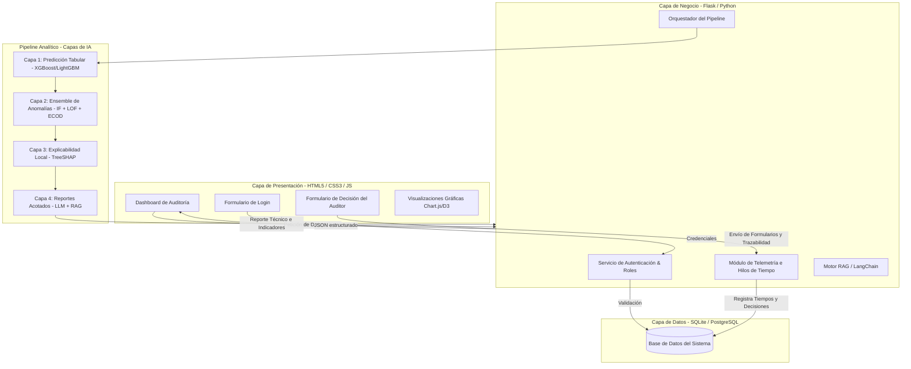

# Especificación Funcional, de Diseño y Arquitectura del Prototipo Web
## Proyecto: Sistema Integrado de Supervisión Operativa con IA Explicable para Empresas Agroexportadoras Peruanas
**Repositorio Relacionado:** `sistema-web-agro`  
**Fecha:** Junio de 2026  

---

## 1. Introducción y Contexto del Prototipo

El presente documento detalla la especificación de requerimientos, arquitectura de software, flujos de navegación, formularios y modelo de datos para el prototipo del **Sistema Integrado de Supervisión Operativa con IA Explicable**. 

Este prototipo tiene un doble propósito en el marco de la investigación:
1. **Validación Tecnológica (Fases 2 a 4):** Demostrar la viabilidad de integrar un pipeline analítico de cuatro capas (Predicción Tabular GBDT $\rightarrow$ Detección de Anomalías con Ensemble $\rightarrow$ Explicabilidad Local con SHAP $\rightarrow$ Generación Narrativa con RAG + LLM).
2. **Evaluación Experimental (Anexo A - Protocolo de Usabilidad):** Servir como la interfaz experimental donde 10 auditores/testers especializados validarán el sistema bajo dos condiciones (Condición A: Completo con SHAP/RAG vs. Condición B: Aislado sin explicabilidad), registrando telemetría clave como el **tiempo-a-decisión (VD4-a)** y la **comprensión percibida (VD4-b)**.

---

## 2. Arquitectura de Software del Prototipo

Para garantizar la modularidad, facilidad de mantenimiento y la inyección en caliente de los modelos analíticos, se propone una arquitectura web desacoplada de **tres capas lógicas (Frontend, Backend y Persistencia)** conectada al **Pipeline Analítico de 4 Capas de IA**.



### Componentes Tecnológicos Recomendados:
*   **Backend:** Python con **Flask** (o **FastAPI**), aprovechando que la tesis ya cuenta con scripts de Flask (`app.py`) y librerías de Machine Learning en Python.
*   **Frontend:** HTML5 semántico, Javascript nativo (para asegurar precisión de microsegundos en telemetría sin sobrecarga de frameworks pesados), y **Vanilla CSS** con variables personalizadas (o Tailwind si se requiere diseño responsivo veloz).
*   **Base de Datos:** **SQLite** para el prototipo local (por su cero configuración e inclusión en el contenedor Docker) o **PostgreSQL** para entorno de pruebas multiusuario.
*   **Librerías de IA:** `xgboost`, `lightgbm`, `pyod` (Isolation Forest, LOF, ECOD), `shap` (TreeSHAP), `langchain`/`llamaindex` (para el motor RAG), y APIs de LLM (Claude/OpenAI o Llama 3 local vía Ollama).

---

## 3. Módulo de Autenticación y Seguridad (Login)

La autenticación es un requisito crítico en sistemas de auditoría para garantizar el **no repudio** y la **trazabilidad de decisiones**. Toda acción (validar o descartar una alerta) debe estar vinculada a una firma de usuario autorizada.

### 3.1 Roles del Sistema
1.  **Auditor / Supervisor de Operaciones (User):**
    *   Visualiza la bandeja de alertas aduaneras y logísticas.
    *   Accede al detalle analítico de cada operación (Predicción, Anomalías, SHAP, RAG).
    *   Registra decisiones (formularios de justificación y clasificación).
    *   Visualiza el histórico de sus propias auditorías.
2.  **Administrador de Datos / Ingeniero de IA (Admin):**
    *   Acceso total al panel de administración.
    *   Monitoreo de métricas del sistema (F1-score, ROC-AUC, tiempos medios).
    *   Configuración de umbrales del modelo (parámetro de contaminación de ECOD/IF).
    *   Gestión de usuarios y auditoría de accesos.
    *   Carga de nuevos datasets (SUNAT, weather registries).

### 3.2 Seguridad y Control de Sesión
*   **Validación de Inputs:** Limpieza de datos en backend para evitar Inyección SQL y Cross-Site Scripting (XSS).
*   **Sesiones:** Manejo de sesiones basadas en cookies firmadas criptográficamente (`Flask-Session` o JWT).
*   **Registro de Auditoría de Seguridad (Security Log):** Tabla que almacena intentos de login fallidos, accesos no autorizados y cambios de contraseñas.

---

## 4. Vistas Completas del Prototipo (Diseño de Pantallas)

Para cumplir con el rigor del experimento de usabilidad y ofrecer una experiencia premium al usuario, el prototipo debe implementar al menos las siguientes **6 vistas**:

### Vista 1: Pantalla de Login
*   **Objetivo:** Permitir el ingreso seguro al sistema y determinar el rol del usuario.
*   **Elementos visuales:**
    *   Tarjeta centralizada con diseño moderno (Glassmorphism, sombras sutiles).
    *   Campos: Nombre de usuario/Email y Contraseña.
    *   Mensajes de error dinámicos (ej: "Credenciales incorrectas" o "Usuario bloqueado").
    *   Botón de envío con micro-animaciones (cambio de color al pasar el cursor).

### Vista 2: Dashboard Principal (Bandeja de Alertas)
*   **Objetivo:** Ofrecer una visión macro de las operaciones agroexportadoras activas y las alertas prioritarias.
*   **Elementos visuales:**
    *   **KPI Cards:**
        1. *Alertas Totales Detectadas* (con indicador de tendencia).
        2. *Operaciones Totales Analizadas*.
        3. *Precisión del Mes (F1-Score)*.
        4. *Tiempo Promedio de Decisión del Equipo* (en segundos).
    *   **Filtros de Búsqueda y Segmentación:**
        *   Filtro por Producto (Palta, Uva, Arándano).
        *   Filtro por Estado de Alerta (Pendiente, En Revisión, Confirmada, Descartada).
        *   Búsqueda por RUC de la empresa exportadora, partida arancelaria o puerto de destino.
    *   **Tabla de Alertas:**
        *   Columnas: ID Alerta, Fecha, Producto, Empresa Exportadora, Puerto Destino, Score de Anomalía (barra de color indicador de severidad), Estado, Acciones (Botón "Auditar").

### Vista 3: Detalle Integrado de la Operación (Capa 1 a Capa 4)
*   *Nota: Esta es la pantalla clave del experimento. Presentará la información según la condición asignada (A o B).*
*   **Elementos visuales:**
    *   **Cabecera de la Operación:** ID de Declaración (DAM), RUC, Razón Social, Producto (ej. Palta Hass), Fecha de Embarque y Destino.
    *   **Sección Capa 1 (Predicción de Precio/Volumen):**
        *   Gráfico comparativo (ej: barra lateral o velocímetro) que muestre el **Valor FOB Declarado** frente al **Valor FOB Esperado** (estimado por XGBoost/LightGBM).
        *   Cálculo automático de la desviación porcentual residual.
    *   **Sección Capa 2 (Severidad de Anomalía):**
        *   Indicador visual tipo "semáforo" (Rojo: Alta probabilidad de anomalía; Amarillo: Sospechoso; Verde: Normal) basado en el Score unificado del Ensemble (IF + LOF + ECOD).
    *   **Sección Capa 3 (Explicabilidad SHAP - *Solo Condición A*):**
        *   Gráfico de barras horizontales interactivo que represente las 5 variables con mayor impacto en el score (atribución SHAP).
        *   Ejemplo de variables: *Desviación de Precio FOB*, *Temperatura en Zona de Cultivo*, *Historial de Alertas de la Empresa*, *Días de Retraso Logístico*, *Índice de Lluvias Acumuladas*.
        *   Rangos de impacto coloreados en azul (disminuyen riesgo) y rojo (aumentan riesgo).
    *   **Sección Capa 4 (Reporte Narrativo Explicable - *Solo Condición A*):**
        *   Caja de texto que renderiza el reporte dinámico generado por el LLM mediante RAG.
        *   El texto debe contener hipervínculos o citas dinámicas a los documentos fuente (ej. *Regulación Fitosanitaria FDA*, *Directivas de Control de Aduanas*), permitiendo al auditor hacer clic y abrir la base legal/normativa en un panel lateral.
    *   **Panel de Formulario de Decisión:** (Detallado en la sección de Formularios).

### Vista 4: Explorador y Carga de Datasets (Data Explorer)
*   **Objetivo:** Permitir la actualización de los datos del sistema por parte del administrador.
*   **Elementos visuales:**
    *   Zona de arrastre de archivos (Drag-and-Drop) para subir archivos CSV o Excel (SUNAT, TradeMap, MIDAGRI, etc.).
    *   Tabla de previsualización de datos con paginación.
    *   Indicador de estado de la base de datos (última actualización, registros totales por tabla).

### Vista 5: Panel de Configuración de Modelos e Integridad
*   **Objetivo:** Modificar los hiperparámetros del sistema y vigilar sesgos.
*   **Elementos visuales:**
    *   Campos de configuración: Umbral de decisión del Ensemble, selección del modelo GBDT activo (XGBoost vs LightGBM), y API Key de los servicios LLM.
    *   **Fairness Monitor:** Mapeo de tasas de falsos positivos divididos por subgrupos (ej: comparando Palta vs Uva o Pequeño Exportador vs Gran Exportador) para vigilar que el modelo no discrimine sistemáticamente, en línea con el Reglamento de la Ley de IA (D.S. N° 115-2025-PCM).

### Vista 6: Panel de Telemetría y Resultados Experimentales (Admin Only)
*   **Objetivo:** Visualizar en tiempo real el progreso de los testers del Anexo A para el análisis de tesis.
*   **Elementos visuales:**
    *   Métricas de rendimiento de usabilidad agregadas: Tiempos medios de decisión bajo la Condición A y Condición B.
    *   Gráficos estadísticos de dispersión e histogramas de los tiempos de respuesta.
    *   Tabla exportable en CSV con los logs completos de telemetría para su análisis inmediato en software estadístico (R, SPSS, Python Pandas).

---

## 5. Formularios del Prototipo: Campos, Validaciones y UX

A continuación se detallan los campos específicos y reglas de negocio para los tres formularios principales del prototipo.

### 5.1 Formulario 1: Autenticación (Login)

| Campo | Tipo | Requerido | Validación en Cliente (JS) | Validación en Servidor (Python) | UX / Feedback |
| :--- | :--- | :--- | :--- | :--- | :--- |
| **Usuario / Email** | Texto / Email | Sí | Formato de email correcto. Mínimo 4 caracteres. | Sanitización contra inyección SQL. Verificación de existencia en base de datos. | Borde rojo si el formato es inválido. Placeholder descriptivo. |
| **Contraseña** | Password | Sí | Mínimo 6 caracteres. | Comparación mediante hash criptográfico seguro (ej. `bcrypt` o `pbkdf2:sha256`). | Icono de "ojo" para mostrar/ocultar contraseña. |

*   **Comportamiento UX:** Al presionar "Ingresar", el botón debe mostrar un spinner de carga y deshabilitarse temporalmente para evitar peticiones duplicadas.

### 5.2 Formulario 2: Registro de Decisión del Auditor (Telemetría de Usabilidad)

Este formulario es el corazón metodológico del experimento de tesis (Anexo A). **Captura directamente las variables dependientes.**

| Campo | Tipo | Requerido | Opciones / Parámetros | Rol de Investigación (Métrica) | UX / Feedback |
| :--- | :--- | :--- | :--- | :--- | :--- |
| **Clasificación de Alerta** | Radio Buttons | Sí | `1` = Anomalía Confirmada (True Positive)<br>`0` = Falsa Alarma (False Positive)<br>`2` = Dudoso / Requiere Investigación | **user_decision** (Clasificación de la alerta para medir precisión del auditor). | Botones grandes con código de colores (Verde para normal/descarte, Rojo para anomalía). |
| **Justificación de Decisión** | Textarea | Sí | Máximo 200 caracteres. Restricción en caliente. | **justification_text** (Permite evaluar la comprensión cualitativa y justificación de variables). | Contador numérico decreciente de caracteres restantes en tiempo real. |
| **Escala de Comprensión** | Likert 1-5 | Sí | `1` = Totalmente incomprensible<br>`2` = Difícil de entender<br>`3` = Neutral / Aceptable<br>`4` = Comprensible<br>`5` = Altamente comprensible | **likert_comprehension** (Variable para medir la comprensión percibida del usuario). | Iconos de estrellas o barra de selección interactiva con etiquetas de texto explicativas. |

*   **Regla de Negocio de Telemetría:** Al abrirse la vista de detalle de la alerta, un script JS iniciará un cronómetro silencioso (`performance.now()`). Al enviar este formulario, se detendrá el cronómetro y se inyectará el valor en milisegundos en un campo oculto del formulario (`time_to_decision_ms`) antes de guardarlo en la base de datos.

### 5.3 Formulario 3: Carga de Archivos de Datos (Data Upload)

| Campo | Tipo | Requerido | Validación en Cliente (JS) | Validación en Servidor (Python) | UX / Feedback |
| :--- | :--- | :--- | :--- | :--- | :--- |
| **Origen de Datos** | Select | Sí | Debe seleccionarse un origen válido. | Mapeo de esquema de base de datos según origen. | Lista desplegable con opciones predefinidas (SUNAT Aduanas, Precios MIDAGRI, SENAMHI Clima). |
| **Archivo de Datos** | File | Sí | Extensión permitida: `.csv`, `.xlsx`. Tamaño máximo: 15MB. | Validación de tipo MIME. Inspección de cabeceras para asegurar consistencia del esquema. | Área interactiva Drag & Drop. Muestra el nombre y tamaño del archivo seleccionado con barra de progreso. |

---

## 6. Modelo de Datos del Prototipo (Base de Datos)

Para persistir el estado de la aplicación, el historial de decisiones y la telemetría del experimento de usabilidad, se propone el siguiente esquema de base de datos relacional.

### Tabla 1: `Usuarios`
Almacena las credenciales y roles del personal de supervisión y administración.

| Nombre Campo | Tipo de Dato | Llave | Descripción |
| :--- | :--- | :--- | :--- |
| `id_usuario` | INTEGER | PK (Auto-increment) | Identificador único del usuario. |
| `username` | VARCHAR(50) | UNIQUE | Nombre de acceso único. |
| `email` | VARCHAR(100) | UNIQUE | Correo electrónico corporativo. |
| `password_hash` | VARCHAR(255) | - | Hash seguro de la contraseña. |
| `rol` | VARCHAR(20) | - | Rol asignado: `AUDITOR` o `ADMIN`. |
| `creado_en` | DATETIME | - | Fecha y hora de creación de la cuenta. |

### Tabla 2: `OperacionesAlertas`
Almacena los registros transaccionales de las exportaciones evaluadas por el pipeline de IA y los scores resultantes.

| Nombre Campo | Tipo de Dato | Llave | Descripción |
| :--- | :--- | :--- | :--- |
| `id_alerta` | VARCHAR(50) | PK | Código único de la alerta (ej: `AL-2026-0001`). |
| `numero_dam` | VARCHAR(50) | - | Número de Declaración Aduanera de Mercancías (SUNAT). |
| `fecha_operacion` | DATE | - | Fecha de registro del despacho aduanero. |
| `ruc_exportador` | VARCHAR(11) | - | Registro Único de Contribuyente de la agroexportadora. |
| `producto` | VARCHAR(50) | - | Nombre del producto agroexportador (Palta, Uva, Arándano). |
| `valor_fob_declarado`| DECIMAL(12,2)| - | Monto FOB registrado en la aduana (USD). |
| `valor_fob_esperado` | DECIMAL(12,2)| - | Predicción del modelo GBDT (Capa 1). |
| `score_anomalia` | DECIMAL(5,4) | - | Score de anomalía unificado del Ensemble (Capa 2). |
| `alertado` | BOOLEAN | - | `TRUE` si supera el umbral establecido de anomalía. |
| `estado` | VARCHAR(20) | - | Estado de la alerta: `PENDIENTE`, `REVISADA`. |

### Tabla 3: `DecisionesAuditoria`
Registra la respuesta de los evaluadores ante cada alerta, incluyendo la justificación y las métricas de usabilidad.

| Nombre Campo | Tipo de Dato | Llave | Descripción |
| :--- | :--- | :--- | :--- |
| `id_decision` | INTEGER | PK (Auto-increment) | Identificador de la decisión tomada. |
| `id_alerta` | VARCHAR(50) | FK (`OperacionesAlertas`) | Alerta a la cual responde la decisión. |
| `id_usuario` | INTEGER | FK (`Usuarios`) | Auditor que tomó la decisión. |
| `condicion_experimento`| VARCHAR(15)| - | Condición en que se mostró la alerta (`INTEGRADO` o `AISLADO`). |
| `user_decision` | INTEGER | - | Clasificación del auditor (0=Normal, 1=Anomalía, 2=Dudoso). |
| `justification_text` | VARCHAR(200) | - | Breve justificación escrita por el auditor. |
| `likert_comprehension`| INTEGER | - | Nivel de comprensión reportado (1 al 5). |
| `time_to_decision_ms` | INTEGER | - | Tiempo de respuesta medido en milisegundos. |
| `creado_en` | DATETIME | - | Marca de tiempo exacta del envío del formulario. |

### Tabla 4: `ExplicacionesSHAP`
Almacena los valores de atribución deterministas del modelo para cada alerta.

| Nombre Campo | Tipo de Dato | Llave | Descripción |
| :--- | :--- | :--- | :--- |
| `id_explicacion` | INTEGER | PK (Auto-increment) | Identificador del registro. |
| `id_alerta` | VARCHAR(50) | FK (`OperacionesAlertas`) | Alerta a la que pertenece la explicación. |
| `variable_nombre` | VARCHAR(50) | - | Nombre de la característica analizada (ej: `residual_precio`). |
| `shap_value` | DECIMAL(8,6) | - | Valor de atribución SHAP calculado. |
| `variable_valor` | VARCHAR(100) | - | Valor real observado en la transacción. |

---

## 7. Experiencia de Usuario (UX) y Lineamientos de Interfaz

Para lograr un prototipo web de **nivel premium** que sorprenda al usuario y garantice un correcto rendimiento en el test de usabilidad, se deben seguir estas pautas de diseño:

### 7.1 Paleta de Colores Curada (Estilo Agro-Industrial Moderno)
Se descartan los colores planos del navegador. Se define un sistema de variables CSS basado en tonos orgánicos y profesionales:
*   **Fondo Principal (Modo Oscuro):** `#0c120c` (Verde negro profundo que reduce la fatiga visual de los auditores).
*   **Fondo de Tarjetas (Glassmorphism):** `rgba(20, 30, 20, 0.6)` con un desenfoque de fondo (`backdrop-filter: blur(12px)`) y borde sutil `#1e351e`.
*   **Color Primario (Acento):** `#3da35d` (Verde esmeralda suave, representa agro-tecnología).
*   **Color de Anomalías (Alertas):** `#d9534f` (Rojo suave no estridente) y `#f0ad4e` (Amarillo ocre para sospechas).
*   **Tipografía:** Fuentes modernas cargadas desde Google Fonts como **Outfit** o **Inter** en lugar de fuentes por defecto.

### 7.2 Micro-animaciones y Elementos Dinámicos
*   **Feedback Inmediato:** Los campos de los formularios deben cambiar suavemente su borde a verde translúcido cuando la validación JS sea correcta.
*   **Transiciones Suaves:** El paso entre la Bandeja de Alertas y la Vista Detallada debe cargarse de manera asíncrona mediante peticiones AJAX/Fetch, mostrando una transición de opacidad suave (`transition: opacity 0.3s ease`).
*   **Gráficos Interactivos:** Los gráficos de SHAP y de desviación de precios deben contar con tooltips dinámicos al pasar el ratón por encima, detallando los valores exactos para facilitar la lectura al tester.

---

## 8. Flujo Completo de Operación del Prototipo

El siguiente diagrama detalla la interacción típica de un supervisor analizando una alerta en la interfaz:

```
[Pantalla de Login]
       │  (Ingresa credenciales de auditor)
       ▼
[Dashboard - Bandeja de Alertas]  <─── (Filtra por "Palta" y "Alertas Activas")
       │
       │  (Hace clic en "Auditar" en una alerta roja)
       ▼
[Detalle de Alerta Integrada]
       ├─── Capa 1: Revisa el desvío de precio FOB (Gráfico interactivo)
       ├─── Capa 2: Compara la severidad (Score del Ensemble)
       ├─── Capa 3: Analiza el gráfico de barras SHAP (Top-5 causas)
       └─── Capa 4: Lee el reporte LLM-RAG y consulta documentos base
       │
       ▼  (Completa formulario de decisión)
[Envío de Formulario] ───► (JS registra time_to_decision_ms en segundo plano)
       │
       ▼
[Registro Exitoso y Retorno a Bandeja]
```

Este flujo y la arquitectura expuesta aseguran un sistema completamente trazable, que no solo sirve de demostrador funcional de la tesis, sino que recolecta toda la evidencia estadística requerida para validar la propuesta de investigación.
