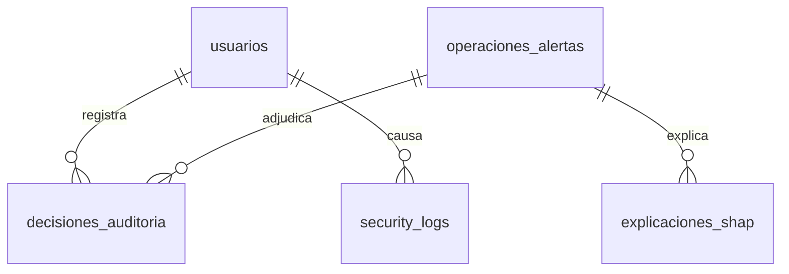

# Documento Técnico: Usabilidad, Arquitectura y Despliegue del Sistema Web Agro

Este documento detalla la especificación de arquitectura de software, el modelo de datos relacional PostgreSQL, el marco metodológico de telemetría de usabilidad (basado en la norma **ISO 9241-11**) y el manual de operaciones del prototipo **Agro-Intelligence Oversight**.

---

## 1. Arquitectura de Software Desacoplada en Docker

Para asegurar la modularidad, consistencia en despliegues y compatibilidad con lenguajes de aprendizaje automático, el prototipo se estructura en **tres capas lógicas contenedorizadas** conectadas mediante una red virtual interna:

```
[Cliente Web: React SPA] (Puerto 8050)
         │
         │  Peticiones HTTP (JSON) /api/*
         ▼
[Servidor de Negocio: Flask API] (Puerto 5000)
         │
         │  Conector ORM (psycopg2 / SQLAlchemy)
         ▼
[Motor de Persistencia: PostgreSQL] (Puerto 5432)
```

### Componentes de los Contenedores:
1.  **Contenedor Frontend (`agro_frontend`):** Utiliza una imagen multi-etapa basada en Node.js para la compilación de recursos estáticos de React, la cual luego es servida por un servidor **Nginx** optimizado de producción en el puerto `8050`. Este servidor web actúa adicionalmente como proxy inverso para redirigir las peticiones `/api/*` al backend de forma transparente.
2.  **Contenedor Backend (`agro_backend`):** Basado en Python `3.11-slim` que ejecuta el servidor de producción WSGI **Gunicorn** con múltiples hilos y procesos de trabajo. Éste expone los endpoints lógicos de la API REST del negocio en el puerto `5000`.
3.  **Contenedor Base de Datos (`agro_db`):** Ejecuta una instancia de **PostgreSQL 15 (Alpine)** que almacena el esquema relacional persistente del sistema, aislada del host.

---

## 2. Modelo de Datos Relacional (PostgreSQL)

El esquema de persistencia se implementa mediante tablas relacionales optimizadas:



### 2.1 Tabla: `usuarios`
Almacena credenciales de acceso y privilegios (roles).
*   `id_usuario` (SERIAL PRIMARY KEY): Identificador único.
*   `username` (VARCHAR(50) UNIQUE): Nombre de acceso de operador.
*   `email` (VARCHAR(100) UNIQUE): Correo corporativo.
*   `password_hash` (VARCHAR(255)): Código de acceso cifrado (cifrado pbkdf2-sha256).
*   `rol` (VARCHAR(20)): Rol de acceso (`AUDITOR` o `ADMIN`).
*   `nombre` (VARCHAR(100)): Nombre completo del tester o supervisor.

### 2.2 Tabla: `operaciones_alertas`
Registra las DAM aduaneras analizadas por las capas de IA del sistema.
*   `id_alerta` (VARCHAR(50) PRIMARY KEY): Código de la alerta (ej. `AL-2026-0012`).
*   `numero_dam` (VARCHAR(50)): Declaración Aduanera de Mercancías (SUNAT).
*   `fecha_operacion` (DATE): Fecha de zarpe.
*   `ruc_exportador` (VARCHAR(11)): RUC de la agroexportadora peruana.
*   `razon_social` (VARCHAR(100)): Nombre de la empresa.
*   `producto` (VARCHAR(50)): Tipo de cultivo (Palta, Uva, Arándano, Mango).
*   `valor_fob_declarado` (DECIMAL): Valor de factura registrado (USD).
*   `valor_fob_esperado` (DECIMAL): Estimación de precio del predictor GBDT (Capa 1).
*   `score_anomalia` (DECIMAL): Puntuación de anomalía del Ensemble (Capa 2).
*   `alertado` (BOOLEAN): Estado activo de bandera de alerta.
*   `estado` (VARCHAR(20)): Flujo de ciclo de vida (`PENDIENTE`, `EN_REVISION`, `CONFIRMADA`, `FALSA_ALARMA`, `REFIERE_INSPECCION`).

### 2.3 Tabla: `decisiones_auditoria`
Sustenta las decisiones tomadas por los evaluadores en el test de usabilidad (Anexo A).
*   `id_decision` (SERIAL PRIMARY KEY): Código único de auditoría.
*   `id_alerta` (VARCHAR(50) FK): Alerta adjudicada.
*   `id_usuario` (INTEGER FK): Auditor adjudicador.
*   `condicion_experimento` (VARCHAR(15)): Contexto visual evaluado (`INTEGRADO` o `AISLADO`).
*   `user_decision` (INTEGER): Decisión (0 = Falsa Alarma, 1 = Anomalía Confirmada, 2 = Inspección Física).
*   `justification_text` (VARCHAR(250)): Razonamiento técnico del auditor.
*   `likert_comprehension` (INTEGER): Escala Likert de entendimiento de IA (1 al 5).
*   `time_to_decision_ms` (INTEGER): Tiempo de latencia de decisión medido en milisegundos.
*   `creado_en` (TIMESTAMP): Registro de fecha del envío.

### 2.4 Tabla: `explicaciones_shap`
Almacena las atribuciones locales calculadas por TreeSHAP para justificar la anomalía (Capa 3).
*   `id_explicacion` (SERIAL PRIMARY KEY)
*   `id_alerta` (VARCHAR(50) FK): Relación con la alerta.
*   `variable_nombre` (VARCHAR(50)): Característica (ej. *Precio Residual*, *Desviación Temp.*).
*   `shap_value` (DECIMAL): Puntuación de influencia (+/-).
*   `variable_valor` (VARCHAR(100)): Valor real en DAM.

### 2.5 Tabla: `security_logs`
Almacena telemetría de eventos de seguridad (acceso, desvío o modificaciones).
*   `id_log` (SERIAL PRIMARY KEY)
*   `usuario` (VARCHAR(50)): Operador responsable.
*   `evento` (VARCHAR(100)): Acción ejecutada.
*   `ip_address` (VARCHAR(40)): IP del cliente.
*   `fecha` (TIMESTAMP): Marca temporal.

---

## 3. Telemetría de Usabilidad e Integridad (Fairness)

Para el análisis metodológico de la tesis, el prototipo registra y procesa directamente las siguientes variables:

### 3.1 Métricas de Usabilidad (Norma ISO 9241-11)
La norma ISO 9241-11 define la usabilidad a través de tres pilares:
1.  **Eficacia (Tasa de Éxito de la Tarea):** Evaluada como la coincidencia lógica entre la decisión tomada por el auditor (`user_decision`) y el score real de anomalía (coincidencia de criterios expertos).
2.  **Eficiencia (Tiempo-a-decisión):** Capturado en milisegundos exactos mediante `performance.now()` al cargar la vista de detalle en React, y restado al presionar el envío en el **Modal de Confirmación**. Evita la variabilidad de red midiendo la latencia a nivel de cliente.
3.  **Satisfacción/Comprensión (Escala Likert 1-5):** Calificación directa del auditor sobre qué tan comprensibles resultaron los factores determinantes de la IA.

### 3.2 Métricas de Sesgo y Equidad (Fairness)
Para garantizar la auditoría algorítmica exigida en marcos regulatorios de IA:
*   **Demographic Parity Ratio (DPR):** Evaluado como la tasa de selección para el grupo sensible (Pequeños Exportadores) sobre el grupo privilegiado (Grandes Exportadores). Un DPR cercano a 1.0 indica equidad en el marcado.
*   **Diferencia de Oportunidades Igualadas (Equalized Odds Difference):** Compara la diferencia en tasas de falsos positivos (FPR) y verdaderos positivos (TPR) entre diferentes tipos de productos (Palta, Uva, Arándano) para evitar sesgos por tipo de cultivo.

---

## 4. Manual de Despliegue y Ejecución con Docker

### 4.1 Requisitos Previos
*   Docker Desktop instalado y en ejecución en el sistema Windows.
*   Puertos `8050` (Frontend) y `5000` (Backend API) disponibles.

### 4.2 Construcción y Arranque
1.  Abra una terminal de comandos (PowerShell o CMD) en la carpeta raíz del prototipo:
    ```bash
    cd c:\Users\LENOVO\Documents\tesis\sistema-web-agro
    ```
2.  Levante el entorno en segundo plano construyendo las imágenes optimizadas:
    ```bash
    docker-compose up --build -d
    ```
3.  Este comando ejecutará las siguientes acciones en secuencia:
    *   Creará el contenedor PostgreSQL `agro_db` y validará que esté saludable mediante un script de ping.
    *   Ejecutará el script `backend/init_db.py` en `agro_backend` para crear las tablas en PostgreSQL e insertar los datos semilla (seed data).
    *   Compilará el frontend de React y levantará el servidor web Nginx en `agro_frontend`.
    *   Iniciará el servidor de producción Gunicorn en `agro_backend`.

### 4.3 Credenciales de Acceso por Defecto
*   **Auditor Tester 1:**
    *   Usuario/ID: `auditor1` (Condición asignada por defecto: `INTEGRADO`)
    *   Contraseña: `correct`
*   **Auditor Tester 2:**
    *   Usuario/ID: `auditor2` (Condición asignada por defecto: `AISLADO`)
    *   Contraseña: `correct`
*   **Administrador del Sistema:**
    *   Usuario/ID: `admin`
    *   Contraseña: `correct`

### 4.4 URL de Acceso en Navegador
*   **Interfaz de Usuario (React App):** [http://localhost:8050](http://localhost:8050)
*   **API REST del Servidor (Flask API):** [http://localhost:5000/api/dashboard/stats](http://localhost:5000/api/dashboard/stats)

---

## 5. Control Experimental Manual para Pruebas

Para facilitar la evaluación de ambas condiciones en el mismo sujeto experimental sin cerrar sesión:
1.  Inicie sesión como administrador (`admin` / `correct`).
2.  Navegue a la pestaña **Control Usuarios** en la barra lateral.
3.  En la fila del auditor correspondiente (ej. `auditor1`), haga clic en el botón de la columna **Acciones** para alternar condicionalidad (`INTEGRADO` $\leftrightarrow$ `AISLADO`).
4.  Cierre sesión e ingrese nuevamente con el usuario modificado. La pantalla de **Detalle de la Operación** se rediseñará automáticamente, ocultando o mostrando las Capas 3 y 4 de explicabilidad (SHAP y RAG).
